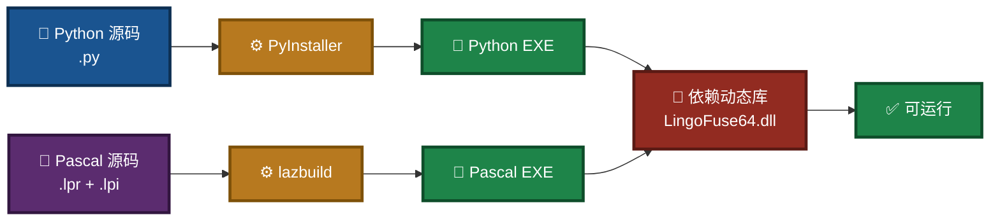
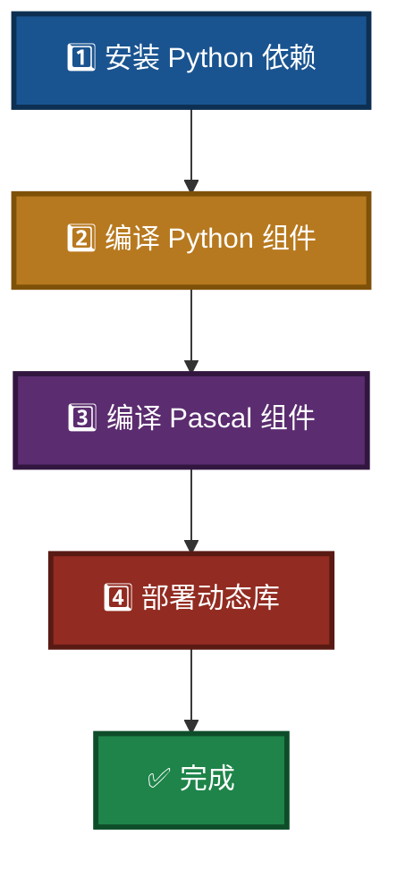

# LingoFuse-pasAgent 组件编译指南（Windows）

> **文档版本**：V3.0  
> **最后更新**：2026-09-14  
> **适用平台**：Windows 10/11（64 位）  
> **相关文档**（同目录）：
> - 依赖安装：`Dependency_Installation_Guide.md`
> - MCP 新手指南：`MCP_SERVER_DOUBAO_GUIDE.md`
> - LLM 服务命令行：`src/llm-service/LingoFuse_LLM_Service_CLI_guide.md`
> - LLM 代理命令行：`src/llm-service/LingoFuse_LLM_Proxy_CLI_Guide.md`
> - 生态体系总览：`src/llm-service/LingoFuse_LLM_Ecosystem_User_Guide.md`

---

## 阅读引导

本文档介绍如何将 LingoFuse-pasAgent 中的 Python 脚本和 Pascal 源代码编译为可执行文件（EXE）。建议按以下顺序阅读：

1. **只想快速编译** → 直接跳到第二章「快速开始」。
2. **想了解前置软件** → 读第一章「前置准备」。
3. **想编译某个特定组件** → 读第三、四、五章。
4. **想了解动态库部署** → 读第六章。
5. **遇到问题** → 读第七章「常见问题」。

如果你只是想**运行**预编译包而不想自己编译，请直接下载预编译包并按 `MCP_SERVER_DOUBAO_GUIDE.md` 操作。

---

## 一、前置准备

### 1.1 操作系统

- Windows 10/11（64 位推荐）

### 1.2 必需软件

| 软件 | 用途 | 获取方式 |
|------|------|----------|
| **Python 3.7+**（64 位） | 运行 PyInstaller 及 Python 脚本 | [python.org](https://python.org) |
| **PyInstaller** | 将 Python 脚本打包为 EXE | `pip install pyinstaller` |
| **Lazarus**（含 Free Pascal 3.2+） | 编译 Pascal 项目（必须使用 lazbuild 或 IDE） | [Lazarus IDE](https://lazarus-ide.org) |
| **LingoFuse 动态库** | 所有 EXE 的运行时依赖 | 由 LingoFuse 项目提供 |

> **重要**：Pascal 项目的编译**不要直接使用 `fpc` 命令行**，因为项目依赖复杂的单元搜索路径（Z 框架、LingoFuse 等）。必须使用 `lazbuild` 或 Lazarus IDE，它们能正确读取 `.lpi` 文件中的配置。

### 图 1：编译工具链全景



### 1.3 源代码目录结构

本项目根目录（假设为 `D:\git\LingoFuse-pasAgent\src`）包含以下关键脚本和文件：

```
src/
├── build_mcp_server.ps1          # 编译 mcp_server.exe 和 mcp_proxy.exe
├── build_bridge.ps1              # 编译 bridge.exe
├── build_llm_service.ps1         # 编译 llm_service.exe / llm_proxy.exe / llm_test.exe
├── build_pascal_agent.bat        # 一键编译所有 Pascal 项目
├── generate_agent_json.py        # 配置生成器
├── language_middleware.py        # MCP 依赖
├── mcp_server.py                 # MCP 服务器源码
├── mcp_proxy.py                  # 代理源码
├── pascal_agent_service.lpi      # Lazarus 项目文件
├── pascal_agent_api.lpi
├── lingofuse/                    # Python 核心包（编译时会打包）
├── llm-service/                  # LLM 服务源码
│   ├── llm_service.py
│   ├── llm_proxy.py
│   ├── llm_test.py
│   └── ...
├── CreateHealthCheck/            # 健康检查 Pascal 项目
│   ├── HealthCheck.lpi
│   └── ...
└── tools/                        # 开发工具（pascal_c_to_mcp 等）
```

---

## 二、快速开始

如果你已经安装好所有前置软件，执行以下步骤即可：

### 图 2：快速编译流程



**在 `src` 目录打开 PowerShell，依次执行**：

```powershell
# 1. 安装依赖
pip install -r requirements.txt
pip install pyinstaller

# 2. 编译 Python 组件（三选一或全选）
.\build_mcp_server.ps1          # mcp_server.exe + mcp_proxy.exe
.\build_llm_service.ps1         # llm_service.exe + llm_proxy.exe + llm_test.exe

# 3. 编译 Pascal 组件
.\build_pascal_agent.bat
```

编译产物在 `dist\` 目录下。

---

## 三、Python 组件编译

所有 Python 脚本均可通过 PyInstaller 打包为独立的 EXE。项目已在 `src` 目录提供了 PowerShell 脚本，**强烈建议使用这些脚本**，它们已配置好必要的参数（依赖收集、数据文件等）。

### 3.1 环境准备

打开 PowerShell，进入 `src` 目录，执行以下命令安装依赖：

```powershell
cd D:\git\LingoFuse-pasAgent\src
pip install -r requirements.txt
pip install pyinstaller
```

### 3.2 编译 mcp_server.exe（含 mcp_proxy.exe）

运行脚本：

```powershell
.\build_mcp_server.ps1
```

脚本内容大致如下（供参考）：

```powershell
pyinstaller --onefile `
    --collect-all fastmcp `
    --collect-all pydantic `
    --collect-all tzdata `
    --hidden-import language_middleware `
    --paths . `
    --add-data "lingofuse;lingofuse" `
    mcp_server.py

pyinstaller --onefile `
    --name mcp_proxy `
    --clean `
    --noconfirm `
    mcp_proxy.py
```

编译完成后，在 `dist\` 目录下将生成：

- `mcp_server.exe`
- `mcp_proxy.exe`

### 3.3 编译 llm_service.exe / llm_proxy.exe / llm_test.exe

`llm_service.py`、`llm_proxy.py`、`llm_test.py` 位于 `llm-service\` 目录。运行脚本：

```powershell
.\build_llm_service.ps1
```

该脚本会依次编译三个 EXE：

| 源文件 | 输出 | 特殊依赖 |
|--------|------|----------|
| `llm_service.py` | `llm_service.exe` | `llama_cpp`、`jinja2` |
| `llm_proxy.py` | `llm_proxy.exe` | `requests`、`http.client`、`ssl` |
| `llm_test.py` | `llm_test.exe` | 仅 `lingofuse` |

编译完成后，在 `dist\` 目录下将生成：

- `llm_service.exe`
- `llm_proxy.exe`
- `llm_test.exe`

> 如需支持 CUDA 或 Vulkan，请先安装对应的 `llama-cpp-python` GPU 版本，再运行脚本。

### 3.4 编译 bridge.exe（可选）

如需 HTTP 桥接网关：

```powershell
.\build_bridge.ps1
```

生成 `bridge.exe`。

---

## 四、Pascal 组件编译

Pascal 项目必须使用 **Lazarus**（或 `lazbuild`）编译，**不要直接调用 `fpc`**。

### 4.1 环境准备

- 安装 Lazarus IDE（包含 Free Pascal 编译器）。
- 确保 `lazbuild.exe` 位于系统 PATH 中，或使用绝对路径。

### 4.2 使用 build_pascal_agent.bat 一键编译

在项目根目录（`src`）双击或命令行执行：

```bat
build_pascal_agent.bat
```

该脚本内容如下：

```bat
lazbuild.exe -B ./pascal_agent_service.lpi
lazbuild.exe -B ./pascal_agent_api.lpi
lazbuild.exe -B ./CreateHealthCheck/HealthCheck.lpi
echo 所有项目编译完成。
timeout /t 5 /nobreak >nul
```

执行后，将编译并生成：

- `pascal_agent_service.exe`（信标）
- `pascal_agent_api.exe`（工具提供者示例）
- `HealthCheck.exe`（在 `CreateHealthCheck\` 目录下）

### 4.3 单独编译某个 Pascal 项目（使用 lazbuild）

如果只想编译某个项目，可以在命令行使用 `lazbuild`：

```cmd
lazbuild.exe -B .\pascal_agent_service.lpi
```

或者使用 Lazarus IDE：打开 `.lpi` 文件，按 `Ctrl+F9` 编译。

### 图 3：Pascal 编译流程


---

## 五、编译工具链（可选，用于代码生成器）

如果你要编译 `tools/pascal_c_to_mcp/` 下的 `code_decl_to_mcp` 工具，可以单独编译：

```cmd
cd tools\pascal_c_to_mcp
lazbuild.exe -B code_decl_to_mcp.lpi
```

生成 `code_decl_to_mcp.exe`，用于把 Pascal / C 声明转换为 MCP 工具提供者单元。

---

## 六、LingoFuse 动态库部署

所有编译出的 EXE 运行时都需要 `LingoFuse64.dll`（Windows）或 `liblingofuse.so`（Linux）。该库由 LingoFuse 核心项目提供，不包含在本仓库中。

### 图 4：动态库部署两种方式


### 6.1 推荐部署方法：加入系统 PATH

1. 克隆 LingoFuse 仓库（需 `--recursive` 拉取子模块）：

```bash
git clone --recursive https://github.com/PassByYou888/LingoFuse.git
```

2. 将 LingoFuse 的 `Binary` 目录（或包含 `LingoFuse64.dll` 的目录）加入系统 `PATH`：

   - **Windows（永久）**：系统属性 → 环境变量 → 编辑 `Path`，添加该目录。
   - **Windows（临时）**：
     ```powershell
     $env:PATH = "D:\LingoFuse\Binary;$env:PATH"
     ```
   - **Linux/macOS**：
     ```bash
     export PATH=/path/to/LingoFuse/Binary:$PATH
     ```

这样系统就能自动找到动态库，无需将 DLL 复制到每个 EXE 目录。

### 6.2 备选方案：复制到每个 EXE 目录

如果不想修改 PATH，可以将动态库复制到每个 EXE 所在目录（例如 `dist\`）。

### 6.3 ⚠️ 运行环境依赖

预编译 DLL 使用 **Visual Studio 2022** 编译，运行时需要安装 **VS2022 可再发行组件（VC++ Redistributable）**。

请从微软官方下载并安装对应架构的版本：

- [VC++ Redistributable for Visual Studio 2022 (x86/x64)](https://learn.microsoft.com/en-us/cpp/windows/latest-supported-vc-redist?view=msvc-170)

---

## 七、常见问题

### Q1：运行 EXE 时提示 `Failed to load LingoFuse64.dll`

**原因**：动态库不在 PATH 或 EXE 同目录。

**解决**：

- 确保 `LingoFuse64.dll` 与 EXE 在同一目录，或已在系统 `PATH` 中。
- 检查动态库位数是否与 EXE 一致（64 位 vs 32 位）。
- 检查是否安装了 VC++ Redistributable。

### Q2：PyInstaller 打包后运行报 `ModuleNotFoundError`

**原因**：某些模块未被打包。

**解决**：

- 增加 `--hidden-import` 参数，或检查 `--add-data` 是否正确包含 `lingofuse` 包。
- 参考项目提供的脚本，它们已配置好所需参数。

### Q3：Pascal 编译报 `Can't find unit Z.Core`

**原因**：单元搜索路径未配置。

**解决**：

- 确保使用 `lazbuild` 编译，因为 `.lpi` 中已配置单元搜索路径。
- 若手动调用 `fpc`，需手动指定 `-Fu` 路径，极易出错，请改用 `lazbuild`。

### Q4：编译的 EXE 体积过大

**解决**：

- 使用 `--upx-dir` 参数启用 UPX 压缩（需先下载 UPX），可显著减小体积。
- 但 `--onefile` 模式本身会增大启动解压开销，若体积敏感，可改用 `--onedir` 模式。

### Q5：使用 `--generate-configs` 时找不到 `generate_agent_json` 模块

**解决**：

- 确保 `generate_agent_json.py` 在相同目录，且打包时已包含（`--add-data` 或 `--hidden-import`）。

### Q6：`build_llm_service.ps1` 编译时找不到 `llama_cpp` 模块

**原因**：未安装 `llama-cpp-python`。

**解决**：

```powershell
# CPU 版本
pip install llama-cpp-python --extra-index-url https://abetlen.github.io/llama-cpp-python/whl/cpu

# 或 CUDA 版本（根据你的 CUDA 版本选择）
pip install llama-cpp-python --extra-index-url https://abetlen.github.io/llama-cpp-python/whl/cu124
```

详见同目录 `src/llm-service/llama_cpp_python_guide.md`。

### Q7：编译完成后，如何知道每个 EXE 的用途？

| EXE | 用途 |
|-----|------|
| `pascal_agent_service.exe` | 信标，管理所有工具注册 |
| `pascal_agent_api.exe` | 工具提供者示例 |
| `mcp_server.exe` | MCP 网关，连接 AI 客户端和信标 |
| `mcp_proxy.exe` | stdio 调试代理 |
| `llm_service.exe` | 本地 LLM 推理服务 |
| `llm_proxy.exe` | 转发到外部 OpenAI 兼容后端 |
| `llm_test.exe` | 命令行 LLM 测试客户端 |
| `bridge.exe` | HTTP 网关（可选） |
| `HealthCheck.exe` | 环境健康检查工具 |

---

## 八、编译产物目录

最终编译后，建议将所有 EXE 和依赖动态库放在同一目录，以便分发：

```
dist\
├── LingoFuse64.dll                    # 从 LingoFuse 仓库复制或通过 PATH 提供
├── z_ipc_64.dll                       # IPC 依赖
├── mcp_server.exe
├── mcp_proxy.exe
├── llm_service.exe
├── llm_proxy.exe
├── llm_test.exe
├── pascal_agent_service.exe
├── pascal_agent_api.exe
├── HealthCheck.exe
├── code_decl_to_mcp.exe               # 若使用 tools 项目编译
├── NVIDIA-Nemotron-3.5-Lightning-30B-A3B-UD-IQ4_NL.gguf    # 可选，用于 LLM 服务
└── (配置文件、文档等)
```

---

## 九、相关文档（同目录）

| 文档 | 说明 |
|------|------|
| `Dependency_Installation_Guide.md` | 依赖安装详细步骤 |
| `MCP_SERVER_DOUBAO_GUIDE.md` | 新手零基础教程 |
| `NVIDIA-Nemotron-3.5-Lightning-30B-A3B-UD-IQ4_NL.md` | 推荐模型下载与部署 |
| `src/llm-service/LingoFuse_LLM_Ecosystem_User_Guide.md` | 闭环架构与生态总览 |
| `src/llm-service/LingoFuse_LLM_Service_CLI_guide.md` | LLM 服务命令行手册 |
| `src/llm-service/LingoFuse_LLM_Proxy_CLI_Guide.md` | LLM 代理命令行手册 |
| `src/llm-service/llama_cpp_python_guide.md` | `llama-cpp-python` 安装与使用 |

---

**文档版本**：V3.0（仅保留同目录链接，高对比配色）  
**维护者**：LingoFuse-pasAgent 团队  
**反馈**：问题提 Issue，急事加 Q（600585）