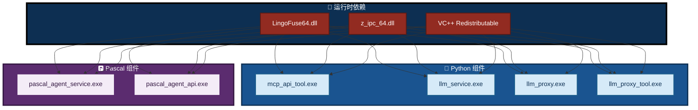
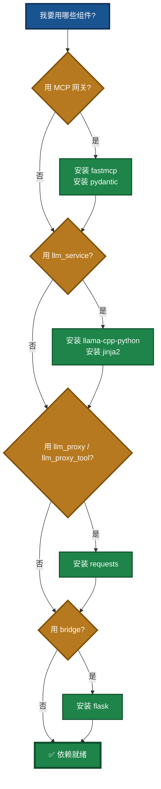
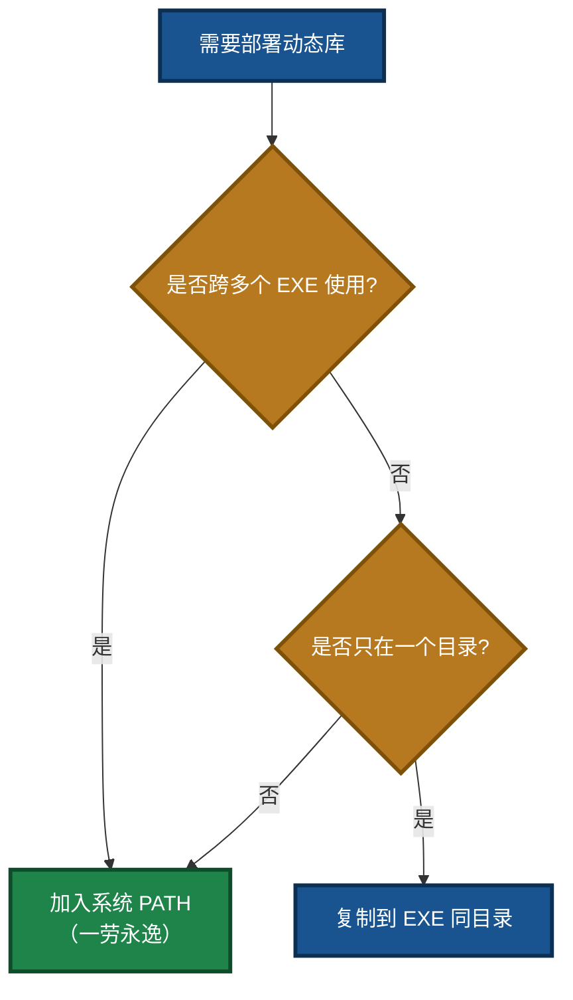
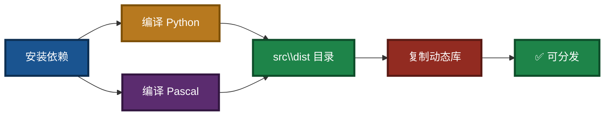

# LingoFuse-pasAgent 项目依赖安装与编译指南

> **文档版本**：V4.0  
> **最后更新**：2026-09-14  
> **适用平台**：Windows / Linux / macOS  
> **相关文档**（同目录）：
> - 编译指南：`Build_Guide.md`
> - MCP 新手指南：`mcp_api_tool_DOUBAO_GUIDE.md`
> - 推荐模型：`NVIDIA-Nemotron-3.5-Lightning-30B-A3B-UD-IQ4_NL.md`
> - LLM 服务命令行（子目录）：`src/LingoFuse_LLM_Service_CLI_guide.md`
> - LLM 代理命令行（子目录）：`src/LingoFuse_LLM_Proxy_CLI_Guide.md`
> - 生态体系总览（子目录）：`src/LingoFuse_LLM_Ecosystem_User_Guide.md`

---

## 阅读引导

本文档介绍编译和运行 **LingoFuse-pasAgent** 各组件所需的依赖包安装步骤。建议按以下顺序阅读：

1. **想快速装好环境** → 直接读第三章「Python 依赖安装」和第四章「获取动态库」。
2. **想了解 Pascal 编译环境** → 读第二章「环境准备」和第五章「Pascal 编译环境」。
3. **想验证是否装好** → 读第七章「验证安装」。
4. **遇到问题** → 读第八章「常见问题」。

如果你只是想**运行**预编译包而不想自己编译，请直接下载预编译包并按 `mcp_api_tool_DOUBAO_GUIDE.md` 操作，**无需**阅读本文档大部分内容。

**本次更新（V4.0）** 修正内容：
- 图 1「依赖层次」补入 `llm_proxy_tool.exe`（此前版本仅列出 3 个 Python 组件）。
- 第三章「Python 依赖安装」补充 `language_middleware` / `generate_agent_json` / `lingofuse` 三个本地模块的说明。
- 6.1 节编译脚本表：`build_llm_service.ps1` 编译目标由「3 个 EXE」修正为「**4 个 EXE**」（新增 `llm_proxy_tool.exe`）。
- 4.2 节备选方案目录示例统一为 `src\dist\`（此前误写为 `src`）。
- 第八章 FAQ 补充 `--hidden-import language_middleware` 的说明。
- 全部相关文档链接路径统一修正为「根目录 / `src/` 子目录」两种，去掉已不存在的 `llm-service/` 假设。

---

## 一、概述

本项目包含两类主要组件：

- **Python 组件**（如 `mcp_api_tool.py`、`llm_service.py`、`llm_proxy.py`、`llm_proxy_tool.py`、`bridge.py` 等），依赖 Python 第三方包。
- **Pascal 组件**（如 `pascal_agent_service.lpr`、`pascal_agent_api.lpr`、`HealthCheck.lpr`），依赖 Free Pascal 编译器和 Lazarus IDE。

**所有组件均依赖 LingoFuse 动态库**（`LingoFuse64.dll` / `liblingofuse.so`），该库由 LingoFuse 核心项目提供，不包含在本仓库中。

### 图 1：依赖层次



---

## 二、环境准备

### 2.1 Python 环境

- Python 3.8 及以上版本（推荐 3.10 ~ 3.12）
- pip（Python 包管理工具）

> **注意**：此前版本建议「Python 3.7+」，但 `mcp_api_tool.py` 依赖的 FastMCP 4.x 与部分现代库在 3.7 上已无官方支持，故推荐下限提升至 3.8。

### 2.2 Pascal 编译环境

- **Free Pascal 3.2+**（必须）
- **Lazarus IDE**（推荐，用于编译 Pascal 项目，且项目依赖 Lazarus 的 `.lpi` 文件）

> **注意**：本项目中的 Pascal 项目使用 Lazarus 项目文件（`.lpi`），**强烈建议使用 `lazbuild` 或 Lazarus IDE 进行编译**，而不是直接调用 `fpc`。因为项目包含复杂的依赖路径和单元搜索路径，`lazbuild` 能自动读取并处理这些配置。

### 图 2：环境准备流程


---

## 三、Python 依赖安装

### 3.1 快速安装（使用 `requirements.txt`）

在 `src/` 目录下执行：

```bash
cd src
pip install -r requirements.txt
```

`requirements.txt` 包含 MCP Server、HTTP 网关、LLM 代理与工具桥的基础依赖。

### 3.2 手动安装核心依赖

根据您要使用的组件，可能需要安装以下包：

| 包名 | 用途 | 是否必需 |
|------|------|----------|
| `fastmcp` | MCP 协议核心库（`mcp_api_tool.py` 依赖） | 若使用 MCP Server 则必需 |
| `pydantic` | FastMCP 依赖的数据验证库 | 若使用 MCP Server 则必需 |
| `flask` | HTTP 网关（`bridge.py`） | 若使用 bridge 则必需 |
| `requests` | HTTP 客户端（`llm_proxy` / `llm_proxy_tool` 探测 `/v1/models`） | 若使用任一代理则必需 |
| `llama-cpp-python` | LLM 服务（`llm_service.py` CPU 版） | 若需本地 LLM 则必需 |
| `jinja2` | 自定义聊天模板 | 若使用自定义模板则必需 |
| `pyinstaller` | 打包工具（仅开发者需要） | 编译时必需 |

> **本地模块（无需 pip 安装）**：
> - `language_middleware.py`：项目内模块，`mcp_api_tool.py` / `llm_proxy_tool.py` 通过 `try/except ImportError` 保护导入。
> - `generate_agent_json.py`：项目内模块，`mcp_api_tool.py --generate-configs` 依赖。
> - `lingofuse` 包：项目内 Python 绑定包，位于 `src/lingofuse/`。
>
> 这三者均为项目内本地模块，无需 `pip install`。打包时通过 `--hidden-import` 或 `--add-data` 引入。

### 图 3：按组件选择依赖



### 3.3 安装命令示例

```bash
# 基础 MCP Server 依赖
pip install fastmcp pydantic

# HTTP 网关（bridge）依赖
pip install flask

# LLM 服务（CPU 版，使用 llama.cpp）
pip install llama-cpp-python

# LLM 服务（GPU 版，示例 CUDA 12.4）
pip install llama-cpp-python --extra-index-url https://abetlen.github.io/llama-cpp-python/whl/cu124

# 自定义聊天模板
pip install jinja2

# HTTP 客户端（llm_proxy / llm_proxy_tool 探测 /v1/models）
pip install requests

# 打包工具（仅编译 EXE 时）
pip install pyinstaller
```

> **`llama-cpp-python` 详细安装**：包括各后端 wheel 源、社区预编译包、常见问题，详见 `src/llama_cpp_python_guide.md`。

---

## 四、获取 LingoFuse 动态库

所有 EXE 和 Python 脚本运行时都需要 **LingoFuse 动态库**。该库不包含在本仓库中，需从 [LingoFuse 仓库](https://github.com/PassByYou888/LingoFuse) 获取。

### 4.1 推荐部署方法：加入系统 PATH

1. 克隆 LingoFuse 仓库（需 `--recursive` 拉取子模块）：

```bash
git clone --recursive https://github.com/PassByYou888/LingoFuse.git
```

2. 将 LingoFuse 的 `Binary` 目录（或放置动态库的目录）加入系统 `PATH`。

   - **Windows**（PowerShell，临时）：
     ```powershell
     $env:PATH = "D:\path\to\LingoFuse\Binary;$env:PATH"
     ```
   - **Windows**（永久）：系统属性 → 环境变量 → 编辑 `Path`。
   - **Linux / macOS**：
     ```bash
     export PATH=/path/to/LingoFuse/Binary:$PATH
     ```

### 4.2 备选方案：复制到 EXE 同目录

如果不想修改 PATH，可以将动态库复制到每个 EXE 所在目录（例如 `src\dist\` 下编译出的 `mcp_api_tool.exe`、`pascal_agent_service.exe` 等）。

### 图 4：动态库部署决策



### 4.3 ⚠️ 运行环境依赖

预编译 DLL 使用 **Visual Studio 2022** 编译，运行时需要安装 **VS2022 可再发行组件（VC++ Redistributable）**。

请从微软官方下载并安装对应架构的版本：

- [VC++ Redistributable for Visual Studio 2022 (x86/x64)](https://learn.microsoft.com/en-us/cpp/windows/latest-supported-vc-redist?view=msvc-170)

---

## 五、Pascal 编译环境

### 5.1 安装 Lazarus

- 下载 Lazarus 安装包：[lazarus-ide.org](https://lazarus-ide.org)
- 推荐版本：**Lazarus 4.8** 或更高，自带 FPC 3.2.2+
- 安装时建议将 Lazarus 安装到 `C:\lazarus`

### 5.2 配置环境变量

将 Lazarus 的 FPC 目录添加到系统 `PATH`，例如：

```cmd
set PATH=C:\lazarus\fpc\3.2.2\bin\x86_64-win64;%PATH%
```

### 5.3 验证编译环境

```cmd
lazbuild.exe --version
fpc -iV
```

应正常输出版本信息。

### 5.4 为什么不推荐直接 `fpc` 编译？

- 项目依赖 Z 框架等大量外部单元，路径配置复杂，`lazbuild` 能正确读取 `.lpi` 中的搜索路径。
- 直接调用 `fpc` 需要手动指定大量 `-Fu` 参数，极易出错。
- 使用 `lazbuild` 可以确保与 Lazarus IDE 编译结果一致，减少兼容性问题。

---

## 六、编译指南

### 6.1 Python 组件编译（生成 EXE）

在 `src` 目录下，提供了 PowerShell 脚本用于打包 Python 组件：

| 脚本 | 作用 | 说明 |
|------|------|------|
| `build_mcp_api_tool.ps1` | 编译 `mcp_api_tool.exe` + `mcp_api_proxy.exe` | 打包 FastMCP、pydantic、lingofuse、language_middleware、generate_agent_json |
| `build_bridge.ps1` | 编译 `bridge.exe` | 打包 Flask 和 lingofuse |
| **`build_llm_service.ps1`** | **编译 `llm_service.exe` + `llm_proxy.exe` + `llm_proxy_tool.exe` + `llm_test.exe`（共 4 个）** | 打包 llama_cpp / lingofuse / language_middleware |

**使用方法**（在 `src` 目录打开 PowerShell）：

```powershell
.\build_mcp_api_tool.ps1
.\build_llm_service.ps1
```

脚本会调用 PyInstaller 生成 `.exe` 文件，输出位于 `src\dist` 目录。

> **注意**：
> - 编译前确保已安装 `pyinstaller` 和相应 Python 依赖（如 `fastmcp`、`pydantic`、`flask`、`llama-cpp-python` 等）。
> - `llm_proxy_tool.exe` 需要 `--hidden-import language_middleware`；`mcp_api_tool.exe` 需要 `--hidden-import language_middleware --hidden-import generate_agent_json`。这些已在脚本中预置。

### 6.2 Pascal 组件编译

**必须使用 Lazarus 或 `lazbuild`**，项目提供了一键脚本 `build_pascal_agent.bat`（在 `src` 目录）：

```bat
lazbuild.exe -B ./pascal_agent_service.lpi
lazbuild.exe -B ./pascal_agent_api.lpi
lazbuild.exe -B ./CreateHealthCheck/HealthCheck.lpi
echo 所有项目编译完成。
timeout /t 5 /nobreak >nul
```

运行方式（在 `src` 目录）：

```cmd
build_pascal_agent.bat
```

该脚本会编译：

- `pascal_agent_service.exe`
- `pascal_agent_api.exe`
- `HealthCheck.exe`（在 `CreateHealthCheck\` 目录下）

如果 Lazarus 未配置到 PATH，请用 Lazarus IDE 打开相应 `.lpi` 文件，点击“编译”即可。

### 图 5：编译流程



---

## 七、验证安装

### 7.1 验证 Python 环境

```bash
python -c "import fastmcp; import pydantic; print('OK')"
```

### 7.2 验证 Pascal 编译环境

编译成功 `pascal_agent_service.exe` 后，运行：

```bash
pascal_agent_service.exe
```

若能看到 `[MAIN] Service is running...` 则说明环境配置正确。

### 7.3 验证 LingoFuse 动态库

运行任何生成的 EXE 或 Python 脚本，若提示 `Failed to load LingoFuse64.dll`，则说明动态库未找到，请检查 PATH 或复制动态库。

### 7.4 验证 LLM 推理环境

如果安装了 `llama-cpp-python`：

```bash
python -c "from llama_cpp import Llama; print('安装成功！')"
```

若需检查 GPU 支持：

```bash
python -c "import llama_cpp; print(f'版本: {llama_cpp.__version__}'); print(f'GPU支持: {llama_cpp.llama_supports_gpu_offload()}')"
```

> **说明**：此前版本中的 `llama_cpp.supports_gpu_offload()` 是错误名称，正确的函数名是 `llama_cpp.llama_supports_gpu_offload()`（`supports_gpu_offload` 不带 `llama_` 前缀的版本不存在）。

---

## 八、常见问题

### Q1：pip 安装失败（网络问题）

**解决**：

- 使用国内镜像：`pip install -i https://pypi.tuna.tsinghua.edu.cn/simple 包名`
- 或使用代理。

### Q2：运行 EXE 提示“缺少 DLL”

**解决**：

- 将 `LingoFuse64.dll`（或 `liblingofuse.so`）复制到 EXE 目录，或将其所在目录添加到系统 `PATH`。
- 确保动态库与 EXE 架构一致（64 位 vs 32 位）。
- 确认已安装 [VC++ Redistributable](https://learn.microsoft.com/en-us/cpp/windows/latest-supported-vc-redist?view=msvc-170)。

### Q3：编译 Pascal 项目时提示“找不到单元”

**解决**：

- 确保已正确配置 Lazarus 的项目搜索路径（`.lpi` 文件中已定义）。
- 若使用 `build_pascal_agent.bat`，请确认 `lazbuild.exe` 在 PATH 中，或使用绝对路径调用。

### Q4：PyInstaller 打包后运行报 `ModuleNotFoundError`

**解决**：

- 可能需要增加 `--hidden-import` 参数：
  - `llm_proxy_tool.py` → `--hidden-import language_middleware`
  - `mcp_api_tool.py` → `--hidden-import language_middleware --hidden-import generate_agent_json`
- 确保 `lingofuse` 包被包含在 `--add-data` 中（参考脚本）。
- 上述 `--hidden-import` 参数已在项目提供的脚本中预置，若自行打包需手动补上。

### Q5：`llama-cpp-python` 安装失败

**解决**：

- 确认已安装 C 编译器（Windows 需要 Visual Studio 或 MinGW）。
- 使用预编译 wheel 跳过源码编译：
  ```bash
  pip install llama-cpp-python --extra-index-url https://abetlen.github.io/llama-cpp-python/whl/cpu
  ```
- 详细排查见 `src/llama_cpp_python_guide.md`。

### Q6：FPC 版本不匹配

**解决**：

- 所有平台必须使用**同一构建批次**的 FPC 3.3.1 预编译包，否则会出现 `PPU version mismatch`。
- 具体切换教程参考 LingoFuse 核心仓库根目录的 `Lazarus_Change_FPC.md`（不在本仓库中）。

---

## 九、总结

- **依赖**：所有组件需 LingoFuse 动态库，推荐通过克隆 LingoFuse 仓库并添加 PATH 来部署。
- **Python 编译**：使用 `src` 下的 `*.ps1` 脚本（PyInstaller）。`build_llm_service.ps1` 编译 **4 个** EXE（`llm_service.exe`、`llm_proxy.exe`、`llm_proxy_tool.exe`、`llm_test.exe`）。
- **Pascal 编译**：使用 `build_pascal_agent.bat`（基于 `lazbuild`），**不建议直接使用 `fpc`**。
- **推荐模型**：`NVIDIA-Nemotron-3.5-Lightning-30B-A3B-UD-IQ4_NL.gguf`，详见 `NVIDIA-Nemotron-3.5-Lightning-30B-A3B-UD-IQ4_NL.md`。

如有任何未覆盖的问题，请参考项目文档或联系开发团队。

---

## 十、相关文档

### 根目录文档

| 文档 | 说明 |
|------|------|
| `Build_Guide.md` | 编译指南（含更多脚本细节） |
| `mcp_api_tool_DOUBAO_GUIDE.md` | 新手零基础教程 |
| `NVIDIA-Nemotron-3.5-Lightning-30B-A3B-UD-IQ4_NL.md` | 推荐模型下载与部署 |
| `readme.md` | 项目总览与闭环架构 |
| `code_generate_mcp.md` | 代码生成器使用手册 |
| `pascal_code_mcp_rule.md` | Pascal 声明规范（解析契约） |
| `C_code_mcp_rule.md` | C 声明规范（解析契约） |
| `LingoFuse_mcp_api_tool_Implementation_Memo.md` | MCP 网关实施备忘 |
| `LingoFuse_Python_Binding_Migration_Record.md` | Python 绑定迁移与工作总结（历史参考） |

### 子目录文档（`src/`）

| 文档 | 说明 |
|------|------|
| `src/LingoFuse_LLM_Ecosystem_User_Guide.md` | 闭环架构与生态总览（三种服务端 + 两条路径） |
| `src/LingoFuse_LLM_Service_CLI_guide.md` | LLM 服务命令行手册 |
| `src/LingoFuse_LLM_Proxy_CLI_Guide.md` | LLM 代理命令行手册 |
| `src/LingoFuse_LLM_Proxy_Compatibility_Guide.md` | 129+ 后端兼容清单 |
| `src/LingoFuse_LLM_Pitfalls_For_AI.md` | 踩坑大全 |
| `src/LingoFuse_LLM_Service_Work_Summary.md` | LLM 工具链版本演进总结 |
| `src/llama_cpp_python_guide.md` | `llama-cpp-python` 安装与使用 |
| `src/lingofuse/Bridge_User_Guide.md` | HTTP 桥接网关使用指南 |
| `src/pascal_agent_api_ref_json.md` | `agent_main` / `register_agent` JSON 结构详解 |

---

**文档版本**：V4.0（三种服务端 + 两条工具路径，图 1 依赖层次补全，编译脚本表修正为 4 EXE，路径统一修正）  
**维护者**：LingoFuse-pasAgent 团队  
**反馈**：问题提 Issue，急事加 Q（600585）