# LingoFuse 与 LingoFuse-pasAgent 迁移与工作总结报告

> **文档版本**：V2.0  
> **最后更新**：2026-09-14  
> **涵盖周期**：2026-08-31 ~ 2026-09-10（原始工作） / 2026-09-14（文档更新）  
> **状态**：📜 **历史参考文档** —— 记录迁移与重构过程  
> **相关文档**（同目录）：
> - 项目总览：`readme.md`
> - MCP 实施备忘：`LingoFuse_MCP_Server_Implementation_Memo.md`
> - LLM 工具链总结（子目录）：`src/llm-service/LingoFuse_LLM_Service_Work_Summary.md`
> - 生态体系总览（子目录）：`src/llm-service/LingoFuse_LLM_Ecosystem_User_Guide.md`

---

## 阅读引导

本文档是 **2026-08-31 ~ 2026-09-10** 期间 LingoFuse 与 LingoFuse-pasAgent 两条主线迁移与重构的历史记录。建议按以下顺序阅读：

1. **想了解做了什么** → 读第一章「项目概述」和第三章「工作里程碑」。
2. **想了解核心框架改造** → 读第四章。
3. **想了解 Python 绑定迁移** → 读第五章。
4. **想了解 Pascal 工具链重构** → 读第六章。
5. **想了解 pasAgent 体系建设** → 读第七章。
6. **想了解遗留问题** → 读第十一章。

> **注意**：本文档为**历史参考**。最新的 LLM 工具链演进请查阅 `src/llm-service/LingoFuse_LLM_Service_Work_Summary.md`（v4.0）。

---

## 一、项目概述

本报告整合了 **LingoFuse 核心框架** 与 **LingoFuse-pasAgent 智能体技术体系** 两条主线的迁移改造与质量提升工作。二者关系如下：

### 图 1：项目层次关系

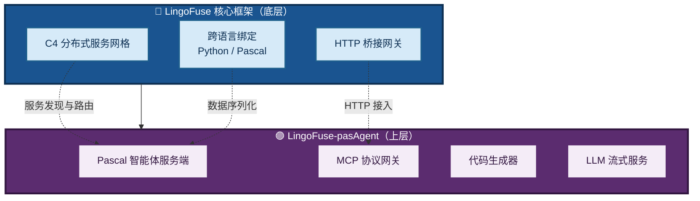

### 两条主线的定位

| 项目 | 定位 | 核心用户 |
|------|------|----------|
| **LingoFuse** | 通用分布式 RPC 基础设施 | 有跨语言/分布式开发需求的程序员 |
| **LingoFuse-pasAgent** | 面向 AI/MCP 的 Pascal 智能体解决方案 | 持有 Pascal 存量代码、有 AI 集成诉求的开发者 |

### 本次工作覆盖的核心议题

1. **LingoFuse 框架**：LLM 服务多会话重构、Python 绑定 v2.0→v2.1 迁移、Pascal 工具链重构。
2. **LingoFuse-pasAgent 体系**：MCP Server 打包适配、传输协议升级、缓存一致性与离线检测修复、文档体系建设、预编译包发布。

---

## 二、整体架构与数据流

### 2.1 LingoFuse 核心架构

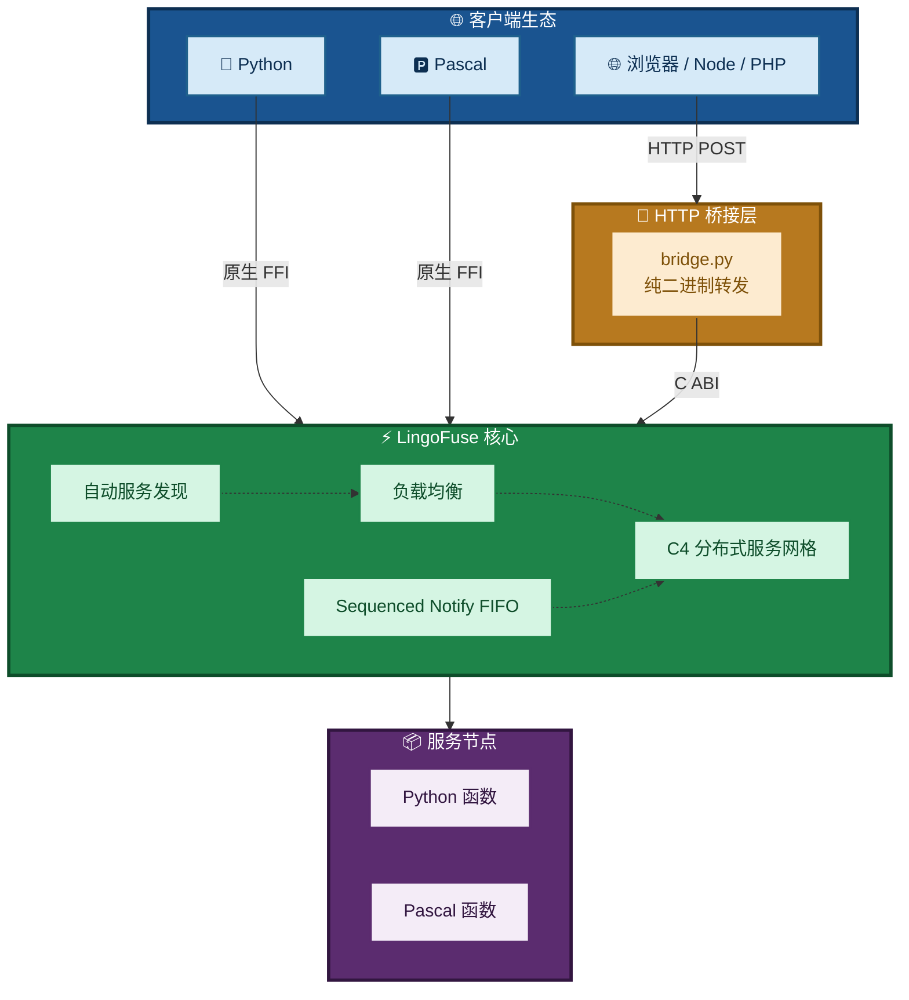

### 2.2 LingoFuse-pasAgent 工作流

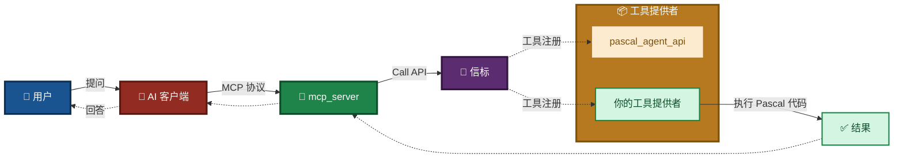

### 2.3 代码生成器数据流


---

## 三、工作里程碑

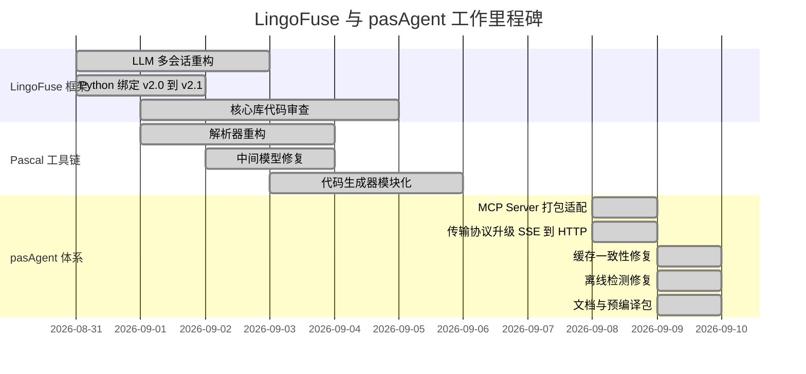

---

## 四、LingoFuse 核心框架改造

### 4.1 LLM 服务多会话动态路由重构

**背景**：原 LLM 服务采用单客户端固定监听模式（硬编码目标 App 名），无法支持多客户端同时调用，且日志输出冗余，缺乏运行时控制。

**核心改造对比**：

| 改造项 | 原实现 | 新实现 |
|--------|--------|--------|
| **通知目标** | 硬编码 `LLM_Client` | 从请求 JSON 的 `client_name` 字段动态提取 |
| **会话管理** | 无（单会话） | 多会话，每会话独立线程 + `session_id` |
| **日志控制** | 始终打印每 chunk JSON | `--quiet` / `--debug` / `--log-level` 运行时可控 |
| **启动反馈** | 无加载进度 | 显示 `Loading model...` |
| **客户端 App 名称** | 固定写死 | 连接成功后 `generate_app_name()` 动态生成 |
| **客户端连接顺序** | 先生成名称再连接 | `PrepareClient(nil)` → `PrepareDone` → 生成名称 → `BindApp` |
| **客户端选项** | 未显式设置 | `Wait_Connection_ReadyOk = True` |
| **Pascal 客户端错误处理** | `raise Exception` | 静默处理，返回 `(Result, ErrorMsg)` |
| **请求参数** | 仅 `content` + `prompt` | 增加 `client_name` 字段 |

### 图 2：架构演进序列

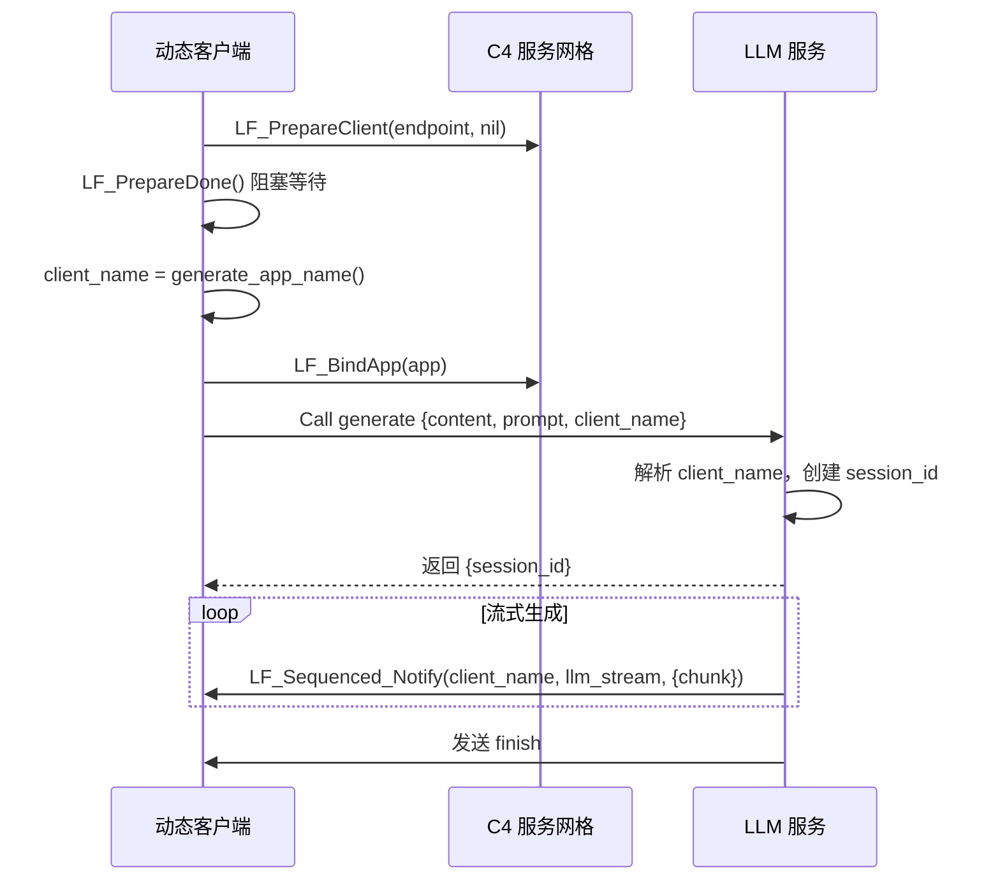

### 4.2 HTTP 桥接器升级（v2.1）

**核心变更**：从 JSON 解析模式进化为**纯二进制转发**模式。

### 图 3：HTTP 桥接器模式对比

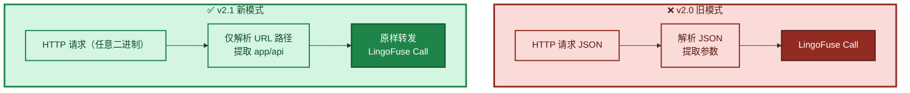

**关键改动**：

- 不再解析请求体 JSON，只从 URL 路径提取 `app` 和 `api`。
- 请求体原样转发给后端 LingoFuse 服务，响应原样返回。
- 新增 `check_api` 预检机制（含 3 次重试，间隔 200ms）。
- 容错字符串读取：无 `\0` 结尾的数据也能正确读取。
- 统一写入规范：自动追加 `\0`，响应前自动剥离尾部 `\0`。

---

## 五、Python 绑定迁移与迭代

### 5.1 版本演进

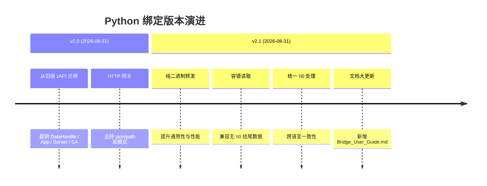

### 5.2 缺陷修复清单

| 缺陷 | 修复方案 |
|------|----------|
| 响应数据读取错误（`c_void_p` 不支持切片） | 改用 `LF_ReadBuffer` + 数组 |
| Pascal 服务端收到空请求体 | 请求体后追加 `\0` |
| 浏览器 JSON 解析失败（多余 `\0`） | 自动剥离尾部终止符 |
| `cross_bridge.py` 返回格式不统一 | 统一为 `{code, result/error}` |
| 多语言客户端路径错误 | 改用完整路径 `/cross_bridge/add` |

### 5.3 资源生命周期澄清

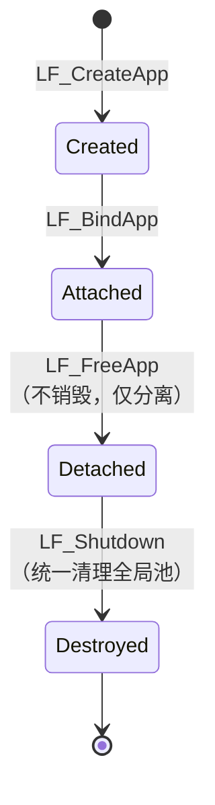

---

## 六、Pascal 工具链重构

Pascal 工具链涉及三个核心单元：底层解析器、中间模型和代码生成器。

### 6.1 解析器重构

### 图 4：解析器重构对比

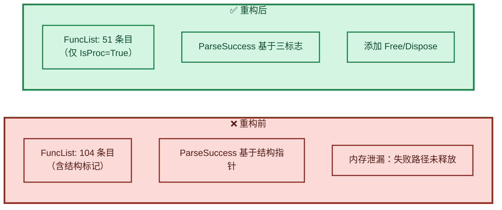

### 6.2 中间模型深拷贝修复

**问题根因**（浅拷贝 + 动态数组共享）：

### 图 5：浅拷贝问题

```mermaid
sequenceDiagram
    participant Loop as 循环
    participant F as f: TFunctionStructure
    participant List as FFuncs 列表

    Loop->>F: f := 从 JSON 读取
    Loop->>F: f.Params := [...]
    Loop->>List: FFuncs.Add(f) — 浅拷贝
    Note over List: 列表中的副本与 f<br/>共享同一动态数组
    Loop->>F: f.Clear — 释放 Params
    Note over List: 列表中的数据被清空
    Loop->>Loop: 下一次迭代...
```

**解决方案**：

1. 实现 `TFunctionStructure.Clone` 进行深拷贝。
2. 将 `FFuncs.Add(f)` 改为 `FFuncs.Add(f.Clone)`。

**修复前后对比**：

| 指标 | 修复前 | 修复后 |
|------|--------|--------|
| 生成代码行数 | 603 行 | 1742 行 |
| 支持的函数数 | 5 个 | 17 个 |
| 参数信息完整性 | 丢失 | 完整保留 |

### 6.3 类型归一化增强

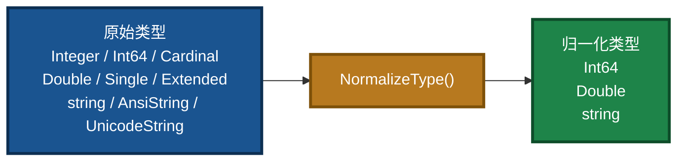

### 6.4 代码生成器模块化

原问题：整个生成过程堆叠在单一 `Lines` 列表中，维护困难。

**模块拆分**：

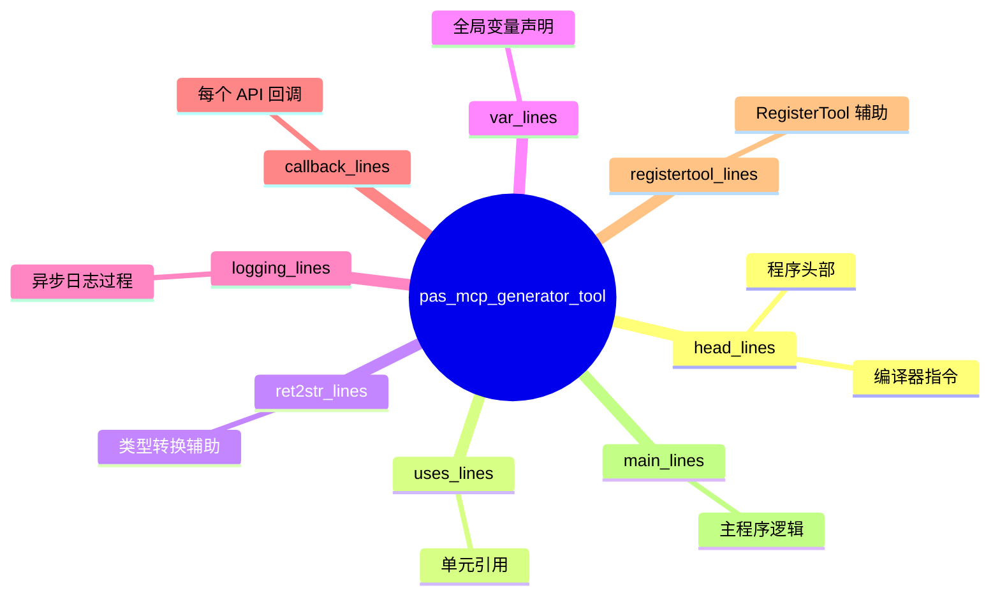

---

## 七、LingoFuse-pasAgent 智能体体系建设

### 7.1 MCP Server 打包适配

| 问题 | 解决方案 |
|------|----------|
| `__file__` 在 PyInstaller 中指向临时文件 | 新增 `is_frozen_exe()` / `get_server_script_path()`，打包时用 `sys.executable` |
| 日志路径权限问题 | `_init_logger` 自动创建父目录 |
| 文件日志默认开启导致失败 | 增加 `--log-file` 参数，默认禁用 |

### 7.2 传输协议升级

### 图 6：传输协议演进


**改动要点**：

- `mcp_server.py` 增加 `--transport http` 选项。
- 保留 `--transport sse`（运行时输出弃用警告）。
- `generate_agent_json.py` 生成三种配置：`_stdio.json`、`_http.json`、`_sse.json`。
- 文档同步推荐 HTTP 传输。

### 7.3 动态工具缓存一致性修复

**问题现象**：

- 后端工具离线时，`agent_main` 正确跳过不可用工具。
- 但 `mcp_server` 的 `refresh_monitor` 仍显示旧工具列表。
- 重启子进程后问题依旧。

**解决方案（v7.2）**：

- 修改 `_register_tool`：**不再修改 `self._tools`**，仅记录日志。
- `_fetch_tools_from_backend` 中**先清空再填充**，确保每次均为权威数据。
- 工具列表完全由 `agent_main` 驱动，避免缓存污染。

### 7.4 离线检测误报修复

**问题**：`LF_CheckApi` 对已离线应用仍返回 `True`。

**根因**：`Find_Remote_API` 未过滤离线客户端，其 `Service_Info` 缓存未清空。

**Pascal 侧补丁**：

```pascal
if Cli.Connected and Cli.LF_Service_Info_Is_Onlne and Cli.Service_Info.Find_API(...) then
    L.Add(Cli);
```

**修复前后对比**：

| 场景 | 修复前 | 修复后 |
|------|--------|--------|
| 后端添加新工具 | `mcp_server` 立即显示 | 刷新后显示 |
| 后端删除工具（服务离线） | 仍显示已删除的工具 | 刷新后自动移除 |
| `check_api` 对离线应用 | 返回 `True`（误报） | 返回 `False`（需 Pascal 补丁） |
| 动态注册后缓存一致性 | 缓存被污染 | 与后端严格一致 |

### 7.5 中文乱码与颜色问题修复

**现象**：PowerShell 下中文显示为 `?`，且出现 ANSI 彩色转义序列。

**根因**：Windows 控制台默认代码页 GBK，不支持 UTF-8。

**修复方案**：

- 强制 `sys.stdout` / `sys.stderr` 编码为 `utf-8`。
- 设置环境变量 `UVICORN_LOGGING_COLOR="0"`、`NO_COLOR="1"`。
- 尝试启用 Windows 虚拟终端处理（`SetConsoleMode`）。

### 7.6 JSON 序列化优化

**问题**：默认 `ensure_ascii=True`，中文字符被转义为 `\uXXXX`。

**修复**：在 `call_tool` 中使用 `json.dumps(arguments, ensure_ascii=False).encode('utf-8')`。

---

## 八、关键问题与解决方案汇总

| 问题 | 影响范围 | 根因 | 解决方案 |
|------|----------|------|----------|
| LLM 服务无法多会话 | 服务端 | 硬编码目标 App | 从请求提取 `client_name` |
| 客户端名称不含隧道信息 | 客户端 | 在连接前生成 | 移至 `PrepareDone` 后生成 |
| 日志过载 | 服务端 | 每 chunk 打印 | 增加日志级别控制 |
| `check_app` 误报 | 服务端 | 缓存延迟 | 增加 `--quiet` 关闭警告 |
| `bridge.py` 读取响应失败 | HTTP 网关 | `c_void_p` 不支持切片 | 改用 `LF_ReadBuffer` |
| Pascal 服务端收到空请求体 | HTTP 网关 | 未追加 `\0` | 请求体后追加 `\0` |
| HTTP 响应含 `\0` 导致 JSON 解析失败 | HTTP 网关 | 未剥离终止符 | 自动剥离尾部 `\0` |
| `cross_bridge.py` 返回格式不统一 | 示例 | 各 API 返回不同类型 | 统一为 `{code, result/error}` |
| `FuncList` 包含结构标记 | 解析器 | `Fill` 添加所有 token | 只添加 `IsProc=True` 的声明 |
| 参数数据 JSON 加载丢失 | 模型 | 浅拷贝 + 动态数组 | 实现深拷贝 `Clone` |
| `string` 类型不被支持 | 工具链 | `NormalizeType` 缺少别名 | 增加 `'string'` 识别 |
| `LF_FreeApp` 注释误导 | 核心库 | 未说明延迟释放 | 重写注释，明确语义 |
| 示例程序资源释放顺序错误 | 示例 | 先 `LF_Shutdown` 后 `App.Free` | 修正顺序 |
| 内存泄漏（解析失败） | 解析器 | `DeclItem` 未释放 | 添加 `Free`/`Dispose` |
| 生成代码行数不足 | 代码生成器 | 参数丢失导致函数被跳过 | 深拷贝修复后 603→1742 |
| 动态工具缓存污染 | pasAgent | `_register_tool` 无条件写入 | 修改为仅记录日志 |
| `check_api` 离线误报 | pasAgent | 未过滤离线客户端 | Pascal 侧补丁 |
| 打包后 `__file__` 路径错误 | pasAgent | PyInstaller 临时路径 | `is_frozen_exe()` 检测 |
| 中文乱码 + ANSI 颜色 | pasAgent | Windows 控制台代码页 | 强制 UTF-8 + 禁用颜色 |
| JSON 中文被转义 | pasAgent | `ensure_ascii=True` | 改为 `ensure_ascii=False` |

---

## 九、交付物清单

### 9.1 LingoFuse 核心框架

| 文件 | 语言 | 说明 |
|------|------|------|
| `llm_service.py` | Python | 多会话流式 LLM 服务端（含日志控制） |
| `llm_test.py` | Python | 动态会话测试客户端 |
| `llm_client.pas` | Pascal | 动态会话客户端单元（静默错误处理） |
| `Z.LingoFuse_Export.pas` | Pascal | 更新 `LF_FreeApp` / `LF_Shutdown` 注释 |
| `Z.LingoFuse_Core.pas` | Pascal | 确认全局池机制 |
| `LingoFuseBenchServer.lpr` | Pascal | 修正资源释放顺序 |
| `core.py`, `client.py`, `server.py`, `bridge.py`, `__init__.py` | Python | 绑定更新 |
| `test_lingofuse.py` | Python | 新增测试用例，修复导入错误 |
| `Z.Pascal_Func_Tool.pas` | Pascal | 解析器重构 |
| `pascal_func_model.pas` | Pascal | 深拷贝修复，跳过报告，类型归一化增强 |
| `pas_mcp_generator_tool.pas` | Pascal | 模块化重构，增加报告支持 |
| `lingofuse_import.pas` | Pascal | 添加 JSON 交换陷阱章节 |

### 9.2 LingoFuse-pasAgent 体系

| 文件 | 版本 | 说明 |
|------|------|------|
| `mcp_server.py` | v2.42 | MCP 网关，自动刷新逻辑稳定 |
| `language_middleware.py` | **v7.3** | 修复缓存污染，日志英文化 |
| `generate_agent_json.py` | v2.5 | 配置生成器（stdio/http/sse + proxy） |
| `mcp_proxy.py` | v2.5 | stdio 通信代理 |
| `cross_bridge.py` | — | 重构为依赖 `bridge.py` 子进程 |
| `build_mcp_server.ps1` | 新增 | PyInstaller 打包脚本 |
| `build_pascal_agent.bat` | 新增 | Lazarus 一键编译脚本 |
| `Z.Net.C4.LingoFuse.pas` | 建议补丁 | 增加离线检查 |

### 9.3 文档体系

| 文档 | 状态 | 面向对象 |
|------|------|----------|
| `readme.md` | 已重写 | 全体用户 |
| `MCP_SERVER_DOUBAO_GUIDE.md` | 已交付 | 零基础新手 |
| `Build_Guide.md` | V3.0 | 需要编译的开发者 |
| `Dependency_Installation_Guide.md` | V3.0 | 依赖安装的开发者 |
| `Qwen2.5-7B-Instruct-Q4_K_M.md` | 已更新（历史参考） | 想跑本地 LLM 的用户 |
| `NVIDIA-Nemotron-3.5-Lightning-30B-A3B-UD-IQ4_NL.md` | V2.0 | 推荐模型下载与部署 |
| `LingoFuse_LLM_Service_guide.md` | 已废弃 | 已迁移到子目录 |
| `LingoFuse_MCP_Server_Implementation_Memo.md` | V2.0 | 想了解内部实现的开发者 |

### 9.4 发布物

- **预编译包**：[pre_build 发布页](https://github.com/PassByYou888/LingoFuse-pasAgent/releases/tag/pre_build)
- **仓库信息**：Description 和 Topics 已优化，提升可发现性。

---

## 十、验证结果与测试

### 10.1 LLM 服务


### 10.2 Python 绑定

- ✅ 新增测试 `test_overlap_connection` 通过
- ✅ 新增测试 `test_free_app_lifetime` 通过
- ✅ `bridge.py` 预检重试机制验证通过
- ✅ 多语言客户端（Node.js、PHP、浏览器）调用正常
- ✅ 资源清理顺序正确（`App.free` 在 `LF_Shutdown` 前）

### 10.3 Pascal 工具链

- ✅ `FuncList` 仅含 51 个函数/过程
- ✅ JSON 加载后参数完整保留
- ✅ 代码生成行数从 603 增至 1742，支持 17 个函数
- ✅ 跳过报告正确输出
- ✅ 内存泄漏已修复

### 10.4 LingoFuse-pasAgent

| 场景 | 结果 |
|------|------|
| 脚本模式运行 | ✅ 正常启动，工具注册、调用成功 |
| EXE 模式运行 | ✅ 配置生成正确，stdio/HTTP 模式正常 |
| HTTP 模式工具调用 | ✅ 中文参数完整，后端正确解析 |
| 日志文件开关 | ✅ 默认关闭，指定 `--log-file` 后写入 |
| 控制台中文显示 | ✅ PowerShell 下无乱码 |
| 动态工具新增/删除 | ✅ `mcp_server` 能正确反映后端变化 |
| 离线检测 | ✅ `agent_main` 正确跳过不可用工具 |

### 10.5 整体兼容性

- ✅ 所有修改兼容 Delphi 和 Free Pascal。
- ✅ 新增的可选报告参数不影响现有调用代码。
- ✅ 所有组件兼容 PyInstaller 打包。

---

## 十一、后续建议与未完成项

### 11.1 LingoFuse 框架

| 建议 | 优先级 | 说明 |
|------|--------|------|
| 服务端并发限流（`--max-sessions`） | 中 | 防止 GPU 显存溢出 |
| 客户端存活探测 | 中 | 服务端定期检查目标 App 在线 |
| 断线重连 | 低 | 客户端断开后自动重连 |
| `bridge.py` 支持二进制模式（`--binary-mode`） | 高 | 避免 `\0` 损坏二进制数据 |
| `DataHandle` 提供 `write_bytes` 方法 | 中 | 明确区分文本和二进制 |

### 11.2 Pascal 工具链

| 建议 | 优先级 | 说明 |
|------|--------|------|
| 启用默认值输出 | 低 | 取消 `BuildParamString` 中注释的代码 |
| 支持 `overload` 关键字 | 中 | 扩展 `tfunc_decl` 添加 `Overload` 字段 |
| 规范化 `ResultDecl` 空格 | 低 | 使用 `TrimChar` 去除前导空格 |
| 编写单元测试 | 中 | 为 `decl_to_pascal`、`SaveToJson`、`LoadFromJson` 添加正式测试 |
| 扩展类型支持（Boolean、Integer） | 中 | 当前仅支持 Int64、Double、string |
| 支持 `var`/`out` 参数 | 低 | 通过引用传递方式支持 |
| 支持嵌套声明 | 低 | 类方法、记录方法等需扩展解析器和模型 |

### 11.3 LingoFuse-pasAgent 体系

| 建议 | 优先级 | 说明 |
|------|--------|------|
| 将 `pascal_decl_to_mcp` 集成到 CI | 中 | 实现工具定义与代码自动同步 |
| 收集用户反馈 | 中 | 持续优化文档和示例 |
| Pascal 侧离线检查补丁 | 高 | 用户端应尽快应用，防止 `check_api` 误报 |
| 监控刷新机制稳定性 | 中 | 确保异常场景下的可靠性 |
| `nssm` 等系统服务包装 | 低 | 生产环境中用于 Windows 服务管理 |

### 11.4 已知限制

| 限制 | 建议 |
|------|------|
| Windows 下 `SIGTERM` 不可用 | 生产环境建议用 `nssm` 等工具包装 |
| `generate_agent_json.py` 仍输出 `sse` 配置 | 完全弃用后可移除 |
| 控制台颜色完全禁用 | 若终端支持 ANSI 可手动恢复 |
| Pascal 后端日志中文显示可能乱码 | 调用 `SetConsoleOutputCP(CP_UTF8)` 解决 |

---

## 十二、总结

本次工作对 **LingoFuse 核心框架** 与 **LingoFuse-pasAgent 智能体技术体系** 进行了深度且系统的改造与修复，取得了以下里程碑成果：

### 图 7：工作成果总览

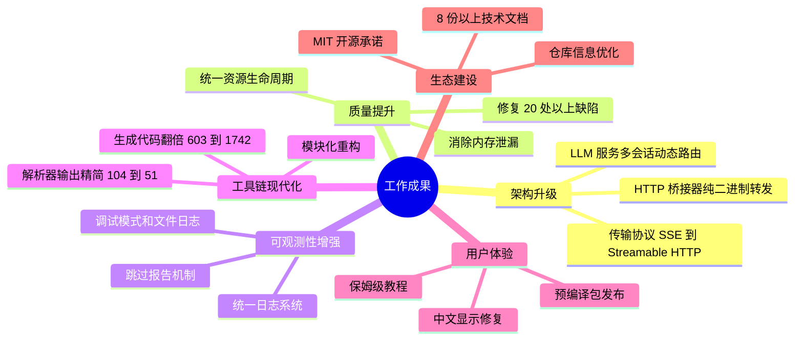

**核心成果**：

1. **架构升级**：LLM 服务从单会话升级为多会话动态路由；HTTP 桥接器进化为纯二进制转发；MCP Server 传输协议升级为官方推荐的 Streamable HTTP。
2. **质量提升**：全面审查资源生命周期，修复 20+ 处缺陷（内存泄漏、浅拷贝数据丢失、跨语言 `\0` 处理不一致、缓存污染、离线误报等）。
3. **可观测性增强**：统一日志系统，增加调试模式和文件日志，为所有工具链增加跳过报告，便于问题定位。
4. **工具链现代化**：解析器输出精简（104→51 条），JSON 大小减半；代码生成器行数翻倍（603→1742），支持更多函数，模块化后维护成本大幅降低。
5. **用户体验**：提供预编译包与保姆级教程，显著降低新手入门门槛。
6. **文档同步**：更新或新增 8+ 份技术文档，明确 API 语义和使用指南，降低学习曲线。

所有修改均已通过单元测试或实际运行验证，遗留问题已记录并排入后续迭代。本次工作为 LingoFuse 的工业级应用和 Pascal 生态的工具化奠定了坚实基础。

---

## 十三、相关文档（同目录）

| 文档 | 说明 |
|------|------|
| `readme.md` | 项目总览与闭环架构 |
| `MCP_SERVER_DOUBAO_GUIDE.md` | 新手零基础教程 |
| `LingoFuse_MCP_Server_Implementation_Memo.md` | MCP 网关实施备忘 |
| `Build_Guide.md` | 编译指南 |
| `Dependency_Installation_Guide.md` | 依赖安装 |
| `NVIDIA-Nemotron-3.5-Lightning-30B-A3B-UD-IQ4_NL.md` | 推荐模型下载与部署 |

### 子目录文档

| 文档 | 位置 | 说明 |
|------|------|------|
| `LingoFuse_LLM_Service_Work_Summary.md` | `src/llm-service/` | **最新** LLM 工具链版本演进总结 |
| `LingoFuse_LLM_Ecosystem_User_Guide.md` | `src/llm-service/` | 闭环架构与生态总览 |
| `LingoFuse_LLM_Service_CLI_guide.md` | `src/llm-service/` | LLM 服务命令行手册 |
| `LingoFuse_LLM_Proxy_CLI_Guide.md` | `src/llm-service/` | LLM 代理命令行手册 |
| `LingoFuse_LLM_Pitfalls_For_AI.md` | `src/llm-service/` | 踩坑大全 |

---

**文档版本**：V2.0（历史参考，高对比配色）  
**维护者**：LingoFuse-pasAgent 团队  
**反馈**：问题提 Issue，急事加 Q（600585）

---

*本报告为历史参考文档，最新的 LLM 工具链演进请查阅 `src/llm-service/LingoFuse_LLM_Service_Work_Summary.md`（v4.0）。*