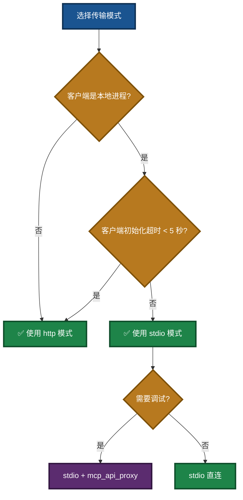
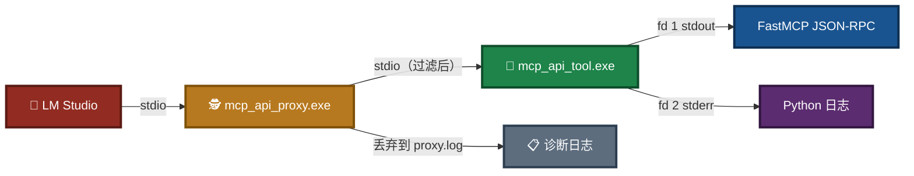
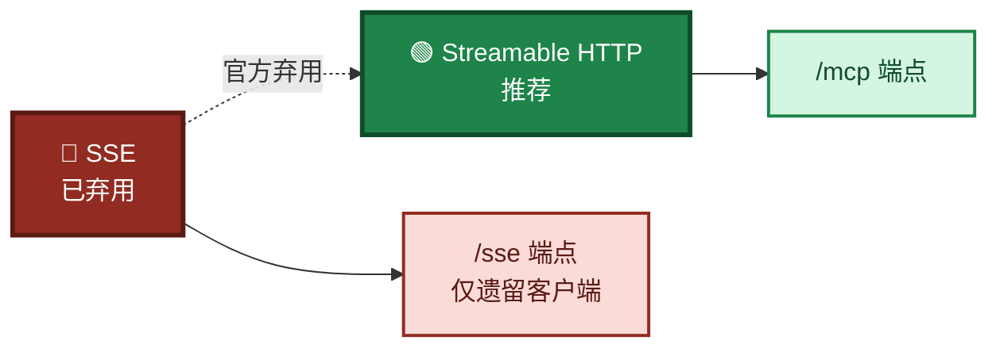
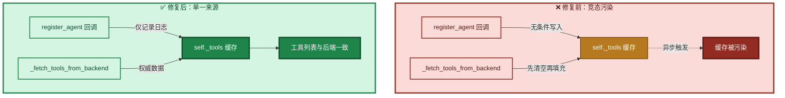
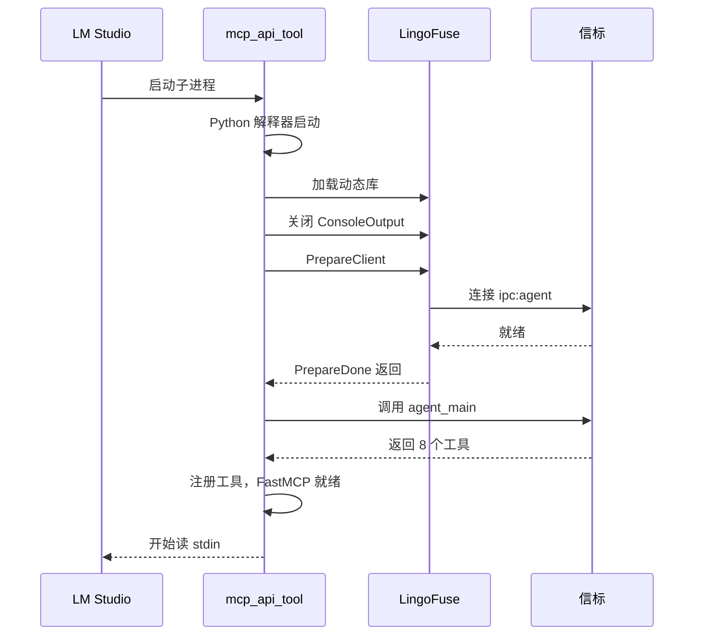
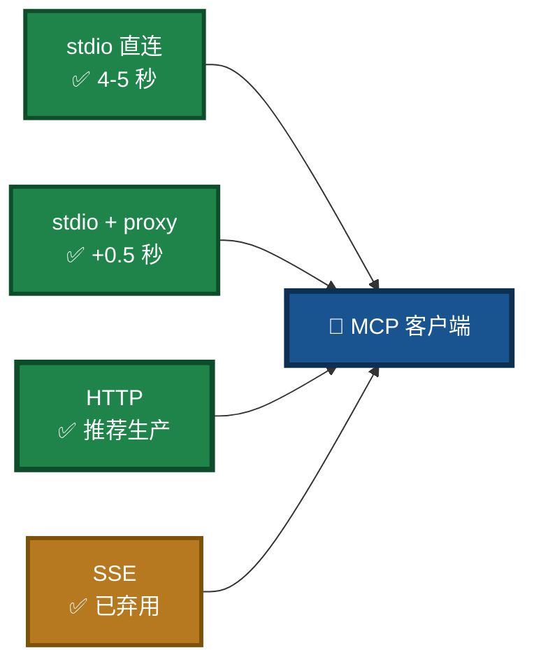

# LingoFuse MCP Server 实施备忘

> **文档路径**：`LingoFuse_mcp_api_tool_Implementation_Memo.md`  
> **版本**：V2.1  
> **最后更新**：2026-09-14  
> **涵盖周期**：2026-09-08 ~ 2026-09-10（原始工作） / 2026-09-14（文档更新）  
> **相关文档**（同目录）：
> - 项目总览：`readme.md`
> - MCP 新手指南：`mcp_api_tool_doubao_guide.md`
> - 编译指南：`Build_Guide.md`
> - 依赖安装：`Dependency_Installation_Guide.md`
> - 生态体系总览（子目录）：`src/LingoFuse_LLM_Ecosystem_User_Guide.md`

---

## 阅读引导

本文档记录了 LingoFuse MCP Server 及相关工具链的完整改造、调试和交付过程。建议按以下顺序阅读：

1. **想了解做了什么** → 读第一章「项目背景与目标」和第二章「架构总览」。
2. **想了解关键问题与修复** → 读第三章「完成的主要工作项」。
3. **想了解 stdio 传输打通细节** → 读第四章「stdio 模式启动链路剖析」。
4. **想了解交付物** → 读第五章「最终交付物清单」。
5. **想了解限制和回滚** → 读第七、八章。

**本次更新（V2.1）**：
- 修正第三章 3.9.1 表格中的拼写错误（`execpet!` → `exception!`）。
- 修正第五章 5.3 节的文档清单：移除误归入根目录的 `LingoFuse_LLM_Service_CLI_guide.md`（实际位于 `src/`），补充 `NVIDIA-Nemotron-3.5-Lightning-30B-A3B-UD-IQ4_NL.md`。
- 补全第十章「相关文档（同目录）」子目录文档列表，与 `src/` 实际文档对齐。

---

## 一、项目背景与目标

- **项目名称**：LingoFuse MCP Server（Model Context Protocol 服务网关）
- **核心用途**：作为 LM Studio、Claude Desktop 等 MCP 客户端与 LingoFuse 后端（Pascal / 任意语言）之间的桥梁，动态注册并调用后端工具。
- **原始版本基线**：v2.21（2026-09-08）
- **当前版本**：v2.42（2026-09-10）

### 主要目标

1. 修复打包为 EXE 后配置生成和日志路径问题；
2. 升级传输协议，从 SSE 过渡到 Streamable HTTP（官方推荐）；
3. 解决控制台中文乱码及颜色输出问题；
4. 增强日志可观测性（Agent 日志前缀、文件日志开关）；
5. 确保所有改动兼容 PyInstaller 打包场景；
6. 修复动态工具缓存不一致问题；
7. 修复 `LF_CheckApi` 离线误报问题；
8. **打通 stdio 传输**，使 LM Studio 可以通过 `mcp_api_tool.exe` 直连或经 `mcp_api_proxy.exe` 中转运行。

### 图 1：项目在整个闭环中的定位


---

## 二、架构总览

### 2.1 三种传输模式的定位

| 模式 | 启动方式 | 适用场景 | 启动耗时敏感性 |
|------|----------|----------|----------------|
| `stdio` | MCP 客户端作为子进程启动 | LM Studio / Claude Desktop 本地集成 | **高**（阻塞客户端握手） |
| `http` | 手动启动，监听端口 | 远程 / 多客户端 / 弱网 | 低 |
| `sse` | 手动启动，监听端口（已弃用） | 遗留客户端 | 低 |

### 图 2：三种传输模式选择



### 2.2 数据流（stdio + proxy）



`mcp_api_proxy.exe` 拦截 mcp_api_tool 的 stdout，**仅转发以 `{` 开头的行**（MCP 不使用 JSON-RPC batch，故无需接受 `[`）。C 层的诊断输出（`Wait Connection ReadyOk = True`、`Clean Framework.` 等）被丢弃到 `proxy.log` 与 stderr，不再污染协议流。

### 2.3 数据流（stdio 直连）


通过 `LF_SetOption("ConsoleOutput", "False")` + `LF_SetOption("Quiet", "True")` 关闭 LingoFuse C 层的 fd 1 输出。适用于 LM Studio 的 initialize 超时 ≥ 5 秒的版本。

---

## 三、完成的主要工作项

### 3.1 打包（EXE）适配

| 问题 | 解决方案 |
|------|----------|
| `__file__` 在 PyInstaller 中指向临时 `.py` 文件，导致配置生成命令错误 | 新增 `is_frozen_exe()` 和 `get_server_script_path()`，打包时使用 `sys.executable` |
| 日志文件路径权限问题 | `_init_logger` 中自动创建父目录（`os.makedirs(log_dir, exist_ok=True)`） |
| 文件日志默认开启导致启动失败 | 增加 `--log-file` 参数，默认不启用文件日志 |

### 3.2 传输协议升级（SSE → Streamable HTTP）

- **背景**：MCP 官方已弃用 SSE，推荐使用 Streamable HTTP（`/mcp` 端点）。
- **改动**：
  - `mcp_api_tool.py` 增加 `--transport http` 选项。
  - 保留 `--transport sse`（标记弃用，运行时输出警告）。
  - `generate_agent_json.py` 生成三种配置：`_stdio.json`、`_http.json`、`_sse.json`。
  - 所有 README 文档同步推荐 HTTP。

### 图 3：传输协议演进



### 3.3 配置生成器增强（`generate_agent_json.py`）

- **新增 `--proxy-path` 参数**：若提供，额外生成 `_stdio_proxy.json`。
- **自动添加 `--log-file`**：生成的 stdio 配置默认附带 `--log-file`。
- **绝对路径处理**：日志文件路径使用 `resolve()` 转绝对路径。
- **proxy 命令构造**：按 server 类型（`is_exe`）决定 proxy 是脚本还是 exe，确保源模式/打包模式一致。

### 3.4 日志系统重构

| 改动 | 说明 |
|------|------|
| 默认禁用文件日志 | 仅当 `--log-file` 指定时启用 |
| 增加 `[MCP Server]` 前缀 | 所有发送到后端的日志均带此前缀 |
| 增加 `[Agent]` 前缀 | 工具调用日志带此前缀 |
| 日志等级控制 | `--debug` 开启详细调试日志 |

### 3.5 中文乱码 & 控制台颜色

- **现象**：PowerShell 下中文显示为 `?`，出现 ANSI 彩色转义序列。
- **根因**：Windows 控制台默认代码页 GBK；未启用虚拟终端处理。
- **修复**：
  - 强制 `sys.stdout` / `sys.stderr` 编码为 `utf-8`。
  - 设置 `UVICORN_LOGGING_COLOR="0"`、`NO_COLOR="1"` 等。
  - 尝试启用 Windows 虚拟终端处理（`SetConsoleMode`）。
- **结果**：PowerShell 下中文正常显示，无颜色乱码。

### 3.6 JSON 序列化优化

- **问题**：`json.dumps` 默认 `ensure_ascii=True`，中文字符被转义为 `\uXXXX`，后端日志无法直接显示中文。
- **修复**：所有序列化调用改用 `ensure_ascii=False`。
- **验证**：Pascal 后端日志成功打印中文诗句。

### 3.7 动态工具缓存一致性（2026-09-09）

#### 3.7.1 问题现象

- 后端工具离线时，`agent_main` 正确跳过不可用工具。
- 但 `mcp_api_tool` 的 `refresh_monitor` 仍显示旧工具列表。
- 重启子进程后问题依旧。

#### 3.7.2 根本原因

- `_reg_tool_callback`（由 `register_agent` 触发）**无条件向 `self._tools` 写入工具定义**，与 `_fetch_tools_from_backend` 形成竞态。

#### 3.7.3 解决方案（v7.2 / v7.3）

- 修改 `_register_tool`：**不再修改 `self._tools`**，仅记录日志。
- `_fetch_tools_from_backend` 中**先清空再填充**，确保每次均为权威数据。
- 工具列表完全由 `agent_main` 驱动，避免缓存污染。
- **（v7.3 追加）** `_reg_tool_callback` 读取字段改为 `name`（与 Pascal 端一致），原实现读 `tool_name` 导致永远失败。

### 图 4：动态工具缓存修复



### 3.8 离线检测修复（2026-09-09）

#### 3.8.1 问题现象

`LF_CheckApi` 对已离线应用仍返回 `True`。

#### 3.8.2 根本原因

`Find_Remote_API` 未过滤离线客户端，其 `Service_Info` 缓存未清空。

#### 3.8.3 Pascal 侧补丁

```pascal
if Cli.Connected and Cli.LF_Service_Info_Is_Onlne and Cli.Service_Info.Find_API(...) then
    L.Add(Cli);
```

确保只有**当前在线且已收到服务广播**的客户端才被视为有效。

### 3.9 stdio 传输全链路打通（2026-09-10）

这是本次工作的**核心攻坚**。stdio 从"完全不能连接"到"直连 / proxy 双模式可用"，共经历 7 个独立问题的定位与修复。

#### 3.9.1 问题总览

| # | 现象 | 根因 | 修复 |
|---|------|------|------|
| 1 | 主进程和子进程都连接 LingoFuse，日志重复 | `main()` 与 `run_fastmcp()` 各初始化一次 | v2.30 起主进程不再加载 LingoFuse / 不连接后端 |
| 2 | FastMCP 4.0.x 仍打印 ASCII banner | 仅设 `FASTMCP_QUIET=1` 已不足（4.0 改了默认值） | v2.33 显式传 `show_banner=False` + 设置 `FASTMCP_SHOW_SERVER_BANNER=false` |
| 3 | LM Studio 收到 `Wait Connection ReadyOk = True` 等乱码，无法解析 JSON-RPC | LingoFuse C 层 `DoStatus` 直接写 fd 1（协议通道） | v2.38 stdio 模式关闭 `ConsoleOutput` / `Quiet`；同时 proxy v2.1 做行过滤 |
| 4 | mcp_api_tool 启动 20ms 后立即 EOF 退出 | proxy `bufsize=0` 使子进程 stdin 变非阻塞，FastMCP 立即读到 EOF | proxy v2.3 移除 `bufsize=0` |
| 5 | proxy 中 `LM->Server` 方向完全无数据 | `sys.stdin.buffer.read(4096)` 阻塞等待满块 | proxy v2.2 改用 `read1()` |
| 6 | proxy 过滤器误把 `[INFO]` 当 JSON-RPC batch | `_is_json_rpc_line` 接受 `[` 开头 | proxy v2.3 只认 `{` 开头 |
| 7 | 工具能注册但调用返回 `args={'a': {}, 'b': {}}`，Pascal 端 `exception!` | v2.35 重构时丢掉了参数类型注解，FastMCP 生成空 schema | v2.40 补回 `_json_type_to_python`，生成 `a: int` 等 |

#### 3.9.2 关键修复细节

**（1）主进程/子进程职责分离（v2.30）**

```python
# 主进程：不加载 LingoFuse、不连接后端
# 子进程（run_fastmcp）：才做初始化
```

避免了 `Successfully loaded from system PATH` 与 `Retrieved N tools` 在日志中各出现两次。

**（2）banner 抑制（v2.33）**

FastMCP 4.0.x 的 `run()` 签名：

```python
FastMCP.run(self, transport=None, show_banner: bool | None = None, ...)
```

`show_banner` 默认 `None`（从 settings 解析），仅靠环境变量已不足。修复：显式传 `show_banner=SHOW_BANNER`（默认 `False`），并附加设置 `FASTMCP_SHOW_SERVER_BANNER="false"` + `FASTMCP_BANNER="none"` 作双保险。

**（3）stdio 模式关闭 C 层输出（v2.38）**

`run_fastmcp()` 中，在任何 LingoFuse API 被调用之前：

```python
if TRANSPORT == "stdio" and LF_SetOption is not None:
    LF_SetOption(b"ConsoleOutput", b"False")
    LF_SetOption(b"Quiet", b"True")
```

注意顺序：`_ensure_native_loaded()` 之后、`_ensure_language_middleware_loaded()` 之前。因为 `language_middleware` 的模块级代码会调用 `LF_SetOption`，必须确保 `ConsoleOutput` 已经关闭。

**（4）stdio 走主进程，http/sse 走子进程（v2.39）**

Windows 的 `multiprocessing` 是 spawn 模式，会重启 Python 解释器、重新 import 所有模块、重新加载 LingoFuse DLL、重新连接后端，把启动时间从 4-5 秒拉长到 9 秒，超过 MCP 客户端的 initialize 超时。

修复：

```python
if TRANSPORT == "stdio":
    # 主进程直接跑 FastMCP
    run_fastmcp(config)
else:
    # http/sse 保持子进程，避免主进程长期持有 LingoFuse 原生库
    mcp_process = multiprocessing.Process(target=run_fastmcp, args=(config,))
    mcp_process.start()
    mcp_process.join()
```

**（5）proxy 修复（v2.1 / v2.2 / v2.3）**

- v2.1：新增 JSON-RPC 行过滤。`Server->LM` 方向只转发 `{` 开头的行。
- v2.2：`source.read(BLOCK_SIZE)` → `source.read1(BLOCK_SIZE)`。`read1` 在任何数据可用时立即返回，避免 `sys.stdin.buffer` 阻塞。
- v2.3：移除 `subprocess.Popen(..., bufsize=0)`。`bufsize=0` 使子进程 stdin 变成无缓冲的 `io.FileIO`，Windows 上表现为非阻塞，FastMCP 会立即读到 EOF 退出。

**（6）参数类型注解恢复（v2.40）**

v2.35 重构 `register_dynamic_tools` 时，为了"更简洁"去掉了参数类型注解：

```python
# v2.35 错误版本
required_parts.append(py_param)              # ❌ 无类型
optional_parts.append(f"{py_param}=None")    # ❌ 无类型
```

FastMCP 从签名生成 JSON Schema 时，无注解的参数推导为 `Any` 或空对象。LM Studio 收到后发送 `{"a": {}, "b": {}}`，Pascal 端想当整数用，抛异常。

修复：新增 `_json_type_to_python` 映射辅助函数，恢复注解。

```python
def _json_type_to_python(json_type: str) -> str:
    return {
        "integer": "int",
        "number": "float",
        "string": "str",
        "boolean": "bool",
        "array": "list",
        "object": "dict",
    }.get(json_type, "Any")

# 生成签名时
json_type = props[rp].get("type", "string")
py_type = _json_type_to_python(json_type)
if rp in required:
    required_parts.append(f"{py_param}: {py_type}")
else:
    optional_parts.append(f"{py_param}: {py_type} = None")
```

生成的函数示例：

```python
async def add(a: int, b: int) -> Any:
    """Add two integers: a + b"""
    args = {'a': a, 'b': b}
    return await call_tool('add', args)
```

**（7）`_lf_native.py` 加载信息改走 stderr**

原实现：

```python
print(f"[INFO] Successfully loaded from system PATH: {lib_name}")
```

在 stdio 模式下会被 MCP 客户端误读为协议数据。改为：

```python
def _eprint(msg: str) -> None:
    sys.stderr.write(msg + "\n")
    sys.stderr.flush()
```

所有加载信息改走 stderr。

#### 3.9.3 修复前后对比

| 场景 | 修复前 | 修复后 |
|------|--------|--------|
| stdio 直连 | 20ms 后 EOF 退出 | ✅ 稳定运行 |
| stdio + proxy | 同上 | ✅ 稳定运行 |
| 工具调用（如 `add(5,3)`） | `args={'a': {}, 'b': {}}`，Pascal 端 exception | ✅ `args={'a': 5, 'b': 3}`，返回 8 |
| 启动耗时 | ~9 秒（超时） | ~4-5 秒（成功） |
| LM Studio 收到乱码 | 大量 C 层诊断 | ✅ 只有 JSON-RPC |

### 图 5：stdio 传输打通过程


---

## 四、stdio 模式启动链路剖析

以 v2.42 为例，stdio 直连的完整启动时间线（LM Studio 视角）：

```
[T+0.0s]  LM Studio 启动 mcp_api_tool.exe 子进程
[T+0.5s]  Python 解释器启动完成，开始 import 模块
[T+1.0s]  _ensure_native_loaded() 加载 LingoFuse64.dll
[T+1.0s]  LF_SetOption(ConsoleOutput=False, Quiet=True)
[T+1.5s]  _ensure_language_middleware_loaded() 完成
[T+2.0s]  LF_PrepareClient 开始连接 ipc:agent
[T+4.5s]  LF_PrepareDone 返回（Wait_Connection_ReadyOk 阻塞结束）
[T+4.5s]  调用 agent_main 拿到 8 个工具
[T+5.0s]  register_dynamic_tools 完成，FastMCP 就绪
[T+5.0s]  FastMCP 开始读 stdin，处理 LM Studio 的 initialize
```

### 图 6：启动时序



**关键约束**：从 `LM Studio 启动子进程` 到 `FastMCP 开始读 stdin` 必须小于 MCP 客户端的 initialize 超时。LM Studio 实测约为 **5 秒**。

- 主进程直跑（v2.39）：4.5-5 秒，**刚好卡在边缘**。
- 加 proxy（v2.3）：多 0.5 秒，**有超时风险**。

**建议**：如果 LM Studio 版本对 stdio 超时较严格，优先使用 HTTP 模式。

---

## 五、最终交付物清单

### 5.1 核心文件

| 文件 | 版本 | 说明 |
|------|------|------|
| `mcp_api_tool.py` | **v2.42** | stdio 主进程运行 + 参数类型注解修复 + ConsoleOutput 抑制 |
| `language_middleware.py` | **v7.3** | `_read_string` 容错 + `ensure_ascii=False` + `reg_tool` 字段名对齐 |
| `mcp_api_proxy.py` | **v2.5** | JSON-RPC 行过滤 + `read1` + 无 `bufsize=0` |
| `_lf_native.py` | v1.x | 加载信息走 stderr |
| `generate_agent_json.py` | **v2.5** | proxy 配置生成 |
| `pascal_agent_service.exe` | — | 后端信标 |
| `pascal_agent_api.exe` | — | 工具提供者示例 |

### 5.2 打包脚本

| 文件 | 说明 |
|------|------|
| `build_mcp_api_tool.ps1` | PyInstaller 打包主服务（含 `--add-data`） |
| `build_pascal_agent.bat` | Lazarus 一键编译 Pascal 项目 |

### 5.3 文档

**根目录文档**：

| 文件 | 说明 |
|------|------|
| `readme.md` | 项目总览 |
| `Build_Guide.md` | 编译指南 |
| `Dependency_Installation_Guide.md` | 依赖安装 |
| `mcp_api_tool_doubao_guide.md` | 零基础新手教程 |
| `NVIDIA-Nemotron-3.5-Lightning-30B-A3B-UD-IQ4_NL.md` | 推荐模型下载与部署 |
| `code_generate_mcp.md` | 代码生成器使用手册 |
| `pascal_code_mcp_rule.md` | Pascal 声明规范 |
| `C_code_mcp_rule.md` | C 声明规范 |
| `LingoFuse_mcp_api_tool_Implementation_Memo.md` | **本文档** |
| `LingoFuse_Python_Binding_Migration_Record.md` | Python 绑定迁移与工作总结（历史参考） |
| `Qwen2.5-7B-Instruct-Q4_K_M.md` | 旧版入门模型（历史参考） |
| `Local LLM Agent Handbook CPU First, GPU Optional.md` | 智能体原理与本地 LLM 入门 |

**子目录文档（`src/`）**：

| 文件 | 说明 |
|------|------|
| `LingoFuse_LLM_Ecosystem_User_Guide.md` | 闭环架构与生态总览 |
| `LingoFuse_LLM_Service_CLI_guide.md` | LLM 服务命令行手册 |
| `LingoFuse_LLM_Proxy_CLI_Guide.md` | LLM 代理命令行手册 |
| `LingoFuse_LLM_Proxy_Compatibility_Guide.md` | 129+ 后端兼容清单 |
| `LingoFuse_LLM_Pitfalls_For_AI.md` | 踩坑大全 |
| `LingoFuse_LLM_Service_Work_Summary.md` | LLM 工具链版本演进总结 |
| `llama_cpp_python_guide.md` | `llama-cpp-python` 安装与使用 |
| `lingofuse/Bridge_User_Guide.md` | HTTP 桥接网关使用指南 |

### 5.4 LM Studio 配置模板

**方式 A：stdio 直连**

```json
{
  "mcpServers": {
    "pascal-backend": {
      "command": "C:\\Python314\\python.exe",
      "args": [
        "D:\\LingoFuse-pasAgent\\src\\mcp_api_tool.py",
        "--endpoint", "ipc:agent",
        "--timeout", "5000",
        "--reg-agent-app", "reg_agent",
        "--tool-provider-app", "agent_main_app",
        "--agent-main-api", "agent_main",
        "--agent-log-api", "agent_log",
        "--transport", "stdio",
        "--log-file", "D:\\LingoFuse-pasAgent\\src\\mcp_configs\\mcp_api_tool.log"
      ],
      "env": {
        "LINGOFUSE_ENDPOINT": "ipc:agent"
      }
    }
  }
}
```

**方式 B：stdio + proxy**

在 args 前插入 `mcp_api_proxy.py` 与 `python.exe`：

```json
"args": [
  "D:\\LingoFuse-pasAgent\\src\\mcp_api_proxy.py",
  "C:\\Python314\\python.exe",
  "D:\\LingoFuse-pasAgent\\src\\mcp_api_tool.py",
  "--endpoint", "ipc:agent",
  ...
]
```

**方式 C：HTTP（推荐用于生产）**

```json
{
  "mcpServers": {
    "pascal-backend": {
      "url": "http://127.0.0.1:8000/mcp",
      "env": {
        "LINGOFUSE_ENDPOINT": "ipc:agent"
      }
    }
  }
}
```

搭配 `mcp_api_tool.exe --transport http --host 127.0.0.1 --port 8000` 先手动启动。

---

## 六、已验证场景

| 场景 | 结果 |
|------|------|
| 脚本模式运行（`python mcp_api_tool.py`） | ✅ 正常启动，工具注册、调用成功 |
| EXE 模式运行 | ✅ 配置生成正确，stdio / HTTP 模式正常 |
| **stdio 直连** | ✅ 稳定运行，参数正确传递 |
| **stdio + proxy** | ✅ 稳定运行，C 层污染被过滤 |
| **HTTP 模式工具调用** | ✅ 中文参数完整，后端正确解析 |
| 日志文件开关 | ✅ 默认关闭，指定 `--log-file` 后写入 |
| 控制台中文显示 | ✅ PowerShell 下无乱码 |
| 配置生成（`--generate-configs`） | ✅ 生成 stdio / http / sse 三种配置 |
| 动态工具新增 / 删除 | ✅ `mcp_api_tool` 能正确反映后端变化 |
| 离线检测 | ✅ `agent_main` 正确跳过不可用工具 |
| 参数类型完整性 | ✅ FastMCP 生成正确的 JSON Schema |

**实测工具调用示例**（stdio + proxy）：

```
[Agent] API call request: add args={'a': 5, 'b': 3}
[add] 5 + 3 = 8
[Agent] API call request: FillRecord args={'AName': '张三', 'AAge': '28', ...}
[FillRecord] called with 张三 -> result: 张三
[Agent] API call request: SaveRecord args={}
[SaveRecord] called (no params) -> result: {...}
```

---

## 七、已知限制与后续建议

### 7.1 已知限制

| 限制 | 建议 |
|------|------|
| Windows 下 `SIGTERM` 不可用，但 `Ctrl+C` 正常捕获 | 生产环境用 `nssm` 等工具包装 |
| `generate_agent_json.py` 仍输出 `sse` 配置 | 完全弃用后可移除 |
| 控制台颜色完全禁用 | 支持 ANSI 的终端（Windows Terminal）可手动恢复 |
| Pascal 后端控制台中文可能乱码 | Pascal 端调用 `SetConsoleOutputCP(CP_UTF8)` |
| **stdio 模式启动耗时 ~4.5-5 秒** | 若 MCP 客户端 initialize 超时 < 5 秒，**只能走 HTTP** |
| **stdio 直连无法感知 initialize 握手延迟** | 加 mcp_api_proxy 后总耗时 +0.5 秒，需权衡 |
| `check_api` 离线误报需 Pascal 侧补丁 | 已提供方案，用户自行应用 |
| `language_middleware` 不再缓存动态注册的工具 | 符合预期，依赖下次刷新 |

### 7.2 后续建议

| 建议 | 优先级 | 说明 |
|------|--------|------|
| 优化 mcp_api_tool 启动时间（减少 `Wait_Connection_ReadyOk` 阻塞） | 高 | 若降到 2 秒内，stdio 直连更稳定 |
| Pascal 侧离线检查补丁 | 高 | 用户端应尽快应用 |
| `bridge.py` 二进制模式（`--binary-mode`） | 中 | 避免 `\0` 损坏二进制数据 |
| `DataHandle.write_bytes` 方法 | 中 | 明确区分文本和二进制 |
| 将 `pascal_decl_to_mcp` 集成到 CI | 中 | 工具定义与代码自动同步 |
| 用 `nssm` 包装为 Windows 服务 | 低 | 生产环境 |

---

## 八、回滚与紧急预案

### 8.1 版本回滚点

| 版本 | 状态 | 回滚到该版本的影响 |
|------|------|-------------------|
| v2.28 | 稳定（HTTP 模式可用；stdio 不可用） | stdio 不可用，但 HTTP 稳定 |
| v2.37 | 稳定（HTTP 模式可用；stdio 直连不可用） | 只保留 http/sse |
| **v2.42** | **当前可用版本** | stdio 直连 + proxy + http/sse 全可用 |

### 8.2 紧急恢复

- **stdio 直连失败** → 改用 HTTP 模式（LM Studio 配置换成 URL 形式）
- **stdio + proxy 失败** → 去掉 proxy，直接 stdio 直连
- **`check_api` 误报** → 使用 `--no-precheck` 禁用预检
- **`language_middleware` 缓存问题** → 临时恢复 v7.1，但会导致缓存不一致

### 8.3 LM Studio 配置切换速查

| 想切换的模式 | 改哪里 |
|--------------|--------|
| stdio 直连 → HTTP | 删除 args，加 `"url": "http://127.0.0.1:8000/mcp"` |
| HTTP → stdio 直连 | 删除 url，加 command + args |
| stdio 直连 ↔ stdio + proxy | 在 args 前面插入 / 删除 `mcp_api_proxy.exe` + `python.exe` |

---

## 九、总结

本次工作（2026-09-08 ~ 2026-09-10）对 LingoFuse MCP Server 进行了完整的生产级适配，涵盖：

### 9.1 已解决的核心问题

1. **打包适配**：PyInstaller 路径、日志目录、文件日志开关
2. **传输协议**：SSE → Streamable HTTP，保留兼容
3. **编码 & 颜色**：UTF-8 强制、ANSI 禁用、中文乱码
4. **序列化**：`ensure_ascii=False` 保留中文
5. **动态缓存一致性**：`_register_tool` 不再污染 `_tools`
6. **离线检测**：Pascal 侧补丁方案
7. **stdio 全链路打通**（本次核心攻坚）：
   - 主进程/子进程职责分离
   - banner 抑制
   - C 层 fd 1 污染关闭（`ConsoleOutput=False`）
   - proxy `bufsize=0` 移除
   - proxy `read1()` 替换 `read()`
   - proxy JSON-RPC 行过滤
   - **参数类型注解恢复**（最隐蔽的坑）

### 9.2 关键洞察

- **MCP stdio 对启动延迟极度敏感**：客户端从启动子进程到 initialize 握手的有效窗口仅约 5 秒。任何超过 5 秒的启动路径都不可行。
- **Python 的 `multiprocessing` 在 Windows 上是昂贵操作**：spawn 模式重启整个解释器，对需要加载原生库的进程尤其致命。
- **C 库的 stdout 输出无法从 Python 层面拦截**：必须通过 `LF_SetOption` 在 C 库内部关闭，或在进程外用 proxy 过滤。
- **类型注解是 FastMCP 生成 JSON Schema 的唯一依据**：任何 `exec` 生成的函数都必须带上准确的类型注解，否则下游客户端会发送空对象。

### 9.3 当前可用状态

| 模式 | 状态 | 备注 |
|------|------|------|
| **stdio 直连** | ✅ 可用 | 4-5 秒启动，边缘通过 |
| **stdio + proxy** | ✅ 可用 | +0.5 秒，有超时风险 |
| **HTTP** | ✅ 可用 | **推荐用于生产** |
| **SSE** | ✅ 可用（已弃用） | 建议迁移 |

所有交付物已通过实际运行验证，可用于 LM Studio、Claude Desktop 等 MCP 客户端。后续若需迭代（如进一步压缩启动时间），可基于本版本扩展。

### 图 7：当前可用状态总结



---

## 十、相关文档（同目录）

### 根目录文档

| 文档 | 说明 |
|------|------|
| `readme.md` | 项目总览与闭环架构 |
| `mcp_api_tool_doubao_guide.md` | 新手零基础教程 |
| `Build_Guide.md` | 编译指南 |
| `Dependency_Installation_Guide.md` | 依赖安装 |
| `NVIDIA-Nemotron-3.5-Lightning-30B-A3B-UD-IQ4_NL.md` | 推荐模型下载与部署 |
| `code_generate_mcp.md` | 代码生成器使用手册 |
| `pascal_code_mcp_rule.md` | Pascal 声明规范（解析契约） |
| `C_code_mcp_rule.md` | C 声明规范（解析契约） |
| `LingoFuse_Python_Binding_Migration_Record.md` | Python 绑定迁移与工作总结（历史参考） |
| `Qwen2.5-7B-Instruct-Q4_K_M.md` | 旧版入门模型（历史参考） |
| `Local LLM Agent Handbook CPU First, GPU Optional.md` | 智能体原理与本地 LLM 入门 |

### 子目录文档（`src/`）

| 文档 | 说明 |
|------|------|
| `LingoFuse_LLM_Ecosystem_User_Guide.md` | 闭环架构与生态总览 |
| `LingoFuse_LLM_Service_CLI_guide.md` | LLM 服务命令行手册 |
| `LingoFuse_LLM_Proxy_CLI_Guide.md` | LLM 代理命令行手册 |
| `LingoFuse_LLM_Proxy_Compatibility_Guide.md` | 129+ 后端兼容清单 |
| `LingoFuse_LLM_Pitfalls_For_AI.md` | 踩坑大全 |
| `LingoFuse_LLM_Service_Work_Summary.md` | LLM 工具链版本演进总结 |
| `llama_cpp_python_guide.md` | `llama-cpp-python` 安装与使用 |
| `lingofuse/Bridge_User_Guide.md` | HTTP 桥接网关使用指南 |

---

**文档版本**：V2.1（修正拼写错误与文档清单）  
**上一版本**：V2.0（高对比配色，拆分图表，仅保留同目录链接）  
**维护者**：LingoFuse-pasAgent 团队  
**反馈**：问题提 Issue，急事加 Q（600585）