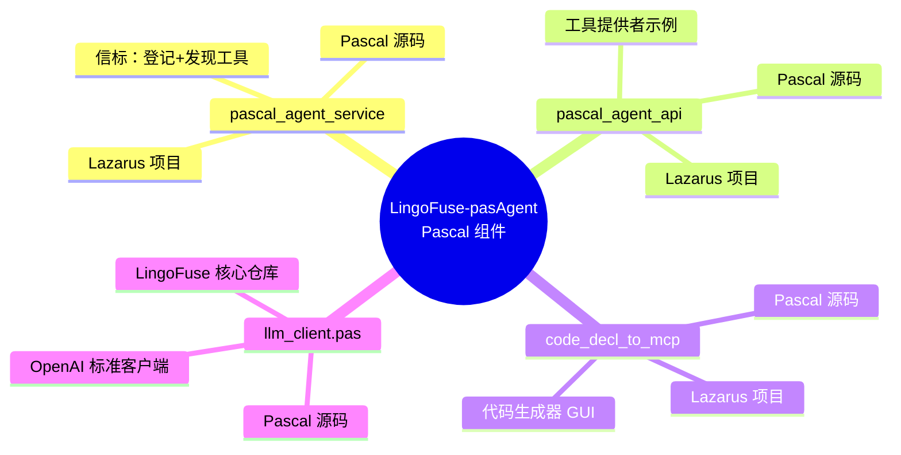
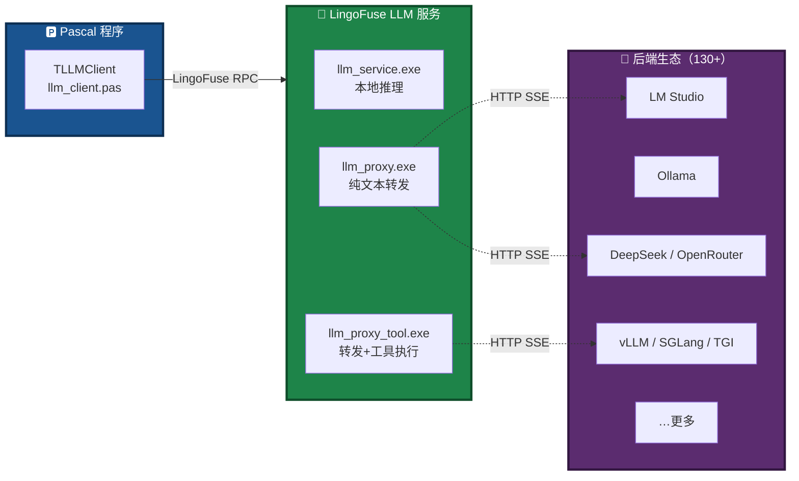
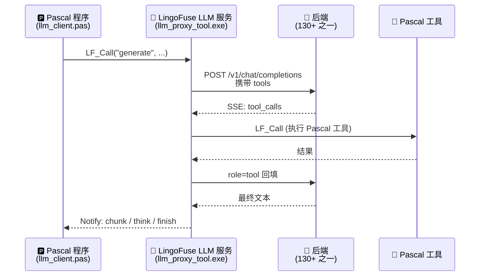
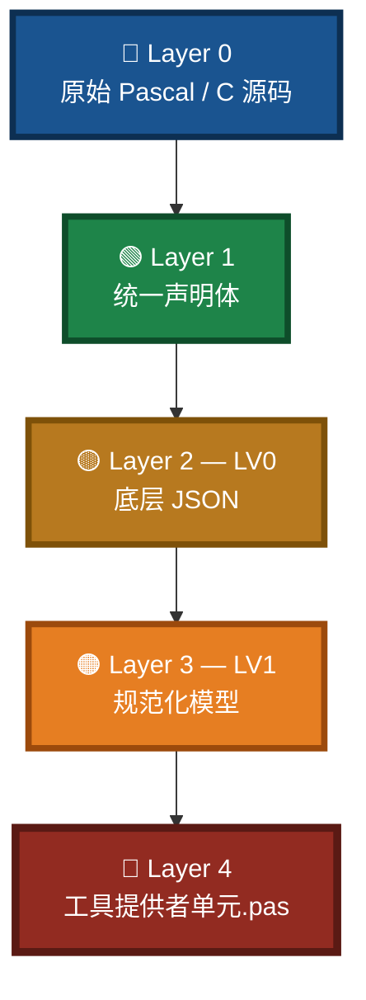
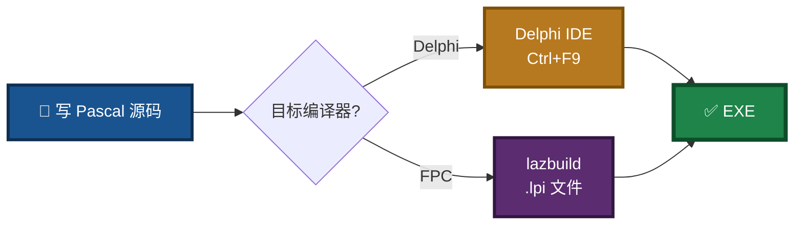
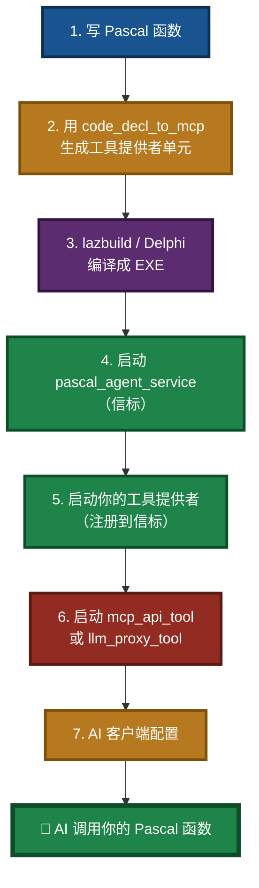
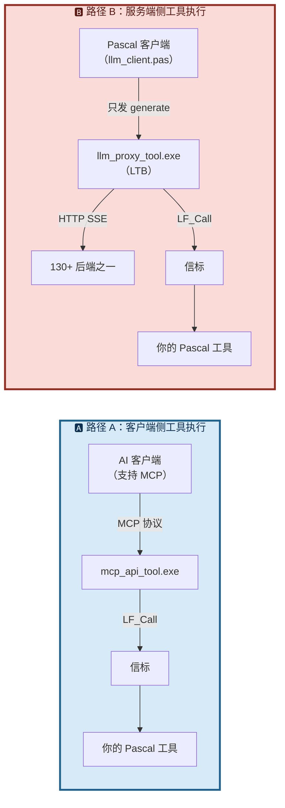

# Pascal Integration Guide — LingoFuse-pasAgent 的 Pascal 切入指南

> **文档名**：`Pascal_Integration_Guide.md`  
> **文档版本**：V1.0  
> **最后更新**：2026-09-15  
> **适用读者**：持有 Pascal（Delphi / Free Pascal）存量代码、希望把函数接入 AI / MCP 智能体的开发者  
> **核心价值**：**用 Pascal 写代码，让 AI 像调用本地函数一样调用你的函数**  
> **同目录相关文档**：
> - 项目总览：`readme.md`
> - 编译指南：`Build_Guide.md`
> - 保姆级教程：`mcp_api_tool_doubao_guide.md`
> - 代码生成器使用手册：`code_generate_mcp.md`
> - Pascal 声明规范：`pascal_code_mcp_rule.md`
> - C 声明规范：`C_code_mcp_rule.md`

---

## ⭐ 开篇速览（30 秒读完）

> **一句话**：pasAgent 让 Pascal 老代码一夜之间变成 AI 可调用的工具，**无需写 IDL、无需生成桩代码、无需搭 HTTP 服务**。

**三个关键事实**，请先记住：

| # | 事实 | 含义 |
|:-:|------|------|
| **1** | **`pascal_agent_service` / `pascal_agent_api` 是 Pascal 原生编写** | 信标、工具提供者示例全部是 Pascal 源码，与 Python 组件地位对等 |
| **2** | **`llm_client.pas` 走 OpenAI 标准协议** | 通过外部程序配置即可接入 **130+ 种智能体后端**（LM Studio / Ollama / DeepSeek / OpenRouter / …） |
| **3** | **`code_decl_to_mcp` 也是 Pascal 编写** | 代码生成器本身用 Pascal 实现，生成的工具提供者单元也直接用 Pascal |

> 🟢 **全部代码同时兼容 Delphi 与 Free Pascal 两种编译器**，从 Delphi 7 到 Lazarus 4.8 均可编译。

---

## 📚 阅读引导

本文档介绍 **如何以 Pascal 为核心语言切入 LingoFuse-pasAgent 生态**。建议按以下顺序阅读：

1. **想快速上手** → 直接跳到第 2 章「三步走：Pascal 开发者最短路径」
2. **想了解三大 Pascal 原生组件** → 读第 3 章
3. **想接入 130+ 智能体后端** → 读第 4 章「llm_client.pas：Pascal 的 OpenAI 标准客户端」
4. **想搞清楚代码生成器** → 读第 5 章「code_decl_to_mcp：用 Pascal 生成 Pascal」
5. **想了解 Delphi / FPC 兼容细节** → 读第 6 章

---

## 一、为什么 Pascal 开发者应该用 pasAgent

### 1.1 你面对的现实

- 手里有一大堆**跑得很稳**的 Pascal 存量代码（财务、工控、医疗、ERP……）
- 老板说「**接个 AI 试试**」
- 你打开主流方案：Python / TypeScript / Go —— **全都要重写一遍**

### 1.2 pasAgent 的答案

> **不重写、不搬迁、不学新语言**。  
> 用 Pascal **原生的** `LF_RegisterCallEx` 把函数注册成工具，AI 就能调用它。


### 1.3 与 Pascal 生态其它方案的对比

| 能力 | **pasAgent** | 其它 Pascal AI 方案 |
|:---|:---:|:---:|
| **从声明自动生成工具** | ✅ | ❌ |
| **服务端代管工具执行** | ✅ | ❌ |
| **客户端零改动** | ✅ | ❌ |
| **跨语言通信层** | ✅ | ❌ |
| **130+ 后端兼容** | ✅ | 有限 |
| **Delphi + FPC 双编译器** | ✅ | 视方案而定 |
| **许可证** | **MIT** | 视方案而定 |

---

## 二、三步走：Pascal 开发者最短路径

> **目标**：**10 分钟**内让 AI 调用你的第一个 Pascal 函数。

### 图 1：三步走


### 第 1 步：下载预编译包

👉 **直接下载**：[pre_build 发布页](https://github.com/PassByYou888/LingoFuse-pasAgent/releases/tag/pre_build)  
解压到比如 `C:\Temp\temp2`。

> 🟢 **预编译包内置所有所需文件**：Pascal 编译好的 EXE、Python 编译好的 EXE、运行时 DLL、示例工具提供者。  
> 🔴 **不需要装 Delphi、不需要装 Lazarus、不需要装 Python**——只要 Windows 10/11。

### 第 2 步：启动 Pascal 三大件

在 `C:\Temp\temp2` 目录打开 **三个** CMD 窗口，依次执行：

| 窗口 | 命令 | 作用 |
|:---:|------|------|
| **1** | `pascal_agent_service.exe` | 📡 **信标**（工具注册中心） |
| **2** | `pascal_agent_api.exe` | 🎯 **工具提供者示例**（注册 add / sub / mul / div） |
| **3** | `mcp_api_tool.exe --generate-configs` | ⚙️ 生成配置文件（一次性） |

> ⚠️ **前两个窗口必须一直开着**。关了工具就没了。

### 第 3 步：让 AI 调用你的函数

1. 用第四个 CMD 窗口启动 `mcp_api_tool.exe`（MCP 网关）
2. 按 `mcp_api_tool_doubao_guide.md` 把配置塞给你的 AI 客户端（LM Studio / Claude Desktop / 豆包等）
3. 打开 AI 客户端，问一句：

```
5 加 7 等于几？
```

**AI 会自动调用 `pascal_agent_api.exe` 注册的 `add` 工具，返回 12。** 🎉

> 💡 **到这里你只用到了 Pascal 编写的** `pascal_agent_service.exe` **和** `pascal_agent_api.exe`。  
> **接下来才是重头戏**：用你自己的 Pascal 函数替换 `pascal_agent_api.exe`。

---

## 三、三大 Pascal 原生组件

> **核心事实**：LingoFuse-pasAgent 的**服务端骨架完全由 Pascal 编写**，与 Python 组件地位对等。所有组件**同时兼容 Delphi 和 Free Pascal**。

### 3.1 组件清单



### 3.2 `pascal_agent_service`：信标

> 📡 **信标 = 工具注册中心**。所有工具提供者向它注册，所有网关向它查询。

- **源码**：`src/pascal_agent_service.lpr`（本仓库）
- **Lazarus 项目**：`src/pascal_agent_service.lpi`
- **默认端点**：`ipc:agent`
- **编译**：`lazbuild pascal_agent_service.lpi`
- **作用**：路由 `LF_Call` 到正确的工具提供者，广播工具列表更新

### 3.3 `pascal_agent_api`：工具提供者示例

> 🎯 **工具提供者 = 你的 Pascal 函数的宿主**。它把函数注册到信标，等 AI 调用。

- **源码**：`src/pascal_agent_api.lpr`（本仓库）
- **Lazarus 项目**：`src/pascal_agent_api.lpi`
- **内容**：`add` / `sub` / `mul` / `div` 四个算术示例
- **作用**：展示如何用 `LF_RegisterCallEx` 注册函数、如何读写 `TDataHnd` 参数

**核心代码片段**（简化）：

```pascal
procedure do_add_Call(Trigger: Pointer; Input: Pointer; Output: TDataHnd); cdecl;
var
  a, b, c: integer;
begin
  a := LF_ReadInt32(Input);
  b := LF_ReadInt32(Input);
  c := a + b;
  LF_WriteInt32(Output, c);
end;

var
  App: TAppHnd;
begin
  App := LF_CreateAppEx('demo', 'cross app inst');
  LF_RegisterCallEx(App, 'add', 'add(int a, int b)', nil, do_add_Call);

  LF_SetOptionEx('Wait_Ready', 'False');
  LF_ResetPrepare();
  LF_PrepareClientEx('ipc:cross', App);
  LF_PrepareDone();
  // ...
end;
```

> 🟢 **这段代码在 Delphi 和 Free Pascal 上都能编译**。  
> - FPC 使用 `lazbuild pascal_agent_api.lpi`  
> - Delphi 打开 `pascal_agent_api.lpi` 对应的源码（去掉 FPC 特有的 mode 指令），或直接用 Delphi 新建 Console Application 粘贴源码

### 3.4 用户该如何替换 `pascal_agent_api`

**四步走**：

1. 复制 `src/pascal_agent_api.lpr` 作为模板
2. 把你的 Pascal 函数改成 `cdecl` 回调形式（参考 `do_add_Call`）
3. 用 `LF_RegisterCallEx` 注册每个函数
4. 用 `lazbuild` 或 Delphi 编译成 EXE

> 💡 **完全不需要手写这些样板代码**——用第 5 章的 `code_decl_to_mcp` 可以自动生成。

---

## 四、`llm_client.pas`：Pascal 的 OpenAI 标准客户端

> ⭐ **本章是本文档的核心**。`llm_client.pas` 是 Pascal 接入 AI 后端的**标准协议实现**。

### 4.1 它在哪里

> 🔴 **重要**：`llm_client.pas` **不在本仓库**（`LingoFuse-pasAgent`）中。

它属于 **LingoFuse 核心仓库**：

- **仓库地址**：[github.com/PassByYou888/LingoFuse](https://github.com/PassByYou888/LingoFuse)
- **克隆方式**（必须带 `--recursive`）：
  ```bash
  git clone --recursive https://github.com/PassByYou888/LingoFuse.git
  ```
- **在核心仓库中的位置**：搜索 `llm_client.pas`，通常在 Pascal 客户端目录下

### 4.2 它是什么



> **`llm_client.pas` 的角色**：它是 Pascal 程序与 LingoFuse LLM 服务对话的**标准协议客户端**。  
> 它**不走 OpenAI 协议**，而是走 LingoFuse 二进制 RPC——**OpenAI 兼容性由服务端（`llm_proxy.exe` / `llm_proxy_tool.exe`）负责对外**。

### 4.3 与 130+ 智能体的交互逻辑

> **核心洞察**：`llm_client.pas` **不直接与智能体对话**。它把请求发给 LingoFuse LLM 服务，由服务端把请求**翻译成 OpenAI 标准 HTTP 请求**，转发给任意 OpenAI 兼容后端。

**完整调用链**：



**换后端只需改一个参数**：

```powershell
# 切换后端只需改 --backend-url
llm_proxy_tool.exe --backend-url http://127.0.0.1:1234/v1   # LM Studio
llm_proxy_tool.exe --backend-url http://127.0.0.1:11434/v1  # Ollama
llm_proxy_tool.exe --backend-url https://api.deepseek.com/v1 # DeepSeek
```

> ✅ **Pascal 客户端代码一行不改**。  
> ✅ **支持 130+ 后端**（完整清单见 `src/LingoFuse_LLM_Proxy_Compatibility_Guide.md`）。

### 4.4 最小 Pascal 客户端示例

```pascal
uses
  llm_client, lingofuse_helper, lingofuse_import;

var
  LLM: TLLMClient;
  sid, err: string;
begin
  // 1) 创建客户端并连接
  LLM := TLLMClient.Create('LLM_Service', 'ipc:llm_service', 10000);
  LLM.OnChunk := Do_LLM_Chunk;   // 流式正文回调
  LLM.OnThink := Do_LLM_Think;   // 思考链回调（推理模型才有）
  LLM.OnFinish := Do_LLM_Finish;

  if not LLM.Connect(err) then
  begin
    WriteLn('连接失败: ', err);
    Exit;
  end;

  // 2) 创建会话（携带 system message）
  if not LLM.CreateSession('你是一个有用的助手。', sid, err) then
  begin
    WriteLn('建会话失败: ', err);
    Exit;
  end;

  // 3) 发一条 generate（流式结果通过 OnChunk 异步推送）
  if not LLM.Generate('你好', '', sid, err) then
    WriteLn('发送失败: ', err);

  // 4) 等待流式输出完成
  ReadLn;

  // 5) 清理
  LLM.Disconnect;
  LLM.Free;
end;
```

### 4.5 事件回调

`llm_client.pas` 通过 `TLLMClient` 的五个事件回调把流式输出呈现给 UI：

| 事件 | 触发时机 | 建议用途 |
|------|---------|---------|
| `OnChunk(SessionId, Text)` | 收到一段正文 | 追加到输出区 |
| `OnThink(SessionId, Text)` | 收到一段思考链 | 灰色显示（推理模型才有） |
| `OnFinish(SessionId, Reason)` | 生成结束 | 更新状态栏 |
| `OnError(SessionId, ErrMsg)` | 服务端错误 | 错误提示 |
| `OnClosed(SessionId, Reason)` | 会话关闭 | 清理会话列表 |

> 🟢 **所有事件回调都在 LingoFuse 主线程执行**，可以**直接操作 VCL / LCL 控件**，不需要 `Synchronize`。

### 4.6 通过外部程序配置，接入 130+ 智能体

`llm_client.pas` 本身**不关心**后端是哪家。它只与 LingoFuse LLM 服务对话。后端的切换完全靠**启动参数**：

| 你想接入的后端 | 启动 LingoFuse LLM 服务时的参数 |
|---------------|-------------------------------|
| LM Studio | `--backend-url http://127.0.0.1:1234/v1` |
| Ollama | `--backend-url http://127.0.0.1:11434/v1` |
| DeepSeek | `--backend-url https://api.deepseek.com/v1` |
| OpenRouter | `--backend-url https://openrouter.ai/api/v1` |
| Groq | `--backend-url https://api.groq.com/openai/v1` |
| … (共 130+) | 见 `src/LingoFuse_LLM_Proxy_Compatibility_Guide.md` |

> 💡 **这就是"通过外部程序配置"的含义**：Pascal 客户端无需重新编译，只要**换一个启动参数**，就能对接**任意** OpenAI 兼容后端。

---

## 五、`code_decl_to_mcp`：用 Pascal 生成 Pascal

> ⭐ **这是 Pascal 开发者的秘密武器**：从声明直接生成可编译的工具提供者单元。

### 5.1 它也是 Pascal 编写的

> 🟢 **`code_decl_to_mcp` 的 GUI 本身是用 Pascal + Lazarus 编写的**，运行在 Windows 上。

| 属性 | 值 |
|------|-----|
| **源码位置** | 🔴 **不在本仓库**。属于 LingoFuse 核心仓库 |
| **获取方式** | [预编译发布页](https://github.com/PassByYou888/LingoFuse-pasAgent/releases/tag/pre_build) 下载 `code_decl_to_mcp.exe` |
| **界面技术** | Lazarus LCL（跨平台 Pascal GUI） |
| **输入** | Pascal 声明 / C 头文件原型 |
| **输出** | 完整的工具提供者 `.pas` 单元 |

> ⚠️ **本仓库只提供使用手册**（`code_generate_mcp.md`）与**声明规范**（`pascal_code_mcp_rule.md`、`C_code_mcp_rule.md`），**不含源码**。

### 5.2 5 层透明转换模型



> **每一层都可以导出 JSON、手工修改、再导入**。核心链路**完全确定性，不依赖 LLM 随机性**。

### 5.3 使用示例

**输入**（粘贴到 `code_decl_to_mcp.exe`）：

```pascal
unit MyUnit;

interface

{
  计算两个整数的和。
  a: 第一个加数
  b: 第二个加数
}
function Add(a, b: Integer): Integer;

{
  字符串回显。
  s: 待回显的字符串
}
function Echo(const s: string): string;

implementation

// 实际实现...

end.
```

**输出**（`code_decl_to_mcp.exe` 生成的 `.pas` 文件）——完整包含：

- 📦 单元头（compiler directives）
- 📤 `interface` 段（全局变量 + 导出函数）
- 📥 `implementation uses`
- 🔧 `internal_` 区域（内部包装 + 日志）
- 🎯 `callback_` 区域（cdecl 回调）
- 📝 `RegisterTool` / `RegisterTools`
- 🚀 `RegisterAPIs`
- 🎬 `Execute_And_Reg_all`

**然后**用 `lazbuild` 或 Delphi 编译，得到一个工具提供者 EXE。**不需要手写一行样板代码**。

### 5.4 详细手册

详见同目录 `code_generate_mcp.md`。声明书写规则详见：

- **Pascal 侧**：`pascal_code_mcp_rule.md`
- **C 侧**：`C_code_mcp_rule.md`

---

## 六、Delphi / FPC 双编译器兼容说明

> 🟢 **本指南涉及的所有 Pascal 代码，同时兼容 Delphi 和 Free Pascal 两种编译器。**

### 6.1 兼容性一览

| 组件 | Delphi 7+ | Delphi 2009+ | FPC 3.0+ | Lazarus 4.8 |
|------|:---------:|:------------:|:--------:|:-----------:|
| `pascal_agent_service` | ⚠️ | ✅ | ✅ | ✅ |
| `pascal_agent_api` | ⚠️ | ✅ | ✅ | ✅ |
| `llm_client.pas` | ⚠️ | ✅ | ✅ | ✅ |
| `code_decl_to_mcp` | ❌ | ⚠️ | ✅ | ✅ |

> **说明**：
> - ⚠️ Delphi 7 可编译，但 Unicode / 泛型等特性需要条件编译分支
> - ✅ 完整支持
> - ❌ 不支持（`code_decl_to_mcp` 的 GUI 依赖 LCL，仅 Lazarus 编译）

### 6.2 编译方式对照

| 场景 | Delphi 用户 | FPC / Lazarus 用户 |
|------|-------------|-------------------|
| **编译 `.dpr`（Delphi 项目）** | Delphi IDE 打开 → `Ctrl+F9` | ⚠️ 建议用 Lazarus 转换 |
| **编译 `.lpi`（Lazarus 项目）** | ⚠️ 需手工转换 | `lazbuild project.lpi` |
| **编译 `.lpr`（FPC 命令行程序）** | 可改用 `program xxx;` 语法编译 | `lazbuild xxx.lpi` 或 `fpc xxx.lpr` |
| **推荐做法** | 使用 Delphi IDE | 使用 `lazbuild`（**不要用 `fpc` 命令行**） |

### 6.3 条件编译技巧

在源码中已通过条件编译指令统一两端：

```pascal
{$ifdef FPC}
  {$mode delphi}{$H+}
  {$modeswitch advancedrecords}
  {$CODEPAGE UTF8}
{$endif}
{$APPTYPE CONSOLE}
```

> 🟢 这段指令**同时**在 FPC 和 Delphi 上编译通过：
> - FPC 进入 `delphi` 模式
> - Delphi 忽略 FPC 特有指令

### 6.4 推荐的开发工作流



> ⚠️ **Pascal 项目强烈建议用 `lazbuild`（或 Lazarus IDE）编译，不要直接调 `fpc`**。
> 原因：项目依赖 `.lpi` 中配置的复杂单元搜索路径，`lazbuild` 会正确读取，`fpc` 手动指定路径极易出错。

### 6.5 获取 LingoFuse 动态库

所有 Pascal EXE 运行都需要 **`LingoFuse64.dll`** / **`liblingofuse.so`**：

```bash
git clone --recursive https://github.com/PassByYou888/LingoFuse.git
# 然后将 LingoFuse/Binary 目录加入系统 PATH
```

> 💡 **预编译包已内置所需动态库**，无需单独安装。

---

## 七、完整流程图

### 7.1 从 Pascal 函数到 AI 调用



### 7.2 两条工具执行路径



> 💡 **Pascal 开发者推荐走路径 B**：客户端只用 `llm_client.pas`，**不需要懂 MCP 协议**，也不需要重写任何东西。

---

## 八、常见问题

### Q1：我是 Delphi 用户，能用吗？

> ✅ **能**。所有 Pascal 组件同时兼容 Delphi 7+ 和 FPC 3.0+。  
> 唯一的例外是 `code_decl_to_mcp.exe` 的 GUI（LCL 编写），但你可以直接使用预编译版本，无需源码。

### Q2：我的 Pascal 函数有复杂参数类型（记录、数组、枚举）怎么办？

> ⚠️ **不支持的参数类型会被代码生成器跳过**。  
> 请查阅 `pascal_code_mcp_rule.md` 里的**类型白名单**：
> - ✅ 支持：整数族、浮点族、字符串族
> - ❌ 不支持：数组、记录、类、枚举、泛型、函数指针、`var` / `out` 参数

**对策**：把复杂参数拆成**多个简单参数**，或者用 JSON 字符串传。

### Q3：`llm_client.pas` 在哪里下载？

> 🔴 **本仓库不含**。请到 **LingoFuse 核心仓库**获取：
> ```bash
> git clone --recursive https://github.com/PassByYou888/LingoFuse.git
> ```
> 搜索 `llm_client.pas` 即可找到。

### Q4：`code_decl_to_mcp` 的源码在哪里？

> 🔴 **本仓库不含**。**源码属于 LingoFuse 核心仓库**，不公开。
> 预编译版本请到 [pre_build 发布页](https://github.com/PassByYou888/LingoFuse-pasAgent/releases/tag/pre_build) 下载。

### Q5：130+ 智能体后端具体怎么配置？

> 详见 `src/LingoFuse_LLM_Proxy_Compatibility_Guide.md`。
> 核心是**启动 LingoFuse LLM 服务时**加上 `--backend-url` 参数：
> ```
> llm_proxy_tool.exe --backend-url https://api.deepseek.com/v1
> ```
> Pascal 客户端**一行代码不改**。

### Q6：我完全不懂 AI，能上手吗？

> ✅ **能**。跟着 `mcp_api_tool_doubao_guide.md` 走，它就是写给零基础用户的。  
> 你只需要：**会复制粘贴命令**、**会拍照问豆包**。

### Q7：编译时提示找不到单元怎么办？

> - 确保用 `lazbuild` 编译（**不要直接调 `fpc`**）
> - 确认 `.lpi` 文件中的单元搜索路径已正确配置
> - 缺少的单元从 LingoFuse 核心仓库获取

### Q8：能商用吗？

> ✅ **能**。**MIT 许可证**。  
> 自由使用、修改、分发、商用，**无需付费**。

---

## 九、相关文档

### 根目录文档

| 文档 | 说明 |
|------|------|
| `readme.md` | 项目总览与闭环架构 |
| `Build_Guide.md` | 编译指南（Pascal + Python 组件） |
| `Dependency_Installation_Guide.md` | 依赖安装 |
| `mcp_api_tool_doubao_guide.md` | 保姆级教程（零基础） |
| `code_generate_mcp.md` | 代码生成器使用手册 |
| `pascal_code_mcp_rule.md` | **Pascal 声明规范（必读）** |
| `C_code_mcp_rule.md` | C 声明规范 |
| `NVIDIA-Nemotron-3.5-Lightning-30B-A3B-UD-IQ4_NL.md` | 推荐模型下载与部署 |

### `src/` 子目录文档

| 文档 | 说明 |
|------|------|
| `src/pascal_agent_api_ref_json.md` | `agent_main` / `register_agent` JSON 详解 |
| `src/LingoFuse_LLM_Ecosystem_User_Guide.md` | 闭环架构与生态总览 |
| `src/LingoFuse_LLM_Service_CLI_guide.md` | `llm_service.exe` 命令行手册 |
| `src/LingoFuse_LLM_Proxy_CLI_Guide.md` | `llm_proxy.exe` 命令行手册 |
| `src/LingoFuse_LLM_Proxy_Compatibility_Guide.md` | **130+ 后端兼容清单** |
| `src/LingoFuse_LLM_Pitfalls_For_AI.md` | 踩坑大全 |
| `src/lingofuse/Bridge_User_Guide.md` | HTTP 桥接网关使用指南 |

### 核心仓库相关

| 资源 | 说明 |
|------|------|
| [LingoFuse 主仓库](https://github.com/PassByYou888/LingoFuse) | `llm_client.pas` 等 Pascal 客户端源码 |
| [zIPC 仓库](https://github.com/PassByYou888/zIPC) | 进程通信组件 |

---

## 十、核心要点速记

> 📌 **三句话记住本文档**：

1. **`pascal_agent_service` / `pascal_agent_api` / `code_decl_to_mcp` 都是 Pascal 原生编写**，源码/EXE 都在本仓库或预编译包中。
2. **`llm_client.pas` 是标准协议客户端**，位于 LingoFuse 核心仓库。通过**外部程序（LLM 服务）配置 `--backend-url`**，可以接入 **130+ 种 OpenAI 兼容后端**。
3. **所有 Pascal 代码同时兼容 Delphi 和 FPC 两种编译器**，从 Delphi 7 到 Lazarus 4.8 均可编译。

> 🎯 **记住这句话就够了**：
>
> **用 Pascal 写函数 → 信标注册 → LLM 服务转发 → AI 调用。全程 Pascal，无需重写。**

---

**文档版本**：V1.0  
**维护者**：LingoFuse-pasAgent 团队  
**反馈**：问题提 Issue，急事加 Q（600585）
