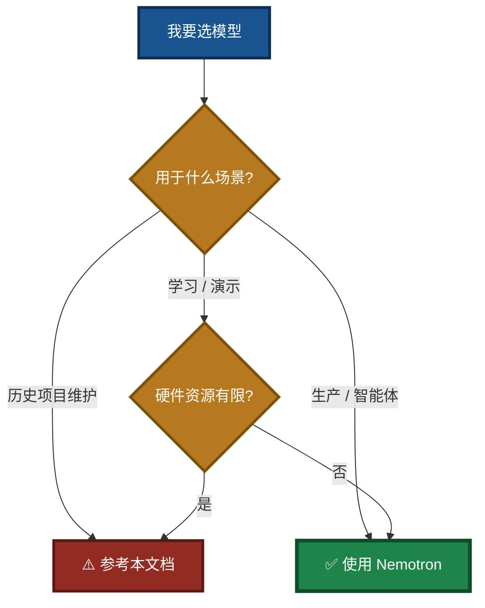
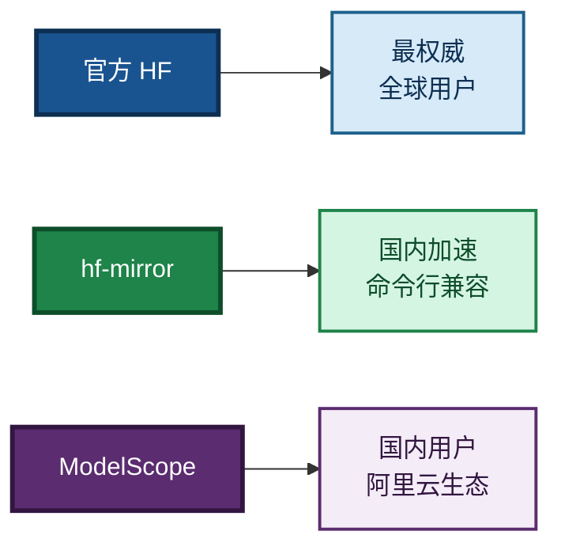
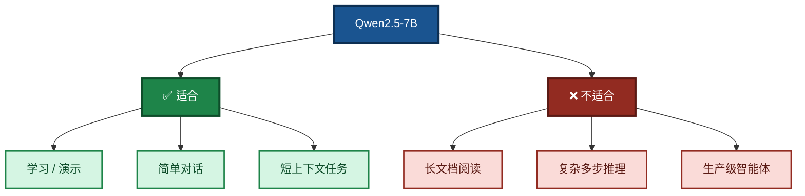

# Qwen2.5-7B-Instruct-Q4_K_M 模型下载与部署指南

> **文档版本**：V3.0  
> **最后更新**：2026-09-14  
> **状态**：⚠️ **历史参考文档** —— 已不再作为默认模型  
> **相关文档**（同目录）：
> - 项目总览与闭环架构：`readme.md`
> - MCP 新手指南：`MCP_SERVER_DOUBAO_GUIDE.md`
> - **推荐模型**：`NVIDIA-Nemotron-3.5-Lightning-30B-A3B-UD-IQ4_NL.md`
> - 编译指南：`Build_Guide.md`
> - 依赖安装：`Dependency_Installation_Guide.md`

---

## ⚠️ 迁移提示（请先读这一段）

本文档描述的 **Qwen2.5-7B-Instruct-Q4_K_M** 模型，是 **LingoFuse-pasAgent 1.0** 阶段用于**引导新手学习**的入门模型。它的设计目标是让开发者以最低的硬件门槛（约 4.7 GB 文件、8 GB 内存）快速跑通「模型加载 → 对话 → 工具调用」全流程。

**在真实生产场景中，该模型存在明显限制：**

- **容易过拟合**：7B 参数在复杂指令遵循和长链路推理中容易产生重复、格式错乱或偏离主题的输出。
- **输出长度受限**：单次生成最长仅 8,192 tokens，处理长文或复杂多步任务时容易中途截断。
- **上下文过短**：32,768 tokens 的上下文窗口，对于需要阅读大量文档、维护长对话历史或执行多轮工具调用的智能体任务，往往不够用。

**目前，项目已全面切换到 NVIDIA-Nemotron-3.5-Lightning-30B-A3B 系列模型。** 该系列采用 MoE 架构（总参 30B，激活仅 3B），具备以下优势：

- **新手友好度更高**：开箱即用，指令遵循更稳定，工具调用格式更可靠。
- **易用性更好**：支持可配置思考模式，兼容主流 GGUF 生态。
- **推理速度优秀**：纯 CPU 即可达到约 **20 tokens/s**，远超传统 30B 稠密模型。
- **超长上下文**：最高支持 **1M tokens**，基本满足程序推理环节的全部需求。

### 图 1：新旧模型选择决策



> **结论**：**新项目请优先使用 `NVIDIA-Nemotron-3.5-Lightning-30B-A3B-UD-IQ4_NL.gguf`**，详细部署指南请参阅同目录 `NVIDIA-Nemotron-3.5-Lightning-30B-A3B-UD-IQ4_NL.md`。本文档仅作为 pasAgent 1.0 学习阶段的参考资料保留。

---

## 一、模型简介

`Qwen2.5-7B-Instruct-Q4_K_M.gguf` 是通义千问 2.5（Qwen2.5）系列 7B 参数模型的 **4-bit 量化（Q4_K_M）GGUF 格式**版本。该模型专为指令遵循与对话场景优化，在**智能体（Agent）任务**和**多轮对话**中均有良好表现。其上下文长度支持 **32,768 tokens**，可生成最长 **8,192 tokens** 的回复。

**Q4_K_M 量化**在模型大小与推理质量间取得了较好的平衡，文件大小约 **4.7 GB**，适合在 **8GB 显存/内存**的硬件上流畅运行。

> **再次提醒**：该模型仅推荐用于 pasAgent 1.0 的学习和功能验证。实际部署智能体时，建议使用 NVIDIA-Nemotron-3.5-Lightning-30B-A3B 系列，以获得更长的上下文、更稳定的输出和更好的工具调用能力。

---

## 二、下载指南

### 方式一：Hugging Face 官方源

这是最权威的下载渠道，模型由通义千问官方账号发布。

- **模型主页**：[Qwen/Qwen2.5-7B-Instruct-GGUF](https://huggingface.co/Qwen/Qwen2.5-7B-Instruct-GGUF)
- **直接下载链接**：
  ```
  https://huggingface.co/Qwen/Qwen2.5-7B-Instruct-GGUF/resolve/main/qwen2.5-7b-instruct-q4_k_m.gguf
  ```

**使用 `huggingface-cli` 下载（推荐）**：

```bash
# 安装 huggingface-hub
pip install -U huggingface_hub

# 仅下载 Q4_K_M 版本
huggingface-cli download Qwen/Qwen2.5-7B-Instruct-GGUF \
    --include "qwen2.5-7b-instruct-q4_k_m*.gguf" \
    --local-dir . \
    --local-dir-use-symlinks False
```

### 方式二：hf-mirror 国内镜像站

若官方源下载缓慢，可使用 Hugging Face 国内镜像站 `hf-mirror.com`。

1. 访问 [hf-mirror.com](https://hf-mirror.com)
2. 搜索 **`Qwen2.5-7B-Instruct-GGUF`**
3. 找到并下载 `qwen2.5-7b-instruct-q4_k_m.gguf` 文件

> **提示**：镜像站也支持 `huggingface-cli`，只需将环境变量指向镜像即可：
> ```bash
> export HF_ENDPOINT=https://hf-mirror.com
> huggingface-cli download Qwen/Qwen2.5-7B-Instruct-GGUF \
>     --include "qwen2.5-7b-instruct-q4_k_m*.gguf" \
>     --local-dir .
> ```

### 方式三：ModelScope 魔搭社区

国内开发者还可通过阿里系平台 ModelScope 获取模型。

- **模型主页**：[modelscope.cn/models/qwen/Qwen2.5-7B-Instruct-gguf](https://modelscope.cn/models/qwen/Qwen2.5-7B-Instruct-gguf)

**使用 `modelscope` 库下载**：

```bash
pip install modelscope
```

```python
from modelscope.hub.snapshot_download import snapshot_download

model_dir = snapshot_download('qwen/Qwen2.5-7B-Instruct-gguf', 
                              cache_dir='./models',
                              revision='master')
```

下载后，模型文件位于 `./models/qwen/Qwen2.5-7B-Instruct-gguf/` 目录下，您需将其中的 `qwen2.5-7b-instruct-q4_k_m.gguf` 复制到目标目录。

### 图 2：下载方式对比



---

## 三、部署说明（针对 LingoFuse LLM 服务）

### 3.1 文件放置要求

下载完成后，请将 `qwen2.5-7b-instruct-q4_k_m.gguf` 文件放置于 **`llm_service.exe` 同目录**下。

**重要**：文件名必须严格匹配 **`qwen2.5-7b-instruct-q4_k_m.gguf`**（大小写敏感，请勿重命名）。若您下载的文件名不同（例如包含额外后缀），请重命名为该标准名称。

### 3.2 自动加载机制

`llm_service.exe` 启动时会**自动扫描**同目录下的模型文件，默认优先加载名为 `NVIDIA-Nemotron-3.5-Lightning-30B-A3B-UD-IQ4_NL.gguf` 的模型。若您使用 Qwen 模型，需通过 `--model-path` 显式指定。

### 3.3 使用方式

启动 `llm_service.exe` 后，它将作为一个 LingoFuse 服务注册到服务网格中（默认端点 `ipc:llm_service`）。此时，您可以通过 LingoFuse 客户端调用该服务提供的 **`generate`** 和 **`set_system_message`** 等 API 进行对话或生成任务。

```powershell
# 使用 Qwen 模型启动
.\llm_service.exe --model-path .\qwen2.5-7b-instruct-q4_k_m.gguf
```

---

## 四、模型适用场景

### ✅ 智能体（Agent）任务

Qwen2.5 系列在**指令遵循**和**结构化输出**（如 JSON）方面有显著增强。这使得它非常适合作为智能体的“大脑”，能够：

- 理解复杂的多步指令
- 以结构化格式（如 JSON）输出工具调用参数
- 处理函数调用（Function Calling）场景

> **注意**：以上能力在 pasAgent 1.0 学习阶段表现良好，但在长时间、多轮次、复杂工具链的生产级智能体任务中，7B 模型容易出现过拟合、输出截断和上下文溢出。实际部署建议使用 NVIDIA-Nemotron-3.5-Lightning-30B-A3B 系列。

### ✅ 简单对话工具

该模型原生支持**多语言**（包括中文、英文等 29 种语言），且对系统提示（System Prompt）的多样性更具韧性，便于实现角色扮演和聊天机器人的条件设定。

配合 LingoFuse LLM 服务（`llm_service.exe`），可在本地快速搭建一个**开箱即用的对话服务**，并通过 LingoFuse 服务网格供其他应用调用。

### 图 3：适用场景



---

## 五、总结

| 下载源 | 地址 / 命令 | 适用场景 |
|--------|-------------|----------|
| **Hugging Face（官方）** | `huggingface-cli download Qwen/Qwen2.5-7B-Instruct-GGUF --include "qwen2.5-7b-instruct-q4_k_m*.gguf" --local-dir .` | 全球用户，追求最新版本 |
| **hf-mirror（镜像）** | 访问 [hf-mirror.com](https://hf-mirror.com) 搜索 `Qwen2.5-7B-Instruct-GGUF` | 国内用户，加速下载 |
| **ModelScope（魔搭）** | `snapshot_download('qwen/Qwen2.5-7B-Instruct-gguf', cache_dir='./models')` | 国内用户，阿里云生态 |

**关键部署要点**：

- 模型文件约 **4.7 GB**，下载后**必须**与 `llm_service.exe` 放在同一目录。
- 文件名固定为 `qwen2.5-7b-instruct-q4_k_m.gguf`，请勿更改。
- 需通过 `--model-path` 显式指定，或重命名为 Nemotron 的默认文件名。
- `pascal_decl_to_mcp.exe` 可生成工具声明，便于集成到 MCP 智能体系统。

### 图 4：迁移对比

```mermaid
flowchart LR
    subgraph OLD["⚠️ 旧方案（历史）"]
        O1["Qwen2.5-7B"]
        O2["32K 上下文"]
        O3["8K 输出上限"]
        O4["CPU ~5-10 tokens/s"]
    end

    subgraph NEW["✅ 新方案（推荐）"]
        N1["Nemotron 30B-A3B"]
        N2["1M 上下文"]
        N3["可配置长输出"]
        N4["CPU ~20 tokens/s"]
    end

    OLD ==>|"迁移"| NEW

    style OLD fill:#FADBD8,stroke:#922B21,stroke-width:3px,color:#5A1A14
    style NEW fill:#D5F5E3,stroke:#1E8449,stroke-width:3px,color:#0E4D2A
    style O1 fill:#FADBD8,stroke:#922B21,stroke-width:2px,color:#5A1A14
    style O2 fill:#FADBD8,stroke:#922B21,stroke-width:2px,color:#5A1A14
    style O3 fill:#FADBD8,stroke:#922B21,stroke-width:2px,color:#5A1A14
    style O4 fill:#FADBD8,stroke:#922B21,stroke-width:2px,color:#5A1A14
    style N1 fill:#D5F5E3,stroke:#1E8449,stroke-width:2px,color:#0E4D2A
    style N2 fill:#D5F5E3,stroke:#1E8449,stroke-width:2px,color:#0E4D2A
    style N3 fill:#D5F5E3,stroke:#1E8449,stroke-width:2px,color:#0E4D2A
    style N4 fill:#D5F5E3,stroke:#1E8449,stroke-width:2px,color:#0E4D2A
```



### 迁移对照表

| 对比项 | Qwen2.5-7B | NVIDIA-Nemotron-3.5-Lightning-30B-A3B |
|---|---|---|
| 总参数量 | 7B | 30B（激活 3B） |
| 上下文长度 | 32,768 tokens | 最高 1,000,000 tokens |
| 单次最大生成 | 8,192 tokens | 可配置，满足长输出需求 |
| CPU 推理速度 | ~5–10 tokens/s | ~20 tokens/s |
| 智能体稳定性 | 一般，易过拟合 | 优秀，专为智能体高频调用设计 |
| 文件大小 | ~4.7 GB | ~19.7 GB |
| 推荐用途 | 学习、演示 | 生产、智能体、主线任务 |

> **新项目请直接使用 `NVIDIA-Nemotron-3.5-Lightning-30B-A3B-UD-IQ4_NL.gguf`**，详细指南见同目录 `NVIDIA-Nemotron-3.5-Lightning-30B-A3B-UD-IQ4_NL.md`。

---

## 六、相关文档（同目录）

| 文档 | 说明 |
|------|------|
| `readme.md` | 项目总览与闭环架构 |
| `MCP_SERVER_DOUBAO_GUIDE.md` | 新手零基础教程 |
| `NVIDIA-Nemotron-3.5-Lightning-30B-A3B-UD-IQ4_NL.md` | **推荐模型**下载与部署 |
| `Build_Guide.md` | 编译指南 |
| `Dependency_Installation_Guide.md` | 依赖安装 |

### 子目录文档

| 文档 | 位置 | 说明 |
|------|------|------|
| `LingoFuse_LLM_Ecosystem_User_Guide.md` | `src/llm-service/` | 闭环架构与生态总览 |
| `LingoFuse_LLM_Service_CLI_guide.md` | `src/llm-service/` | LLM 服务命令行手册 |
| `LingoFuse_LLM_Proxy_CLI_Guide.md` | `src/llm-service/` | LLM 代理命令行手册 |
| `llama_cpp_python_guide.md` | `src/llm-service/` | `llama-cpp-python` 安装与使用 |

---

**文档版本**：V3.0（历史参考文档，高对比配色）  
**维护者**：LingoFuse-pasAgent 团队  
**反馈**：问题提 Issue，急事加 Q（600585）