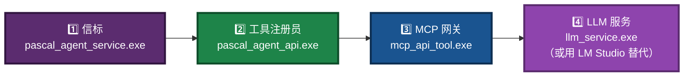

# mcp_api_tool 保姆级使用指南（豆包专用版）

> **文档版本**：v5.1  
> **适用系统**：Windows 10/11/Server 2022（64 位）  
> **适用对象**：完全不懂编程，但想给自己的 AI 聊天工具（如 LM Studio）增加“计算能力”的用户  
> **核心方法**：复制粘贴命令 → 拍照问豆包 → 按豆包说的点鼠标  
> **最强辅助**：**本文档就是写给豆包看的**，把它全文发给豆包，遇到任何界面操作直接截图问豆包，它会手把手教你。

**本次更新（v5.1）** 修正内容：
- 第四步中 `llm_service.exe` 状态横幅版本号由 `v3.2` 修正为 `v3.3`（与实际代码一致）。
- 「第零步」与「第一步」的编号顺序调整：改为「第一步：打开命令行窗口」→「第二步（可选）：HealthCheck」，其余步骤顺延，避免“先第零步再第一步”的混乱。
- 文件清单表中补入 `llm_proxy_tool.exe`（路径 B 的服务端），并说明其与 `llm_proxy.exe` 的区别。
- 明确说明：本指南走的是 **路径 A（客户端侧工具执行）**，LM Studio 自身负责 LLM 推理；`llm_service.exe` 是给不使用 LM Studio 的用户准备的本地推理方案。
- 第六章末尾增加 HTTP 模式下 `mcp_api_tool.exe --transport http` 的说明，与 `--generate-configs` 产出的 `_http.json` 配置对应。
- 文档末尾的文档清单统一注明「这些文档在源码仓库中位于 `src/`，预编译包中会放在同一目录」，避免读者在根目录找不到文件。

---

## 📖 这份文档是干什么用的？

简单说：**让你能在 LM Studio、Claude Desktop 这类聊天软件里，直接使用你自己写的 Pascal 工具（比如加减乘除）**。

这些工具实际运行在一个叫 LingoFuse 的后台程序里，我们需要通过几个小步骤把它们连起来。

**整个流程只需要你做三件事：**

1. 打开几个命令行窗口，复制粘贴几条命令。
2. 启动 LLM 服务（让 AI 有“大脑”）。
3. 在聊天软件的配置文件里粘贴一段文本（豆包会指导你完成）。

**其余所有图形界面的操作（比如“在哪下载 LM Studio”、“怎么打开设置页面”、“配置文件在哪”），都交给豆包——你只需要拍照，然后问豆包“下一步点哪里”。**

> **本指南走的是哪条路径？**
>
> 本指南走的是 **路径 A（客户端侧工具执行）**：LM Studio 自己负责 LLM 推理，自己决定调哪个工具；`mcp_api_tool.exe` 只负责把 Pascal 工具翻译成 MCP 协议。
>
> 第四步启动的 `llm_service.exe` 是给**不使用 LM Studio** 的用户准备的本地推理方案（例如纯命令行测试）。如果你已经在用 LM Studio，这一步可以跳过，或者用 `llm_proxy.exe` 转发到 LM Studio。

---

## 🏗️ 整体流程一图看懂

为避免一张图信息过载，下面按**数据流**拆分为三张小图。

### 图 1：整体闭环


### 图 2：你要启动的四个程序



### 图 3：AI 调用工具的过程


---

## 0. 准备工作（先检查文件齐不齐）

把预编译包解压到一个文件夹（本文档假设是 `C:\Temp\temp2`）。该文件夹里**必须**有以下文件（一个都不能少）：

| 文件名 | 它是干什么的？ | 没有它行吗？ |
|--------|---------------|-------------|
| `pascal_agent_service.exe` | 信标，负责登记和发现所有工具 | ❌ 不行 |
| `pascal_agent_api.exe` | 工具注册员，把加、减、乘、除注册到信标 | ❌ 不行 |
| `mcp_api_tool.exe` | MCP 网关，把工具翻译成聊天软件能听懂的语言（路径 A） | ❌ 不行 |
| `mcp_api_proxy.exe` | 调试侦探，用来查哪里出错了 | ⚠️ 可选，但推荐有 |
| `llm_service.exe` | AI 的大脑，本地跑大模型（路径 A 用 LM Studio 时可不启动） | ⚠️ 若用 LM Studio 则不需要 |
| `llm_proxy.exe` | 转发到 LM Studio / Ollama / 云 API 的代理（替代 `llm_service.exe`） | ⚠️ 与 `llm_service.exe` 二选一 |
| `llm_proxy_tool.exe` | **路径 B**：转发 + 服务端代管工具执行（客户端不需要 MCP） | ⚠️ 走路径 B 时才需要 |
| `llm_test.exe` | 命令行测试客户端，用来验证 LLM 服务是否正常 | ⚠️ 可选 |
| `HealthCheck.exe` | 健康检查工具，快速验证环境 | ⚠️ 可选 |
| `NVIDIA-Nemotron-3.5-Lightning-30B-A3B-UD-IQ4_NL.gguf` | AI 的“知识库”模型文件（约 20 GB） | ❌ 若用 `llm_service.exe` 则必需 |

> 💡 **豆包提示**：如果你缺了某个文件，或者不确定放的位置对不对，**拍一张文件夹的截图发给豆包**，问：“我这些文件全不全？位置对吗？”豆包会告诉你。
>
> 模型文件下载方式详见同目录下的 **[NVIDIA-Nemotron-3.5-Lightning-30B-A3B-UD-IQ4_NL.md](NVIDIA-Nemotron-3.5-Lightning-30B-A3B-UD-IQ4_NL.md)**。

### 关于 LingoFuse 动态库

预编译包应已内置 `LingoFuse64.dll` 和 `z_ipc_64.dll` 等运行库。若你解压后看不到它们，可能是打包时被放在了子目录里，或者你需要从 [LingoFuse 预编译包发布页](https://github.com/PassByYou888/LingoFuse-pasAgent/releases/tag/pre_build) 单独下载并放到 `C:\Temp\temp2` 目录。

---

## 📂 第一步：打开命令行窗口（CMD）

1. 打开文件夹 `C:\Temp\temp2`。
2. 在文件夹的**地址栏**（就是显示路径的那条白框）里，单击一下，然后输入 `cmd`，按回车。
   - 这时会弹出一个黑底白字的窗口，那就是命令行。
   - **这个窗口不要关，后面所有命令都在这类窗口里敲。**

💡 **为什么要这么做？** 因为后面的程序需要在命令行里启动，并且要保持运行。在正确的目录里打开 CMD，程序才能找到同目录的 DLL 和模型文件。

---

## 🔍 第二步（可选）：用 HealthCheck.exe 快速验证环境

**现在要做什么？**  
在正式启动所有程序之前，可以先跑一下 `HealthCheck.exe`，它会快速检查你的环境是否就绪。

**在当前 CMD 窗口里执行：**

```cmd
HealthCheck.exe
```

**你会看到什么？**  
它会打印一些检查结果。如果全部通过，说明你的 DLL 和依赖都没问题；如果报错，按错误提示处理，或者直接**截图发给豆包**。

---

## 🚀 第三步：启动工具管理员（pascal_agent_service.exe）

**现在要做什么？**  
启动第一个程序，它负责管理所有工具。

**复制下面这行命令，粘贴到刚才打开的 CMD 窗口里，按回车：**

```cmd
pascal_agent_service.exe
```

**你会看到什么？**  
命令行里会滚出一堆文字，最后出现类似这样一行：
```
[MAIN] Service is running. Type "exit" to quit.
```
看到这行，就说明**成功了**。

**这个窗口必须一直开着，不能关！** 关了工具管理员就没了。

💡 **豆包提示**：如果报错说“找不到 LingoFuse64.dll”，那就是你的文件没放对位置。**拍照把错误窗口发给豆包**，它会告诉你怎么办。

---

## 🛠️ 第四步：启动工具注册员（pascal_agent_api.exe）

**现在要做什么？**  
启动第二个程序，它会把“加、减、乘、除”四个工具注册到管理员那里。

**开第二个 CMD 窗口**（跟第一步一样，再进一次 `C:\Temp\temp2`，地址栏输 `cmd`），然后复制粘贴下面命令，按回车：

```cmd
pascal_agent_api.exe
```

**你会看到什么？**  
会看到类似这样的信息：
```
[OK] Registered tool: add
[OK] Registered tool: sub
[OK] Registered tool: mul
[OK] Registered tool: div
```
看到这四条，说明**四个工具都注册成功了**。

**这个窗口也得一直开着**。

💡 **豆包提示**：如果你看不到这四条，或者卡住了，**截图发给豆包**，让它帮你分析。

---

## 🧠 第五步：启动 LLM 服务（让 AI 有“大脑”）

**现在要做什么？**  
启动大模型服务。这一步让 AI 具备理解和决策能力，能自主判断该调用哪个工具。

> **本指南走路径 A**：如果你已经在用 LM Studio，跳过这一步，直接看下方“替代方案”。`llm_service.exe` 是给纯命令行测试或不想用 LM Studio 的用户准备的。

**开第三个 CMD 窗口**，进入 `C:\Temp\temp2`，然后执行：

```cmd
llm_service.exe
```

**你会看到什么？**  
会看到类似这样的状态横幅：
```
======================================================================
 LINGOFUSE LLM SERVICE STATUS (v3.3)
======================================================================
  Backend                 : llama_cpp
  Model path              : ./NVIDIA-Nemotron-3.5-Lightning-30B-A3B-UD-IQ4_NL.gguf
  Context size actual     : 32768
  ...
======================================================================
[Service] LLM Service is running on ipc:llm_service
[Service] Press Ctrl+C to stop...
```

看到最后两行，说明**LLM 服务启动成功了**。

**这个窗口也必须一直开着**。

> ⚠️ **注意**：模型文件约 20 GB，首次加载需要一些时间（约 10-30 秒），请耐心等待。启动完成后才会打印状态横幅。

### 替代方案 A：用 `llm_proxy.exe` 转发到 LM Studio

如果你不想在本地加载大模型（比如内存不够，或者已经装了 LM Studio），可以改用 `llm_proxy.exe`：

**开一个新的 CMD 窗口**，进入 `C:\Temp\temp2`，然后执行：

```cmd
llm_proxy.exe --backend-url http://127.0.0.1:1234/v1
```

前提是 LM Studio 已经启动并开启了本地服务器（端口通常是 1234 或 12345）。这样你就不需要 `llm_service.exe` 和那个 20 GB 的模型文件了。

💡 **豆包提示**：如果 `llm_service.exe` 启动报错（比如“显存不足”或“内存不足”），**把错误信息截图发给豆包**，它会告诉你怎么办。通常可以先尝试：

```cmd
llm_service.exe --context-size 8192 --gpu-layers 0
```

如果还不行，就改用 `llm_proxy.exe`。

### 替代方案 B：走路径 B（用 `llm_proxy_tool.exe`）

如果你用的是**不支持 MCP 的客户端**（例如自研的 Pascal GUI），可以不启动 `mcp_api_tool.exe`，改用 `llm_proxy_tool.exe`：

```cmd
llm_proxy_tool.exe --backend-url http://127.0.0.1:1234/v1 --mcp-reg-agent-app llm_proxy_agent
```

这样客户端只发 `generate`，工具调用由服务端代管。详见 `LingoFuse_LLM_Ecosystem_User_Guide.md`。

### 可选：用 `llm_test.exe` 验证 LLM 服务

如果你想单独测试一下 LLM 服务是否正常，可以再开一个 CMD 窗口，执行：

```cmd
llm_test.exe
```

它会进入一个交互式命令行，你可以输入问题，看模型是否正常回答。输入 `/quit` 退出。

---

## 📄 第六步：生成聊天软件的配置文件（mcp_api_tool.exe --generate-configs）

**现在要做什么？**  
运行一个一次性命令，它会自动生成所有聊天软件需要的配置文本，你后面直接复制粘贴就行。

**开第四个 CMD 窗口**，进入 `C:\Temp\temp2`，执行：

```cmd
mcp_api_tool.exe --generate-configs
```

**你会看到什么？**  
命令执行完会立刻退出，然后在你当前文件夹里多出一个叫 `mcp_configs` 的文件夹。

里面有很多文件，比如 `lmstudio_stdio.json`、`lmstudio_http.json`、`claude_stdio.json` 等，**这些都是给不同聊天软件、不同传输模式准备的配置文件**。

💡 **豆包提示**：如果你找不到这个文件夹，或者里面文件不全，**拍一张文件夹内容的截图发给豆包**，它会告诉你该用哪个。

---

## 🌉 第七步：启动 MCP 网关（mcp_api_tool.exe）

**现在要做什么？**  
启动真正的网关程序，它负责接收聊天软件的请求，然后去问工具管理员要结果。

**开第五个 CMD 窗口**，进入 `C:\Temp\temp2`，执行：

```cmd
mcp_api_tool.exe
```

> **如果你想让其他电脑也能访问**，可以用这个命令（替换成你自己的 IP）：
> ```cmd
> mcp_api_tool.exe --transport http --host 0.0.0.0 --port 8000
> ```
> 这种情况下，第六步生成的 `lmstudio_http.json` 配置（URL 指向 `http://<你的IP>:8000/mcp`）就是给别的电脑用的。新手建议先用第一行命令（stdio 模式），更简单。

**你会看到什么？**  
会看到类似：
```
[INFO] Starting MCP server with transport=stdio
[INFO] Registered tool: add parameters: ['a', 'b']
...
```
看到这些，说明网关已经准备好了。

**这个窗口也得一直开着**。

💡 **豆包提示**：如果启动时出现错误，**把错误信息截图发给豆包**，它能告诉你哪里不对。

---

## ⚙️ 第八步：把配置文件塞给你的聊天软件

**现在你要做的是：**  
把你用的聊天软件（比如 LM Studio、Claude Desktop 等）的配置文件打开，把刚才生成的那段 JSON 文本粘贴进去。

**具体操作步骤：**

1. **确认你用的是哪个聊天软件**（比如 LM Studio）。
2. 在 `C:\Temp\temp2\mcp_configs` 文件夹里找到对应的配置文件，比如 `lmstudio_stdio.json`。
3. 用记事本打开它，**全选、复制**里面的所有内容。
4. 然后你需要找到聊天软件的配置文件位置（路径见下表）。
5. 用记事本打开那个配置文件，把复制的内容粘贴进去，保存。

> **但是！新手很可能找不到聊天软件的配置文件在哪，也不知道怎么打开。**  
> 这时候**千万不要自己瞎找**，直接：

---

### 📸 拍照问豆包，让豆包指导你完成配置

**拿起手机，打开豆包 App，然后：**

1. **拍一张你的桌面**（或聊天软件的主界面），问豆包：“我用的 LM Studio，怎么找到 MCP 设置页面？”
2. 豆包会告诉你具体点哪里（比如“点右上角齿轮图标”、“选择‘高级设置’”、“找到‘MCP Servers’部分”）。
3. 当豆包让你“打开配置文件”时，你可能会看到一个文件夹，**再拍一张文件夹的截图**，问豆包：“我应该打开哪个文件？”
4. 豆包会告诉你文件名（比如 `mcp.json`），你双击打开。
5. 然后把之前复制的内容粘贴进去，保存。
6. 最后问豆包：“改完了，怎么重启生效？”豆包会告诉你“完全退出软件，再重新打开”。

**整个过程中，你只需要拍照和问问题，所有点鼠标的操作都由豆包一步一步教。**

---

**下面是常见的聊天软件配置文件位置（供豆包参考，你不用记）：**

| 聊天软件 | 配置文件路径（Windows） |
|---------|------------------------|
| LM Studio | `%USERPROFILE%\.lmstudio\mcp.json` |
| Claude Desktop | `%APPDATA%\Claude\claude_desktop_config.json` |
| DeepSeek Chat | 通常也在 `%APPDATA%` 下，具体问豆包 |
| Continue.dev | `%USERPROFILE%\.continue\config.json` |
| Jan AI | `%USERPROFILE%\.jan\configuration.json` |

> 💡 **豆包万能指令**：如果你完全不知道上面这些路径是啥意思，直接说：“豆包，我电脑上装了 LM Studio，帮我找到它的配置文件。”然后按豆包说的做。

---

## ✅ 第九步：测试一下工具能不能用

**现在，重启你的聊天软件（完全退出再打开）**，然后：

- 看看聊天界面里有没有多出 `add`、`sub`、`mul`、`div` 四个工具（通常在“工具”面板或“函数”列表里）。
- 如果有，随便调用一个试试，比如 `add` 传入 `{"a": 5, "b": 7}`，应该返回 `{"result": 12}`。
- 或者直接在聊天框里问：“5 加 7 等于几？”如果配置正确，AI 会自动调用 `add` 工具并返回结果。

**如果看不到工具，或者调用失败**，先检查：

1. 前面五个 CMD 窗口是不是都开着？有没有报错？
2. 如果都开着还是不行，**截图发给豆包**，豆包会帮你排查。

---

## 🕵️ 第十步（可选）：用 mcp_api_proxy.exe 抓包调试

如果你和豆包都搞不定，可以用 `mcp_api_proxy.exe` 把通信过程记录下来，然后发给豆包分析。

**用法：**

```cmd
mcp_api_proxy.exe mcp_api_tool.exe --debug
```

这会启动网关，并在 `C:\Temp\temp2` 目录下生成 `proxy.log` 文件，里面记录了所有收发数据。

**如果你看不懂日志，直接把 `proxy.log` 的内容截图（或把文件内容复制）发给豆包**，它会告诉你哪里错了。

---

## ❓ 常见问题（豆包也常被问到）

### Q1：启动 mcp_api_tool 时提示“找不到 LingoFuse64.dll”
**A**：检查 `LingoFuse64.dll` 和 `z_ipc_64.dll` 是否和 exe 在同一目录。如果有了还报错，**拍照发豆包**。

### Q2：聊天软件看不到工具
**A**：首先确认信标、注册员、MCP 网关三个窗口都开着（LLM 服务窗口如果不启动 `llm_service.exe` 也没关系，只要 LM Studio 自身能跑就行）；其次检查 `mcp_api_tool` 窗口有无错误；最后确认配置文件中的路径是**绝对路径**（比如 `C:\Temp\temp2\mcp_api_tool.exe`）。如果不确定，**拍配置文件内容发给豆包**。

### Q3：调用工具超时或返回空
**A**：可能后端服务没响应。试试加上 `--timeout 10000` 启动 `mcp_api_tool`。还不行，用 `mcp_api_proxy` 抓日志发豆包。

### Q4：LLM 服务启动报“模型文件未找到”
**A**：确认 `NVIDIA-Nemotron-3.5-Lightning-30B-A3B-UD-IQ4_NL.gguf` 与 `llm_service.exe` 在同一目录 `C:\Temp\temp2`。模型下载方式见同目录下的 **[NVIDIA-Nemotron-3.5-Lightning-30B-A3B-UD-IQ4_NL.md](NVIDIA-Nemotron-3.5-Lightning-30B-A3B-UD-IQ4_NL.md)**。

### Q5：LLM 服务启动报“显存不足”或“内存不足”
**A**：尝试降低上下文大小：
```cmd
llm_service.exe --context-size 8192 --gpu-layers 0
```
或者改用 `llm_proxy.exe` 转发到 LM Studio：
```cmd
llm_proxy.exe --backend-url http://127.0.0.1:1234/v1
```

### Q6：SSE 模式连不上
**A**：检查防火墙是否放行端口，客户端 URL 必须带 `/sse`。如果不确定，**截图豆包看**。

### Q7：我什么都不懂，能成功吗？
**A**：**能！** 只要你会复制粘贴，会拍照发豆包，豆包就能带你走完所有步骤。豆包就是你的“屏幕共享教练”。

---

## 🧭 最后的“傻瓜式”行动清单

把这些步骤打印出来，或放在手机旁边：

1. 把预编译包解压到 `C:\Temp\temp2`，确认所有 exe、dll、gguf 都在。
2. 开第一个 CMD，运行 `pascal_agent_service.exe` —— 保持开着。
3. 开第二个 CMD，运行 `pascal_agent_api.exe` —— 保持开着。
4. 开第三个 CMD，运行 `llm_service.exe`（或 `llm_proxy.exe`）—— 保持开着；若用 LM Studio 自身推理，此步可跳过。
5. 开第四个 CMD，运行 `mcp_api_tool.exe --generate-configs` —— 会退出，不用管。
6. 开第五个 CMD，运行 `mcp_api_tool.exe` —— 保持开着。
7. **拍照问豆包**：“怎么把 `C:\Temp\temp2\mcp_configs` 里的配置装到我的聊天软件里？”然后跟着豆包走。
8. 重启聊天软件，测试工具。试着问：“5 加 7 等于几？”
9. 如果不行，**拍照所有窗口和错误**，发给豆包，直到成功。

---

## 📚 相关文档

以下是预编译包 `C:\Temp\temp2` 目录里自带的文档，遇到问题时可以查阅。

> **路径说明**：在源码仓库中，这些文档位于 `src/` 子目录；在预编译包中，它们会被放到与 exe 相同的目录（即 `C:\Temp\temp2`）。以下链接按预编译包中的相对路径书写。

| 文档 | 说明 |
|------|------|
| **[NVIDIA-Nemotron-3.5-Lightning-30B-A3B-UD-IQ4_NL.md](NVIDIA-Nemotron-3.5-Lightning-30B-A3B-UD-IQ4_NL.md)** | 推荐模型下载与部署 |
| **[LingoFuse_LLM_Service_CLI_guide.md](LingoFuse_LLM_Service_CLI_guide.md)** | `llm_service.exe` 命令行完整手册 |
| **[LingoFuse_LLM_Proxy_CLI_Guide.md](LingoFuse_LLM_Proxy_CLI_Guide.md)** | `llm_proxy.exe` 命令行完整手册 |
| **[LingoFuse_LLM_Proxy_Compatibility_Guide.md](LingoFuse_LLM_Proxy_Compatibility_Guide.md)** | 支持的全部 OpenAI 兼容后端清单 |
| **[LingoFuse_LLM_Ecosystem_User_Guide.md](LingoFuse_LLM_Ecosystem_User_Guide.md)** | 闭环架构与生态总览（三种服务端 + 两条路径） |
| **[LingoFuse_LLM_Pitfalls_For_AI.md](LingoFuse_LLM_Pitfalls_For_AI.md)** | 踩坑大全，症状-根因-正确做法 |
| **[LingoFuse_LLM_Service_Work_Summary.md](LingoFuse_LLM_Service_Work_Summary.md)** | LLM 工具链版本演进与架构决策 |
| **[Build_Guide.md](Build_Guide.md)** | 编译指南 |
| **[Dependency_Installation_Guide.md](Dependency_Installation_Guide.md)** | 依赖安装 |

---

**🎉 你不需要懂任何技术，只需要一个豆包 App，和一点点耐心。祝你成功！**

---

**文档版本**：v5.1（修正版本号、编号顺序、补全组件清单、区分路径 A/B）  
**维护者**：LingoFuse-pasAgent 团队  
**反馈**：问题提 Issue，急事加 Q（600585）