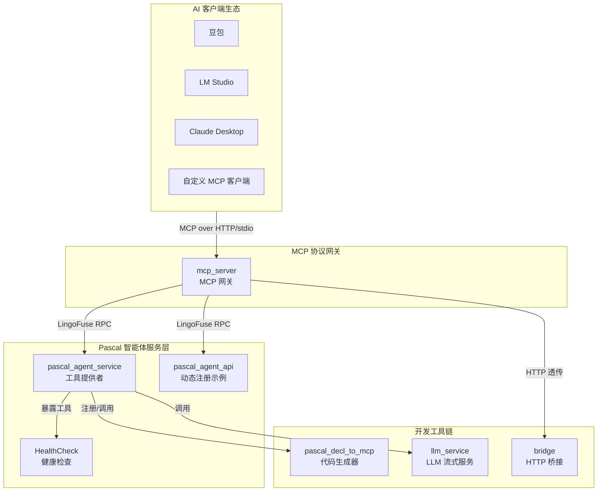

# pasAgent

**工业级 Pascal 智能体技术体系 —— 让 Pascal 语言无缝接入 AI 智能体生态**

[](https://opensource.org/licenses/MIT)

---

## 🎯 这是什么？

**pasAgent** 是一套 **工业级 Pascal 语言智能体（Agent）技术体系**，专为使用 Pascal 语言构建智能体服务而设计。它解决了传统 Pascal 应用接入 AI 智能体生态时面临的协议适配、工具注册、动态调度等核心问题，让 Pascal 开发者能够以最自然的方式将现有业务逻辑暴露给 AI 智能体（如豆包、LM Studio、Claude Desktop 等）。

**核心能力**：
- 🏗️ **Pascal 智能体服务框架** —— 轻松将 Pascal 函数、过程、类方法发布为 AI 可调用的工具（Tools）
- 🌉 **MCP 协议原生网关** —— 自动将 Pascal 服务转换为 MCP（Model Context Protocol）标准接口
- 🤖 **代码生成体系** —— 从 Pascal 声明一键生成 MCP 工具定义，零手工编写 JSON Schema
- 🔌 **LLM 流式推理集成** —— 内置大语言模型服务，支持流式对话与工具调用
- 🛠️ **完整的开发-部署工具链** —— 从代码编写、编译、测试到生产部署的全流程支持

**定位**：面向 **企业级、工业级 Pascal 开发团队**，提供从“业务逻辑”到“智能体工具”的端到端技术方案，无需修改现有代码架构，即可融入 AI 驱动的下一代应用生态。

---

## 🚀 核心特性

| 特性 | 说明 |
|------|------|
| **Pascal 原生 API** | 直接使用 Pascal 过程/函数/方法注册工具，无需 IDL 或桩代码 |
| **MCP 协议兼容** | 完整支持 Model Context Protocol，与豆包、LM Studio、Claude 等无缝对接 |
| **零侵入集成** | 无需修改现有业务代码，通过装饰器/辅助函数即可暴露工具 |
| **代码生成器** | `pascal_decl_to_mcp` 工具自动解析 Pascal 声明，生成 MCP 工具 JSON 定义 |
| **同步 + 异步调用** | 支持请求-响应（Call）和单向通知（Notify）两种通信模式 |
| **顺序保证** | Sequenced Notify 确保消息按 FIFO 顺序交付，适用于流式场景 |
| **自动服务发现** | 基于 C4 网格的服务注册与发现，节点动态加入/退出，无需配置 |
| **负载均衡** | 内置智能路由，请求自动分发到最空闲的节点 |
| **断线重连** | 客户端自动重连，保障高可用性 |
| **高性能** | 同机 IPC 延迟 < 1ms，吞吐量 12,000+ 请求/秒 |
| **跨平台** | 支持 Windows、Linux、macOS，编译为原生 EXE 或动态库 |
| **生产就绪** | 配套日志、健康检查、配置生成等工具，满足企业级运维需求 |

---

## 🏗️ 架构概览



所有组件均基于 LingoFuse 底层通信框架，但 pasAgent 向上屏蔽了实现细节，为 Pascal 开发者提供了一套 **纯 Pascal 风格** 的智能体开发体验。

---

## 📁 项目结构

```
src/
├── pascal_agent_service.lpr     # 🏗️ Pascal 智能体服务端（核心工具提供者）
├── pascal_agent_api.lpr         # 🔧 Pascal API 示例（动态注册工具）
├── pascal_agent_api_ref_json.md # 工具定义参考
├── lingofuse_import.pas         # 底层 LingoFuse C ABI 绑定
├── lingofuse_helper.pas         # Pascal 高级封装（RAII、类型安全）
├── mcp_server.py                # 🌉 MCP 协议网关（对接 AI 客户端）
├── mcp_proxy.py                 # 🕵️ stdio 调试代理
├── generate_agent_json.py       # 📄 MCP 客户端配置生成器
├── language_middleware.py       # 多语言中间件（Python）
├── CreateHealthCheck/           # 🩺 健康检查工具（Lazarus GUI）
│   ├── HealthCheck.lpi          # 项目文件
│   ├── HealthCheck.lpr          # 主程序
│   └── frm*.pas                 # 表单单元
├── llm-service/                 # 🤖 LLM 流式推理服务
│   ├── llm_service.py           # 服务主程序
│   ├── llm_test.py              # 测试客户端
│   └── *.md                     # 使用文档
├── tools/                       # 🛠️ 开发工具集
│   ├── pascal_decl_to_mcp.lpr   # 代码生成器（Pascal → MCP 定义）
│   ├── pascal_decl_to_mcp_frm.pas
│   ├── llm_client.pas           # Pascal LLM 客户端示例
│   ├── llm_tool_frm.pas         # LLM 工具窗体
│   ├── pas_mcp_generator_tool.pas
│   └── pascal_code_rule.md      # 编码规范参考
├── lingofuse/                   # Python 核心绑定（内部依赖）
│   ├── _lf_native.py
│   ├── core.py
│   ├── client.py
│   ├── server.py
│   └── bridge.py
├── build_mcp_server.ps1         # 打包脚本（PyInstaller）
├── build_pascal_agent.bat       # Pascal 编译脚本
├── init_env.ps1                 # 环境初始化
└── *.md                         # 各类文档
```

---

## ⚡ 快速上手（5 分钟体验）

### 1. 启动 Pascal 智能体服务

```bash
# 编译或直接运行预编译 EXE
.\pascal_agent_service.exe
```

服务启动后，自动注册三个内置工具：
- `agent_main`：返回当前可用的所有工具列表（供 MCP 网关获取）
- `agent_log`：接收并记录日志消息
- `register_agent`：动态注册新工具（可选）

### 2. 启动 MCP 网关（供 AI 客户端调用）

```bash
# HTTP 模式（推荐，支持豆包等远程客户端）
.\mcp_server.exe --transport http --host 0.0.0.0 --port 8000
```

网关将自动发现 `pascal_agent_service` 并暴露其所有工具。

### 3. 接入豆包客户端

在豆包中配置 MCP 服务器地址：

```
http://<你的IP>:8000/mcp
```

豆包将自动加载所有 Pascal 工具，您可以直接在对话中调用。

### 4. 编写自己的 Pascal 工具（以加法为例）

```pascal
// 在你的 Pascal 单元中，注册一个 Call 模式 API
uses lingofuse_helper;

procedure do_add(Trigger: Pointer; Input, Output: TDataHnd); cdecl;
var
  a, b, sum: integer;
begin
  a := LF_ReadInt32(Input);
  b := LF_ReadInt32(Input);
  sum := a + b;
  LF_WriteInt32(Output, sum);
end;

// 在 App 初始化时注册
App.RegisterCall('add', 'Add two integers', nil, @do_add);
```

然后重新编译服务，新工具即可被 MCP 网关自动发现。

### 5. 使用代码生成器（免手写 JSON Schema）

```bash
.\pascal_decl_to_mcp.exe --input my_utils.pas --output tools.json
```

工具会自动解析 Pascal 声明，生成符合 MCP 规范的 JSON 工具定义，可直接用于 `register_agent`。

---

## 🤖 代码生成体系

pasAgent 的核心竞争力之一是其 **代码生成体系**，它极大降低了 Pascal 智能体开发的门槛：

- **`pascal_decl_to_mcp`**：解析 Pascal 源代码中的类型、函数、过程声明，自动生成 MCP 工具 JSON 定义（包含参数类型、描述、required 字段等）。
- **集成到 CI/CD**：可作为编译前/后步骤，自动同步工具定义与代码，保证一致性。
- **支持复杂类型**：结构化类型（record、class）、枚举、数组等自动映射为 JSON Schema。
- **可扩展**：支持自定义映射规则和注解，满足特殊业务需求。

该生成器使 Pascal 开发者无需学习 MCP 协议细节，专注于业务逻辑实现。

---

## 🔧 编译与部署

### 编译 Pascal 组件（需 Free Pascal 3.2+）

```bash
# 编译智能体服务
fpc -Mdelphi -O2 pascal_agent_service.lpr

# 编译代码生成器
fpc -Mdelphi -O2 tools/pascal_decl_to_mcp.lpr

# 编译健康检查工具（使用 Lazarus 或 lazbuild）
lazbuild CreateHealthCheck/HealthCheck.lpi
```

### 编译 Python 组件（可选，如需源码打包）

```powershell
.\build_mcp_server.ps1    # 打包 mcp_server.py → mcp_server.exe
```

### 部署建议

- **开发环境**：直接运行源码（需 Python 环境和 Pascal 编译器）。
- **生产环境**：使用预编译 EXE，所有依赖（动态库、配置文件）集中放置于同一目录。
- **容器化**：支持 Docker 部署，基础镜像可选择 Windows 或 Linux。

详细编译指南请参考 [Build_Guide.md](Build_Guide.md)。

---

## 📚 文档索引

| 文档 | 说明 |
|------|------|
| [MCP_SERVER_DOUBAO_GUIDE.md](MCP_SERVER_DOUBAO_GUIDE.md) | 豆包及 MCP 客户端接入指南 |
| [Build_Guide.md](Build_Guide.md) | 完整编译指南（Pascal + Python） |
| [Dependency_Installation_Guide.md](Dependency_Installation_Guide.md) | 依赖包安装说明 |
| [Qwen2.5-7B-Instruct-Q4_K_M.md](Qwen2.5-7B-Instruct-Q4_K_M.md) | LLM 模型下载与部署 |
| [pascal_code_rule.md](pascal_code_rule.md) | Pascal 编码规范与工具开发指南 |
| [LingoFuse_Python_Streaming_LLM_Guide.md](llm-service/LingoFuse_Python_Streaming_LLM_Guide.md) | LLM 流式服务使用手册 |
| [llama_cpp_python_guide.md](llm-service/llama_cpp_python_guide.md) | llama.cpp Python 集成指南 |

---

## ❓ 常见问题

**Q：pasAgent 与 LingoFuse 的关系是什么？**

A：pasAgent 基于 LingoFuse 核心通信框架，但面向 Pascal 开发者提供更高层次的智能体工具链，屏蔽了底层细节，专注于 Pascal 生态的智能体接入。

**Q：我需要学习 MCP 协议才能使用吗？**

A：不需要。代码生成器和 MCP 网关自动处理协议转换，您只需编写 Pascal 业务逻辑。

**Q：如何添加自定义工具？**

A：在 Pascal 服务中注册回调函数（`RegisterCall` / `RegisterNotify`），然后重新编译即可。网关会自动发现并暴露新工具。

**Q：支持哪些 AI 客户端？**

A：任何兼容 MCP 协议的客户端，包括豆包、LM Studio、Claude Desktop、Continue.dev、Jan、DeepSeek 等。

**Q：可以在 Linux/macOS 上运行吗？**

A：可以。Pascal 编译器和 LingoFuse 动态库支持跨平台，部署方式相同。

**Q：性能如何？**

A：基于 LingoFuse 的 IPC 通信，延迟 < 1ms，单节点吞吐量 12k+ 请求/秒，满足绝大部分企业级需求。

---

## 👤 关于作者

**老张（QQ: 600585）**

专注 Pascal 生态十余年，致力于让古老而强大的 Pascal 语言焕发新生。pasAgent 是为 Pascal 开发者量身打造的智能体接入方案，欢迎反馈、建议和贡献。

---

## 📄 许可证

**MIT** —— 允许自由使用、修改、分发，无需书面许可。

---

*项目始于 2026 年，持续迭代中。提 Issue 或加 Q 交流。*