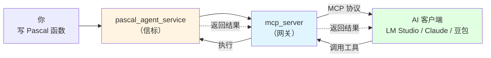
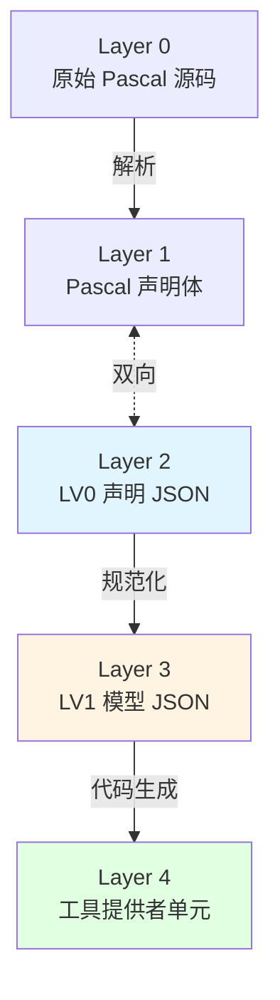
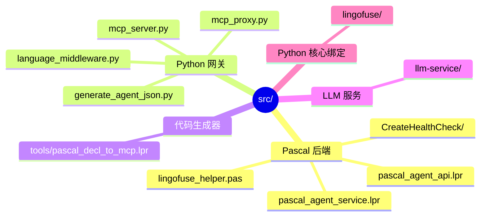
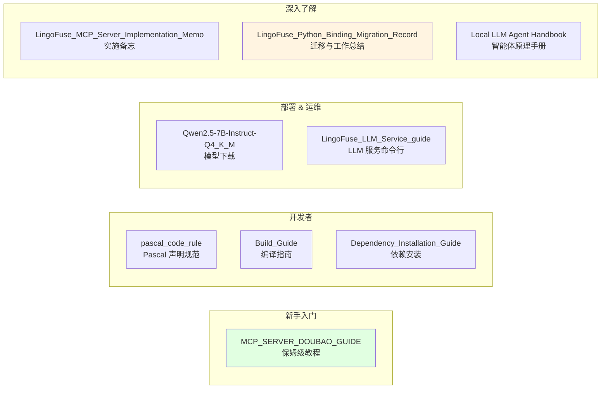

# pasAgent

**工业级 Pascal 智能体技术体系 —— 让 AI 学会用你的 Pascal 代码**

[](https://opensource.org/licenses/MIT)

---

> ## 🚀 新手用户看这里！
>
> 不想折腾编译和环境配置？**直接下载预编译包**：
>
> 👉 **[下载预编译包（Pre-built Package）](https://github.com/PassByYou888/LingoFuse-pasAgent/releases/tag/pre_build)**
>
> 解压 → 按 **[MCP_SERVER_DOUBAO_GUIDE.md](MCP_SERVER_DOUBAO_GUIDE.md)** 操作 → **10 分钟让 AI 调用你的第一个 Pascal 工具**。

---

## 🎯 一句话定位

> **让你用 Pascal 写的函数，被 AI 像内置功能一样直接调用。**

不需要懂 MCP 协议，不需要写 JSON Schema，不需要搭 HTTP 服务。

---

## 🏗️ 工作原理



**核心机制**：你写的 Pascal 函数 → 被 `mcp_server` 翻译 → AI 客户端看到标准工具 → 调用时**实际执行你的 Pascal 代码**。

---

## 🚀 三步上手


**完整图文教程**：[MCP_SERVER_DOUBAO_GUIDE.md](MCP_SERVER_DOUBAO_GUIDE.md)

---

## 🧩 代码生成器 5 层透明链



**每一层都可以**：独立查看 · 编辑 · 导出 · 喂给 LLM 辅助修正 · 出错时回退重走。

**主链路完全确定性**——不依赖 LLM 随机性，结果可复现。

---

## 📦 组件清单

| 组件 | 作用 | 谁关心 |
|------|------|--------|
| **Pascal 智能体服务端** | 把你的 Pascal 函数注册为工具 | 写 Pascal 的你 |
| **MCP 协议网关** | 把工具翻译成 MCP 协议 | 部署服务的你 |
| **代码生成器** | 从 Pascal 声明一键生成工具定义 | 开发阶段的你 |
| **LLM 流式服务** | 本地跑大模型，完全离线 | 想断网的你 |

---

## 📁 项目结构



**你最需要关心的三个文件**：

- `pascal_agent_api.lpr` —— 算术工具示例，你的项目原型
- `pascal_agent_service.lpr` —— 你要改的服务端源码
- `lingofuse_helper.pas` —— 写工具时的辅助函数

---

## 📚 文档地图



**详细链接**：

- 🎓 新手教程：[MCP_SERVER_DOUBAO_GUIDE.md](MCP_SERVER_DOUBAO_GUIDE.md)
- 📐 Pascal 声明规范：[pascal_code_rule.md](pascal_code_rule.md)
- 🔨 编译指南：[Build_Guide.md](Build_Guide.md)
- 📦 依赖安装：[Dependency_Installation_Guide.md](Dependency_Installation_Guide.md)
- 🤖 模型下载：[Qwen2.5-7B-Instruct-Q4_K_M.md](Qwen2.5-7B-Instruct-Q4_K_M.md)
- ⚙️ LLM 服务命令行：[LingoFuse_LLM_Service_guide.md](LingoFuse_LLM_Service_guide.md)
- 🧠 智能体原理手册：[Local LLM Agent Handbook CPU First, GPU Optional.md](Local%20LLM%20Agent%20Handbook%20CPU%20First%2C%20GPU%20Optional.md)
- 📝 MCP Server 实施备忘：[LingoFuse_MCP_Server_Implementation_Memo.md](LingoFuse_MCP_Server_Implementation_Memo.md)
- 📊 **迁移与工作总结报告**：[LingoFuse_Python_Binding_Migration_Record.md](LingoFuse_Python_Binding_Migration_Record.md)

---

## 🔧 运行前准备

pasAgent 所有组件都依赖 **LingoFuse 动态库**（`LingoFuse64.dll` / `liblingofuse.so`）。


```bash
git clone --recursive https://github.com/PassByYou888/LingoFuse.git
# 然后将 LingoFuse/Binary 目录加入系统 PATH
```

> **新手提示**：预编译包已内置所需动态库，**无需单独安装**。

### ⚠️ 首次运行缺少 DLL？别慌！

如果第一次运行时提示找不到 `LingoFuse64.dll` / `z_ipc_64.dll` 等动态库，而你又**不想自己编译 LingoFuse**：

👉 **直接去预编译包发布页找现成的**：[https://github.com/PassByYou888/LingoFuse-pasAgent/releases/tag/pre_build](https://github.com/PassByYou888/LingoFuse-pasAgent/releases/tag/pre_build)

那里已经打包好了所有需要的动态库，**下载解压即用**，省去编译环境折腾。

---

## 🌟 关于开放性

**[pasAgent](https://github.com/PassByYou888/LingoFuse-pasAgent) 是 [LingoFuse](https://github.com/PassByYou888/LingoFuse) 的分支项目**，两者均为完全开放、非商业性的开源项目。

- ✅ **永久免费**：MIT 许可证
- ✅ **无商业捆绑**：无收费功能、无付费订阅
- ✅ **社区驱动**：决策来自社区贡献者
- ✅ **透明开发**：源码全公开，构建可复现

---

## ❓ 常见问题

| 问题 | 回答 |
|------|------|
| 需要懂 MCP 协议吗？ | **不需要**，写 Pascal 就行 |
| 只支持豆包吗？ | **支持所有 MCP 客户端**：豆包 / LM Studio / Claude / Continue.dev / Jan / DeepSeek |
| 只能做加减乘除吗？ | **任何 Pascal 函数**：数据库、文件、硬件、GUI…… |
| 需要联网吗？ | **不需要**，所有组件本地运行 |
| 我的函数操作 UI 能接入吗？ | **能**，生成代码预留主线程同步接口 |
| 缺 DLL 又不想编译？ | **去[预编译包发布页](https://github.com/PassByYou888/LingoFuse-pasAgent/releases/tag/pre_build)下载，解压即用** |

---

## 👤 关于作者

**老张（QQ: 600585）**

看不惯跨语言调用得写一箩筐胶水代码，干脆撸了 LingoFuse；又看不惯 Pascal 老代码接不进 AI 时代，顺手撸了 pasAgent。

欢迎反馈、建议、PR。

---

## 📄 许可证

**MIT** —— 自由使用、修改、分发。

---

*项目始于 2026 年，持续迭代中。有问题提 Issue，急事加 Q。*