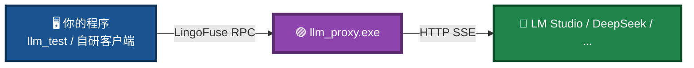
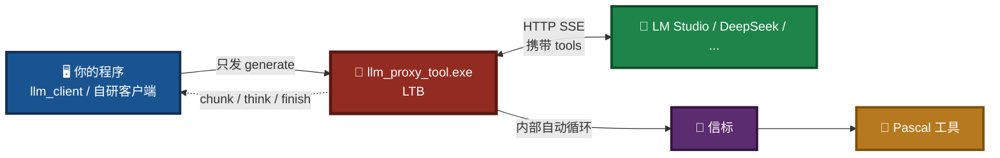
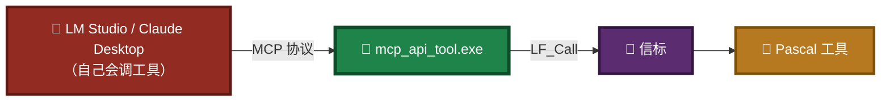
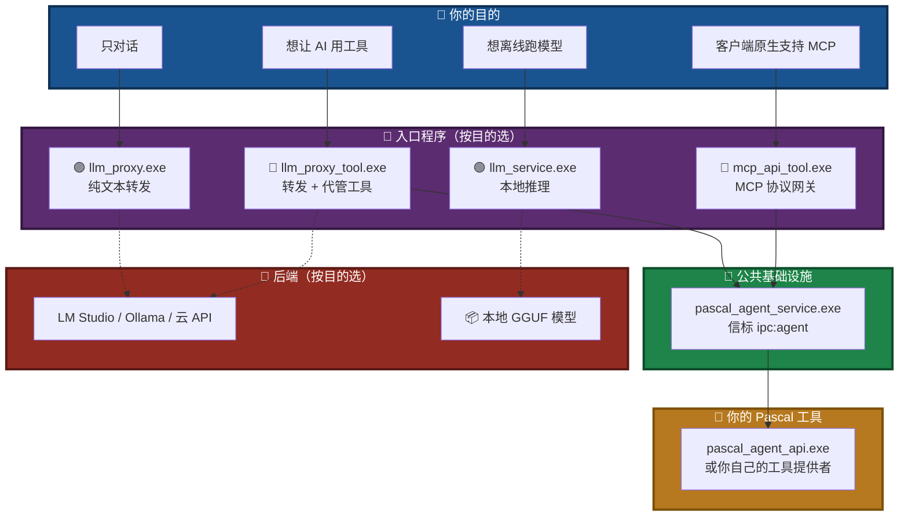
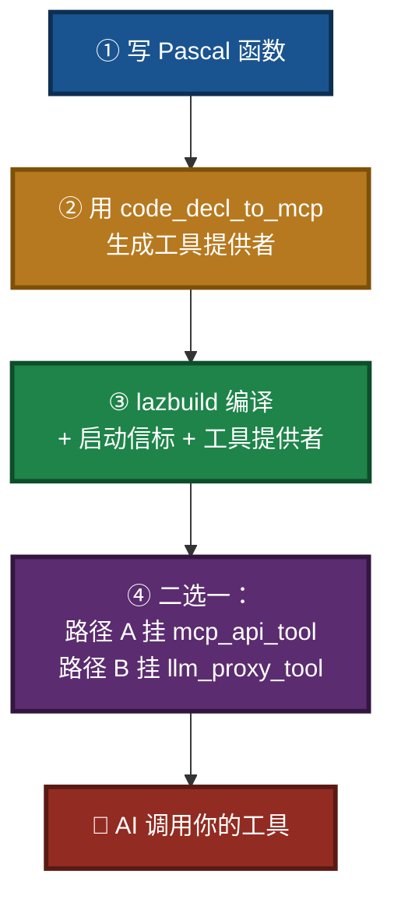
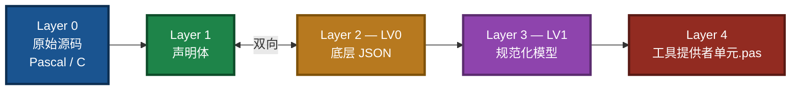
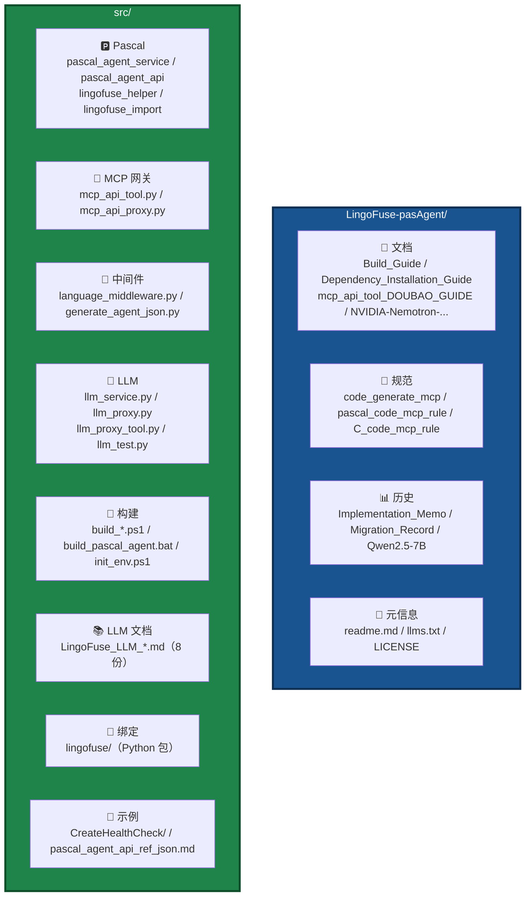

# pasAgent

**工业级 Pascal 智能体技术体系 —— 让 AI 学会用你的 Pascal 代码**

[](https://opensource.org/licenses/MIT)

---

> ## 🚀 新手用户看这里！
>
> 不想折腾编译和环境配置？**直接下载预编译包**：
>
> 👉 **[下载预编译包（Pre-built Package）](https://github.com/PassByYou888/LingoFuse-pasAgent/releases/tag/pre_build)**
>
> 解压 → 按 **[mcp_api_tool_doubao_guide.md](mcp_api_tool_doubao_guide.md)** 操作 → **10 分钟让 AI 调用你的第一个 Pascal 工具**。

---

## 🎯 一句话定位

> **让你用 Pascal 写的函数，被 AI 像内置功能一样直接调用。**

不需要懂 MCP 协议，不需要写 JSON Schema，不需要搭 HTTP 服务。

---

## 🎯 你想干什么？（按目的选择）

pasAgent 有 11 个可执行文件，但**大多数用户只需要其中 2~3 个**。按你的目的选择：

### 目的 1：只想和 AI 对话（不需要工具）

**用 `llm_proxy.exe`** —— 转发到 LM Studio / Ollama / 云 API，你和 AI 正常聊天。



### 目的 2：想让 AI 调用你的 Pascal 工具（推荐）

**用 `llm_proxy_tool.exe`（LTB）** —— 在对话基础上，**服务端自动帮 AI 调用你的 Pascal 工具**。你的客户端**不需要懂 MCP**，只发一条 `generate` 就行。



### 目的 3：不联网，本地跑模型

**用 `llm_service.exe`** —— 加载 GGUF 模型，完全离线。


### 目的 4：客户端原生支持 MCP（经典路径）

**用 `mcp_api_tool.exe`** —— 把 Pascal 工具翻译成 MCP 协议，给 LM Studio / Claude Desktop / Continue.dev 这类**自带 MCP 支持**的客户端使用。



---

## 🗺️ 一图看懂组网

**所有目的共用同一个信标**（`pascal_agent_service.exe`），只是入口程序不同。



**三种 LLM 服务端（`llm_proxy` / `llm_proxy_tool` / `llm_service`）默认共用同一端点 `ipc:llm_service`，同一时刻只能运行一个。** 要同时跑多个，必须给每个指定不同的 `--endpoint` + `--app-name`。

**`mcp_api_tool` 与 `llm_proxy_tool` 可以同时运行**（它们注册到信标的名字不同），一个走路径 A、一个走路径 B。

---

## 🚀 快速上手

### 场景 A：新手最快路径（下载预编译包）


### 场景 B：开发自己的 Pascal 工具



---

## 🧩 代码生成器 5 层透明链



每一层可独立查看 · 编辑 · 导出 · 喂给 LLM 修正 · 回退重走。**主链路完全确定性**，不依赖 LLM 随机性。

详细说明：[code_generate_mcp.md](code_generate_mcp.md)  
声明规范：[pascal_code_mcp_rule.md](pascal_code_mcp_rule.md) · [C_code_mcp_rule.md](C_code_mcp_rule.md)

> **注意**：`code_decl_to_mcp.exe` 的源码不在本仓库中，本仓库仅提供手册与规范。请从预编译发布页获取。

---

## 📦 组件清单

| 组件 | 作用 | 谁关心 |
|------|------|--------|
| `pascal_agent_service.exe` | **信标**：登记和发现所有工具 | 部署服务的你 |
| `pascal_agent_api.exe` | **工具提供者示例**：把 Pascal 函数注册为工具 | 写 Pascal 的你 |
| `mcp_api_tool.exe` | **MCP 网关**：路径 A，翻译成 MCP 协议 | 用 MCP 客户端的你 |
| `mcp_api_proxy.exe` | **MCP 调试代理**：stdio 透明转发 + 日志 | 排查 MCP 握手的你 |
| `code_decl_to_mcp.exe` | **代码生成器**：从声明一键生成工具提供者单元 | 开发阶段的你 |
| `llm_service.exe` | **LLM 本地服务**：本地跑 GGUF，完全离线 | 想断网的你 |
| `llm_proxy.exe` | **LLM 纯转发**：转发到外部后端，只对话 | 只用对话的你 |
| `llm_proxy_tool.exe`（LTB） | **LLM 工具桥**：转发 + **服务端代管工具执行** | 想让智能体调用工具 API 的你 |
| `llm_test.exe` | **LLM 测试客户端**：命令行交互式 REPL | 调试 LLM 的你 |
| `bridge.exe` | **HTTP 桥接网关**：让浏览器 / Node / PHP 访问 | Web 生态的你 |
| `HealthCheck.exe` | **健康检查**：快速验证环境 | 首次部署的你 |

---

## 📁 项目结构



**你最需要关心的文件**：

- `src/pascal_agent_api.lpr` —— 算术工具示例，你的项目原型
- `src/pascal_agent_service.lpr` —— 信标源码
- `src/lingofuse_helper.pas` —— 写工具时的辅助函数
- `src/lingofuse/` —— LingoFuse Python 绑定包（编译时会打包）

---

## 📚 文档地图

### 新手入门

- 🎓 **[mcp_api_tool_doubao_guide.md](mcp_api_tool_doubao_guide.md)** —— 保姆级教程，零基础让 AI 调用第一个 Pascal 工具。

### 理解闭环

- 🌐 **[LingoFuse_LLM_Ecosystem_User_Guide.md](src/LingoFuse_LLM_Ecosystem_User_Guide.md)** —— 三种服务端、两条路径、能力发现机制全景。
- 🧠 **[Local LLM Agent Handbook CPU First, GPU Optional.md](Local%20LLM%20Agent%20Handbook%20CPU%20First%2C%20GPU%20Optional.md)** —— 智能体原理与本地 LLM 入门。

### 开发工具

- 📐 **[pascal_code_mcp_rule.md](pascal_code_mcp_rule.md)** —— Pascal 声明规范。
- 📐 **[C_code_mcp_rule.md](C_code_mcp_rule.md)** —— C 声明规范。
- ⚙️ **[code_generate_mcp.md](code_generate_mcp.md)** —— 代码生成器使用手册。
- 📝 **[pascal_agent_api_ref_json.md](src/pascal_agent_api_ref_json.md)** —— `agent_main` / `register_agent` JSON 详解。

### 部署 LLM 与配置

- 🔨 **[Build_Guide.md](Build_Guide.md)** —— 编译 Pascal 与 Python 组件为 EXE。
- 📦 **[Dependency_Installation_Guide.md](Dependency_Installation_Guide.md)** —— 依赖安装与动态库部署。
- 🤖 **[NVIDIA-Nemotron-3.5-Lightning-30B-A3B-UD-IQ4_NL.md](NVIDIA-Nemotron-3.5-Lightning-30B-A3B-UD-IQ4_NL.md)** —— 推荐模型下载与部署。

**三种服务端命令行手册**：

| 服务端 | 手册 | 什么时候用 |
|--------|------|-----------|
| 🟢 `llm_service.exe` | [LingoFuse_LLM_Service_CLI_guide.md](src/LingoFuse_LLM_Service_CLI_guide.md) | **本地加载 GGUF 模型推理** |
| 🟣 `llm_proxy.exe` | [LingoFuse_LLM_Proxy_CLI_Guide.md](src/LingoFuse_LLM_Proxy_CLI_Guide.md) | **纯文本转发，只对话** |
| 🔴 `llm_proxy_tool.exe`（LTB） | **[LingoFuse_LLM_Proxy_Tool_CLI_Guide.md](src/LingoFuse_LLM_Proxy_Tool_CLI_Guide.md)** | **转发 + 服务端工具执行，让智能体调用 tools API** |

**其他**：

- 📋 **[LingoFuse_LLM_Proxy_Compatibility_Guide.md](src/LingoFuse_LLM_Proxy_Compatibility_Guide.md)** —— 129+ 后端清单（LTB 亦适用）。
- 📦 **[llama_cpp_python_guide.md](src/llama_cpp_python_guide.md)** —— `llama-cpp-python` 安装。

### 深入与排错

- 📝 **[LingoFuse_mcp_api_tool_Implementation_Memo.md](LingoFuse_mcp_api_tool_Implementation_Memo.md)** —— MCP 网关实施备忘与坑点。
- 🚨 **[LingoFuse_LLM_Pitfalls_For_AI.md](src/LingoFuse_LLM_Pitfalls_For_AI.md)** —— LLM 生态踩坑大全。
- 📊 **[LingoFuse_LLM_Service_Work_Summary.md](src/LingoFuse_LLM_Service_Work_Summary.md)** —— LLM 工具链版本演进（历史参考）。
- 📊 **[LingoFuse_Python_Binding_Migration_Record.md](LingoFuse_Python_Binding_Migration_Record.md)** —— Python 绑定迁移与工作总结（历史参考）。

> **历史文档**：`Qwen2.5-7B-Instruct-Q4_K_M.md` 已不再作为默认模型，仅作历史参考。新项目请使用 NVIDIA Nemotron 模型。

---

## 🛡️ 稳定性：为长时间运行而设计

pasAgent 的所有组件都针对**长时运行、高频调用**做了专门加固：

**实测表现**：可稳定处理**数万条**连续的交互命令或 function call，长时间运行不掉线、不漏句柄、不串会话。

---

## 🔧 运行前准备

pasAgent 所有组件都依赖 **LingoFuse 动态库**（`LingoFuse64.dll` / `liblingofuse.so`）。

```bash
git clone --recursive https://github.com/PassByYou888/LingoFuse.git
# 然后将 LingoFuse/Binary 目录加入系统 PATH
```

> **新手提示**：预编译包已内置所需动态库，**无需单独安装**。

### ⚠️ 首次运行缺少 DLL？

如果提示找不到 `LingoFuse64.dll` / `z_ipc_64.dll`，**不想自己编译 LingoFuse**：

👉 **直接去预编译包发布页找现成的**：[releases/tag/pre_build](https://github.com/PassByYou888/LingoFuse-pasAgent/releases/tag/pre_build)

**运行环境依赖**：预编译 DLL 使用 **Visual Studio 2022** 编译，运行时需要安装 **VS2022 可再发行组件（VC++ Redistributable）**：

- [VC++ Redistributable for Visual Studio 2022 (x86/x64)](https://learn.microsoft.com/en-us/cpp/windows/latest-supported-vc-redist?view=msvc-170)

---

## 🌟 关于开放性

**[pasAgent](https://github.com/PassByYou888/LingoFuse-pasAgent) 是 [LingoFuse](https://github.com/PassByYou888/LingoFuse) 的分支项目**，两者均为完全开放、非商业性的开源项目。

- ✅ **永久免费**：MIT 许可证
- ✅ **无商业捆绑**：无收费功能、无付费订阅
- ✅ **社区驱动**：决策来自社区贡献者
- ✅ **透明开发**：源码全公开，构建可复现

---

## ❓ 常见问题

| 问题 | 回答 |
|------|------|
| 需要懂 MCP 协议吗？ | **不需要**，写 Pascal 就行 |
| 只支持豆包吗？ | **支持所有 MCP 客户端**：豆包 / LM Studio / Claude / Continue.dev / Jan / DeepSeek |
| 只能做加减乘除吗？ | **任何 Pascal 函数**：数据库、文件、硬件、GUI…… |
| 需要联网吗？ | **不需要**，所有组件本地运行。若使用 `llm_proxy` / `llm_proxy_tool` 转发云端 API 则需联网 |
| 我的函数操作 UI 能接入吗？ | **能**，生成代码预留主线程同步接口 |
| 客户端不支持 MCP 工具怎么办？ | **用 `llm_proxy_tool.exe`**（路径 B），服务端会代管工具调用 |
| 三种 LLM 服务端能同时跑吗？ | **默认不能**（共享同一端点）。要共存须改 `--endpoint` + `--app-name` |
| 缺 DLL 又不想编译？ | **去[预编译包发布页](https://github.com/PassByYou888/LingoFuse-pasAgent/releases/tag/pre_build)下载，解压即用** |
| 如何让 AI 自动调用工具？ | 路径 A：启动 `mcp_api_tool`；路径 B：启动 `llm_proxy_tool` |
| LLM 体系文档在哪里？ | 全部在 **[`src/`](src/)** 目录下 |
| 代码生成器的源码在哪？ | **不在本仓库中**，本仓库仅提供手册。请从预编译发布页获取 `code_decl_to_mcp.exe` |
| 能长时间跑吗？ | **能**。专门做过加固：单 worker 串行、双条件回收、句柄自动回收、异常隔离。**实测可稳定处理数万条交互命令或 function call** |

---

## 👤 关于作者

**老张（QQ: 600585）**

看不惯跨语言调用得写一箩筐胶水代码，干脆撸了 LingoFuse；又看不惯 Pascal 老代码接不进 AI 时代，顺手撸了 pasAgent。

欢迎反馈、建议、PR。

---

## 📄 许可证

**MIT** —— 自由使用、修改、分发。

---

*项目始于 2026 年，持续迭代中。有问题提 Issue，急事加 Q。*