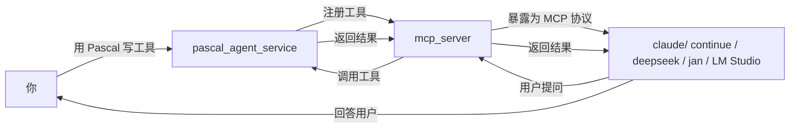

# pasAgent

**工业级 Pascal 智能体技术体系 —— 让 AI 学会用你的 Pascal 代码**

[](https://opensource.org/licenses/MIT)

---

> ## 🚀 新手用户看这里！
>
> 如果你是**第一次接触智能体和 LLM**，不想折腾编译和环境配置，**直接下载预编译包**即可开始体验：
>
> 👉 **[下载预编译包（Pre-built Package）](https://github.com/PassByYou888/LingoFuse-pasAgent/releases/tag/pre_build)**
>
> 下载后解压，按照 [MCP_SERVER_DOUBAO_GUIDE.md](MCP_SERVER_DOUBAO_GUIDE.md) 的说明操作，**10 分钟就能让 AI 调用你的第一个 Pascal 工具**。
>
> 预编译包包含所有必需的可执行文件和动态库，开箱即用，无需安装任何开发环境。

---

## 🎯 这是什么？

**pasAgent** 是一套 **工业级 Pascal 智能体（Agent）技术体系**，它的核心使命是：**让你用 Pascal 写的代码，能被 AI 直接调用。**

传统上，AI（如豆包、LM Studio）只能调用 Python 或 JavaScript 写的工具。如果你想让自己积累多年的 Pascal 业务逻辑被 AI 使用，过去需要重写、封装、搭 HTTP 服务……而现在，pasAgent 让你**直接用 Pascal 写工具函数，AI 就能像调用内置功能一样调用它。**

---

## 🌟 关于本项目的开放性

**[pasAgent](https://github.com/PassByYou888/LingoFuse-pasAgent)是[LingoFuse](https://github.com/PassByYou888/LingoFuse)的分支项目,[pasAgent](https://github.com/PassByYou888/LingoFuse-pasAgent)与[LingoFuse](https://github.com/PassByYou888/LingoFuse)都是完全开放、非商业性的开源项目。**

- ✅ **永久免费**：MIT 许可证，任何个人、团队、企业均可自由使用，包括商业用途。
- ✅ **无商业捆绑**：没有任何收费功能、付费订阅或商业版本。
- ✅ **社区驱动**：所有发展决策来自社区贡献者，而非商业公司。
- ✅ **开放协作**：欢迎任何形式的贡献——代码、文档、测试、Issue 讨论。
- ✅ **透明开发**：所有源码公开，构建过程可复现，无闭源组件。

---

### 这个体系包含什么？

| 组件                    | 作用                                        | 谁需要关心         |
| ----------------------- | ------------------------------------------- | ------------------ |
| **Pascal 智能体服务端** | 把你的 Pascal 函数注册成“工具”，供 AI 调用  | 写 Pascal 代码的你 |
| **MCP 协议网关**        | 把工具翻译成 AI 能听懂的语言（MCP 协议）    | 部署服务的你       |
| **代码生成器**          | 从 Pascal 声明一键生成工具定义，免手写 JSON | 开发阶段的你       |
| **LLM 流式服务**        | 在本地跑大语言模型，让 AI 不依赖网络        | 想完全离线的你     |

**说白了：这是一套让“Pascal 老代码”能接入“AI 新世界”的完整解决方案。**

---

## 🚀 快速了解：新手第一次接触智能体的完整流程

看 [新手入门](MCP_SERVER_DOUBAO_GUIDE.md) 文档

---

## 🏗️ 这个体系到底怎么工作的？



**一句话总结：你用 Pascal 写的函数 → 被 mcp_server 翻译 → AI 客户端看到的是标准工具 → AI 调用时，实际执行的是你的 Pascal 代码。**

---

## 📁 项目结构（你只需要关注这些）

```
src/
├── pascal_agent_service.lpr     # 工具管理服务（Pascal 源码）
├── pascal_agent_api.lpr         # 工具注册示例（Pascal 源码）
├── lingofuse_helper.pas         # Pascal 辅助库（你写工具时会用到）
├── lingofuse_import.pas         # 底层 C 绑定（一般不用动）
├── mcp_server.py                # MCP 网关（Python 源码）
├── mcp_proxy.py                 # 调试代理（用于排查问题）
├── generate_agent_json.py       # 配置生成器
├── tools/                       # 开发工具
│   └── pascal_decl_to_mcp.lpr   # 代码生成器（Pascal → MCP 定义）
├── llm-service/                 # LLM 流式服务（可选）
├── CreateHealthCheck/           # 健康检查工具（可选）
├── lingofuse/                   # Python 核心绑定（一般不用动）
└── *.md                         # 各类文档
```

**你只需要关心：**

- `pascal_agent_api.lpr` —— 算术注册工具示例，也是原型
- `pascal_agent_service.lpr` —— 你要改的服务端源码（加你自己的工具）
- `lingofuse_helper.pas` —— 写工具时用到的辅助函数
- `tools/pascal_decl_to_mcp.lpr` —— 如果你不想手写 JSON，用这个自动生成

---

# 🤖 代码生成器

如果你不想手动写注册代码，可以用 `tools/pascal_decl_to_mcp.exe`：

```cmd
pascal_decl_to_mcp.exe
```

它会解析你的 Pascal 源码，自动生成 MCP 工具定义 JSON，你可以直接用 `register_agent` 注册，或者直接喂给 mcp_server。

**这让你能专注于写业务逻辑，让工具自动生成注册代码。**

---

## 📚 完整文档

| 文档                                                                                       | 适合谁               | 内容                                                         |
| ------------------------------------------------------------------------------------------ | -------------------- | ------------------------------------------------------------ |
| [MCP_SERVER_DOUBAO_GUIDE.md](MCP_SERVER_DOUBAO_GUIDE.md)                                   | 完全零基础新手       | 从零开始的图文教程，每一步都配有解释，**适合一边看一边操作** |
| [Build_Guide.md](Build_Guide.md)                                                           | 需要自己编译的开发者 | 完整的编译指南（Pascal + Python）                            |
| [Dependency_Installation_Guide.md](Dependency_Installation_Guide.md)                       | 需要安装依赖的开发者 | 所有依赖包的安装说明                                         |
| [Qwen2.5-7B-Instruct-Q4_K_M.md](Qwen2.5-7B-Instruct-Q4_K_M.md)                             | 想跑本地 LLM 的用户  | 模型下载与部署指南                                           |
| [pascal_code_rule.md](pascal_code_rule.md)                                                 | Pascal 工具开发者    | Pascal 编码规范与工具开发指南                                |
| [LingoFuse_MCP_Server_Implementation_Memo.md](LingoFuse_MCP_Server_Implementation_Memo.md) | 想了解内部实现       | 技术实施备忘                                                 |

---

## ❓ 常见问题

**Q：我需要懂 MCP 协议吗？**

A：**不需要。** 你只需要写 Pascal 代码，mcp_server 自动处理协议转换。

**Q：这个体系只支持豆包吗？**

A：**支持所有兼容 MCP 协议的 AI 客户端**，包括豆包、LM Studio、Claude Desktop、Continue.dev、Jan、DeepSeek 等。

**Q：只能做加减乘除吗？**

A：**当然不是。** 你可以注册任何 Pascal 函数——数据库查询、文件处理、硬件控制、工业自动化……只要你能用 Pascal 写，就能被 AI 调用。

**Q：需要联网吗？**

A：**不需要。** 所有组件都在本地运行，数据不出内网。你也可以选装 LLM 服务实现完全离线。

**Q：我是新手，能成功吗？**

A：**能。** 下载[预编译包](https://github.com/PassByYou888/LingoFuse-pasAgent/releases/tag/pre_build)，按照 [MCP_SERVER_DOUBAO_GUIDE.md](MCP_SERVER_DOUBAO_GUIDE.md) 的步骤操作，每一步都有解释。遇到不懂的，拍照问豆包，它会手把手教你。

**Q：我是老手，想深入定制？**

A：看源码。`pascal_agent_service.lpr` 和 `lingofuse_helper.pas` 是起点，全部开源，MIT 协议，随便改。

---

## 👤 关于作者

**老张（QQ: 600585）**

欢迎反馈、建议、PR。骚扰。

---

## 📄 许可证

**MIT** —— 自由使用、修改、分发。

---

*项目始于 2026 年，持续迭代中。有问题提 Issue，急事加 Q。*