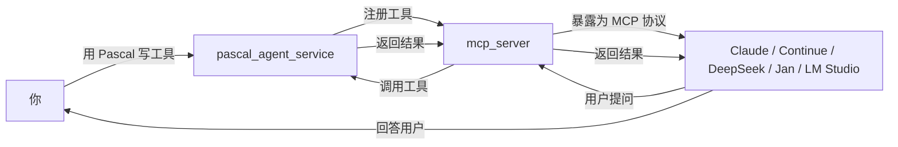

# pasAgent

**工业级 Pascal 智能体技术体系 —— 让 AI 学会用你的 Pascal 代码**

[](https://opensource.org/licenses/MIT)

---

> ## 🚀 新手用户看这里！
>
> 如果你是**第一次接触智能体和 LLM**，不想折腾编译和环境配置，**直接下载预编译包**即可开始体验：
>
> 👉 **[下载预编译包（Pre-built Package）](https://github.com/PassByYou888/LingoFuse-pasAgent/releases/tag/pre_build)**
>
> 下载后解压，按照 **[MCP_SERVER_DOUBAO_GUIDE.md](MCP_SERVER_DOUBAO_GUIDE.md)** 的说明操作，**10 分钟就能让 AI 调用你的第一个 Pascal 工具**。
>
> 预编译包包含所有必需的可执行文件和动态库，开箱即用，无需安装任何开发环境。

---

## 🔧 运行前准备：LingoFuse 动态库依赖

**pasAgent 的所有组件（MCP Server、Pascal 后端、代码生成器、LLM 服务）运行时都必须依赖 LingoFuse 动态库**（`LingoFuse64.dll` / `liblingofuse.so`）。

- **获取动态库的方式**：
  1. 从 **[LingoFuse 仓库](https://github.com/PassByYou888/LingoFuse)** 下载**预编译包**（Release 中提供）。
  2. 或按 LingoFuse 仓库中的构建指南**自行一键编译**。

- **最佳部署方法（推荐）**：
  将 LingoFuse 仓库克隆到本地，然后把其动态库所在目录（例如 `Binary/`）**添加到系统 PATH**，让系统能够直接找到动态库：
  ```bash
  git clone --recursive https://github.com/PassByYou888/LingoFuse.git
  # 然后将 LingoFuse/Binary 目录加入系统 PATH，例如在 Linux 下：
  export PATH=/path/to/LingoFuse/Binary:$PATH
  ```
  这是最简洁的做法，**无需把 DLL 复制到每个项目目录**。

- **关于新手体验**：
  考虑到新手的快速切入，预编译包已内置所需动态库，**无需单独安装 LingoFuse 或走安装流程**。
  对于希望获得源码环境的开发者，正规的 LingoFuse Python 绑定安装流程为：在 LingoFuse 仓库的 `Py` 目录执行 `pip install -e .` 完成装包。

---

## 🎯 这是什么？

**pasAgent** 是一套 **工业级 Pascal 智能体（Agent）技术体系**，它的核心使命是：

> **让你用 Pascal 写的代码，能被 AI 直接调用。**

传统上，AI（如豆包、LM Studio、Claude Desktop）只能调用 Python 或 JavaScript 写的工具。如果你想让自己积累多年的 Pascal 业务逻辑被 AI 使用，过去需要重写、封装、搭 HTTP 服务……

而现在，pasAgent 让你**直接用 Pascal 写工具函数，AI 就能像调用内置功能一样调用它。**

**你不需要懂 MCP 协议，不需要写 JSON Schema，不需要搭 HTTP 服务。** 你只需要：

1. 用 Pascal 写一个普通函数（就像你平时写代码一样）。
2. 用 `pascal_decl_to_mcp.exe` 一键生成工具定义。
3. AI 客户端就能调用它。

---

## 🌟 关于本项目的开放性

**[pasAgent](https://github.com/PassByYou888/LingoFuse-pasAgent) 是 [LingoFuse](https://github.com/PassByYou888/LingoFuse) 的分支项目，两者均为完全开放、非商业性的开源项目。**

- ✅ **永久免费**：MIT 许可证，任何个人、团队、企业均可自由使用，包括商业用途。
- ✅ **无商业捆绑**：没有任何收费功能、付费订阅或商业版本。
- ✅ **社区驱动**：所有发展决策来自社区贡献者，而非商业公司。
- ✅ **开放协作**：欢迎任何形式的贡献——代码、文档、测试、Issue 讨论。
- ✅ **透明开发**：所有源码公开，构建过程可复现，无闭源组件。

---

## 📦 这个体系包含什么？

| 组件 | 作用 | 谁需要关心 |
|------|------|------------|
| **Pascal 智能体服务端** | 把你的 Pascal 函数注册成"工具"，供 AI 调用 | 写 Pascal 代码的你 |
| **MCP 协议网关** | 把工具翻译成 AI 能听懂的语言（MCP 协议） | 部署服务的你 |
| **代码生成器** | 从 Pascal 声明一键生成工具定义，免手写 JSON | 开发阶段的你 |
| **LLM 流式服务** | 在本地跑大语言模型，让 AI 不依赖网络 | 想完全离线的你 |

**一句话：这是一套让"Pascal 老代码"能接入"AI 新世界"的完整解决方案。**

---

## 🏗️ 这个体系怎么工作的？



**一句话总结：**

> 你用 Pascal 写的函数 → 被 `mcp_server` 翻译 → AI 客户端看到的是标准工具 → AI 调用时，**实际执行的是你的 Pascal 代码**。

---

## 🧩 核心工作流：从 Pascal 函数到 AI 工具

pasAgent 的核心工作流是**"LLM + 结构体"的确定性代码生成链**，把整个过程拆成 5 层透明的中间态：

```
Layer 0  原始 Pascal 源码
            ↓ 解析
Layer 1  Pascal 声明体（标准 Pascal 语法）
            ⇄ 双向转换
Layer 2  LV0 声明 JSON（Z.Pascal_Func_Tool 解析产物）
            ↓ 规范化
Layer 3  LV1 模型 JSON（pascal_func_model 产物，生成器的实际输入）
            ↓ 代码生成
Layer 4  工具提供者单元（pas_mcp_generator_tool 产物，可直接编译）
```

**每一层都可以**：

- 独立查看、编辑、导出。
- 用 LLM 辅助修正（跨语言声明转换、注释补全、代码审查）。
- 出错时回退到任意一层重新走。

**主链路完全确定性**——同样的输入永远得到同样的输出，**不依赖 LLM 的随机性**。LLM 只做辅助，不污染生成结果。

这套流程的具体操作方式，请参考 **[pascal_decl_to_mcp 使用手册](pascal_decl_to_mcp_使用手册.md)**（或者参看 `tools/` 目录内的源码注释）。

---

## 🚀 快速上手：三步让 AI 调用你的 Pascal 代码

### 第 1 步：用 Pascal 写一个普通函数

```pascal
// 这就是你要给 AI 用的函数，写法跟平时完全一样
function Add(a, b: Integer): Integer;
begin
  Result := a + b;
end;
```

### 第 2 步：用代码生成器生成工具提供者

```cmd
pascal_decl_to_mcp.exe
```

粘贴你的 Pascal 声明 → 点几下按钮 → 拿到一份 `<UnitName>_tool_provider_unit.pas`。

### 第 3 步：编译并注册

```cmd
lazbuild.exe -B .\your_tool_provider.lpi
```

启动 `pascal_agent_service.exe`（信标）+ 你的工具提供者 + `mcp_server.exe`，AI 客户端就能看到并调用 `Add` 工具了。

**完整的新手图文教程见 [MCP_SERVER_DOUBAO_GUIDE.md](MCP_SERVER_DOUBAO_GUIDE.md)。**

---

## 📁 项目结构（你只需要关注这些）

```
src/
├── pascal_agent_service.lpr     # 工具管理服务（信标）的 Pascal 源码
├── pascal_agent_api.lpr         # 算术工具注册示例（add/sub/mul/div）
├── lingofuse_helper.pas         # Pascal 辅助库（你写工具时会用到）
├── lingofuse_import.pas         # 底层 C 绑定（一般不用动）
├── mcp_server.py                # MCP 网关（Python 源码）
├── mcp_proxy.py                 # 调试代理（用于排查通信问题）
├── generate_agent_json.py       # 客户端配置生成器
├── language_middleware.py       # MCP Server 依赖的中间件
├── tools/                       # 开发工具
│   └── pascal_decl_to_mcp.lpr   # 代码生成器（Pascal → MCP 工具定义）
├── llm-service/                 # LLM 流式服务（可选，本地跑大模型）
│   ├── llm_service.py
│   └── ...
├── CreateHealthCheck/           # 健康检查示例项目（Pascal + GUI）
└── lingofuse/                   # Python 核心绑定
```

**你最需要关心的三个文件：**

- **`pascal_agent_api.lpr`** —— 算术注册工具示例，也是你自己项目的原型。
- **`pascal_agent_service.lpr`** —— 你要改的服务端源码（加你自己的工具）。
- **`lingofuse_helper.pas`** —— 写工具时用到的辅助函数。

---

## 🤖 代码生成器：`pascal_decl_to_mcp.exe`

**如果你不想手动写工具注册代码，用这个。**

它是一套 **"Pascal 声明 → 结构体 → 工具提供者"** 的确定性代码生成器。你不用手写 JSON Schema，不用手写 Call 回调，不用手写注册逻辑——只要把函数声明粘进去，点几下按钮，就能拿到一份可以直接编译运行的工具提供者单元。

**核心特点：**

- **5 层透明中间态**：任意一层都能查看、编辑、导出、喂给 LLM 辅助修正。
- **确定性生成**：主链路不依赖 LLM，结果可复现、可审查、可回退。
- **反向按钮**：可以从任意中间态退回上一步，方便反复试错。
- **跳过报告**：明确告诉你哪些函数因为什么原因被跳过。
- **LLM 集成但不依赖**：可以完全不用 LLM 走完全流程。

**使用细节参见 [pascal_decl_to_mcp 使用手册](pascal_decl_to_mcp_使用手册.md)。**

---

## 📚 完整文档

| 文档 | 适合谁 | 内容 |
|------|--------|------|
| **[MCP_SERVER_DOUBAO_GUIDE.md](MCP_SERVER_DOUBAO_GUIDE.md)** | 完全零基础新手 | 从零开始的图文教程，**适合一边看一边操作**。每一步都配解释，遇到界面操作拍照问豆包即可 |
| **[pascal_code_rule.md](pascal_code_rule.md)** | Pascal 工具开发者 | Pascal 函数/过程声明规范（兼容代码生成器），包含大量可直接模仿的注释写法 |
| **[Build_Guide.md](Build_Guide.md)** | 需要自己编译的开发者 | 完整的编译指南（Pascal + Python），包括 `mcp_server.exe`、`llm_service_*.exe`、Pascal 工具提供者的编译流程 |
| **[Dependency_Installation_Guide.md](Dependency_Installation_Guide.md)** | 需要安装依赖的开发者 | 所有依赖包的安装说明（Python + Pascal + 动态库） |
| **[Qwen2.5-7B-Instruct-Q4_K_M.md](Qwen2.5-7B-Instruct-Q4_K_M.md)** | 想跑本地 LLM 的用户 | Qwen2.5-7B 模型的下载与部署指南（Hugging Face / hf-mirror / ModelScope 三个源） |
| **[LingoFuse_LLM_Service_guide.md](LingoFuse_LLM_Service_guide.md)** | 部署 LLM 服务的用户 | `llm_service_*.exe` 的命令行启动详细说明（参数、环境变量、典型场景、故障排查） |
| **[Local LLM Agent Handbook CPU First, GPU Optional.md](Local%20LLM%20Agent%20Handbook%20CPU%20First%2C%20GPU%20Optional.md)** | 想理解智能体原理的读者 | 本地 LLM 智能体手册——"CPU 优先，GPU 可选"，绕开显卡焦虑直通本地智能体实战 |
| **[LingoFuse_MCP_Server_Implementation_Memo.md](LingoFuse_MCP_Server_Implementation_Memo.md)** | 想了解内部实现的开发者 | MCP Server 的完整改造、调试和交付过程备忘，包括缓存一致性与离线检测修复 |

---

## ❓ 常见问题

**Q：我需要懂 MCP 协议吗？**

A：**不需要。** 你只需要写 Pascal 代码，`mcp_server` 自动处理协议转换。

**Q：这个体系只支持豆包吗？**

A：**支持所有兼容 MCP 协议的 AI 客户端**，包括豆包、LM Studio、Claude Desktop、Continue.dev、Jan、DeepSeek 等。

**Q：只能做加减乘除吗？**

A：**当然不是。** 你可以注册**任何 Pascal 函数**——数据库查询、文件处理、硬件控制、工业自动化、GUI 操作……只要你能用 Pascal 写，就能被 AI 调用。

**Q：需要联网吗？**

A：**不需要。** 所有组件都在本地运行，数据不出内网。你也可以选装 `llm_service_*.exe` 实现**完全离线的本地大模型**。

**Q：我是新手，能成功吗？**

A：**能。** 下载 [预编译包](https://github.com/PassByYou888/LingoFuse-pasAgent/releases/tag/pre_build)，按照 **[MCP_SERVER_DOUBAO_GUIDE.md](MCP_SERVER_DOUBAO_GUIDE.md)** 的步骤操作，每一步都有解释。遇到不懂的，**拍照问豆包**，它会手把手教你。

**Q：我是老手，想深入定制？**

A：看源码。`pascal_agent_service.lpr` 和 `lingofuse_helper.pas` 是起点，全部开源，MIT 协议，随便改。

**Q：我写的 Pascal 函数需要满足什么规则？**

A：参考 **[pascal_code_rule.md](pascal_code_rule.md)**。简单说：函数必须是**顶层声明**，参数和返回值类型必须是 `Int64` / `Double` / `string`（工具会自动归一化 `Integer`/`Single`/各种 string 别名）。

**Q：我的 Pascal 函数会操作 UI，能接入吗？**

A：**能。** 工具生成的代码预留了主线程同步接口，启用后回调会在主线程执行，可以安全操作 LCL / VCL 组件。参考 `CreateHealthCheck` 示例项目。

---

## 👤 关于作者

**老张（QQ: 600585）**

看不惯跨语言调用得写一箩筐胶水代码，干脆撸了 LingoFuse；又看不惯 Pascal 老代码接不进 AI 时代，顺手撸了 pasAgent。

欢迎反馈、建议、PR。

---

## 📄 许可证

**MIT** —— 自由使用、修改、分发。

---

*项目始于 2026 年，持续迭代中。有问题提 Issue，急事加 Q。*