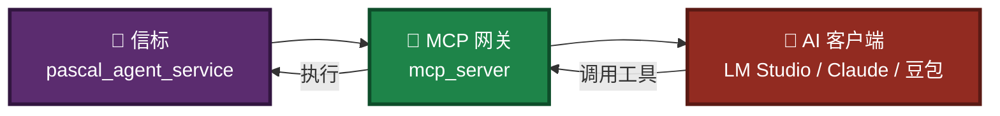
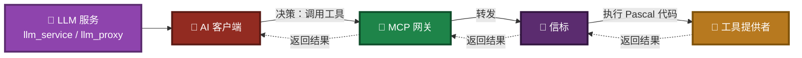
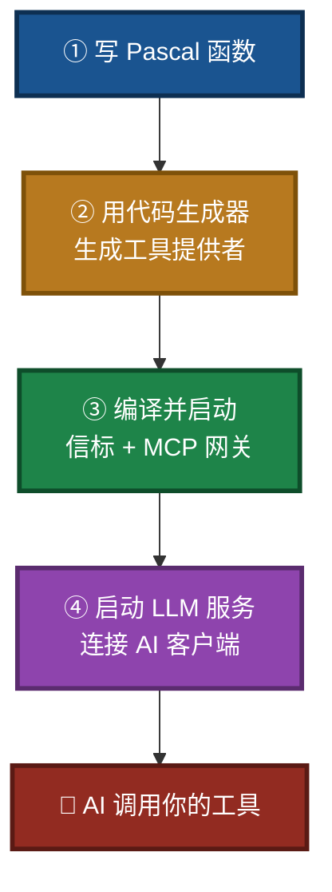
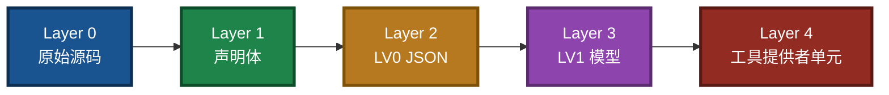
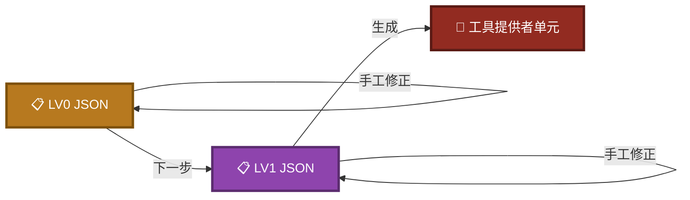
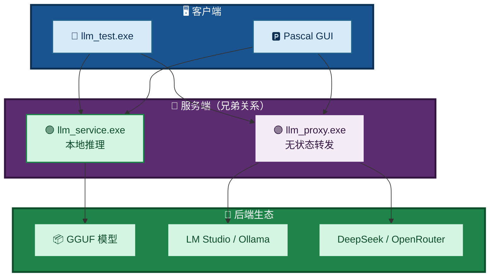
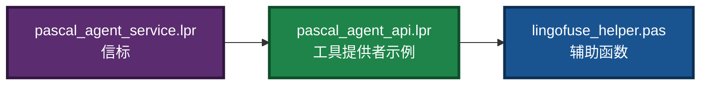
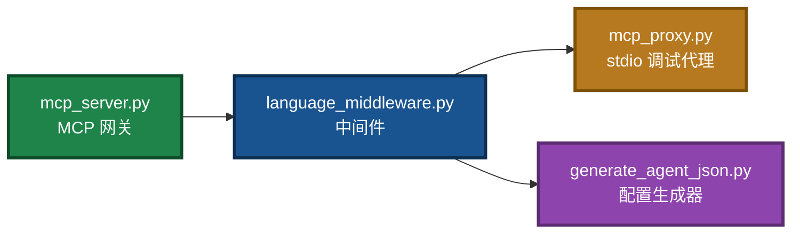
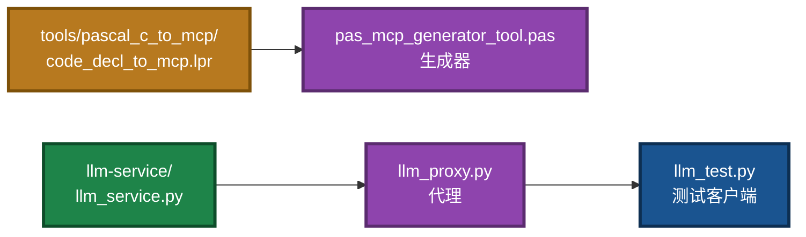
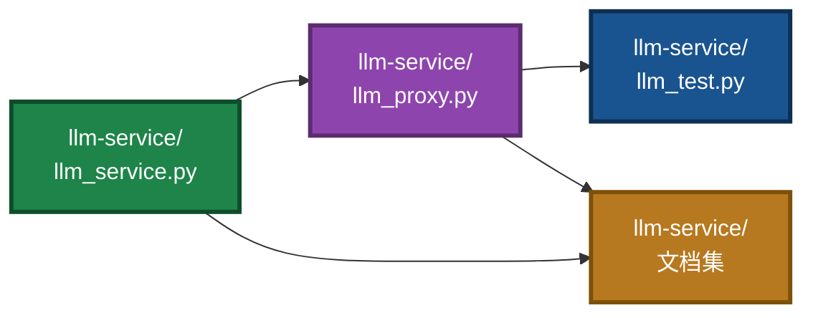

# pasAgent

**工业级 Pascal 智能体技术体系 —— 让 AI 学会用你的 Pascal 代码**

[](https://opensource.org/licenses/MIT)

---

> ## 🚀 新手用户看这里！
>
> 不想折腾编译和环境配置？**直接下载预编译包**：
>
> 👉 **[下载预编译包（Pre-built Package）](https://github.com/PassByYou888/LingoFuse-pasAgent/releases/tag/pre_build)**
>
> 解压 → 按 **[MCP_SERVER_DOUBAO_GUIDE.md](MCP_SERVER_DOUBAO_GUIDE.md)** 操作 → **10 分钟让 AI 调用你的第一个 Pascal 工具**。
>
> 该指南已更新，包含完整的 LLM 服务启动步骤。若想先理解整体闭环，请继续往下读。

---

## 🎯 一句话定位

> **让你用 Pascal 写的函数，被 AI 像内置功能一样直接调用。**

不需要懂 MCP 协议，不需要写 JSON Schema，不需要搭 HTTP 服务。

---

## 🏗️ 完整闭环：从 Pascal 函数到 AI 调用

pasAgent 由四个核心环节组成，形成一条从代码到 AI 的完整闭环。为避免一张图信息过载，下面按**数据流**拆分为四张独立小图。

### 图 1：整体闭环总览


### 图 2：Pascal 函数如何变成工具（阶段一）


### 图 3：工具如何被 AI 看见（阶段二）



### 图 4：LLM 服务如何触发工具（阶段三）



**核心机制**：你写的 Pascal 函数 → 被 `mcp_server` 翻译 → AI 客户端看到标准工具 → 调用时**实际执行你的 Pascal 代码**。`llm_service` / `llm_proxy` 为 AI 客户端提供本地或云端模型能力，使智能体能够自主决策并触发工具调用。

---

## 🚀 四步上手（完整闭环）



**完整图文教程**：[MCP_SERVER_DOUBAO_GUIDE.md](MCP_SERVER_DOUBAO_GUIDE.md)

---

## 🧩 代码生成器 5 层透明链

同样拆为两张图，先看整体链路，再看可编辑的中间层。

### 图 5：5 层转换链路



### 图 6：中间层可编辑、可回退



**每一层都可以**：独立查看 · 编辑 · 导出 · 喂给 LLM 辅助修正 · 出错时回退重走。  
**主链路完全确定性**——不依赖 LLM 随机性，结果可复现。

详细说明：[src/tools/pascal_c_to_mcp/code_generate_mcp.md](src/tools/pascal_c_to_mcp/code_generate_mcp.md)

---

## 🌟 LLM 生态体系（重点推荐）

pasAgent 闭环中 **“AI 的大脑”** 由 LLM 生态体系提供。它由**两种兄弟服务端**、**多种客户端**、**完整的协议与能力发现机制**组成。以下是全套文档，建议按顺序阅读。

### 图 7：LLM 生态全景



### 📚 LLM 生态文档索引

> **所有 LLM 相关文档都在 [`src/llm-service/`](src/llm-service/) 目录下。**

| 文档 | 说明 | 适合谁 |
|------|------|--------|
| 🌐 **[LingoFuse_LLM_Ecosystem_User_Guide.md](src/llm-service/LingoFuse_LLM_Ecosystem_User_Guide.md)** | **闭环架构与生态总览**（入口文档） | 想理解全貌的人 |
| ⚙️ **[LingoFuse_LLM_Service_CLI_guide.md](src/llm-service/LingoFuse_LLM_Service_CLI_guide.md)** | `llm_service.exe` 命令行完整手册 | 部署本地推理的人 |
| ⚙️ **[LingoFuse_LLM_Proxy_CLI_Guide.md](src/llm-service/LingoFuse_LLM_Proxy_CLI_Guide.md)** | `llm_proxy.exe` 命令行完整手册 | 转发到外部后端的人 |
| 📋 **[LingoFuse_LLM_Proxy_Compatibility_Guide.md](src/llm-service/LingoFuse_LLM_Proxy_Compatibility_Guide.md)** | 支持的 129+ OpenAI 兼容后端清单 | 想知道能接什么的人 |
| 🚨 **[LingoFuse_LLM_Pitfalls_For_AI.md](src/llm-service/LingoFuse_LLM_Pitfalls_For_AI.md)** | 踩坑大全，症状-根因-正确做法 | 遇到问题的人 |
| 📊 **[LingoFuse_LLM_Service_Work_Summary.md](src/llm-service/LingoFuse_LLM_Service_Work_Summary.md)** | 版本演进与架构决策（历史参考） | 想了解内部实现的人 |
| 📦 **[llama_cpp_python_guide.md](src/llm-service/llama_cpp_python_guide.md)** | `llama-cpp-python` 安装与使用 | 装依赖的人 |

---

## 📦 组件清单

| 组件 | 作用 | 谁关心 |
| ----------------------- | ------------------------------ | -------------- |
| **Pascal 智能体服务端** | 把你的 Pascal 函数注册为工具 | 写 Pascal 的你 |
| **MCP 协议网关** | 把工具翻译成 MCP 协议 | 部署服务的你 |
| **代码生成器** | 从 Pascal 声明一键生成工具定义 | 开发阶段的你 |
| **LLM 流式服务** | 本地跑大模型，完全离线 | 想断网的你 |
| **LLM 代理** | 转发到 LM Studio / Ollama / 云 API | 想用云端模型的你 |

---

## 📁 项目结构

分为后端、网关、工具链三部分，分别用独立小图展示。

### 图 8：Pascal 后端



### 图 9：Python 网关



### 图 10：代码生成器与 LLM 服务



### 图 11：LLM 工具链（独立目录）



**你最需要关心的文件**：

- `pascal_agent_api.lpr` —— 算术工具示例，你的项目原型
- `pascal_agent_service.lpr` —— 你要改的服务端源码
- `lingofuse_helper.pas` —— 写工具时的辅助函数
- `src/llm-service/` —— LLM 生态体系源码与文档

---

## 📚 文档地图与阅读引导

建议按以下顺序阅读，逐步深入。

### 第一步：新手入门

- 🎓 **[MCP_SERVER_DOUBAO_GUIDE.md](MCP_SERVER_DOUBAO_GUIDE.md)** —— 保姆级教程，零基础让 AI 调用第一个 Pascal 工具。

### 第二步：理解闭环

- 🌐 **[LingoFuse_LLM_Ecosystem_User_Guide.md](src/llm-service/LingoFuse_LLM_Ecosystem_User_Guide.md)** —— 闭环架构、LLM 服务、代理、客户端协作全景。
- 🧠 **[Local LLM Agent Handbook CPU First, GPU Optional.md](Local%20LLM%20Agent%20Handbook%20CPU%20First%2C%20GPU%20Optional.md)** —— 智能体原理与本地 LLM 入门。

### 第三步：开发工具

- 📐 **[pascal_code_mcp_rule.md](src/tools/pascal_c_to_mcp/pascal_code_mcp_rule.md)** —— Pascal 声明规范（解析契约）。
- 📐 **[C_code_mcp_rule.md](src/tools/pascal_c_to_mcp/C_code_mcp_rule.md)** —— C 声明规范（解析契约）。
- ⚙️ **[code_generate_mcp.md](src/tools/pascal_c_to_mcp/code_generate_mcp.md)** —— 代码生成器使用手册。

### 第四步：部署 LLM 与配置

- 🔨 **[Build_Guide.md](Build_Guide.md)** —— 编译 Pascal 与 Python 组件为 EXE。
- 📦 **[Dependency_Installation_Guide.md](Dependency_Installation_Guide.md)** —— 依赖安装与动态库部署。
- 🤖 **[NVIDIA-Nemotron-3.5-Lightning-30B-A3B-UD-IQ4_NL.md](NVIDIA-Nemotron-3.5-Lightning-30B-A3B-UD-IQ4_NL.md)** —— 推荐模型下载与部署。
- ⚙️ **[LingoFuse_LLM_Service_CLI_guide.md](src/llm-service/LingoFuse_LLM_Service_CLI_guide.md)** —— LLM 服务命令行手册。
- ⚙️ **[LingoFuse_LLM_Proxy_CLI_Guide.md](src/llm-service/LingoFuse_LLM_Proxy_CLI_Guide.md)** —— LLM 代理命令行手册。
- 📋 **[LingoFuse_LLM_Proxy_Compatibility_Guide.md](src/llm-service/LingoFuse_LLM_Proxy_Compatibility_Guide.md)** —— 支持的全部 OpenAI 兼容后端清单。
- 📦 **[llama_cpp_python_guide.md](src/llm-service/llama_cpp_python_guide.md)** —— `llama-cpp-python` 安装。

### 第五步：深入与排错

- 📝 **[LingoFuse_MCP_Server_Implementation_Memo.md](LingoFuse_MCP_Server_Implementation_Memo.md)** —— MCP 网关实施备忘与坑点。
- 🚨 **[LingoFuse_LLM_Pitfalls_For_AI.md](src/llm-service/LingoFuse_LLM_Pitfalls_For_AI.md)** —— LLM 生态踩坑大全。
- 📊 **[LingoFuse_LLM_Service_Work_Summary.md](src/llm-service/LingoFuse_LLM_Service_Work_Summary.md)** —— LLM 工具链版本演进（历史参考）。
- 📊 **[LingoFuse_Python_Binding_Migration_Record.md](LingoFuse_Python_Binding_Migration_Record.md)** —— Python 绑定迁移与工作总结（历史参考）。

> **历史文档**：`Qwen2.5-7B-Instruct-Q4_K_M.md` 已不再作为默认模型，仅作历史参考。新项目请使用 NVIDIA Nemotron 模型。

---

## 🔧 运行前准备

pasAgent 所有组件都依赖 **LingoFuse 动态库**（`LingoFuse64.dll` / `liblingofuse.so`）。

### 图 12：动态库部署


```bash
git clone --recursive https://github.com/PassByYou888/LingoFuse.git
# 然后将 LingoFuse/Binary 目录加入系统 PATH
```

> **新手提示**：预编译包已内置所需动态库，**无需单独安装**。

### ⚠️ 首次运行缺少 DLL？别慌！

如果第一次运行时提示找不到 `LingoFuse64.dll` / `z_ipc_64.dll` 等动态库，而你又**不想自己编译 LingoFuse**：

👉 **直接去预编译包发布页找现成的**：[https://github.com/PassByYou888/LingoFuse-pasAgent/releases/tag/pre_build](https://github.com/PassByYou888/LingoFuse-pasAgent/releases/tag/pre_build)

那里已经打包好了所有需要的动态库，**下载解压即用**，省去编译环境折腾。

**⚠️ 运行环境依赖**：  
预编译 DLL 使用 **Visual Studio 2022** 编译，运行时需要安装 **VS2022 可再发行组件（VC++ Redistributable）**。  
请从微软官方下载并安装对应架构的版本：

- [VC++ Redistributable for Visual Studio 2022 (x86/x64)](https://learn.microsoft.com/en-us/cpp/windows/latest-supported-vc-redist?view=msvc-170)

---

## 🌟 关于开放性

**[pasAgent](https://github.com/PassByYou888/LingoFuse-pasAgent) 是 [LingoFuse](https://github.com/PassByYou888/LingoFuse) 的分支项目**，两者均为完全开放、非商业性的开源项目。

- ✅ **永久免费**：MIT 许可证
- ✅ **无商业捆绑**：无收费功能、无付费订阅
- ✅ **社区驱动**：决策来自社区贡献者
- ✅ **透明开发**：源码全公开，构建可复现

---

## ❓ 常见问题

| 问题 | 回答 |
| -------------------------- | --------------------------------------------------------------------------------------------------------------- |
| 需要懂 MCP 协议吗？ | **不需要**，写 Pascal 就行 |
| 只支持豆包吗？ | **支持所有 MCP 客户端**：豆包 / LM Studio / Claude / Continue.dev / Jan / DeepSeek |
| 只能做加减乘除吗？ | **任何 Pascal 函数**：数据库、文件、硬件、GUI…… |
| 需要联网吗？ | **不需要**，所有组件本地运行。若使用 `llm_proxy` 转发云端 API 则需联网 |
| 我的函数操作 UI 能接入吗？ | **能**，生成代码预留主线程同步接口 |
| 缺 DLL 又不想编译？ | **去[预编译包发布页](https://github.com/PassByYou888/LingoFuse-pasAgent/releases/tag/pre_build)下载，解压即用** |
| 如何让 AI 自动调用工具？ | 启动 `llm_service` 或 `llm_proxy`，在 AI 客户端中配置 MCP 网关即可 |
| LLM 体系文档在哪里？ | 全部在 **[`src/llm-service/`](src/llm-service/)** 目录下 |

---

## 👤 关于作者

**老张（QQ: 600585）**

看不惯跨语言调用得写一箩筐胶水代码，干脆撸了 LingoFuse；又看不惯 Pascal 老代码接不进 AI 时代，顺手撸了 pasAgent。

欢迎反馈、建议、PR。

---

## 📄 许可证

**MIT** —— 自由使用、修改、分发。

---

*项目始于 2026 年，持续迭代中。有问题提 Issue，急事加 Q。*