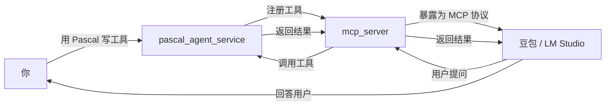

# pasAgent

**工业级 Pascal 智能体技术体系 —— 让 AI 学会用你的 Pascal 代码**

[](https://opensource.org/licenses/MIT)

---

> ## 🚀 新手用户看这里！
> 
> 如果你是**第一次接触智能体和 LLM**，不想折腾编译和环境配置，**直接下载预编译包**即可开始体验：
> 
> 👉 **[下载预编译包（Pre-built Package）](https://github.com/PassByYou888/LingoFuse-pasAgent/releases/tag/pre_build)**
> 
> 下载后解压，按照 [MCP_SERVER_DOUBAO_GUIDE.md](MCP_SERVER_DOUBAO_GUIDE.md) 的说明操作，**10 分钟就能让 AI 调用你的第一个 Pascal 工具**。
> 
> 预编译包包含所有必需的可执行文件和动态库，开箱即用，无需安装任何开发环境。

---

## 🎯 这是什么？

**pasAgent** 是一套 **工业级 Pascal 智能体（Agent）技术体系**，它的核心使命是：**让你用 Pascal 写的代码，能被 AI 直接调用。**

传统上，AI（如豆包、LM Studio）只能调用 Python 或 JavaScript 写的工具。如果你想让自己积累多年的 Pascal 业务逻辑被 AI 使用，过去需要重写、封装、搭 HTTP 服务……而现在，pasAgent 让你**直接用 Pascal 写工具函数，AI 就能像调用内置功能一样调用它。**

### 这个体系包含什么？

| 组件 | 作用 | 谁需要关心 |
|------|------|-----------|
| **Pascal 智能体服务端** | 把你的 Pascal 函数注册成“工具”，供 AI 调用 | 写 Pascal 代码的你 |
| **MCP 协议网关** | 把工具翻译成 AI 能听懂的语言（MCP 协议） | 部署服务的你 |
| **代码生成器** | 从 Pascal 声明一键生成工具定义，免手写 JSON | 开发阶段的你 |
| **LLM 流式服务** | 在本地跑大语言模型，让 AI 不依赖网络 | 想完全离线的你 |
| **健康检查 & 调试工具** | 确保一切正常运行 | 运维阶段的你 |

**说白了：这是一套让“Pascal 老代码”能接入“AI 新世界”的完整解决方案。**

---

## 🚀 快速了解：新手第一次接触智能体的完整流程

下面是一个**零基础新手**走通“让 AI 调用我写的 Pascal 代码”的完整路径。你不需要提前理解任何概念，跟着走就行。

### 第 0 步：获取预编译包（新手推荐）

**如果你是新手，强烈建议直接下载预编译包**，跳过所有编译和环境配置步骤：

1. 访问 [预编译包发布页](https://github.com/PassByYou888/LingoFuse-pasAgent/releases/tag/pre_build)
2. 下载最新版本的压缩包
3. 解压到任意目录（建议 `C:\pasAgent`）

预编译包包含所有必需的可执行文件（EXE）和动态库（DLL），**解压即用，无需安装 Python、Free Pascal 或任何开发工具**。

> **如果你是从源码开始**，可以参考 [Build_Guide.md](Build_Guide.md) 自行编译，或查看 [Dependency_Installation_Guide.md](Dependency_Installation_Guide.md) 安装依赖。

### 第 1 步：启动“工具管理服务”

打开命令行（CMD），进入你的文件夹，运行：

```cmd
pascal_agent_service.exe
```

这个程序会一直运行，它的工作是：**管理所有已注册的工具，等 AI 来调用**。看到 `[MAIN] Service is running.` 就说明成功了——**这个窗口不要关**。

### 第 2 步：注册几个示例工具

再开一个 CMD 窗口，运行：

```cmd
pascal_agent_api.exe
```

这个程序会把 **加、减、乘、除** 四个工具注册到管理服务中。看到四条 `[OK] Registered tool: xxx` 就说明成功了——**这个窗口也不要关**。

### 第 3 步：生成配置文件（一次性操作）

再开一个 CMD 窗口，运行：

```cmd
mcp_server.exe --generate-configs
```

它会生成一个 `mcp_configs` 文件夹，里面是为不同 AI 客户端（豆包、LM Studio、Claude 等）准备的配置文件。**这一步只需要做一次**。

### 第 4 步：启动 MCP 网关

再开一个 CMD 窗口，运行：

```cmd
mcp_server.exe
```

这个程序是**翻译官**：它把 Pascal 工具“翻译”成 AI 能理解的语言。看到工具列表被打印出来，就说明成功了——**这个窗口也要一直开着**。

### 第 5 步：告诉 AI 客户端去哪里找工具

现在打开你的 AI 客户端（豆包、LM Studio 等），把 `mcp_configs` 里对应的配置文件内容粘贴进去。**具体怎么操作？** 打开 [MCP_SERVER_DOUBAO_GUIDE.md](MCP_SERVER_DOUBAO_GUIDE.md)，里面有每一步的截图指引——**不懂就问豆包，拍照发过去，它会指导你。**

### 第 6 步：开始使用

重启 AI 客户端，你应该能在工具列表里看到 `add`、`sub`、`mul`、`div` 四个工具了。随便试一个，比如对 AI 说“帮我算 5 + 7”，AI 就会调用你 Pascal 写的加法函数，返回 12。

---

## 🏗️ 这个体系到底怎么工作的？



**一句话总结：你用 Pascal 写的函数 → 被 mcp_server 翻译 → AI 客户端看到的是标准工具 → AI 调用时，实际执行的是你的 Pascal 代码。**

---

## 📁 项目结构（你只需要关注这些）

```
src/
├── pascal_agent_service.lpr     # 工具管理服务（Pascal 源码）
├── pascal_agent_api.lpr         # 工具注册示例（Pascal 源码）
├── lingofuse_helper.pas         # Pascal 辅助库（你写工具时会用到）
├── lingofuse_import.pas         # 底层 C 绑定（一般不用动）
├── mcp_server.py                # MCP 网关（Python 源码）
├── mcp_proxy.py                 # 调试代理（用于排查问题）
├── generate_agent_json.py       # 配置生成器
├── tools/                       # 开发工具
│   └── pascal_decl_to_mcp.lpr   # 代码生成器（Pascal → MCP 定义）
├── llm-service/                 # LLM 流式服务（可选）
├── CreateHealthCheck/           # 健康检查工具（可选）
├── lingofuse/                   # Python 核心绑定（一般不用动）
└── *.md                         # 各类文档
```

**你只需要关心：**
- `pascal_agent_service.lpr` —— 你要改的服务端源码（加你自己的工具）
- `lingofuse_helper.pas` —— 写工具时用到的辅助函数
- `tools/pascal_decl_to_mcp.lpr` —— 如果你不想手写 JSON，用这个自动生成

---

## ⚡ 用 Pascal 写自己的第一个工具

假设你有一个 Pascal 函数，想把它变成 AI 可调用的工具。只需要三步：

### 1. 在 `pascal_agent_service.lpr` 里加一个回调函数

```pascal
// 一个简单的乘法工具
procedure do_mul(Trigger: Pointer; Input, Output: TDataHnd); cdecl;
var
  a, b, prod: integer;
begin
  a := LF_ReadInt32(Input);   // 读第一个参数
  b := LF_ReadInt32(Input);   // 读第二个参数
  prod := a * b;              // 执行逻辑
  LF_WriteInt32(Output, prod); // 写回结果
end;
```

### 2. 在启动代码里注册它

```pascal
App.RegisterCall('mul', 'Multiply two integers', nil, @do_mul);
```

### 3. 重新编译、重启服务

运行 `fpc pascal_agent_service.lpr` 重新编译，然后重启 `pascal_agent_service.exe`。mcp_server 会自动发现新工具，AI 客户端刷新后就能用了。

**不需要写 JSON Schema，不需要改配置文件，不需要搭 HTTP 服务**——就是写 Pascal，然后注册，完事。

---

## 🤖 代码生成器：更懒的办法

如果你不想手动写注册代码，可以用 `tools/pascal_decl_to_mcp.exe`：

```cmd
pascal_decl_to_mcp.exe --input my_utils.pas --output tools.json
```

它会解析你的 Pascal 源码，自动生成 MCP 工具定义 JSON，你可以直接用 `register_agent` 注册，或者直接喂给 mcp_server。

**这让你能专注于写业务逻辑，让工具自动生成注册代码。**

---

## 📚 完整文档

| 文档 | 适合谁 | 内容 |
|------|--------|------|
| [MCP_SERVER_DOUBAO_GUIDE.md](MCP_SERVER_DOUBAO_GUIDE.md) | 完全零基础新手 | 从零开始的图文教程，每一步都配有解释，**适合一边看一边操作** |
| [Build_Guide.md](Build_Guide.md) | 需要自己编译的开发者 | 完整的编译指南（Pascal + Python） |
| [Dependency_Installation_Guide.md](Dependency_Installation_Guide.md) | 需要安装依赖的开发者 | 所有依赖包的安装说明 |
| [Qwen2.5-7B-Instruct-Q4_K_M.md](Qwen2.5-7B-Instruct-Q4_K_M.md) | 想跑本地 LLM 的用户 | 模型下载与部署指南 |
| [pascal_code_rule.md](pascal_code_rule.md) | Pascal 工具开发者 | Pascal 编码规范与工具开发指南 |
| [LingoFuse_MCP_Server_Implementation_Memo.md](LingoFuse_MCP_Server_Implementation_Memo.md) | 想了解内部实现 | 技术实施备忘 |

---

## ❓ 常见问题

**Q：我需要懂 MCP 协议吗？**

A：**不需要。** 你只需要写 Pascal 代码，mcp_server 自动处理协议转换。

**Q：这个体系只支持豆包吗？**

A：**支持所有兼容 MCP 协议的 AI 客户端**，包括豆包、LM Studio、Claude Desktop、Continue.dev、Jan、DeepSeek 等。

**Q：只能做加减乘除吗？**

A：**当然不是。** 你可以注册任何 Pascal 函数——数据库查询、文件处理、硬件控制、工业自动化……只要你能用 Pascal 写，就能被 AI 调用。

**Q：需要联网吗？**

A：**不需要。** 所有组件都在本地运行，数据不出内网。你也可以选装 LLM 服务实现完全离线。

**Q：我是新手，能成功吗？**

A：**能。** 下载[预编译包](https://github.com/PassByYou888/LingoFuse-pasAgent/releases/tag/pre_build)，按照 [MCP_SERVER_DOUBAO_GUIDE.md](MCP_SERVER_DOUBAO_GUIDE.md) 的步骤操作，每一步都有解释。遇到不懂的，拍照问豆包，它会手把手教你。

**Q：我是老手，想深入定制？**

A：看源码。`pascal_agent_service.lpr` 和 `lingofuse_helper.pas` 是起点，全部开源，MIT 协议，随便改。

---

## 👤 关于作者

**老张（QQ: 600585）**

专注 Pascal 生态十余年。看不惯老代码被新技术抛弃，做了这套让 Pascal 接入 AI 的完整方案。欢迎反馈、建议、PR。

---

## 📄 许可证

**MIT** —— 自由使用、修改、分发。

---

*项目始于 2026 年，持续迭代中。有问题提 Issue，急事加 Q。*