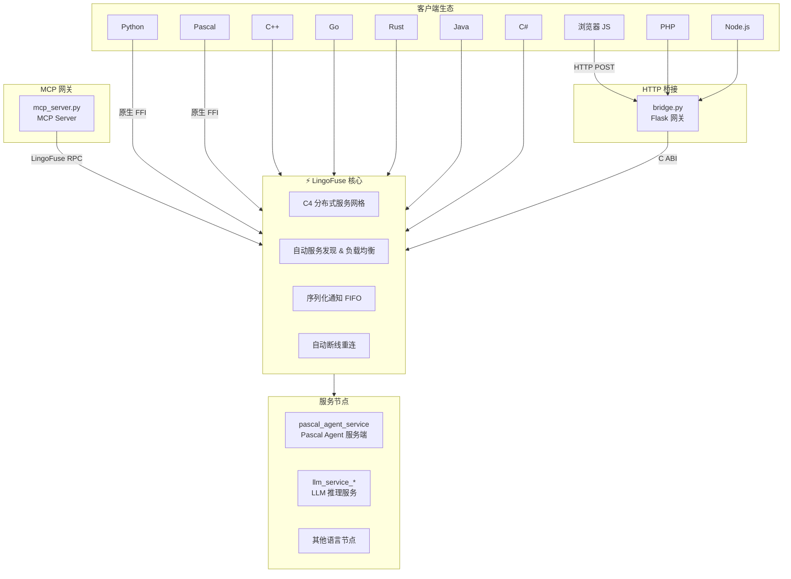

# LingoFuse-pasAgent

**LingoFuse 的 Pascal Agent 工具链 —— 智能体时代的 Pascal 服务网格接入套件**

[](https://opensource.org/licenses/MIT)

---

## 🎯 这是什么？

**LingoFuse-pasAgent** 是 [LingoFuse](https://github.com/PassByYou888/LingoFuse) 的 **Pascal Agent 工具链分支**，提供了一套开箱即用的 **Pascal 智能体服务端** 和 **MCP（Model Context Protocol）网关** 实现。

LingoFuse 是一个面向**智能体（Agent）**和**全栈系统**的**分布式 RPC 框架**，让 Python、Pascal、C++、Go、Rust、Java、C#、Node.js、PHP、浏览器 JavaScript 等十几种语言编写的服务能够互相调用，就像调用本地函数一样简单。**不需要写 IDL，不需要生成桩代码，不需要搭 HTTP 服务**——你只需要引用一个库，用你熟悉的语言写几行代码，你的函数就“全栈通杀”了。

本仓库专注于 **Pascal 生态的智能体接入**，提供：

- 🏗️ **Pascal Agent 服务端**（`pascal_agent_service`）：注册工具、接收日志、动态管理工具列表
- 🔧 **Pascal Agent API 示例**（`pascal_agent_api`）：展示如何动态注册工具到后端
- 🌉 **MCP Server 网关**（`mcp_server`）：将 LingoFuse 后端工具暴露为 MCP 协议，对接豆包、LM Studio、Claude Desktop 等 AI 客户端
- 🔌 **HTTP Bridge**（`bridge`）：通用 HTTP 透传网关，任何能发 HTTP 请求的语言都能接入
- 🤖 **LLM 流式服务**（`llm_service_*`）：本地大模型推理服务，支持 CPU/CUDA/Vulkan 多后端

---

## 🚀 核心特性

| 特性 | 说明 |
|------|------|
| **10+ 语言绑定** | Python、Pascal、C++、Go、Rust、Java、C#、Node.js、PHP、Web.js |
| **⚡ 高性能** | 同机 IPC 延迟 < 1ms，吞吐 10,000+ 请求/秒 |
| **双通信模式** | TCP（跨机器）+ IPC（同机微秒级） |
| **自动服务发现 & 负载均衡** | 基于 C4 网格，节点即插即用，请求自动分发 |
| **零拷贝传输** | 直接访问内部缓冲区，无二次复制 |
| **双调用模式** | 同步 Call（请求-响应）+ 异步 Notify（单向通知） |
| **Sequenced Notify** | FIFO 有序交付，支持大数据分片流式传输 |
| **自动内存回收** | 数据句柄闲置 5 分钟自动释放 |
| **部署模式** | 节点无序启动，弹性伸缩零协调 |
| **HTTP 桥接** | 自带 Flask 网关，Web 生态无缝接入 |
| **MCP 协议支持** | 对接豆包、LM Studio、Claude Desktop 等 AI 客户端 |

### 性能对比

| 方案 | 延迟 (IPC) | 吞吐量 | 服务发现 | 负载均衡 | 顺序保证 |
|------|------------|--------|----------|----------|----------|
| **LingoFuse** | **< 1 ms** | **12k+/s** | ✅ 内置 | ✅ 内置 | ✅ FIFO |
| gRPC | ~5-8 ms | ~3k/s | ❌ 需 etcd | ❌ 需 LB | ❌ |
| REST | ~10-20 ms | ~1k/s | ❌ 需 Nginx | ❌ 需 Nginx | ❌ |

**LingoFuse 比 gRPC 快 5-8 倍，比 REST 快 10-20 倍。**

---

## 🏗️ 架构



---

## 📁 项目结构

```
src/
├── mcp_server.py              # MCP 网关核心（对接豆包/LM Studio）
├── mcp_proxy.py               # stdio 调试代理
├── bridge.py                  # HTTP 透传网关
├── llm_service.py             # LLM 流式推理服务
├── generate_agent_json.py     # MCP 客户端配置生成器
├── language_middleware.py     # 多语言中间件
├── pascal_agent_service.lpr   # Pascal Agent 服务端（工具提供者）
├── pascal_agent_api.lpr       # Pascal Agent API 示例（动态注册工具）
├── lingofuse/                 # Python 核心绑定
│   ├── _lf_native.py          # ctypes 底层绑定
│   ├── core.py                # DataHandle + App RAII 封装
│   ├── server.py              # @expose 装饰器服务端
│   ├── client.py              # C4 动态客户端
│   └── bridge.py              # HTTP 网关
├── CreateHealthCheck/         # 健康检查工具（Pascal）
├── build_mcp_server.ps1       # PyInstaller 打包脚本
├── build_pascal_agent.bat     # Pascal 编译脚本
└── *.md                        # 各类文档
```

---

## ⚡ 快速上手

### 1. 启动 Pascal Agent 服务端（工具提供者）

```bash
# 启动后端服务，注册到 ipc:agent
.\pascal_agent_service.exe
```

该服务会注册三个 API：
- `agent_main`：返回工具列表
- `agent_log`：接收日志消息
- `register_agent`：动态注册工具

### 2. 启动 MCP 网关（HTTP 模式，推荐）

```bash
# HTTP 模式，供豆包等远程客户端调用
.\mcp_server.exe --transport http --host 0.0.0.0 --port 8000
```

### 3. 配置豆包客户端

使用 `mcp_server.exe --generate-configs` 生成配置文件，或直接配置豆包的 MCP 服务器地址为：

```
http://<你的IP>:8000/mcp
```

豆包将自动发现并列出所有后端工具。

### 4. Python 服务端（7 行）

```python
from lingofuse import Server

app = Server("Calc")

@app.expose("add")
def add(a, b):
    return a + b

app.start_multi(["ipc:calc", "0.0.0.0:9898"])
input("按回车退出...\n")
app.stop()
```

### 5. Python 客户端（3 行）

```python
from lingofuse import C4

c = C4("Calc", "ipc:calc")
print(c.add(10, 20))  # 30
```

### 6. Pascal 客户端调 Python 服务

```pascal
program client;
uses lingofuse_helper;

function Add(a,b: integer): integer;
var Data, Res: TDataHnd;
begin
  Data := TDataHnd.Create('add');
  Data.WriteInt32(a).WriteInt32(b);
  Res := LF.CallApp('Calc', Data, 3000);
  if Res.Size > 0 then Result := Res.ReadInt32
  else Result := 0;
  Data.Free; Res.Free;
end;

begin
  LF.ResetPrepare;
  LF.PrepareClient('ipc:calc', nil);
  if LF.PrepareDone then
    WriteLn('10 + 20 = ', Add(10,20));
  LF.Shutdown;
end.
```

**看到没？Python 写的服务，Pascal 直接调——这就是 LingoFuse。**

---

## 🔧 编译指南

### 编译所有 EXE（推荐）

所有组件均已提供预编译 EXE，直接运行即可。如需从源码编译：

```powershell
# Python → EXE（需 PyInstaller）
.\build_mcp_server.ps1

# Pascal → EXE（需 Free Pascal）
.\build_pascal_agent.bat
```

详细编译指南请参考 [Build_Guide.md](Build_Guide.md)。

### 依赖安装

```bash
# Python 依赖
pip install fastmcp pydantic flask

# Pascal 编译环境
# 安装 Free Pascal 3.2+ 或 Lazarus
```

详细依赖说明请参考 [Dependency_Installation_Guide.md](Dependency_Installation_Guide.md)。

---

## 🤖 LLM 流式服务

LingoFuse 自带流式 LLM 服务示例，将 `llama-cpp-python` 的 token 流通过 `Sequenced_Notify` 推送给客户端：

```bash
# 启动服务（需模型文件同目录）
.\llm_service_cpu.exe

# 或使用 CUDA 加速版本
.\llm_service_cu124.exe

# 客户端接收流式输出
python llm_test.py --content "print('Hello')" --prompt "解释"
```

模型文件需为 `qwen2.5-7b-instruct-q4_k_m.gguf`，放置于 EXE 同目录。下载指南请参考 [Qwen2.5-7B-Instruct-Q4_K_M.md](Qwen2.5-7B-Instruct-Q4_K_M.md)。

---

## 🌉 HTTP 桥接

```bash
.\bridge.exe --endpoint ipc:calc --app Calc --port 8081
```

然后任意 HTTP 客户端都能调用：

```bash
curl -X POST http://127.0.0.1:8081/Calc/add -d '[10,20]'
# 返回: 30
```

---

## 📚 文档

| 文档 | 说明 |
|------|------|
| [MCP_SERVER_DOUBAO_GUIDE.md](MCP_SERVER_DOUBAO_GUIDE.md) | MCP Server 部署与豆包接入指南 |
| [Build_Guide.md](Build_Guide.md) | 完整编译指南 |
| [Dependency_Installation_Guide.md](Dependency_Installation_Guide.md) | 依赖包安装指南 |
| [Qwen2.5-7B-Instruct-Q4_K_M.md](Qwen2.5-7B-Instruct-Q4_K_M.md) | Qwen 模型下载与部署指南 |
| [LingoFuse_MCP_Server_Implementation_Memo.md](LingoFuse_MCP_Server_Implementation_Memo.md) | 实施备忘与技术细节 |

---

## 🔗 相关项目

- **[LingoFuse](https://github.com/PassByYou888/LingoFuse)** —— 本项目的上游，LingoFuse 核心框架

---

## ❓ 常见问题

**Q：克隆仓库后编译失败？**

A：请确认你是否使用了 `--recursive` 开关克隆。本仓库包含子模块，克隆时必须使用 `--recursive` 开关，否则会导致编译失败：

```bash
git clone --recursive https://github.com/PassByYou888/LingoFuse-pasAgent.git
```

如果已经克隆但忘记加 `--recursive`，可以执行以下命令补全：

```bash
git submodule update --init --recursive
```

**Q：Python 绑定需要编译吗？**

A：不需要。纯 Python + ctypes，直接使用即可。

**Q：`generate_app_name()` 什么时候调？**

A：**必须在 `PrepareDone()` 成功后调用**，否则生成的名称缺少隧道 ID。

**Q：回调里能调 `LF_Call` 吗？**

A：**绝对不行！** 会死锁。想远程调用，另开线程。

**Q：想多个应用绑到同一个地址？**

A：设 `Overlap_Connection=True`，然后反复 `PrepareClient`。

**Q：动态库找不到？**

A：把 `LingoFuse64.dll` 放到当前目录或加到 PATH。

**Q：听说代码注释很全，能喂给 AI？**

A：能。`lingofuse_import.pas` 每个函数都有完整注释，把全部代码喂给 AI，AI 能解析出结构化接口描述，然后由代码生成器一键产出多语言客户端——**比你手动写快 100 倍，还不会出错**。

---

## 👤 关于作者

**老张（QQ: 600585）**

看不惯跨语言调用得写一箩筐胶水代码，干脆撸了 LingoFuse。欢迎来撩、来喷、来 PR——**Star 是最好的催更。**

---

## 📄 许可证

**MIT** ——拿去用，拿去改，拿去卖，都不用来谢我。

---

*项目始于 2026 年，持续进化中。有问题提 Issue，急事加 Q。*