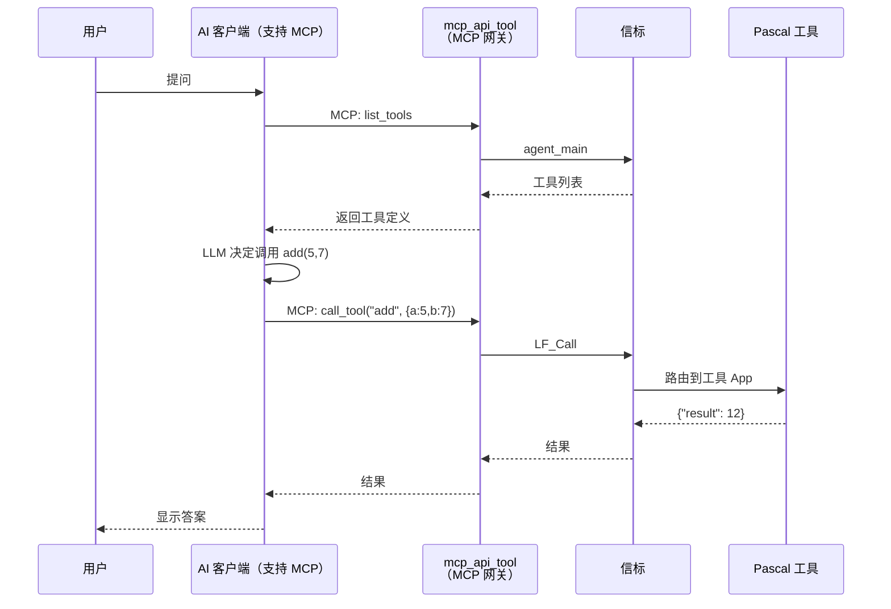
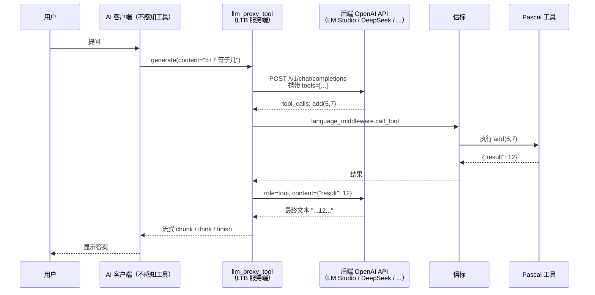
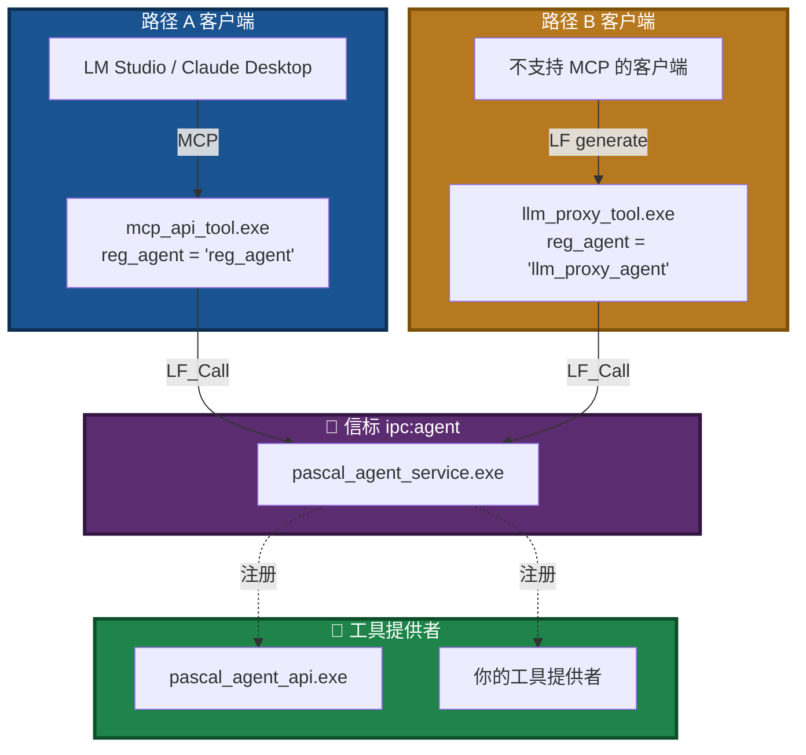
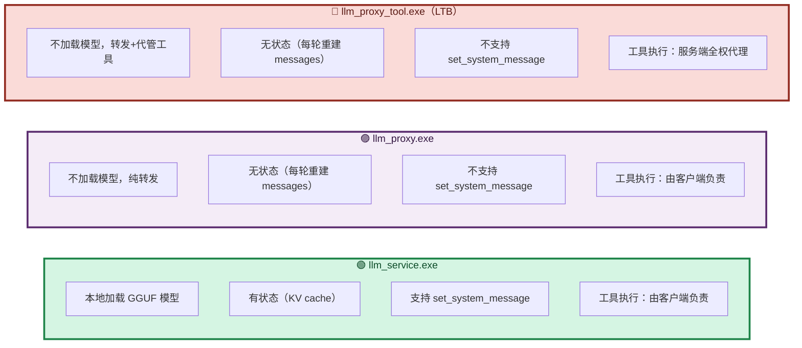
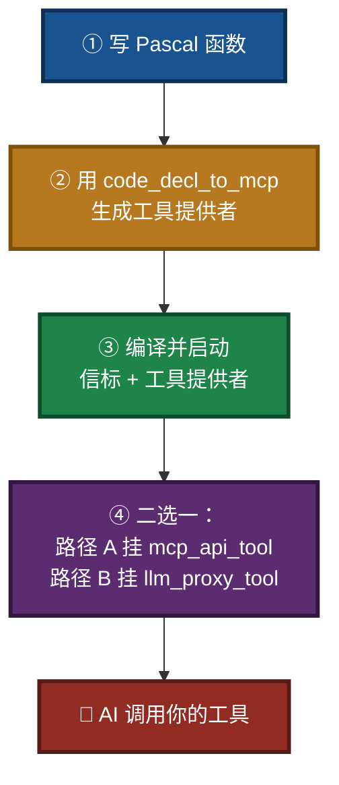
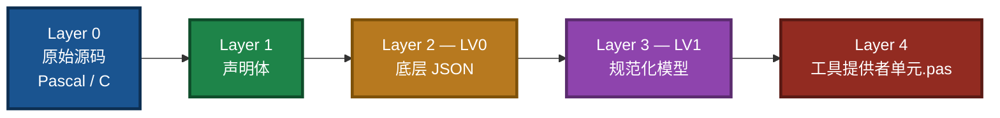
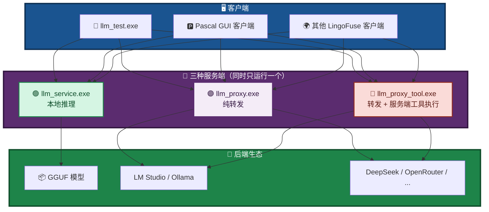
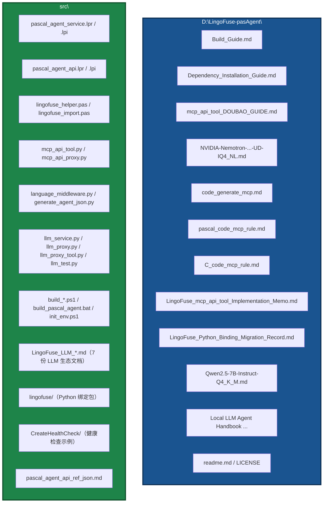

# pasAgent

**工业级 Pascal 智能体技术体系 —— 让 AI 学会用你的 Pascal 代码**

[](https://opensource.org/licenses/MIT)

---

> ## 🚀 新手用户看这里！
>
> 不想折腾编译和环境配置？**直接下载预编译包**：
>
> 👉 **[下载预编译包（Pre-built Package）](https://github.com/PassByYou888/LingoFuse-pasAgent/releases/tag/pre_build)**
>
> 解压 → 按 **[mcp_api_tool_DOUBAO_GUIDE.md](mcp_api_tool_DOUBAO_GUIDE.md)** 操作 → **10 分钟让 AI 调用你的第一个 Pascal 工具**。
>
> 该指南已包含完整的 LLM 服务启动步骤。若想先理解整体闭环，请继续往下读。

---

## 🎯 一句话定位

> **让你用 Pascal 写的函数，被 AI 像内置功能一样直接调用。**

不需要懂 MCP 协议，不需要写 JSON Schema，不需要搭 HTTP 服务。

---

## 🏗️ 完整闭环：从 Pascal 函数到 AI 调用

pasAgent 主链路有三段，**工具执行的位置**有两种方案（路径 A / 路径 B）。下面按**数据流**拆开画，避免一张图过载。

### 图 1：三段主链路


### 图 2：路径 A（客户端侧工具执行）—— 经典 MCP 闭环

适用：**AI 客户端本身支持 MCP 协议**（LM Studio、Claude Desktop、Continue.dev、Jan、DeepSeek Chat 等）。



**要点**：
- 工具执行由 **AI 客户端发起**（客户端看到 MCP 工具列表，自己决定调哪个）。
- `mcp_api_tool` 只做 MCP ↔ LingoFuse 的翻译。
- LLM 推理可以由 AI 客户端自己负责（LM Studio 自带），也可以由 `llm_service` / `llm_proxy` 提供。

### 图 3：路径 B（服务端侧工具执行）—— LTB 闭环

适用：**AI 客户端不支持 MCP 工具**（部分 Pascal GUI 客户端、纯文本前端），或**希望服务端统一管理工具调用循环**的场景。



**要点**：
- AI 客户端**完全不知道工具体系的存在**——它只调 `generate`，收到 `chunk`/`think`/`finish` 流。
- 工具发现和执行**全在 LTB 内部**完成。
- 后端 OpenAI API 只需要能返回标准的 `tool_calls`。

### 图 4：两条路径共存



**共存关键**：`mcp_api_tool` 用 `--reg-agent-app reg_agent`；`llm_proxy_tool` 用 `--mcp-reg-agent-app llm_proxy_agent`。二者注册名不同，可同时运行，共享同一信标。

### 图 5：三种 LLM 服务端（同一时刻只运行一个）



**三者默认都占用 `ipc:llm_service` / `LLM_Service`，同时只能运行一个**；要共存必须改 `--endpoint` + `--app-name`。

**如何选**：

| 你的情况 | 用哪个 |
|----------|--------|
| 想在本地跑模型（有 GGUF 文件） | `llm_service.exe` |
| 已有 LM Studio / Ollama / 云 API，只想转发 | `llm_proxy.exe` |
| 客户端不支持 MCP 工具，或希望工具调用由服务端统一管理 | `llm_proxy_tool.exe`（LTB） |

**核心机制**：你写的 Pascal 函数 → 通过 `code_decl_to_mcp` 生成工具提供者 → 注册到信标 → AI 客户端（路径 A 通过 `mcp_api_tool`，或路径 B 通过 `llm_proxy_tool`）看到工具 → **实际执行你的 Pascal 代码**。

---

## 🚀 四步上手



**完整图文教程**：[mcp_api_tool_DOUBAO_GUIDE.md](mcp_api_tool_DOUBAO_GUIDE.md)

---

## 🧩 代码生成器 5 层透明链



**每一层都可以**：独立查看 · 编辑 · 导出 · 喂给 LLM 辅助修正 · 出错时回退重走。  
**主链路完全确定性**——不依赖 LLM 随机性，结果可复现。

详细说明：[code_generate_mcp.md](code_generate_mcp.md)

输入输出规范（解析契约）：
- Pascal 声明规范：[pascal_code_mcp_rule.md](pascal_code_mcp_rule.md)
- C 声明规范：[C_code_mcp_rule.md](C_code_mcp_rule.md)

> **注意**：代码生成器 `code_decl_to_mcp.exe` 的**源码不在本仓库中**，本仓库仅提供使用手册与声明规范。请从项目的预编译发布页获取可执行文件。

---

## 🌟 LLM 生态体系（三种服务端 + 多客户端）

pasAgent 闭环中 **"AI 的大脑"** 由 LLM 生态体系提供。它由**三种兄弟服务端**、**多种客户端**、**完整的协议与能力发现机制**组成。

### 图 6：LLM 生态全景



### 📚 LLM 生态文档索引

> **所有 LLM 相关文档都在 [`src/`](src/) 目录下。**

| 文档 | 说明 | 适合谁 |
|------|------|--------|
| 🌐 **[LingoFuse_LLM_Ecosystem_User_Guide.md](src/LingoFuse_LLM_Ecosystem_User_Guide.md)** | **闭环架构与生态总览**（入口文档） | 想理解全貌的人 |
| ⚙️ **[LingoFuse_LLM_Service_CLI_guide.md](src/LingoFuse_LLM_Service_CLI_guide.md)** | `llm_service.exe` 命令行完整手册 | 部署本地推理的人 |
| ⚙️ **[LingoFuse_LLM_Proxy_CLI_Guide.md](src/LingoFuse_LLM_Proxy_CLI_Guide.md)** | `llm_proxy.exe` 命令行完整手册 | 转发到外部后端的人 |
| 📋 **[LingoFuse_LLM_Proxy_Compatibility_Guide.md](src/LingoFuse_LLM_Proxy_Compatibility_Guide.md)** | 支持的 129+ OpenAI 兼容后端清单（LTB 同样适用） | 想知道能接什么的人 |
| 🚨 **[LingoFuse_LLM_Pitfalls_For_AI.md](src/LingoFuse_LLM_Pitfalls_For_AI.md)** | 踩坑大全，症状-根因-正确做法 | 遇到问题的人 |
| 📊 **[LingoFuse_LLM_Service_Work_Summary.md](src/LingoFuse_LLM_Service_Work_Summary.md)** | 版本演进与架构决策（历史参考） | 想了解内部实现的人 |
| 📦 **[llama_cpp_python_guide.md](src/llama_cpp_python_guide.md)** | `llama-cpp-python` 安装与使用 | 装依赖的人 |
| 📝 **[pascal_agent_api_ref_json.md](src/pascal_agent_api_ref_json.md)** | `agent_main` / `register_agent` JSON 结构详解 | 开发工具提供者的人 |

---

## 📦 组件清单

| 组件 | 作用 | 谁关心 |
| ----------------------- | ------------------------------ | -------------- |
| **Pascal 信标**（`pascal_agent_service.exe`） | 登记和发现所有工具 | 部署服务的你 |
| **Pascal 工具提供者**（如 `pascal_agent_api.exe`） | 把你的 Pascal 函数注册为工具 | 写 Pascal 的你 |
| **MCP 协议网关**（`mcp_api_tool.exe`） | 路径 A：把工具翻译成 MCP 协议给 AI 客户端 | 用 MCP 客户端的你 |
| **MCP 调试代理**（`mcp_api_proxy.exe`） | stdio 通信的透明转发 + 日志记录 | 需要排查 MCP 握手的你 |
| **代码生成器**（`code_decl_to_mcp.exe`） | 从 Pascal / C 声明一键生成工具提供者单元 | 开发阶段的你 |
| **LLM 本地服务**（`llm_service.exe`） | 本地跑大模型，完全离线 | 想断网的你 |
| **LLM 纯转发**（`llm_proxy.exe`） | 转发到 LM Studio / Ollama / 云 API | 想用云端模型的你 |
| **LLM 工具桥**（`llm_proxy_tool.exe`，LTB） | 路径 B：转发 + **服务端代管工具执行** | 客户端不支持 MCP 的你 |
| **LLM 测试客户端**（`llm_test.exe`） | 命令行交互式 REPL，验证 LLM 服务 | 调试 LLM 的你 |
| **HTTP 桥接网关**（`bridge.exe`） | 让 Web 生态通过 HTTP 访问 LingoFuse 服务 | 用浏览器/Node/PHP 的你 |
| **健康检查**（`HealthCheck.exe`） | 快速验证编译环境和动态库是否就绪 | 首次部署的你 |

> **提示**：`code_decl_to_mcp.exe` 的源码不在本仓库中，请从预编译发布页获取。其余组件的源码均在 `src/` 目录下。

---

## 📁 项目结构



**你最需要关心的文件**：

- `src/pascal_agent_api.lpr` —— 算术工具示例，你的项目原型
- `src/pascal_agent_service.lpr` —— 信标源码
- `src/lingofuse_helper.pas` —— 写工具时的辅助函数
- `src/lingofuse/` —— LingoFuse Python 绑定包（编译时会打包）

---

## 📚 文档地图与阅读引导

### 第一步：新手入门

- 🎓 **[mcp_api_tool_DOUBAO_GUIDE.md](mcp_api_tool_DOUBAO_GUIDE.md)** —— 保姆级教程，零基础让 AI 调用第一个 Pascal 工具。

### 第二步：理解闭环

- 🌐 **[LingoFuse_LLM_Ecosystem_User_Guide.md](src/LingoFuse_LLM_Ecosystem_User_Guide.md)** —— 三种服务端、两条工具路径、能力发现机制全景。
- 🧠 **[Local LLM Agent Handbook CPU First, GPU Optional.md](Local%20LLM%20Agent%20Handbook%20CPU%20First%2C%20GPU%20Optional.md)** —— 智能体原理与本地 LLM 入门。

### 第三步：开发工具

- 📐 **[pascal_code_mcp_rule.md](pascal_code_mcp_rule.md)** —— Pascal 声明规范（解析契约）。
- 📐 **[C_code_mcp_rule.md](C_code_mcp_rule.md)** —— C 声明规范（解析契约）。
- ⚙️ **[code_generate_mcp.md](code_generate_mcp.md)** —— 代码生成器使用手册。
- 📝 **[pascal_agent_api_ref_json.md](src/pascal_agent_api_ref_json.md)** —— `agent_main` / `register_agent` 的 JSON 结构详解。

### 第四步：部署 LLM 与配置

- 🔨 **[Build_Guide.md](Build_Guide.md)** —— 编译 Pascal 与 Python 组件为 EXE（含 4 个 LLM EXE）。
- 📦 **[Dependency_Installation_Guide.md](Dependency_Installation_Guide.md)** —— 依赖安装与动态库部署。
- 🤖 **[NVIDIA-Nemotron-3.5-Lightning-30B-A3B-UD-IQ4_NL.md](NVIDIA-Nemotron-3.5-Lightning-30B-A3B-UD-IQ4_NL.md)** —— 推荐模型下载与部署。
- ⚙️ **[LingoFuse_LLM_Service_CLI_guide.md](src/LingoFuse_LLM_Service_CLI_guide.md)** —— LLM 服务命令行手册。
- ⚙️ **[LingoFuse_LLM_Proxy_CLI_Guide.md](src/LingoFuse_LLM_Proxy_CLI_Guide.md)** —— LLM 代理命令行手册。
- 📋 **[LingoFuse_LLM_Proxy_Compatibility_Guide.md](src/LingoFuse_LLM_Proxy_Compatibility_Guide.md)** —— 129+ 后端清单（LTB 亦适用）。
- 📦 **[llama_cpp_python_guide.md](src/llama_cpp_python_guide.md)** —— `llama-cpp-python` 安装。

### 第五步：深入与排错

- 📝 **[LingoFuse_mcp_api_tool_Implementation_Memo.md](LingoFuse_mcp_api_tool_Implementation_Memo.md)** —— MCP 网关实施备忘与坑点。
- 🚨 **[LingoFuse_LLM_Pitfalls_For_AI.md](src/LingoFuse_LLM_Pitfalls_For_AI.md)** —— LLM 生态踩坑大全。
- 📊 **[LingoFuse_LLM_Service_Work_Summary.md](src/LingoFuse_LLM_Service_Work_Summary.md)** —— LLM 工具链版本演进（历史参考）。
- 📊 **[LingoFuse_Python_Binding_Migration_Record.md](LingoFuse_Python_Binding_Migration_Record.md)** —— Python 绑定迁移与工作总结（历史参考）。

> **历史文档**：`Qwen2.5-7B-Instruct-Q4_K_M.md` 已不再作为默认模型，仅作历史参考。新项目请使用 NVIDIA Nemotron 模型。

---

## 🔧 运行前准备

pasAgent 所有组件都依赖 **LingoFuse 动态库**（`LingoFuse64.dll` / `liblingofuse.so`）。

```bash
git clone --recursive https://github.com/PassByYou888/LingoFuse.git
# 然后将 LingoFuse/Binary 目录加入系统 PATH
```

> **新手提示**：预编译包已内置所需动态库，**无需单独安装**。

### ⚠️ 首次运行缺少 DLL？别慌！

如果第一次运行时提示找不到 `LingoFuse64.dll` / `z_ipc_64.dll` 等动态库，而你又**不想自己编译 LingoFuse**：

👉 **直接去预编译包发布页找现成的**：[https://github.com/PassByYou888/LingoFuse-pasAgent/releases/tag/pre_build](https://github.com/PassByYou888/LingoFuse-pasAgent/releases/tag/pre_build)

那里已经打包好了所有需要的动态库，**下载解压即用**。

**⚠️ 运行环境依赖**：  
预编译 DLL 使用 **Visual Studio 2022** 编译，运行时需要安装 **VS2022 可再发行组件（VC++ Redistributable）**。  
请从微软官方下载并安装对应架构的版本：

- [VC++ Redistributable for Visual Studio 2022 (x86/x64)](https://learn.microsoft.com/en-us/cpp/windows/latest-supported-vc-redist?view=msvc-170)

---

## 🌟 关于开放性

**[pasAgent](https://github.com/PassByYou888/LingoFuse-pasAgent) 是 [LingoFuse](https://github.com/PassByYou888/LingoFuse) 的分支项目**，两者均为完全开放、非商业性的开源项目。

- ✅ **永久免费**：MIT 许可证
- ✅ **无商业捆绑**：无收费功能、无付费订阅
- ✅ **社区驱动**：决策来自社区贡献者
- ✅ **透明开发**：源码全公开，构建可复现

---

## ❓ 常见问题

| 问题 | 回答 |
| -------------------------- | --------------------------------------------------------------------------------------------------------------- |
| 需要懂 MCP 协议吗？ | **不需要**，写 Pascal 就行 |
| 只支持豆包吗？ | **支持所有 MCP 客户端**：豆包 / LM Studio / Claude / Continue.dev / Jan / DeepSeek |
| 只能做加减乘除吗？ | **任何 Pascal 函数**：数据库、文件、硬件、GUI…… |
| 需要联网吗？ | **不需要**，所有组件本地运行。若使用 `llm_proxy` / `llm_proxy_tool` 转发云端 API 则需联网 |
| 我的函数操作 UI 能接入吗？ | **能**，生成代码预留主线程同步接口 |
| 客户端不支持 MCP 工具怎么办？ | **用 `llm_proxy_tool.exe`**（路径 B），服务端会代管工具调用 |
| 三种 LLM 服务端能同时跑吗？ | **默认不能**（共享同一端点）。要共存须改 `--endpoint` + `--app-name` |
| 缺 DLL 又不想编译？ | **去[预编译包发布页](https://github.com/PassByYou888/LingoFuse-pasAgent/releases/tag/pre_build)下载，解压即用** |
| 如何让 AI 自动调用工具？ | 路径 A：启动 `mcp_api_tool`；路径 B：启动 `llm_proxy_tool` |
| LLM 体系文档在哪里？ | 全部在 **[`src/`](src/)** 目录下 |
| 代码生成器的源码在哪？ | **不在本仓库中**，本仓库仅提供手册。请从预编译发布页获取 `code_decl_to_mcp.exe` |

---

## 👤 关于作者

**老张（QQ: 600585）**

看不惯跨语言调用得写一箩筐胶水代码，干脆撸了 LingoFuse；又看不惯 Pascal 老代码接不进 AI 时代，顺手撸了 pasAgent。

欢迎反馈、建议、PR。

---

## 📄 许可证

**MIT** —— 自由使用、修改、分发。

---

*项目始于 2026 年，持续迭代中。有问题提 Issue，急事加 Q。*