# LingoFuse LLM 生态体系使用指南

> **文档名**：`LingoFuse_LLM_Ecosystem_User_Guide.md`  
> **版本**：v4.1  
> **最后更新**：2026-09-14  
> **适用组件**：`llm_service.exe`、`llm_proxy.exe`、`llm_proxy_tool.exe`、`llm_test.exe`、Pascal 客户端  
> **相关文档**（同目录）：
> - LLM 服务命令行手册：`LingoFuse_LLM_Service_CLI_guide.md`
> - LLM 代理命令行手册：`LingoFuse_LLM_Proxy_CLI_Guide.md`
> - 代理兼容性指南：`LingoFuse_LLM_Proxy_Compatibility_Guide.md`
> - 踩坑大全：`LingoFuse_LLM_Pitfalls_For_AI.md`
> - 版本演进总结：`LingoFuse_LLM_Service_Work_Summary.md`
> - llama-cpp-python 安装：`llama_cpp_python_guide.md`

**本次更新（v4.1）** 修正内容：
- 第六章「客户端详解」中，明确 `llm_client.pas` / `llm_tool_frm.pas` 属于 **LingoFuse 核心仓库**，本仓库不含其源码。
- 第九章「典型使用场景」场景 4「跨机部署」中的 `llm_tool.exe` 修正为「Pascal GUI 客户端（内置 `llm_client.pas`，需从核心仓库获取）」。
- 第十章「故障排查」中的 `P0-1` / `P0-4` / `P6-3` / `P6-4` / `P7-1` 等编号补充说明：这些是 `LingoFuse_LLM_Pitfalls_For_AI.md` 中的条目编号。
- 第五章 5.5「关键参数速查」补入 `llm_proxy_tool` 的 `--enable-tools` / `--no-tools` 在 mindmap 中的显式呈现（此前只列了部分参数）。
- 图 1「生态全景」调整布局，将 `B1`（C4 二进制 RPC）与「三种服务端选一」的关系显式标注为「选一」，避免误读为三种可同时使用。
- 12 章「文档索引」明确本仓库 / 核心仓库归属。

---

## 阅读引导

本文档是 LingoFuse LLM 生态的**全局参考**。建议按以下顺序阅读：

1. **想快速了解全貌** → 读第一章「体系全景」。
2. **想选一个服务端** → 读第二章「三种服务端」。
3. **想理解两条工具路径** → 读第三章「两条工具执行路径」。
4. **想搭起来跑** → 读第四章「快速开始」。
5. **想了解细节** → 读第五、六章「服务端详解」「客户端详解」。
6. **想知道协议和能力发现** → 读第七、八章。
7. **想解决具体问题** → 直接读第十章「故障排查」，或翻同目录 `LingoFuse_LLM_Pitfalls_For_AI.md`。
8. **想了解版本演进** → 读同目录 `LingoFuse_LLM_Service_Work_Summary.md`。

如果只想尽快跑通，跳到第四章即可。

---

## 一、体系全景

LingoFuse LLM 生态是一套跨语言、流式、多会话的大模型调用方案。它把大模型能力封装成 **LingoFuse 服务端**，任何支持 LingoFuse 的客户端都能像调用本地函数一样调用大模型，并实时接收流式输出。

**两种工具执行模式**并行存在：

- **路径 A（客户端侧工具执行）**：AI 客户端自己支持 MCP 协议、自己管理工具调用循环。LLM 服务只负责推理。工具由 `mcp_api_tool.exe` 翻译成 MCP 协议暴露给客户端。
- **路径 B（服务端侧工具执行）**：AI 客户端只发 `generate`，完全不知道工具存在。`llm_proxy_tool.exe`（LTB）代管整个工具调用循环，直到最终文本答案才返回客户端。

为避免一张图信息过载，按**层次**拆分为三张小图。

### 图 1：生态全景（客户端 / 核心 / 服务端 / 后端）

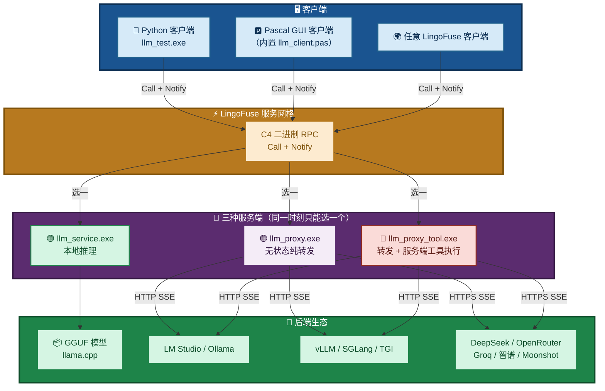
```mermaid
flowchart TB
    subgraph CLIENTS["🖥️ 客户端"]
        A1["🐍 Python 客户端<br/>llm_test.exe"]
        A2["🅿️ Pascal GUI 客户端<br/>（内置 llm_client.pas）"]
        A3["🌍 任意 LingoFuse 客户端"]
    end

    subgraph CORE["⚡ LingoFuse 服务网格"]
        B1["C4 二进制 RPC<br/>Call + Notify"]
    end

    subgraph SERVERS["🎯 三种服务端（同一时刻只能选一个）"]
        C1["🟢 llm_service.exe<br/>本地推理"]
        C2["🟣 llm_proxy.exe<br/>无状态纯转发"]
        C3["🔴 llm_proxy_tool.exe<br/>转发 + 服务端工具执行"]
    end

    subgraph BACKENDS["🔌 后端生态"]
        D1["📦 GGUF 模型<br/>llama.cpp"]
        D2["LM Studio / Ollama"]
        D3["vLLM / SGLang / TGI"]
        D4["DeepSeek / OpenRouter<br/>Groq / 智谱 / Moonshot"]
    end

    A1 -->|"Call + Notify"| B1
    A2 -->|"Call + Notify"| B1
    A3 -->|"Call + Notify"| B1
    B1 -->|"选一"| C1
    B1 -->|"选一"| C2
    B1 -->|"选一"| C3
    C1 --> D1
    C2 -->|"HTTP SSE"| D2
    C2 -->|"HTTP SSE"| D3
    C2 -->|"HTTPS SSE"| D4
    C3 -->|"HTTP SSE"| D2
    C3 -->|"HTTP SSE"| D3
    C3 -->|"HTTPS SSE"| D4

    style CLIENTS fill:#1A5490,stroke:#0D2F52,stroke-width:3px,color:#FFFFFF
    style CORE fill:#B7791F,stroke:#7E5109,stroke-width:3px,color:#FFFFFF
    style SERVERS fill:#5B2C6F,stroke:#321640,stroke-width:3px,color:#FFFFFF
    style BACKENDS fill:#1E8449,stroke:#0E4D2A,stroke-width:3px,color:#FFFFFF
    style A1 fill:#D6EAF8,stroke:#1F618D,stroke-width:2px,color:#0D2F52
    style A2 fill:#D6EAF8,stroke:#1F618D,stroke-width:2px,color:#0D2F52
    style A3 fill:#D6EAF8,stroke:#1F618D,stroke-width:2px,color:#0D2F52
    style B1 fill:#FDEBD0,stroke:#B7791F,stroke-width:2px,color:#7E5109
    style C1 fill:#D5F5E3,stroke:#1E8449,stroke-width:2px,color:#0E4D2A
    style C2 fill:#F4ECF7,stroke:#5B2C6F,stroke-width:2px,color:#321640
    style C3 fill:#FADBD8,stroke:#922B21,stroke-width:2px,color:#5A1A14
    style D1 fill:#D5F5E3,stroke:#1E8449,stroke-width:2px,color:#0E4D2A
    style D2 fill:#D5F5E3,stroke:#1E8449,stroke-width:2px,color:#0E4D2A
    style D3 fill:#D5F5E3,stroke:#1E8449,stroke-width:2px,color:#0E4D2A
    style D4 fill:#D5F5E3,stroke:#1E8449,stroke-width:2px,color:#0E4D2A
```

### 图 2：一次调用的完整链路（通用）

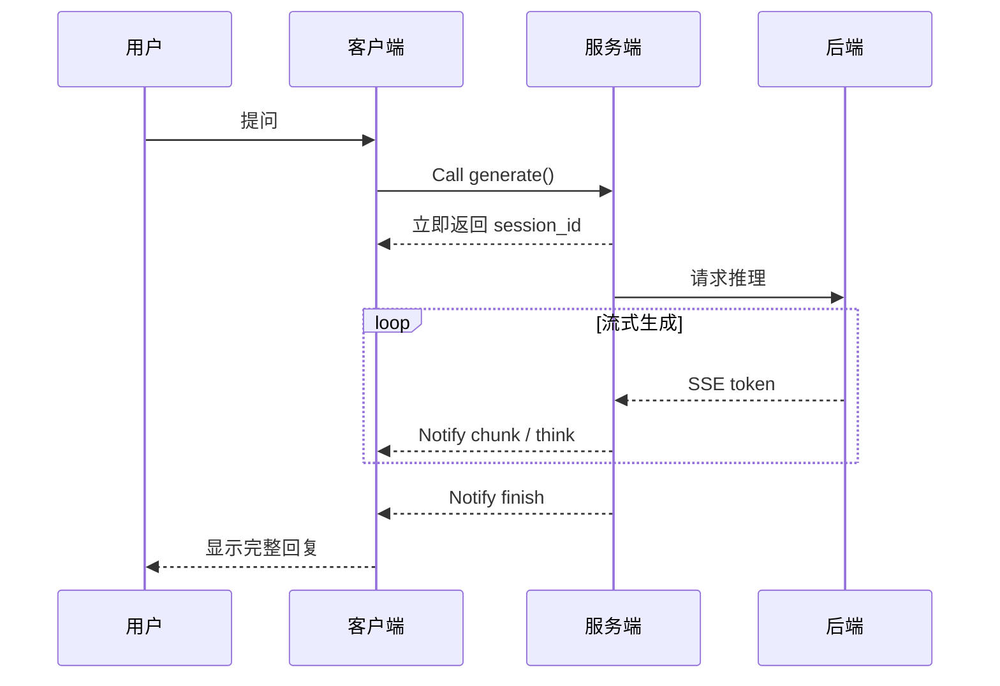
```mermaid
sequenceDiagram
    participant U as 用户
    participant C as 客户端
    participant S as 服务端
    participant B as 后端

    U->>C: 提问
    C->>S: Call generate()
    S-->>C: 立即返回 session_id
    S->>B: 请求推理
    loop 流式生成
        B-->>S: SSE token
        S-->>C: Notify chunk / think
    end
    S-->>C: Notify finish
    C-->>U: 显示完整回复
```

### 图 3：两条工具执行路径对比

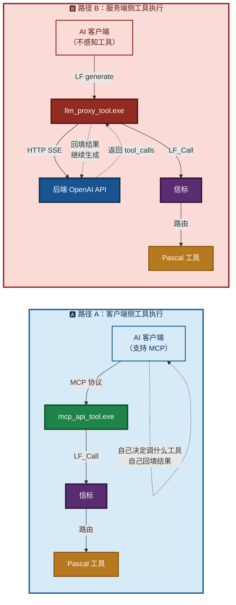
```mermaid
flowchart LR
    subgraph PathA["🅰️ 路径 A：客户端侧工具执行"]
        direction TB
        A1["AI 客户端<br/>（支持 MCP）"] -->|"MCP 协议"| A2["mcp_api_tool.exe"]
        A2 -->|"LF_Call"| A3["信标"]
        A3 -->|"路由"| A4["Pascal 工具"]
        A1 -.->|"自己决定调什么工具<br/>自己回填结果"| A1
    end

    subgraph PathB["🅱️ 路径 B：服务端侧工具执行"]
        direction TB
        B1["AI 客户端<br/>（不感知工具）"] -->|"LF generate"| B2["llm_proxy_tool.exe"]
        B2 -->|"HTTP SSE"| B3["后端 OpenAI API"]
        B3 -.->|"返回 tool_calls"| B2
        B2 -->|"LF_Call"| B4["信标"]
        B4 -->|"路由"| B5["Pascal 工具"]
        B2 -.->|"回填结果<br/>继续生成"| B3
    end

    style PathA fill:#D6EAF8,stroke:#1F618D,stroke-width:3px,color:#0D2F52
    style PathB fill:#FADBD8,stroke:#922B21,stroke-width:3px,color:#5A1A14
    style A1 fill:#D6EAF8,stroke:#1F618D,stroke-width:2px,color:#0D2F52
    style A2 fill:#1E8449,stroke:#0E4D2A,stroke-width:3px,color:#FFFFFF
    style A3 fill:#5B2C6F,stroke:#321640,stroke-width:3px,color:#FFFFFF
    style A4 fill:#B7791F,stroke:#7E5109,stroke-width:2px,color:#FFFFFF
    style B1 fill:#FADBD8,stroke:#922B21,stroke-width:2px,color:#5A1A14
    style B2 fill:#922B21,stroke:#5A1A14,stroke-width:3px,color:#FFFFFF
    style B3 fill:#1A5490,stroke:#0D2F52,stroke-width:3px,color:#FFFFFF
    style B4 fill:#5B2C6F,stroke:#321640,stroke-width:3px,color:#FFFFFF
    style B5 fill:#B7791F,stroke:#7E5109,stroke-width:2px,color:#FFFFFF
```

**一句话总结**：客户端只管调 `generate`。服务端负责把请求变成真正的模型推理。工具调用的位置有两种选择——客户端侧（路径 A）或服务端侧（路径 B）。

---

## 二、三种服务端

三种服务端都注册在**同一端点** `ipc:llm_service`、**同一 App 名** `LLM_Service`，因此**同一时刻只能运行一个**。要共存必须改 `--endpoint` + `--app-name`。

### 图 4：三种服务端定位对比

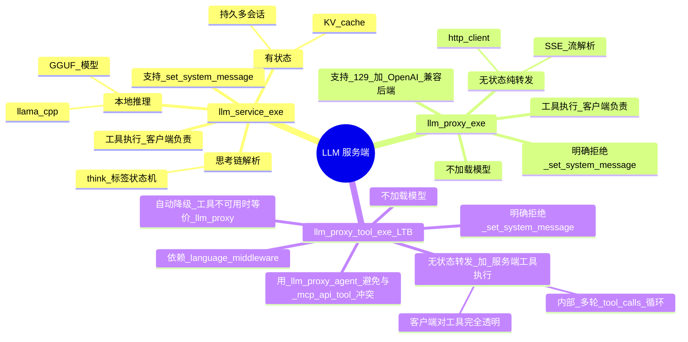
```mermaid
mindmap
  root(("LLM 服务端"))
    llm_service_exe
      本地推理
        llama_cpp
        GGUF_模型
      有状态
        持久多会话
        KV_cache
      支持_set_system_message
      思考链解析
        think_标签状态机
      工具执行_客户端负责
    llm_proxy_exe
      无状态纯转发
        http_client
        SSE_流解析
      不加载模型
      明确拒绝_set_system_message
      支持_129_加_OpenAI_兼容后端
      工具执行_客户端负责
    llm_proxy_tool_exe_LTB
      无状态转发_加_服务端工具执行
        内部_多轮_tool_calls_循环
        客户端对工具完全透明
      不加载模型
      明确拒绝_set_system_message
      依赖_language_middleware
      用_llm_proxy_agent_避免与_mcp_api_tool_冲突
      自动降级_工具不可用时等价_llm_proxy
```

### 图 5：能力矩阵

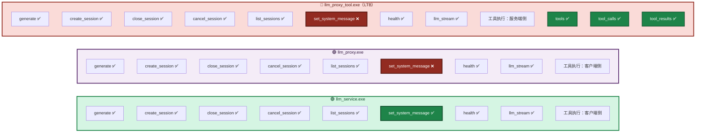
```mermaid
flowchart LR
    subgraph LS["🟢 llm_service.exe"]
        L1["generate ✅"]
        L2["create_session ✅"]
        L3["close_session ✅"]
        L4["cancel_session ✅"]
        L5["list_sessions ✅"]
        L6["set_system_message ✅"]
        L7["health ✅"]
        L8["llm_stream ✅"]
        L9["工具执行：客户端侧"]
    end

    subgraph LP["🟣 llm_proxy.exe"]
        P1["generate ✅"]
        P2["create_session ✅"]
        P3["close_session ✅"]
        P4["cancel_session ✅"]
        P5["list_sessions ✅"]
        P6["set_system_message ❌"]
        P7["health ✅"]
        P8["llm_stream ✅"]
        P9["工具执行：客户端侧"]
    end

    subgraph LT["🔴 llm_proxy_tool.exe（LTB）"]
        T1["generate ✅"]
        T2["create_session ✅"]
        T3["close_session ✅"]
        T4["cancel_session ✅"]
        T5["list_sessions ✅"]
        T6["set_system_message ❌"]
        T7["health ✅"]
        T8["llm_stream ✅"]
        T9["工具执行：服务端侧"]
        T10["tools ✅"]
        T11["tool_calls ✅"]
        T12["tool_results ✅"]
    end

    style LS fill:#D5F5E3,stroke:#1E8449,stroke-width:3px,color:#0E4D2A
    style LP fill:#F4ECF7,stroke:#5B2C6F,stroke-width:3px,color:#321640
    style LT fill:#FADBD8,stroke:#922B21,stroke-width:3px,color:#5A1A14
    style L6 fill:#1E8449,stroke:#0E4D2A,stroke-width:3px,color:#FFFFFF
    style P6 fill:#922B21,stroke:#5A1A14,stroke-width:3px,color:#FFFFFF
    style T6 fill:#922B21,stroke:#5A1A14,stroke-width:3px,color:#FFFFFF
    style T10 fill:#1E8449,stroke:#0E4D2A,stroke-width:2px,color:#FFFFFF
    style T11 fill:#1E8449,stroke:#0E4D2A,stroke-width:2px,color:#FFFFFF
    style T12 fill:#1E8449,stroke:#0E4D2A,stroke-width:2px,color:#FFFFFF
```

### 图 6：共存规则

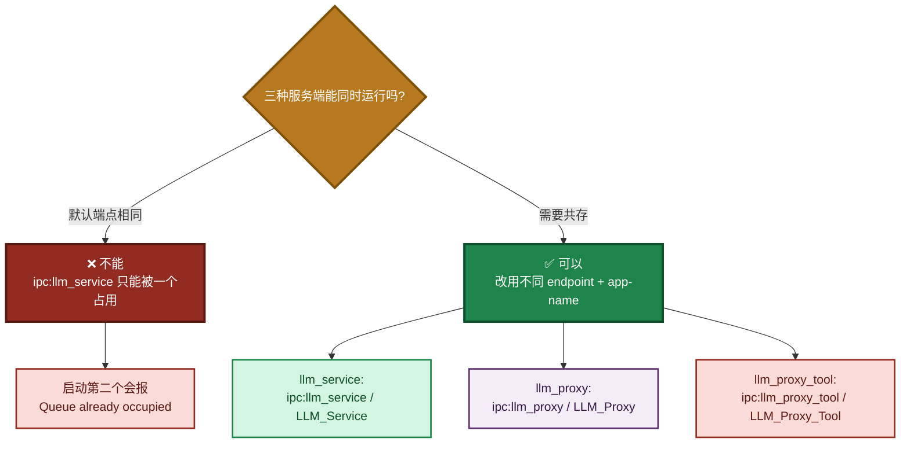
```mermaid
flowchart TB
    Q{"三种服务端能同时运行吗?"}
    Q -->|"默认端点相同"| NO["❌ 不能<br/>ipc:llm_service 只能被一个占用"]
    Q -->|"需要共存"| YES["✅ 可以<br/>改用不同 endpoint + app-name"]

    NO --> N1["启动第二个会报<br/>Queue already occupied"]
    YES --> Y1["llm_service:<br/>ipc:llm_service / LLM_Service"]
    YES --> Y2["llm_proxy:<br/>ipc:llm_proxy / LLM_Proxy"]
    YES --> Y3["llm_proxy_tool:<br/>ipc:llm_proxy_tool / LLM_Proxy_Tool"]

    style Q fill:#B7791F,stroke:#7E5109,stroke-width:3px,color:#FFFFFF
    style NO fill:#922B21,stroke:#5A1A14,stroke-width:3px,color:#FFFFFF
    style YES fill:#1E8449,stroke:#0E4D2A,stroke-width:3px,color:#FFFFFF
    style N1 fill:#FADBD8,stroke:#922B21,stroke-width:2px,color:#5A1A14
    style Y1 fill:#D5F5E3,stroke:#1E8449,stroke-width:2px,color:#0E4D2A
    style Y2 fill:#F4ECF7,stroke:#5B2C6F,stroke-width:2px,color:#321640
    style Y3 fill:#FADBD8,stroke:#922B21,stroke-width:2px,color:#5A1A14
```

**如何选**：

| 你的情况 | 用哪个 |
|----------|--------|
| 有本地 GGUF 模型，想直接加载 | `llm_service.exe` |
| 已有 LM Studio / Ollama / 云 API，客户端支持 MCP 工具 | `llm_proxy.exe` |
| 已有 LM Studio / Ollama / 云 API，但客户端不支持 MCP 工具，或希望服务端统一管工具调用 | `llm_proxy_tool.exe`（LTB） |

---

## 三、两条工具执行路径

### 3.1 路径 A：客户端侧工具执行（经典 MCP）

**适用场景**：AI 客户端**原生支持 MCP**（LM Studio、Claude Desktop、Continue.dev、Jan、DeepSeek Chat 等）。

**数据流**：

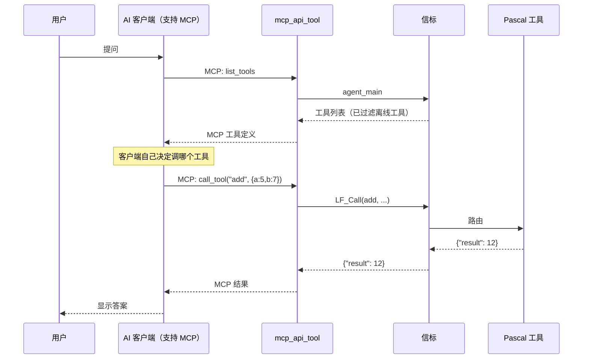
```mermaid
sequenceDiagram
    participant U as 用户
    participant C as AI 客户端（支持 MCP）
    participant M as mcp_api_tool
    participant B as 信标
    participant T as Pascal 工具

    U->>C: 提问
    C->>M: MCP: list_tools
    M->>B: agent_main
    B-->>M: 工具列表（已过滤离线工具）
    M-->>C: MCP 工具定义
    Note over C: 客户端自己决定调哪个工具
    C->>M: MCP: call_tool("add", {a:5,b:7})
    M->>B: LF_Call(add, ...)
    B->>T: 路由
    T-->>B: {"result": 12}
    B-->>M: {"result": 12}
    M-->>C: MCP 结果
    C-->>U: 显示答案
```

**关键特征**：
- AI 客户端**必须**支持 MCP 协议。
- 工具执行由**客户端发起**。
- 客户端自己维护工具调用循环（看到 `tool_calls` → 调 MCP 工具 → 回填 → 继续对话）。
- LLM 推理可以由 AI 客户端自带（LM Studio）或由 `llm_service` / `llm_proxy` 提供。

**关键参数**（`mcp_api_tool.exe`）：
- `--reg-agent-app reg_agent`：注册应用名（与 LTB 冲突，须不同）
- `--transport stdio|http|sse`：传输协议

### 3.2 路径 B：服务端侧工具执行（LTB）

**适用场景**：AI 客户端**不支持 MCP 工具**（部分 Pascal GUI 客户端），或希望**服务端统一管理工具调用循环**。

**数据流**：

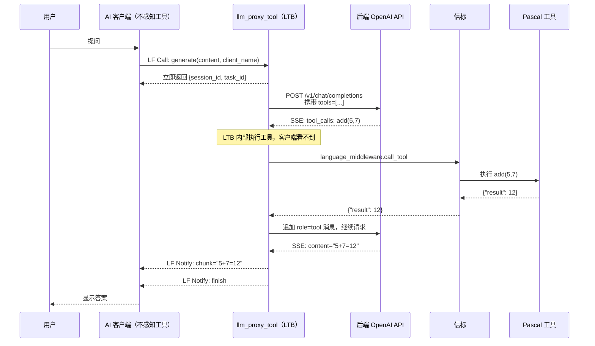
```mermaid
sequenceDiagram
    participant U as 用户
    participant C as AI 客户端（不感知工具）
    participant L as llm_proxy_tool（LTB）
    participant R as 后端 OpenAI API
    participant B as 信标
    participant T as Pascal 工具

    U->>C: 提问
    C->>L: LF Call: generate(content, client_name)
    L-->>C: 立即返回 {session_id, task_id}
    L->>R: POST /v1/chat/completions<br/>携带 tools=[...]
    R-->>L: SSE: tool_calls: add(5,7)
    Note over L: LTB 内部执行工具，客户端看不到
    L->>B: language_middleware.call_tool
    B->>T: 执行 add(5,7)
    T-->>B: {"result": 12}
    B-->>L: {"result": 12}
    L->>R: 追加 role=tool 消息，继续请求
    R-->>L: SSE: content="5+7=12"
    L-->>C: LF Notify: chunk="5+7=12"
    L-->>C: LF Notify: finish
    C-->>U: 显示答案
```

**关键特征**：
- AI 客户端**完全不知道**工具体系存在——只发 `generate`，收 `chunk`/`think`/`finish`。
- 工具发现、调用循环、结果回填**全在 LTB 内部**完成。
- 后端 OpenAI API 必须能返回标准 `tool_calls` 字段。
- 若 MCP 工具不可用（无信标 / 无工具提供者 / `--no-tools`），LTB **自动降级**为纯文本代理，行为与 `llm_proxy.exe` 完全一致。

**关键参数**（`llm_proxy_tool.exe`）：
- `--mcp-reg-agent-app llm_proxy_agent`：**必须**与 `mcp_api_tool` 的 `reg_agent` 不同，才能同时运行
- `--mcp-tool-provider-app agent_main_app`：工具提供者 App 名
- `--enable-tools` / `--no-tools`：是否启用工具（默认启用）
- `--max-tool-rounds` / `--max-total-tool-calls`：多轮循环的限流
- `--max-tool-result-chars` / `--max-total-tool-result-chars`：工具结果长度限流

### 3.3 路径 A 与路径 B 共存

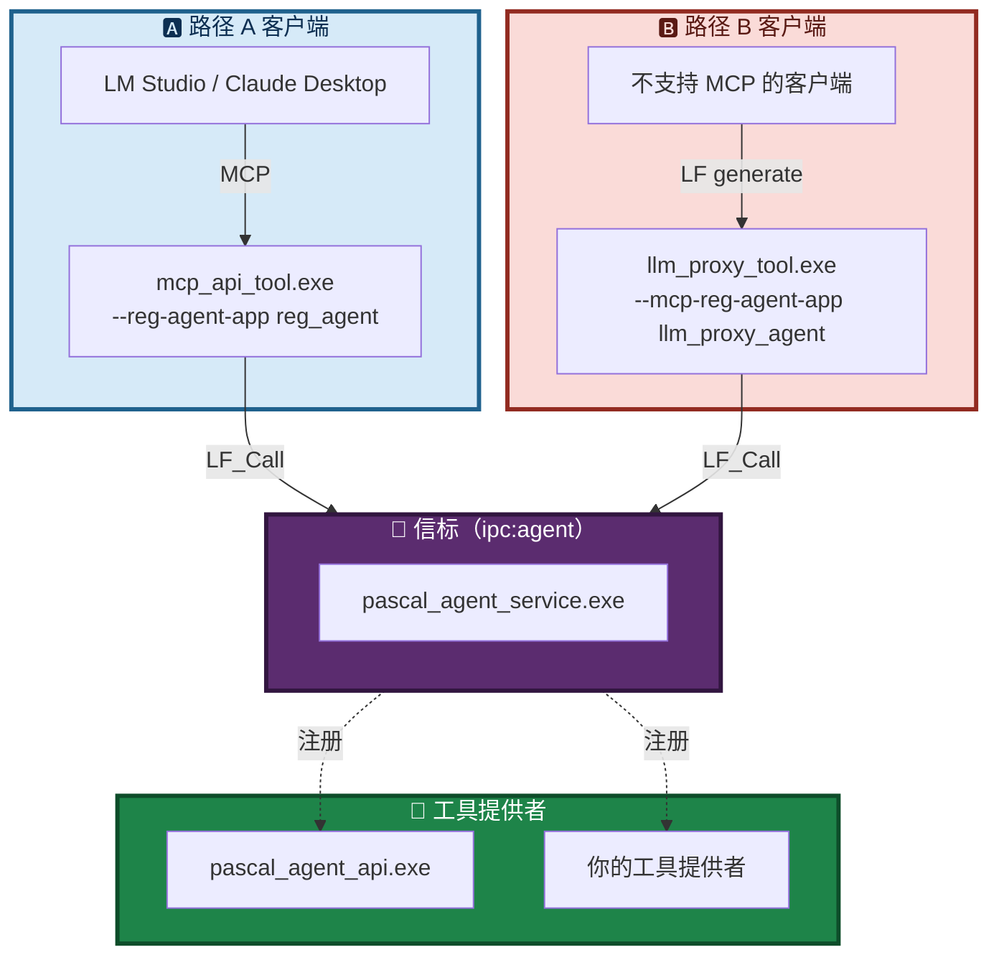
```mermaid
flowchart TB
    subgraph Beacon["📡 信标（ipc:agent）"]
        B1["pascal_agent_service.exe"]
    end

    subgraph Tools["🎯 工具提供者"]
        T1["pascal_agent_api.exe"]
        T2["你的工具提供者"]
    end

    subgraph PathA["🅰️ 路径 A 客户端"]
        A1["LM Studio / Claude Desktop"]
        A2["mcp_api_tool.exe<br/>--reg-agent-app reg_agent"]
    end

    subgraph PathB["🅱️ 路径 B 客户端"]
        B1c["不支持 MCP 的客户端"]
        B2c["llm_proxy_tool.exe<br/>--mcp-reg-agent-app llm_proxy_agent"]
    end

    A1 -->|MCP| A2
    A2 -->|LF_Call| Beacon
    B1c -->|LF generate| B2c
    B2c -->|LF_Call| Beacon
    Beacon -.->|注册| T1
    Beacon -.->|注册| T2

    style Beacon fill:#5B2C6F,stroke:#321640,stroke-width:3px,color:#FFFFFF
    style Tools fill:#1E8449,stroke:#0E4D2A,stroke-width:3px,color:#FFFFFF
    style PathA fill:#D6EAF8,stroke:#1F618D,stroke-width:3px,color:#0D2F52
    style PathB fill:#FADBD8,stroke:#922B21,stroke-width:3px,color:#5A1A14
```

**共存关键**：`mcp_api_tool` 用 `reg_agent`，`llm_proxy_tool` 用 `llm_proxy_agent`。二者注册名不同，**可同时运行**，共享同一信标。

**注意**：虽然二者可共存，但二者背后的 LLM 服务端（`llm_service` / `llm_proxy` / `llm_proxy_tool`）**默认共享同一端点**，同时只能跑一个。若想让 LTB 与 `llm_service` 同时运行，必须：
- `llm_service` 保持默认 `ipc:llm_service` / `LLM_Service`
- `llm_proxy_tool` 改用 `ipc:llm_proxy_tool` / `LLM_Proxy_Tool`

---

## 四、快速开始

### 4.1 选择服务端 + 路径

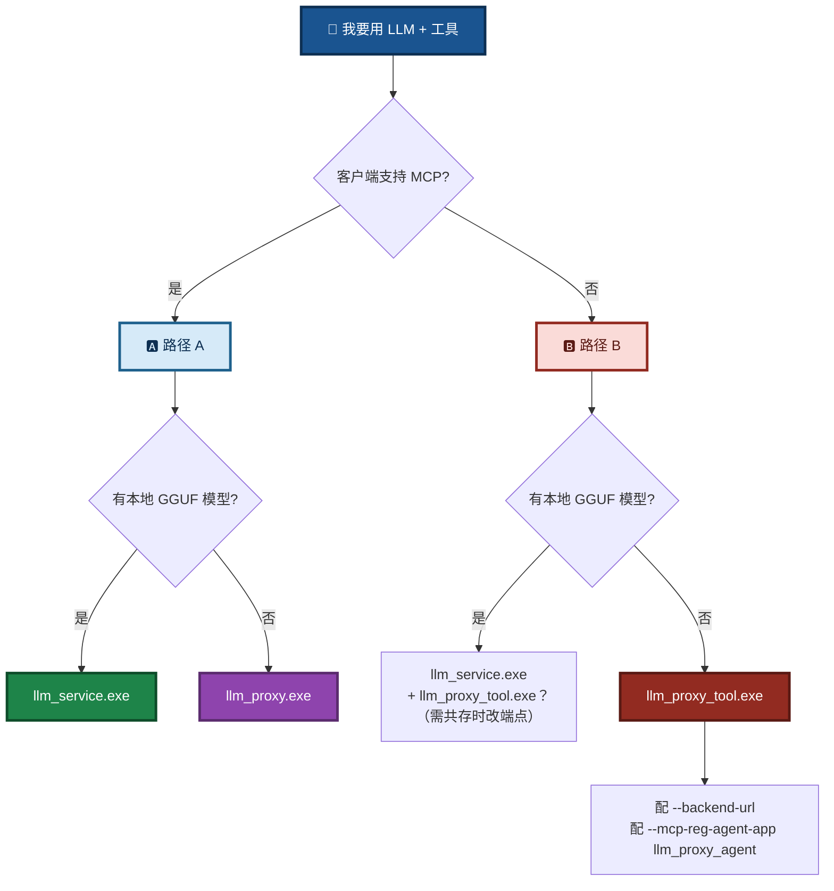
```mermaid
flowchart TD
    START["🚀 我要用 LLM + 工具"] --> Q1{"客户端支持 MCP?"}
    Q1 -->|是| PathA["🅰️ 路径 A"]
    Q1 -->|否| PathB["🅱️ 路径 B"]

    PathA --> QA1{"有本地 GGUF 模型?"}
    QA1 -->|是| SA1["llm_service.exe"]
    QA1 -->|否| SA2["llm_proxy.exe"]

    PathB --> QB1{"有本地 GGUF 模型?"}
    QB1 -->|是| SB1["llm_service.exe<br/>+ llm_proxy_tool.exe？<br/>（需共存时改端点）"]
    QB1 -->|否| SB2["llm_proxy_tool.exe"]

    SB2 --> SB2a["配 --backend-url<br/>配 --mcp-reg-agent-app llm_proxy_agent"]

    style START fill:#1A5490,stroke:#0D2F52,stroke-width:3px,color:#FFFFFF
    style PathA fill:#D6EAF8,stroke:#1F618D,stroke-width:3px,color:#0D2F52
    style PathB fill:#FADBD8,stroke:#922B21,stroke-width:3px,color:#5A1A14
    style SA1 fill:#1E8449,stroke:#0E4D2A,stroke-width:3px,color:#FFFFFF
    style SA2 fill:#8E44AD,stroke:#5B2C6F,stroke-width:3px,color:#FFFFFF
    style SB2 fill:#922B21,stroke:#5A1A14,stroke-width:3px,color:#FFFFFF
```

### 4.2 启动流程（路径 A 示例）

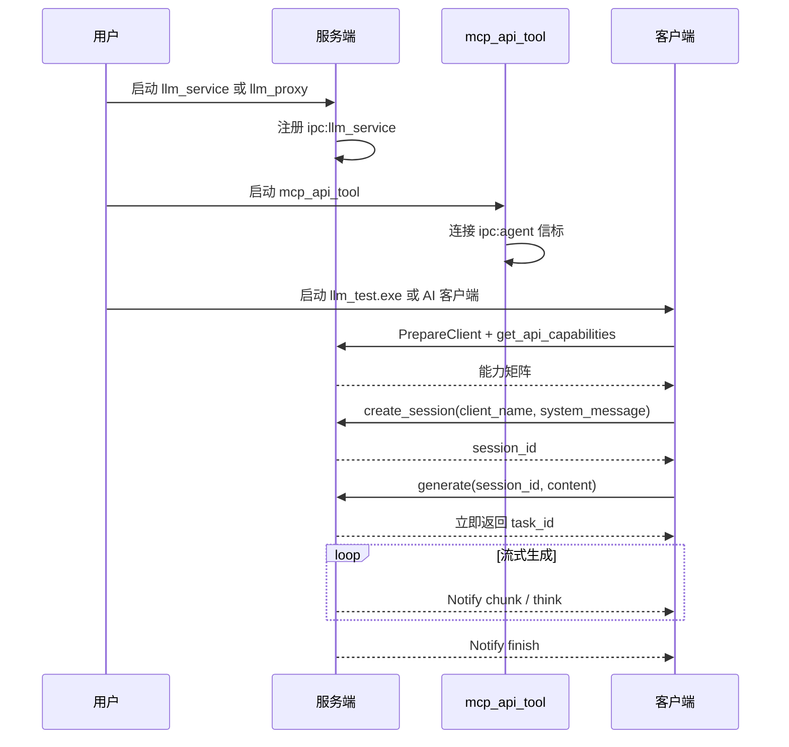
```mermaid
sequenceDiagram
    participant U as 用户
    participant S as 服务端
    participant M as mcp_api_tool
    participant C as 客户端

    U->>S: 启动 llm_service 或 llm_proxy
    S->>S: 注册 ipc:llm_service
    U->>M: 启动 mcp_api_tool
    M->>M: 连接 ipc:agent 信标
    U->>C: 启动 llm_test.exe 或 AI 客户端
    C->>S: PrepareClient + get_api_capabilities
    S-->>C: 能力矩阵
    C->>S: create_session(client_name, system_message)
    S-->>C: session_id
    C->>S: generate(session_id, content)
    S-->>C: 立即返回 task_id
    loop 流式生成
        S-->>C: Notify chunk / think
    end
    S-->>C: Notify finish
```

### 4.3 启动流程（路径 B 示例）

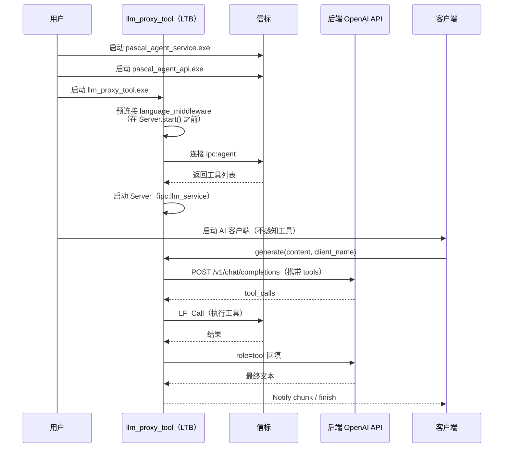
```mermaid
sequenceDiagram
    participant U as 用户
    participant L as llm_proxy_tool（LTB）
    participant B as 信标
    participant R as 后端 OpenAI API
    participant C as 客户端

    U->>B: 启动 pascal_agent_service.exe
    U->>B: 启动 pascal_agent_api.exe
    U->>L: 启动 llm_proxy_tool.exe
    L->>L: 预连接 language_middleware<br/>（在 Server.start() 之前）
    L->>B: 连接 ipc:agent
    B-->>L: 返回工具列表
    L->>L: 启动 Server（ipc:llm_service）
    U->>C: 启动 AI 客户端（不感知工具）
    C->>L: generate(content, client_name)
    L->>R: POST /v1/chat/completions（携带 tools）
    R-->>L: tool_calls
    L->>B: LF_Call（执行工具）
    B-->>L: 结果
    L->>R: role=tool 回填
    R-->>L: 最终文本
    L-->>C: Notify chunk / finish
```

---

## 五、服务端详解

### 5.1 llm_service.exe —— 本地推理服务

#### 图 7：架构

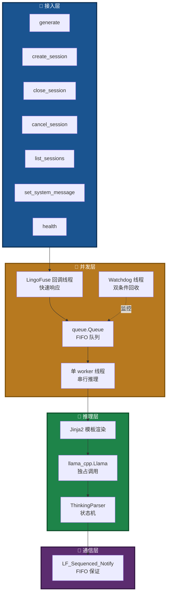
```mermaid
flowchart TB
    subgraph API["🎯 接入层"]
        A1["generate"]
        A2["create_session"]
        A3["close_session"]
        A4["cancel_session"]
        A5["list_sessions"]
        A6["set_system_message"]
        A7["health"]
    end

    subgraph CONC["🧵 并发层"]
        CB["LingoFuse 回调线程<br/>快速响应"]
        Q["queue.Queue<br/>FIFO 队列"]
        W["单 worker 线程<br/>串行推理"]
        WD["Watchdog 线程<br/>双条件回收"]
    end

    subgraph INFER["🧠 推理层"]
        TPL["Jinja2 模板渲染"]
        TH["ThinkingParser<br/>状态机"]
        LLM["llama_cpp.Llama<br/>独占调用"]
    end

    subgraph COMM["📡 通信层"]
        SEQ["LF_Sequenced_Notify<br/>FIFO 保证"]
    end

    API --> CB
    CB --> Q
    Q --> W
    W --> TPL
    TPL --> LLM
    LLM --> TH
    TH --> SEQ
    WD -.->|监控| Q

    style API fill:#1A5490,stroke:#0D2F52,stroke-width:3px,color:#FFFFFF
    style CONC fill:#B7791F,stroke:#7E5109,stroke-width:3px,color:#FFFFFF
    style INFER fill:#1E8449,stroke:#0E4D2A,stroke-width:3px,color:#FFFFFF
    style COMM fill:#5B2C6F,stroke:#321640,stroke-width:3px,color:#FFFFFF
```

**核心设计**：llama.cpp 的 `llama_context` 是**单线程状态机**（KV cache、采样器 RNG、BPE 状态共享），多线程直调会导致进程级 abort。所以所有推理请求都通过一个 FIFO 队列串行化到单个 worker 线程。

#### 图 8：会话生命周期

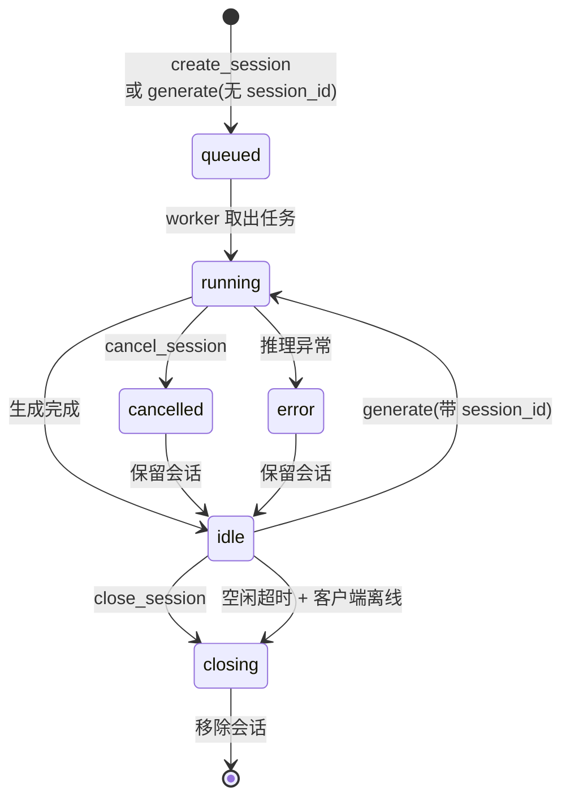
```mermaid
stateDiagram-v2
    [*] --> queued: create_session<br/>或 generate(无 session_id)
    queued --> running: worker 取出任务
    running --> idle: 生成完成
    running --> cancelled: cancel_session
    running --> error: 推理异常
    idle --> running: generate(带 session_id)
    idle --> closing: close_session
    idle --> closing: 空闲超时 + 客户端离线
    cancelled --> idle: 保留会话
    error --> idle: 保留会话
    closing --> [*]: 移除会话
```

#### 图 9：双条件回收策略

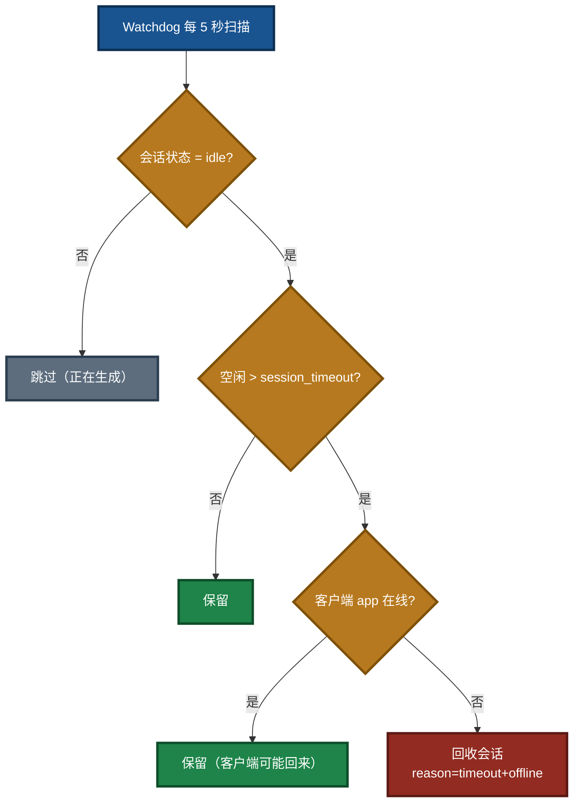
```mermaid
flowchart TD
    START["Watchdog 每 5 秒扫描"] --> C1{"会话状态 = idle?"}
    C1 -->|否| SKIP["跳过（正在生成）"]
    C1 -->|是| C2{"空闲 > session_timeout?"}
    C2 -->|否| KEEP["保留"]
    C2 -->|是| C3{"客户端 app 在线?"}
    C3 -->|是| KEEP2["保留（客户端可能回来）"]
    C3 -->|否| CLOSE["回收会话<br/>reason=timeout+offline"]

    style START fill:#1A5490,stroke:#0D2F52,stroke-width:3px,color:#FFFFFF
    style C1 fill:#B7791F,stroke:#7E5109,stroke-width:3px,color:#FFFFFF
    style C2 fill:#B7791F,stroke:#7E5109,stroke-width:3px,color:#FFFFFF
    style C3 fill:#B7791F,stroke:#7E5109,stroke-width:3px,color:#FFFFFF
    style SKIP fill:#5D6D7E,stroke:#2C3E50,stroke-width:3px,color:#FFFFFF
    style KEEP fill:#1E8449,stroke:#0E4D2A,stroke-width:3px,color:#FFFFFF
    style KEEP2 fill:#1E8449,stroke:#0E4D2A,stroke-width:3px,color:#FFFFFF
    style CLOSE fill:#922B21,stroke:#5A1A14,stroke-width:3px,color:#FFFFFF
```

**关键命令**：`--session-timeout`（默认 600 秒）、`--max-sessions`（默认 1024）、`--queue-max-size`（默认 256）。详见同目录 `LingoFuse_LLM_Service_CLI_guide.md`。

### 5.2 llm_proxy.exe —— 无状态纯转发代理

#### 图 10：架构

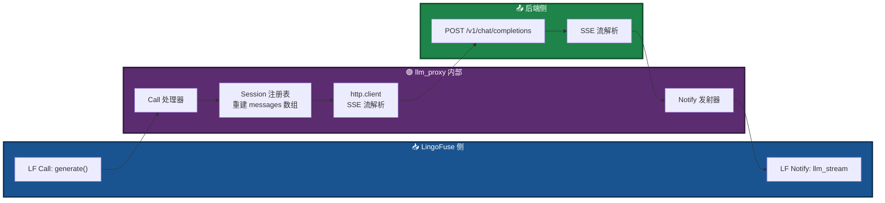
```mermaid
flowchart LR
    subgraph IN["📥 LingoFuse 侧"]
        CALL["LF Call: generate()"]
        NOTIFY["LF Notify: llm_stream"]
    end

    subgraph PROXY["🟣 llm_proxy 内部"]
        HANDLER["Call 处理器"]
        SESSION["Session 注册表<br/>重建 messages 数组"]
        BACKEND["http.client<br/>SSE 流解析"]
        EMIT["Notify 发射器"]
    end

    subgraph OUT["📤 后端侧"]
        HTTP["POST /v1/chat/completions"]
        SSE["SSE 流解析"]
    end

    CALL --> HANDLER
    HANDLER --> SESSION
    SESSION --> BACKEND
    BACKEND --> HTTP
    HTTP --> SSE
    SSE --> EMIT
    EMIT --> NOTIFY

    style IN fill:#1A5490,stroke:#0D2F52,stroke-width:3px,color:#FFFFFF
    style PROXY fill:#5B2C6F,stroke:#321640,stroke-width:3px,color:#FFFFFF
    style OUT fill:#1E8449,stroke:#0E4D2A,stroke-width:3px,color:#FFFFFF
```

#### 图 11：无状态语义

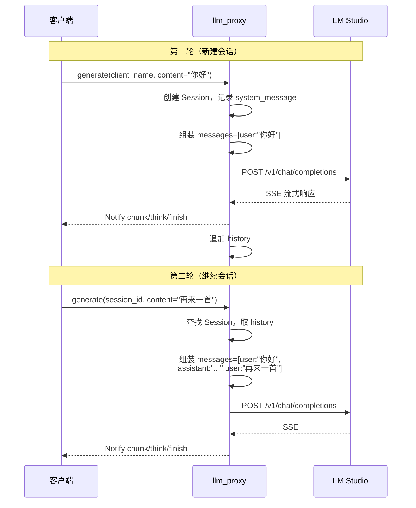
```mermaid
sequenceDiagram
    participant C as 客户端
    participant P as llm_proxy
    participant B as LM Studio

    Note over C,B: 第一轮（新建会话）
    C->>P: generate(client_name, content="你好")
    P->>P: 创建 Session，记录 system_message
    P->>P: 组装 messages=[user:"你好"]
    P->>B: POST /v1/chat/completions
    B-->>P: SSE 流式响应
    P-->>C: Notify chunk/think/finish
    P->>P: 追加 history

    Note over C,B: 第二轮（继续会话）
    C->>P: generate(session_id, content="再来一首")
    P->>P: 查找 Session，取 history
    P->>P: 组装 messages=[user:"你好",<br/>assistant:"...",user:"再来一首"]
    P->>B: POST /v1/chat/completions
    B-->>P: SSE
    P-->>C: Notify chunk/think/finish
```

**要点**：代理不持有模型 KV cache；每轮请求都重新组装完整 messages 数组发给后端。

### 5.3 llm_proxy_tool.exe —— 转发 + 服务端工具执行（LTB）

#### 图 12：架构

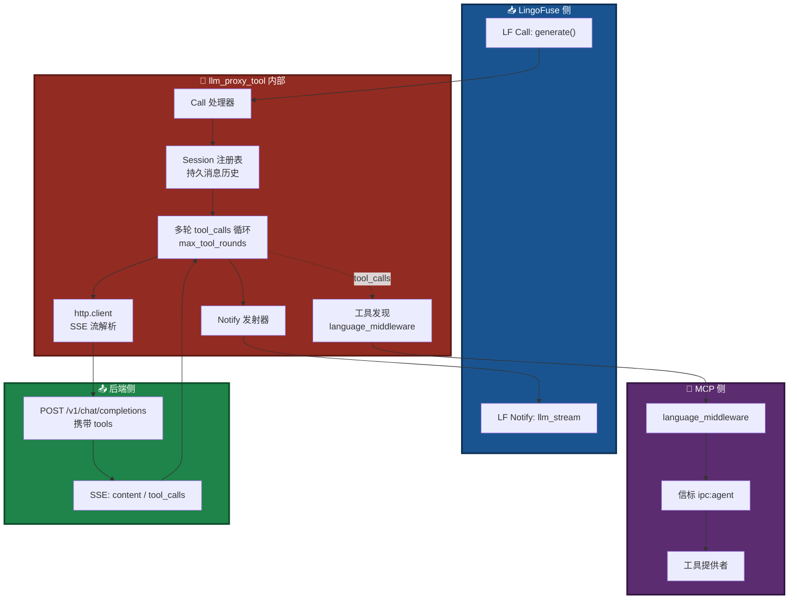
```mermaid
flowchart TB
    subgraph IN["📥 LingoFuse 侧"]
        CALL["LF Call: generate()"]
        NOTIFY["LF Notify: llm_stream"]
    end

    subgraph LTB["🔴 llm_proxy_tool 内部"]
        HANDLER["Call 处理器"]
        SESSION["Session 注册表<br/>持久消息历史"]
        TOOLS["工具发现<br/>language_middleware"]
        LOOP["多轮 tool_calls 循环<br/>max_tool_rounds"]
        BACKEND["http.client<br/>SSE 流解析"]
        EMIT["Notify 发射器"]
    end

    subgraph MCP["📡 MCP 侧"]
        MW["language_middleware"]
        Beacon["信标 ipc:agent"]
        Provider["工具提供者"]
    end

    subgraph OUT["📤 后端侧"]
        HTTP["POST /v1/chat/completions<br/>携带 tools"]
        SSE["SSE: content / tool_calls"]
    end

    CALL --> HANDLER
    HANDLER --> SESSION
    SESSION --> LOOP
    LOOP --> BACKEND
    BACKEND --> HTTP
    HTTP --> SSE
    SSE --> LOOP
    LOOP -.->|tool_calls| TOOLS
    TOOLS --> MW
    MW --> Beacon
    Beacon --> Provider
    LOOP --> EMIT
    EMIT --> NOTIFY

    style IN fill:#1A5490,stroke:#0D2F52,stroke-width:3px,color:#FFFFFF
    style LTB fill:#922B21,stroke:#5A1A14,stroke-width:3px,color:#FFFFFF
    style MCP fill:#5B2C6F,stroke:#321640,stroke-width:3px,color:#FFFFFF
    style OUT fill:#1E8449,stroke:#0E4D2A,stroke-width:3px,color:#FFFFFF
```

#### 图 13：多轮工具循环

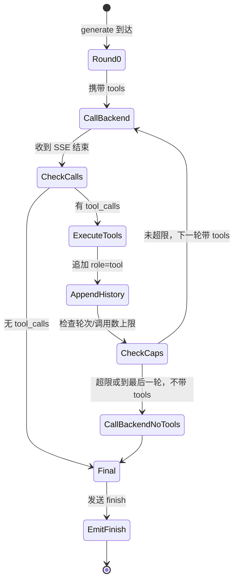
```mermaid
stateDiagram-v2
    [*] --> Round0: generate 到达
    Round0 --> CallBackend: 携带 tools
    CallBackend --> CheckCalls: 收到 SSE 结束
    CheckCalls --> Final: 无 tool_calls
    CheckCalls --> ExecuteTools: 有 tool_calls
    ExecuteTools --> AppendHistory: 追加 role=tool
    AppendHistory --> CheckCaps: 检查轮次/调用数上限
    CheckCaps --> CallBackend: 未超限，下一轮带 tools
    CheckCaps --> CallBackendNoTools: 超限或到最后一轮，不带 tools
    CallBackendNoTools --> Final
    Final --> EmitFinish: 发送 finish
    EmitFinish --> [*]
```

**关键参数**：
- `--max-tool-rounds`：最大往返轮次（默认 100），最后一轮强制不带 tools
- `--max-total-tool-calls`：单次 `generate` 内最多执行多少次工具（默认 50）
- `--max-tools-per-round`：单轮最多处理多少个工具调用（默认 10）
- `--max-tool-result-chars`：单个工具结果最大字符数（默认 8000）
- `--max-total-tool-result-chars`：单次 `generate` 内所有工具结果总和上限（默认 200000）

#### 图 14：降级行为

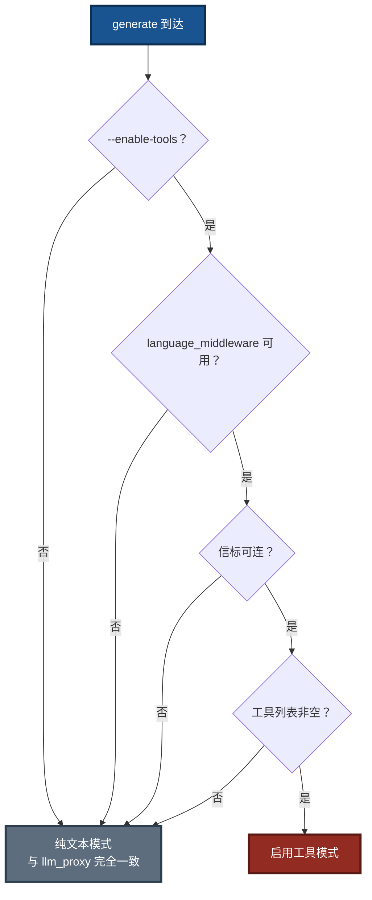
```mermaid
flowchart TD
    START["generate 到达"] --> Q1{"--enable-tools？"}
    Q1 -->|否| PURE["纯文本模式<br/>与 llm_proxy 完全一致"]
    Q1 -->|是| Q2{"language_middleware 可用？"}
    Q2 -->|否| PURE
    Q2 -->|是| Q3{"信标可连？"}
    Q3 -->|否| PURE
    Q3 -->|是| Q4{"工具列表非空？"}
    Q4 -->|否| PURE
    Q4 -->|是| TOOLS["启用工具模式"]

    style START fill:#1A5490,stroke:#0D2F52,stroke-width:3px,color:#FFFFFF
    style PURE fill:#5D6D7E,stroke:#2C3E50,stroke-width:3px,color:#FFFFFF
    style TOOLS fill:#922B21,stroke:#5A1A14,stroke-width:3px,color:#FFFFFF
```

**设计原则**：默认总是能跑——工具环境不满足时自动降级为纯文本代理，客户端无感。

### 5.4 三种服务端关键差异对照

| 维度 | `llm_service.exe` | `llm_proxy.exe` | `llm_proxy_tool.exe` |
|------|:----------------:|:---------------:|:--------------------:|
| **模型加载** | 本地 llama.cpp | 无 | 无 |
| **推理线程** | 单 worker 串行 | 无推理 | 无推理 |
| **上下文管理** | 服务端持有 KV cache | 每轮重建 messages | 每轮重建 messages |
| **`set_system_message`** | ✅ 支持 | ❌ 明确拒绝 | ❌ 明确拒绝 |
| **工具发现** | 无 | 无 | ✅ MCP 工具 |
| **工具执行** | 无（客户端负责） | 无（客户端负责） | ✅ 服务端代管 |
| **多轮 tool_calls 循环** | 无 | 无 | ✅ 内置 |
| **依赖 middleware** | 无 | 无 | ✅ `language_middleware` |
| **reg_agent 名称** | — | — | `llm_proxy_agent` |
| **端点 / App 名** | `ipc:llm_service` / `LLM_Service` | 同左 | 同左 |
| **三者能同时运行** | ❌ | ❌ | ❌ |

### 5.5 关键参数速查

```mermaid
mindmap
  root(("服务端参数"))
    llm_service
      --model-path
      --context-size
      --max-tokens
      --threads
      --gpu-layers
      --session-timeout
      --max-sessions
      --chat-template
      --system-message
    llm_proxy
      --backend-url
      --backend-model
      --backend-key
      --backend-key-file
      --backend-auth-header
      --backend-auth-scheme
      --backend-extra-headers
      --session-timeout
      --max-sessions
    llm_proxy_tool_额外
      --enable-tools_or_--no-tools
      --mcp-endpoint
      --mcp-reg-agent-app
      --mcp-tool-provider-app
      --max-tool-rounds
      --max-total-tool-calls
      --max-tools-per-round
      --max-tool-result-chars
      --max-total-tool-result-chars
    三者通用
      --endpoint
      --app-name
      --notify-api
      --log-level
      --debug
      --quiet
```

---

## 六、客户端详解

> **重要提示**：**Pascal 客户端源码不在本仓库中**。本仓库是 `LingoFuse-pasAgent`，包含 Python 组件（`llm_*.py`）、Pascal 服务端示例（`pascal_agent_*.lpr`）、MCP 网关（`mcp_api_tool.py`）及其配套文档。**Pascal GUI 客户端**（`llm_client.pas`、`llm_tool_frm.pas` 等）属于 **LingoFuse 核心仓库**，需从 [github.com/PassByYou888/LingoFuse](https://github.com/PassByYou888/LingoFuse) 获取。

### 6.1 Python 客户端：llm_test.exe

```mermaid
flowchart TB
    START["启动 llm_test.exe"] --> CONN["连接 ipc:llm_service"]
    CONN --> CAP["调用 get_api_capabilities<br/>缓存能力矩阵"]
    CAP --> MODE{"交互模式?"}
    MODE -->|是| REPL["进入 REPL"]
    MODE -->|否| ONESHOT["一次性提问"]
    REPL --> CMD{"用户输入"}
    CMD -->|"/new"| NEW["创建新会话"]
    CMD -->|"/use"| USE["切换会话"]
    CMD -->|"/sessions"| LIST["列出会话"]
    CMD -->|"/close"| CLOSE["关闭会话"]
    CMD -->|"/cancel"| CANCEL["取消生成"]
    CMD -->|"/sys"| SYS["检查能力后调用"]
    CMD -->|"/health"| HEALTH["查询服务端健康"]
    CMD -->|"/capabilities"| CAPS["显示能力矩阵"]
    CMD -->|"/thinking"| THINK["切换思考模式"]
    CMD -->|"其他文本"| SEND["发送 generate"]
    SEND --> STREAM["流式接收 chunk/think/finish"]

    style START fill:#1A5490,stroke:#0D2F52,stroke-width:3px,color:#FFFFFF
    style CONN fill:#B7791F,stroke:#7E5109,stroke-width:3px,color:#FFFFFF
    style CAP fill:#B7791F,stroke:#7E5109,stroke-width:3px,color:#FFFFFF
    style STREAM fill:#1E8449,stroke:#0E4D2A,stroke-width:3px,color:#FFFFFF
```

**命令列表**：

| 命令 | 作用 |
|------|------|
| `/new` | 创建新会话 |
| `/use <id>` | 切换当前会话 |
| `/sessions` | 列出本客户端的所有会话 |
| `/close [id]` | 关闭会话 |
| `/cancel` | 取消当前生成 |
| `/sys <msg>` | 更新全局默认 system message（能力检查后） |
| `/health` | 查询服务端健康/状态 |
| `/capabilities [refresh]` | 显示/刷新能力矩阵 |
| `/thinking on\|off` | 切换思考模式 |
| `/help` | 显示帮助 |
| `/quit`、`/exit` | 退出 |

**注意**：`llm_test.exe` 本身**不感知工具**。它只调 `generate`，走路径 B 时配合 `llm_proxy_tool.exe`；走路径 A 时配合 AI 客户端（LM Studio 等）。

### 6.2 Pascal 客户端（位于 LingoFuse 核心仓库）

**文件**：`llm_client.pas` + `llm_tool_frm.pas`（**不在本仓库中**）

```mermaid
flowchart TB
    subgraph CLIENT["🅿️ TLLMClient"]
        CONN["Connect"]
        CAP["FetchCapabilities"]
        GEN["Generate"]
        CS["CreateSession"]
        SSM["SetSystemMessage"]
        HEALTH["Health"]
        EVENTS["OnChunk / OnThink<br/>OnFinish / OnError / OnClosed"]
    end

    subgraph GUI["🖥️ Tllm_tool_form"]
        BTN_CONN["连接按钮"]
        BTN_NEW["新建会话按钮"]
        BTN_GEN["发送 generate 按钮"]
        BTN_SYS["更新系统消息按钮"]
        MEMO["sys_prompt_Memo"]
        SSE["sse_Edit 输出区"]
        LOG["LogMemo 日志区"]
        TIMER["sysTimer"]
    end

    BTN_CONN --> CONN
    CONN --> CAP
    BTN_NEW --> CS
    BTN_GEN --> GEN
    BTN_SYS --> SSM
    GEN --> EVENTS
    EVENTS --> SSE
    TIMER -->|驱动软同步| EVENTS
    TIMER -->|轮询状态| LOG

    style CLIENT fill:#1A5490,stroke:#0D2F52,stroke-width:3px,color:#FFFFFF
    style GUI fill:#B7791F,stroke:#7E5109,stroke-width:3px,color:#FFFFFF
```

**关键设计**：

- **`FActiveSessionId`**：会话过滤，只处理当前活动会话的消息。
- **"新建会话"按钮**：自定义 system message 的**唯一有效入口**。
- **`RegisterNotifySync`**：回调在主线程执行。
- **能力检查**：`LLM.HasCapabilityInfo` 和 `LLM.LLMSupported(API_NAME_SET_SYSTEM_MESSAGE)` 提前短路。
- **Unicode**：全程 `TBytes` / UTF-8。

**Pascal GUI 客户端推荐走路径 B**：直接连 `llm_proxy_tool.exe`，客户端不需要任何 MCP 相关的代码改动。

---

## 七、API 能力发现机制

### 7.1 能力矩阵

```mermaid
classDiagram
    class CapabilityMatrix {
        +int generate
        +int create_session
        +int close_session
        +int cancel_session
        +int list_sessions
        +int set_system_message
        +int health
        +int llm_stream
        +int tools
        +int tool_calls
        +int tool_results
    }

    class ServiceKind {
        <<enumeration>>
        service
        proxy
    }

    CapabilityMatrix --> ServiceKind : server_kind
```

**1 = 支持，0 = 不支持**。缺失条目按 0 处理。

**三种服务端的能力矩阵**：

| API | `service` | `proxy` | `proxy`（LTB） |
|-----|:---------:|:-------:|:--------------:|
| `generate` | 1 | 1 | 1 |
| `create_session` | 1 | 1 | 1 |
| `close_session` | 1 | 1 | 1 |
| `cancel_session` | 1 | 1 | 1 |
| `list_sessions` | 1 | 1 | 1 |
| `set_system_message` | 1 | 0 | 0 |
| `health` | 1 | 1 | 1 |
| `llm_stream` | 1 | 1 | 1 |
| `tools` | — | — | 1 |
| `tool_calls` | — | — | 1 |
| `tool_results` | — | — | 1 |
| `server_kind` | `service` | `proxy` | `proxy` |

**注意**：`llm_proxy.exe` 与 `llm_proxy_tool.exe` 的 `server_kind` 都是 `"proxy"`；要区分二者，读 `tools` / `tool_calls` 等 LTB 特有字段。

### 7.2 发现流程

```mermaid
sequenceDiagram
    participant C as 客户端
    participant S as 服务端

    C->>S: Connect
    C->>S: get_api_capabilities
    S-->>C: {code:0, server_kind, capabilities}
    C->>C: 缓存到本地
    Note over C: 后续命令先查缓存
    C->>C: LLMSupported("set_system_message")
    alt 不支持
        C-->>C: 短路，友好提示
    else 支持
        C->>S: set_system_message(content)
        S-->>C: {code:0, status:"ok"}
    end
```

**向后兼容**：旧服务端不暴露 `get_api_capabilities` 时，客户端缓存保持为空，相关命令按"未知"处理，回退到无条件调用。

---

## 八、流式协议

### 8.1 消息类型

```mermaid
flowchart LR
    subgraph MSG["📨 流式消息类型"]
        C["chunk<br/>正文流"]
        T["think<br/>思考流"]
        F["finish<br/>生成结束"]
        E["error<br/>服务端错误"]
        CL["closed<br/>会话关闭"]
    end

    C --> CU["客户端追加显示"]
    T --> TU["灰色显示 / 折叠"]
    F --> FU["更新状态栏"]
    E --> EU["错误提示"]
    CL --> CLU["清理会话列表"]

    style C fill:#1A5490,stroke:#0D2F52,stroke-width:3px,color:#FFFFFF
    style T fill:#5D6D7E,stroke:#2C3E50,stroke-width:3px,color:#FFFFFF
    style F fill:#1E8449,stroke:#0E4D2A,stroke-width:3px,color:#FFFFFF
    style E fill:#922B21,stroke:#5A1A14,stroke-width:3px,color:#FFFFFF
    style CL fill:#B7791F,stroke:#7E5109,stroke-width:3px,color:#FFFFFF
```

### 8.2 协议演进

```mermaid
sequenceDiagram
    participant Server as 服务端
    participant Client as 客户端

    Note over Server,Client: ❌ v1.0 协议（字符串魔法）
    Server->>Client: {"chunk": "Hello"}
    Server->>Client: {"chunk": " world"}
    Server->>Client: {"chunk": "__FINISH__"}
    Note over Client: 用 startswith 判断

    Note over Server,Client: ✅ v3.0+ 协议（结构化）
    Server->>Client: {"type":"chunk","session_id":"...","text":"Hello"}
    Server->>Client: {"type":"chunk","session_id":"...","text":" world"}
    Server->>Client: {"type":"think","session_id":"...","text":"..."}
    Server->>Client: {"type":"finish","session_id":"...","reason":"stop"}
    Server->>Client: {"type":"closed","session_id":"...","reason":"timeout+offline"}
```

**客户端只看 `type` 字段，不解析任何 "魔法字符串"。**

### 8.3 思考流处理

```mermaid
stateDiagram-v2
    [*] --> Outside: 初始化
    Outside --> Inside: 检测到 think 开始标记
    Inside --> Outside: 检测到 think 结束标记
    Outside --> Outside: 普通文本 → chunk
    Inside --> Inside: 思考文本 → think
```

**三条路径**：

- `llm_service.exe`：模板预置 thinking 标记或模型自发，`ThinkingParser` 状态机分流。
- `llm_proxy.exe`：后端 SSE 已分离 `reasoning_content` 和 `content`，代理无策略转发。
- `llm_proxy_tool.exe`：与 `llm_proxy.exe` 相同——SSE 的 `reasoning_content` 直接转为 `think`。

---

## 九、典型使用场景

### 场景 1：本地推理 + Python REPL（路径 A 或 B 均可）

```mermaid
flowchart LR
    A["安装 llama-cpp-python"] --> B["下载 GGUF 模型"]
    B --> C["启动 llm_service.exe"]
    C --> D["启动 llm_test.exe"]
    D --> E["/new 创建会话"]
    E --> F["输入问题"]
    F --> G["实时流式输出"]
```

### 场景 2：路径 A —— LM Studio + 支持 MCP 的客户端

```mermaid
flowchart LR
    A["启动 LM Studio<br/>加载模型"] --> B["启动 llm_proxy.exe<br/>--backend-url http://127.0.0.1:1234/v1"]
    B --> C["启动 mcp_api_tool.exe"]
    C --> D["AI 客户端（如 LM Studio）<br/>配 MCP 网关"]
    D --> E["AI 自己决定调用工具"]
```

### 场景 3：路径 B —— LM Studio + 不支持 MCP 的客户端

```mermaid
flowchart LR
    A["启动 LM Studio<br/>加载模型"] --> B["启动 llm_proxy_tool.exe<br/>--backend-url http://127.0.0.1:1234/v1<br/>--mcp-reg-agent-app llm_proxy_agent"]
    B --> C["AI 客户端（不感知工具）<br/>调 generate"]
    C --> D["LTB 内部完成工具调用循环"]
```

### 场景 4：跨机部署

```mermaid
flowchart TB
    subgraph GPU["🖥️ GPU 工作站（服务端）"]
        LP["llm_proxy_tool.exe<br/>--endpoint 0.0.0.0:9898"]
    end

    subgraph WEAK["💻 弱机笔记本（客户端）"]
        PY["llm_test.exe<br/>--endpoint 192.168.1.100:9898"]
        PAS["Pascal GUI 客户端<br/>（内置 llm_client.pas，<br/>从核心仓库获取）<br/>端点填 192.168.1.100:9898"]
    end

    LP -->|TCP 9898| PY
    LP -->|TCP 9898| PAS

    style GPU fill:#5B2C6F,stroke:#321640,stroke-width:3px,color:#FFFFFF
    style WEAK fill:#1A5490,stroke:#0D2F52,stroke-width:3px,color:#FFFFFF
```

### 场景 5：三种服务端共存（全部改端点）

```mermaid
flowchart TB
    subgraph T1["终端 1"]
        S1["llm_service.exe<br/>ipc:llm_service / LLM_Service"]
    end

    subgraph T2["终端 2"]
        S2["llm_proxy.exe<br/>ipc:llm_proxy / LLM_Proxy<br/>--backend-url http://127.0.0.1:1234/v1"]
    end

    subgraph T3["终端 3"]
        S3["llm_proxy_tool.exe<br/>ipc:llm_proxy_tool / LLM_Proxy_Tool<br/>--backend-url http://127.0.0.1:1234/v1"]
    end

    subgraph Clients["客户端"]
        C1["llm_test.exe<br/>--endpoint ipc:llm_service"]
        C2["llm_test.exe<br/>--endpoint ipc:llm_proxy --server-app LLM_Proxy"]
        C3["llm_test.exe<br/>--endpoint ipc:llm_proxy_tool --server-app LLM_Proxy_Tool"]
    end

    S1 --> C1
    S2 --> C2
    S3 --> C3

    style T1 fill:#D5F5E3,stroke:#1E8449,stroke-width:3px,color:#0E4D2A
    style T2 fill:#F4ECF7,stroke:#5B2C6F,stroke-width:3px,color:#321640
    style T3 fill:#FADBD8,stroke:#922B21,stroke-width:3px,color:#5A1A14
```

### 场景 6：路径 A 与路径 B 共存（信标共享）

```mermaid
flowchart TB
    subgraph Beacon["📡 信标 ipc:agent"]
        B1["pascal_agent_service.exe"]
    end

    subgraph Providers["🎯 工具提供者"]
        P1["pascal_agent_api.exe"]
    end

    subgraph PathA["🅰️ 路径 A"]
        A1["LM Studio"]
        A2["mcp_api_tool.exe<br/>reg_agent"]
    end

    subgraph PathB["🅱️ 路径 B"]
        B1c["Pascal GUI"]
        B2c["llm_proxy_tool.exe<br/>llm_proxy_agent"]
    end

    A1 --> A2
    A2 --> B1
    B1c --> B2c
    B2c --> B1
    B1 --> P1

    style Beacon fill:#5B2C6F,stroke:#321640,stroke-width:3px,color:#FFFFFF
    style Providers fill:#1E8449,stroke:#0E4D2A,stroke-width:3px,color:#FFFFFF
    style PathA fill:#D6EAF8,stroke:#1F618D,stroke-width:3px,color:#0D2F52
    style PathB fill:#FADBD8,stroke:#922B21,stroke-width:3px,color:#5A1A14
```

**要点**：`mcp_api_tool`（`reg_agent`）与 `llm_proxy_tool`（`llm_proxy_agent`）注册名不同，可同时跑。

---

## 十、故障排查

### 10.1 症状速查表

> 下表「参考」列的 `P0-1`、`P0-4` 等编号，对应同目录 `LingoFuse_LLM_Pitfalls_For_AI.md` 中的条目 ID。请直接到该文档检索对应编号以获取**症状 → 根因 → 正确做法**的完整说明。

| 症状 | 可能原因 | 参考（Pitfalls 条目 ID） |
|------|----------|------|
| 服务端刷屏 `no found app` | `client_name` 不是真实注册的 App 名 | P0-1 |
| 客户端延迟数秒才收到第一批 token | `requests` 的 SSE 缓冲 | P0-4 |
| `llm_proxy` / `llm_proxy_tool` 启动后立即退出 | `main()` 缺少阻塞主循环 | P0-5 |
| 思考阶段无输出，之后突然全部出现 | `reasoning_content` 被丢弃 | P0-6 |
| `set_system_message` 返回 `unsupported` | 当前服务端是 `llm_proxy` 或 `llm_proxy_tool` | P6-3 |
| 多会话输出串台 | 客户端未按 `session_id` 过滤 | P6-4 |
| 中文乱码 | 未使用 `TBytes` 全程 UTF-8 | P2-1 |
| emoji 显示为 `?` | Windows 控制台代码页问题 | P2-3 |
| 关闭窗口时崩溃 | `FormClose` 直接 Shutdown | P4-2 |
| 流式输出延迟极大 | `RegisterNotifySync` 未驱动同步 | P4-3 |
| 连接失败后按钮永久禁用 | 失败路径未恢复 UI | P4-4 |
| 新的 system prompt 不生效 | 未走 `CreateSession` 路径 | P4-5 |
| **LTB 启动了但工具不执行** | `--enable-tools` 未开 / middleware 不可连 / 信标未启动 | P7-1 |
| **LTB 与 mcp_api_tool 同时启动冲突** | 二者 `reg_agent` 名字相同 | P7-2 |
| **LTB 启动时报 `LF_PrepareDone returned 0`** | middleware 与 Server.start 竞争 | P7-3 |
| **LTB 收到的 `tool_calls` 参数为空 `{}`** | SSE 分片未按 `index` 拼接 `arguments` | P7-4 |

完整排查指南和所有坑的索引，请直接查阅同目录 `LingoFuse_LLM_Pitfalls_For_AI.md`。

### 10.2 路径选择排查

```mermaid
flowchart TD
    START["AI 不调工具 / 调用失败"] --> Q1{"客户端支持 MCP?"}
    Q1 -->|是| A["路径 A：<br/>1. mcp_api_tool 是否启动？<br/>2. 信标是否启动？<br/>3. 工具提供者是否启动？<br/>4. 客户端 MCP 配置是否正确？"]
    Q1 -->|否| B["路径 B：<br/>1. llm_proxy_tool 是否启动？<br/>2. --enable-tools 是否开？<br/>3. middleware 是否可连 ipc:agent？<br/>4. 后端是否真的返回 tool_calls？"]

    style START fill:#1A5490,stroke:#0D2F52,stroke-width:3px,color:#FFFFFF
    style A fill:#D6EAF8,stroke:#1F618D,stroke-width:3px,color:#0D2F52
    style B fill:#FADBD8,stroke:#922B21,stroke-width:3px,color:#5A1A14
```

---

## 十一、三条铁律

```mermaid
mindmap
  root(("三条铁律"))
    铁律一
      client_name 是身份
      不是标签
      必须真实注册
    铁律二
      回调要快
      耗时操作入队
      阻塞调用禁止
    铁律三
      字节流是通用语言
      UTF-8 全程
      不经 string 中转
```

1. **`client_name` = LingoFuse 网络路由身份**，必须是 `generate_app_name()` 的返回值。
2. **回调只做"读输入 + 入队 + 立即返回"**。
3. **跨语言 JSON 走 `TBytes` / `bytes`**，UTF-8 全程一致。

---

## 十二、文档索引（同目录）

> **重要说明**：本仓库（`LingoFuse-pasAgent`）只包含下表中「本仓库」相关的文档。`llm_client.pas`、`llm_tool_frm.pas` 等 **Pascal GUI 客户端源码**属于 **LingoFuse 核心仓库**（[github.com/PassByYou888/LingoFuse](https://github.com/PassByYou888/LingoFuse)），不在本仓库中。

| 文档 | 说明 | 归属 |
|------|------|------|
| `LingoFuse_LLM_Service_CLI_guide.md` | `llm_service.exe` 命令行完整手册 | 本仓库（`src/`） |
| `LingoFuse_LLM_Proxy_CLI_Guide.md` | `llm_proxy.exe` 命令行完整手册（LTB 参数另见 `llm_proxy_tool.py --help`） | 本仓库（`src/`） |
| `LingoFuse_LLM_Proxy_Compatibility_Guide.md` | 支持的 129+ OpenAI 兼容后端清单（**LTB 亦适用**） | 本仓库（`src/`） |
| `LingoFuse_LLM_Pitfalls_For_AI.md` | 踩坑大全，症状-根因-正确做法 | 本仓库（`src/`） |
| `LingoFuse_LLM_Service_Work_Summary.md` | 版本演进与架构决策（历史参考） | 本仓库（`src/`） |
| `llama_cpp_python_guide.md` | `llama-cpp-python` 安装与使用 | 本仓库（`src/`） |
| `llm_client.pas` / `llm_tool_frm.pas` | Pascal GUI 客户端（路径 B 推荐） | **LingoFuse 核心仓库** |

---

**文档版本**：v4.1（明确核心仓库 / 本仓库归属，修正 Pascal GUI 引用，补充 LTB 参数与陷阱编号说明）  
**维护者**：LingoFuse-pasAgent 团队  
**反馈**：问题提 Issue，急事加 Q（600585）