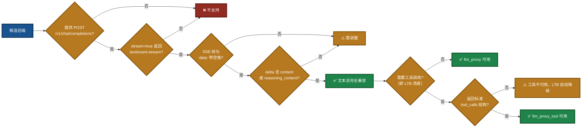
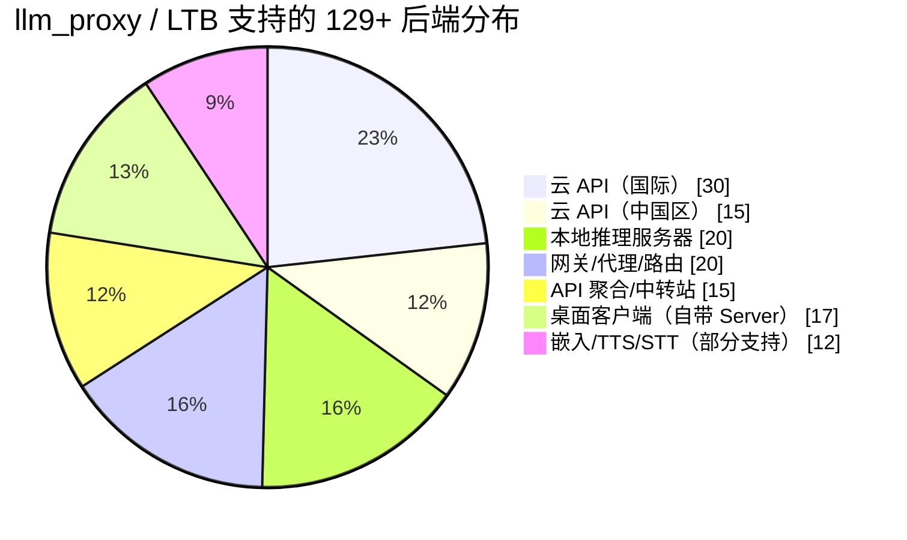

# LingoFuse LLM Proxy 兼容性指南

> **文档版本**：V3.1  
> **适用组件**：`llm_proxy.exe`、`llm_proxy_tool.exe`（LTB）  
> **最后更新**：2026-09-14  
> **相关文档**（同目录）：
> - 生态体系使用指南：`LingoFuse_LLM_Ecosystem_User_Guide.md`
> - 代理命令行手册：`LingoFuse_LLM_Proxy_CLI_Guide.md`
> - 服务端命令行手册：`LingoFuse_LLM_Service_CLI_guide.md`
> - 踩坑大全：`LingoFuse_LLM_Pitfalls_For_AI.md`
> - 版本演进总结：`LingoFuse_LLM_Service_Work_Summary.md`
> - llama-cpp-python 安装：`llama_cpp_python_guide.md`

**本次更新（V3.1）** 修正内容：
- 标题下补充 `llm_proxy_tool.exe`（LTB）为**同样适用**的组件，避免读者误以为本文档只覆盖纯文本代理。
- 第一章明确区分 **文本流兼容性**（本文档判据）与 **工具调用能力**（LTB 独有要求）。
- 第十章「已知限制」中「不支持 Function Calling」修正为「**`llm_proxy.exe` 不支持 Function Calling；`llm_proxy_tool.exe`（LTB）通过服务端代管工具执行支持**」——避免误伤 LTB 场景。
- 第十章新增一条限制：「**LTB 要求后端在 `tool_calls` 时返回标准 OpenAI 结构**」。
- 第十一章「支持统计」表格补注「该清单对 `llm_proxy.exe` 与 `llm_proxy_tool.exe` 均适用」。
- 全文所有「llm_proxy」在需要区分二者的语境下，明确写成「`llm_proxy.exe`（LTB 场景下为 `llm_proxy_tool.exe`）」。

---

## 一、核心支持逻辑

`llm_proxy.exe` 的兼容性判据**极其单一**——它只认一个端点模式：`POST /v1/chat/completions` 配合 `stream=true` 返回 `text/event-stream`。任何符合此协议的服务，无论它是云 API、本地服务器、网关还是桌面应用，均可通过 `--backend-url` 无缝接入。

`llm_proxy_tool.exe`（**LTB**）在此判据之上**额外要求**：当请求中携带 `tools` 字段时，后端需能返回**标准 OpenAI 格式的 `tool_calls`**（详见第十章）。二者的**基础接入规则完全一致**，因此本文档所有关于**后端兼容性**的说明，**对 LTB 同样适用**。

### 图 1：兼容性判定流程



**为什么只有这一条基础判据？** 因为 `llm_proxy.exe` 的实现只做三件事：解析 URL 路径提取 `app` 和 `api`、将请求体原样转发给后端、将后端的 SSE 流逐行解析并映射为 LingoFuse 的 Notify 事件。它不解析业务数据、不校验 `Content-Type`、不关心后端的具体实现。因此，**只要后端在协议层面是 OpenAI 兼容的，`llm_proxy.exe` 就能透传它**。

`llm_proxy_tool.exe` 在此基础上增加的是**请求构造**（注入 `tools` 字段）和**响应解析**（聚合 `tool_calls` 分片），但**依旧不解析业务文本内容**。

**关键匹配点**：

| 匹配点 | llm_proxy / LTB 的对应实现 | 说明 |
|--------|---------------------------|------|
| `POST /v1/chat/completions` | `OpenAIStreamClient.stream_chat()` | 硬编码路径，不支持自定义 |
| `Authorization: Bearer <key>` | `_build_headers()` | 支持自定义 header 名与 scheme |
| `stream=true` → `text/event-stream` | `Accept-Encoding: identity` + `http.client` | 强制不压缩，禁用 Nagle |
| `data: {...}\n\n` SSE 帧 | `for raw_line in resp:` | 只认 `data: `（带空格）前缀 |
| `choices[0].delta.content` | `_extract_delta()` | 映射为 `chunk` 事件 |
| `choices[0].delta.reasoning_content` | `_extract_delta()` | 映射为 `think` 事件 |
| `data: [DONE]` | `stream_chat()` 的 `return` | 流结束标记 |
| `choices[0].delta.tool_calls`（LTB 专属） | `stream_chat()` 的累加器 | 按 `index` 拼接 `arguments` 字符串 |

---

## 二、云 API 提供商

### 2.1 国际主流

| 平台 | Base URL | 路径 | 兼容性理由 |
|------|----------|------|------------|
| OpenAI 官方 | `https://api.openai.com` | `/v1/chat/completions` | **协议原生**，无需任何调整 |
| Azure OpenAI | `<resource>.openai.azure.com` | `/openai/deployments/<name>/chat/completions` | 路径含 deployment 与 api-version，需手工拼接到 `--backend-url` |
| Mistral AI | `https://api.mistral.ai` | `/v1/chat/completions` | **OpenAI 兼容标准**，直接接入 |
| Groq | `https://api.groq.com` | `/openai/v1/chat/completions` | 路径含 `openai` 前缀，**OpenAI SDK 兼容** |
| Together AI | `https://api.together.xyz` | `/v1/chat/completions` | **OpenAI 兼容标准**，直接接入 |
| DeepInfra | `https://api.deepinfra.com` | `/v1/openai/chat/completions` | 路径含 `openai`，兼容 OpenAI 格式 |
| Cerebras | `https://api.cerebras.ai` | `/v1/chat/completions` | **OpenAI 兼容标准**，直接接入 |
| Fireworks AI | `https://api.fireworks.ai` | `/inference/v1/chat/completions` | 路径含 `inference`，兼容 OpenAI 格式 |
| Baseten | `https://inference.baseten.co` | `/v1/chat/completions` | **OpenAI 兼容标准**，直接接入 |
| Cohere | `https://api.cohere.ai` | `/compatibility/v1/chat/completions` | 路径含 `compatibility`，**专门提供 OpenAI 兼容层** |
| xAI (Grok) | `https://api.x.ai` | `/v1/chat/completions` | **OpenAI 兼容标准**，直接接入 |
| Nebius Token Factory | 有 OpenAI 兼容端点 | `/v1/chat/completions` | **OpenAI 兼容标准**，直接接入 |
| DigitalOcean Serverless Inference | 有 OpenAI 兼容端点 | `/v1/chat/completions` | **OpenAI 兼容标准**，直接接入 |
| Perplexity | `https://api.perplexity.ai` | `/chat/completions` | 搜索增强，兼容 OpenAI 格式 |
| Hugging Face Inference | `https://router.huggingface.co` | `/v1/chat/completions` | **OpenAI 兼容标准**，直接接入 |
| OpenRouter | `https://openrouter.ai` | `/api/v1/chat/completions` | **聚合 300+ 模型**，统一 OpenAI 兼容 API |
| Cloudflare Workers AI | `https://api.cloudflare.com/client/v4/accounts/<id>/ai/v1` | `/chat/completions` | 需 account id，**OpenAI 兼容格式** |
| GitHub Models | `https://models.inference.ai.azure.com` | `/chat/completions` | 需 GitHub token，**OpenAI 兼容格式** |
| SambaNova | 有 OpenAI 兼容端点 | `/v1/chat/completions` | **OpenAI 兼容标准**，直接接入 |
| Hyperbolic | 有 OpenAI 兼容端点 | `/v1/chat/completions` | **OpenAI 兼容标准**，直接接入 |
| Novita AI | 有 OpenAI 兼容端点 | `/v1/chat/completions` | **OpenAI 兼容标准**，直接接入 |
| Anyscale Endpoints | 有 OpenAI 兼容端点 | `/v1/chat/completions` | **OpenAI 兼容标准**，直接接入 |
| Replicate | 有 OpenAI 兼容端点 | `/v1/chat/completions` | **OpenAI 兼容标准**，直接接入 |
| AI21 Labs | 有 OpenAI 兼容端点 | `/v1/chat/completions` | **OpenAI 兼容标准**，直接接入 |
| Writer | 有 OpenAI 兼容端点 | `/v1/chat/completions` | **OpenAI 兼容标准**，直接接入 |
| GMI Cloud | `https://api.gmi-serving.com/v1` | `/chat/completions` | **OpenAI 兼容标准**，直接接入 |
| Voyage AI | 嵌入为主 | `/v1/embeddings` | **部分支持**，代理不转发此端点 |
| Jina AI | 嵌入为主 | `/v1/embeddings` | **部分支持**，代理不转发此端点 |
| Mixedbread AI | 嵌入 / 重排序 | `/v1/embeddings` | **部分支持**，代理不转发此端点 |
| Nomic AI | 嵌入为主 | `/v1/embeddings` | **部分支持**，代理不转发此端点 |
| LLM7.io | `https://api.llm7.io/v1` | `/chat/completions` | 无需注册，**OpenAI 兼容格式** |

### 2.2 中国区主流

| 平台 | Base URL | 路径 | 兼容性理由 |
|------|----------|------|------------|
| DeepSeek | `https://api.deepseek.com` | `/v1/chat/completions` | **OpenAI 兼容标准**，直接接入 |
| 硅基流动 (SiliconFlow) | `https://api.siliconflow.cn` | `/v1/chat/completions` | **200+ 模型**，统一 OpenAI 兼容 API |
| 阿里云 DashScope (百炼) | `https://dashscope.aliyuncs.com/compatible-mode` | `/v1/chat/completions` | **专门提供 `compatible-mode` 兼容层** |
| 火山引擎 (豆包) | `https://ark.cn-beijing.volces.com/api/v3` | `/chat/completions` | **OpenAI 兼容格式**，直接接入 |
| 智谱 (GLM) | `https://open.bigmodel.cn/api/paas/v4` | `/chat/completions` | **OpenAI + Anthropic 双协议兼容** |
| MiniMax | `https://api.minimax.chat/v1` | `/chat/completions` | **OpenAI + Anthropic SDK 兼容** |
| 月之暗面 (Moonshot) | `https://api.moonshot.cn/v1` | `/chat/completions` | **OpenAI 兼容格式**，直接接入 |
| 零一万物 (Yi) | `https://api.lingyiwanwu.com/v1` | `/chat/completions` | **OpenAI 兼容格式**，直接接入 |
| 百川智能 | `https://api.baichuan-ai.com/v1` | `/chat/completions` | **OpenAI 兼容格式**，直接接入 |
| 腾讯混元 | `https://api.hunyuan.cloud.tencent.com/v1` | `/chat/completions` | **OpenAI 兼容格式**，直接接入 |
| 百度文心 | `https://qianfan.baidubce.com/v2` | `/chat/completions` | 需百度云 AK/SK，**OpenAI 兼容格式** |
| 讯飞星火 | `https://spark-api-open.xf-yun.com/v1` | `/chat/completions` | **OpenAI 兼容格式**，直接接入 |
| 阶跃星辰 | `https://api.stepfun.com/v1` | `/chat/completions` | **OpenAI 兼容格式**，直接接入 |
| 商汤日日新 | 有 OpenAI 兼容端点 | `/v1/chat/completions` | **OpenAI 兼容格式**，直接接入 |
| 昆仑万维天工 | 有 OpenAI 兼容端点 | `/v1/chat/completions` | **OpenAI 兼容格式**，直接接入 |

---

## 三、本地推理服务器

| 服务器 | 默认端点 | 兼容性理由 |
|--------|----------|------------|
| **LM Studio** | `http://localhost:1234/v1/chat/completions` | **已实测**，提供 `/v1/chat/completions` + `/v1/responses` |
| **llama.cpp (llama-server)** | `http://localhost:8080/v1/chat/completions` | **官方实现 OpenAI 兼容端点**，支持 chat + completions + embeddings |
| **vLLM** | `http://localhost:8000/v1/chat/completions` | **官方实现 OpenAI 兼容**，支持 Completions + Chat + Embeddings |
| **Ollama** | `http://localhost:11434/v1/chat/completions` | **0.1.0+ 原生内置 OpenAI 兼容** |
| **LocalAI** | `http://localhost:8080/v1/chat/completions` | **Drop-in OpenAI 替代**，无需修改客户端 |
| **Text Generation Inference (TGI)** | `http://localhost:8080/v1/chat/completions` | **HuggingFace 官方方案**，OpenAI 兼容 |
| **SGLang** | `http://localhost:30000/v1/chat/completions` | **原生 OpenAI 兼容**，直接接入 |
| **TabbyAPI** | 有 OpenAI 兼容端点 | **Exllama 官方 API**，OpenAI 兼容 |
| **KoboldCPP** | 有 OpenAI 兼容端点 | **内置 OpenAI 兼容端点** |
| **text-generation-webui** | 有 OpenAI 兼容扩展 | **通过扩展提供 OpenAI 兼容** |
| **MLX Omni Server** | Apple Silicon 专用 | **MLX 框架的 OpenAI 兼容服务器** |
| **Kronk** | 基于 llama.cpp | **GPU 加速 + 音频转录**，OpenAI 兼容 |
| **Shimmy** | 纯 Rust WebGPU 推理 | **单二进制，GGUF 原生，OpenAI 兼容** |
| **Lemonade Server** | `http://localhost:13305/api/v1` | **77+ 内置模型**，OpenAI 兼容 |
| **OpenLLM (BentoML)** | 一键部署 | **一条命令将任意开源 LLM 部署为 OpenAI 兼容 API** |
| **MLC LLM** | 有 OpenAI 兼容端点 | **跨平台编译，OpenAI 兼容** |
| **LitGPT** | 有 OpenAI 兼容端点 | **Lightning AI 方案**，OpenAI 兼容 |
| **xinfer** | 纯 Rust 推理 | **无 PyTorch 依赖**，OpenAI 兼容 |
| **paddock** | NVIDIA GPU 原生 Rust | **OpenAI + Anthropic 双协议兼容** |
| **hipEngine** | FastAPI 层 | **torch-free**，OpenAI 兼容 |
| **Fake OpenAI Server** | 嵌入 / 重排序 | **本地测试用**，OpenAI 兼容 |
| **Dify 本地部署** | 有 OpenAI 兼容端点 | **LLMOps 平台**，OpenAI 兼容 |
| **LLM-Proxy (Nayjest)** | 有 OpenAI 兼容端点 | **轻量代理**，OpenAI 兼容 |

---

## 四、网关 / 代理 / 路由

| 网关 | 语言 | 兼容性理由 |
|------|------|------------|
| **LiteLLM** | Python | **100+ 提供商支持**，统一 OpenAI 兼容路由 |
| **Portkey Gateway** | TypeScript | **MIT 许可**，含护栏与路由，OpenAI 兼容 |
| **Helicone AI Gateway** | Rust | **轻量，可观测性**，OpenAI 兼容 |
| **OmniRoute** | TypeScript | **351 提供商**，自动格式转换，OpenAI 兼容 |
| **New API** | Go | **开源 AI 网关**，OpenAI 兼容 |
| **GoModel** | Go | **轻量统一 API**，OpenAI 兼容 |
| **Bifrost** | Go | **23+ 提供商**，OpenAI 兼容 |
| **Vercel AI Gateway** | 云服务 | **100+ 模型**，OpenAI 兼容 |
| **Cloudflare AI Gateway** | 云服务 | **Cloudflare 原生**，OpenAI 兼容 |
| **Braintrust** | 云服务 | **含可观测性**，OpenAI 兼容 |
| **AISIX** | 云服务 | **企业级治理**，OpenAI 兼容 |
| **Higress** | Go | **阿里开源网关**，OpenAI 兼容 |
| **LLM0 Gateway** | — | **开源**，OpenAI 兼容 |
| **freellmapi-proxy** | — | **聚合 14+ 免费提供商**，OpenAI 兼容 |
| **ProxyGateLLM** | — | **聚合 22 提供商**，OpenAI 兼容 |
| **neurogate** | — | **聚合 20 免费提供商**，OpenAI 兼容 |
| **Brick** | — | **AI 模型路由网关**，OpenAI 兼容 |
| **venagate** | TypeScript | **60+ AI 提供商**，OpenAI 兼容 |
| **CLIProxyAPI** | — | **包装 CLI 工具为 API**，OpenAI 兼容 |
| **gptoss-proxy** | JavaScript | **GPT-OSS 专用**，OpenAI 兼容 |
| **Kong AI Gateway** | Lua | **Kong 生态**，OpenAI 兼容 |
| **APIClaw** | — | **20 Direct Call 提供商**，OpenAI 兼容 |

---

## 五、API 聚合 / 中转站

| 平台 | 兼容性理由 |
|------|------------|
| **OpenRouter** | **300+ 模型聚合**，统一 OpenAI 兼容端点 |
| **Ollama Cloud** | **400+ 模型，云端 GPU**，OpenAI 兼容 |
| **Kluster AI** | **有免费额度**，OpenAI 兼容 |
| **Free-The-Ai** | **50+ 模型，免费**，OpenAI 兼容 |
| **FreeLLMAPI** | **14 家平台免费额度聚合**，约 13 亿 tokens/月 |
| **proaiapi.tech** | **企业级首选**，OpenAI 兼容 |
| **n1n.ai** | **企业级专线**，OpenAI 兼容 |
| **PoloAPI** | **老牌，折扣力度大**，OpenAI 兼容 |
| **星链 4SAPI** | **边缘节点优化**，OpenAI + Anthropic + Gemini 三协议 |
| **云雾 API (YUNWU)** | **国内中转**，OpenAI 兼容 |
| **玄枢 API (XuanShu API)** | **国内中转**，OpenAI 兼容 |
| **TeamoRouter** | **OpenAI / Anthropic / Gemini 兼容** |
| **CometAPI** | **多模型路由**，OpenAI 兼容 |
| **OfoxAI** | **100+ LLM 统一 OpenAI 兼容网关** |
| **Eden AI** | **多模态聚合**，OpenAI 兼容 |

---

## 六、桌面客户端（自带 OpenAI 兼容 Server）

| 工具 | 平台 | 兼容性理由 |
|------|------|------------|
| **LM Studio** | Windows / macOS / Linux | **GUI + 内置 server**，已实测 |
| **GPT4All** | Windows / Linux / macOS | **开源，全 GPU 加速**，内置 OpenAI 兼容 |
| **Jan** | Windows / macOS / Linux | **开源桌面客户端，内置 server** |
| **Ollama** | Windows / macOS / Linux | **CLI + 内置 server** |
| **Lobe Chat** | Windows / macOS / Linux | **桌面版，数十个模型** |
| **PyGPT** | 桌面助手 | **支持 OpenAI / Gemini / Claude** |
| **OOLIS** | 桌面 | **100% 离线**，兼容 OpenAI |
| **Msty** | macOS / Windows / Linux | **多模型桌面客户端** |
| **Elvean** | macOS | **AI 客户端**，OpenAI 兼容 |
| **LLM FX** | 桌面客户端 | **简单桌面 LLM 客户端** |
| **TurboLLM** | 桌面 | **自动调优 GPU**，OpenAI 兼容 |
| **RWKV Runner** | 桌面 | **RWKV 专用，兼容 OpenAI API** |
| **ChatQT** | Linux (Flatpak) | **简洁 AI 客户端**，OpenAI 兼容 |
| **Sigma Oasis** | macOS / Windows / Linux | **基于 LM Studio** |
| **local-chat** | 跨平台 | **Electron，支持 MCP** |
| **Delta** | 离线优先 | **内置 OpenAI 兼容 API** |
| **AI Server Studio** | 桌面 | **内置 llama.cpp + OpenAI 兼容 API** |

---

## 七、嵌入 / 重排序 / TTS / STT（部分支持）

以下服务暴露 OpenAI 兼容端点，但 `llm_proxy.exe`（以及 LTB）只转发 `/v1/chat/completions`。如需要这些能力，客户端需直连。

| 服务器 | 端点 | 兼容性理由 |
|--------|------|------------|
| **Hugging Face TEI** | `/v1/embeddings` | **OpenAI 兼容嵌入端点** |
| **AINative embedding-service** | `/v1/embeddings` | **OpenAI 兼容嵌入端点** |
| **api-embedding** | `/v1/embeddings` | **OpenAI 兼容嵌入端点** |
| **jina-embeddings-v4 server** | `/v1/embeddings` | **OpenAI 兼容嵌入端点** |
| **tts-server** | OpenAI 兼容 TTS | **OpenAI 兼容音频端点** |
| **omnivoice-server** | OpenAI 兼容 TTS | **OpenAI 兼容音频端点** |
| **supertonic-server** | OpenAI 兼容 TTS | **OpenAI 兼容音频端点** |
| **ChatTTS-OpenAI-API** | OpenAI 兼容音频 | **OpenAI 兼容音频端点** |
| **Speaches** | OpenAI 兼容 STT/TTS | **OpenAI 兼容音频端点** |
| **speech-server** | OpenAI 兼容 TTS + STT | **OpenAI 兼容音频端点** |
| **VoiceStudio** | OpenAI 兼容 TTS & STT | **OpenAI 兼容音频端点** |
| **museq** | 23 种模态 | **OpenAI 兼容多模态** |

---

## 八、启动命令速查

```bash
# ===== 本地推理 =====
# LM Studio
llm_proxy.exe --backend-url http://127.0.0.1:1234/v1

# llama.cpp
llm_proxy.exe --backend-url http://127.0.0.1:8080/v1

# Ollama
llm_proxy.exe --backend-url http://127.0.0.1:11434/v1

# vLLM
llm_proxy.exe --backend-url http://127.0.0.1:8000/v1

# Lemonade Server
llm_proxy.exe --backend-url http://127.0.0.1:13305/api/v1

# ===== 云 API =====
# DeepSeek
llm_proxy.exe --backend-url https://api.deepseek.com/v1 \
  --backend-key sk-xxx --backend-model deepseek-chat

# SiliconFlow
llm_proxy.exe --backend-url https://api.siliconflow.cn/v1 \
  --backend-key sk-xxx --backend-model deepseek-ai/DeepSeek-V3

# OpenRouter
llm_proxy.exe --backend-url https://openrouter.ai/api/v1 \
  --backend-key sk-or-xxx \
  --backend-extra-headers '{"HTTP-Referer":"https://example.com"}'

# Groq
llm_proxy.exe --backend-url https://api.groq.com/openai/v1 \
  --backend-key gsk_xxx

# ===== 网关 =====
# LiteLLM
llm_proxy.exe --backend-url http://127.0.0.1:4000/v1

# ===== Azure OpenAI（需手工拼接路径） =====
llm_proxy.exe \
  --backend-url "https://<resource>.openai.azure.com/openai/deployments/<name>" \
  --backend-key xxx \
  --backend-auth-header api-key \
  --backend-auth-scheme ""

# ===== LTB（llm_proxy_tool.exe）：在以上任意命令基础上追加工具参数 =====
llm_proxy_tool.exe \
  --backend-url http://127.0.0.1:1234/v1 \
  --mcp-reg-agent-app llm_proxy_agent \
  --mcp-tool-provider-app agent_main_app
```

> **提示**：源码模式下将 `llm_proxy.exe` / `llm_proxy_tool.exe` 替换为 `python llm_proxy.py` / `python llm_proxy_tool.py` 即可。

---

## 九、接入验证

在将任何后端接入 `llm_proxy.exe`（或 LTB）前，用以下命令验证：

```bash
curl -N -X POST http://127.0.0.1:1234/v1/chat/completions \
  -H "Content-Type: application/json" \
  -d '{"model":"<模型 id>","messages":[{"role":"user","content":"hi"}],"stream":true}'
```

| 检查项 | 通过条件 | 不通过的应对 |
|--------|----------|--------------|
| HTTP 状态 | `200 OK` | 检查 `--backend-url` 与 `--backend-model` |
| Content-Type | `text/event-stream` | 后端未开启流式 |
| 帧前缀 | `data: `（含尾随空格） | 若为 `data:{...}` 需扩展 |
| 输出节奏 | 逐 token 逐行实时 | 若整段输出，检查 gzip |
| delta 字段 | 含 `content` 或 `reasoning_content` | 若否则扩展 `_extract_delta` |
| 结束标记 | `data: [DONE]` | 若缺失，后端未完整实现 SSE |

### 9.1 LTB 额外验证（需要工具调用时）

```bash
curl -N -X POST http://127.0.0.1:1234/v1/chat/completions \
  -H "Content-Type: application/json" \
  -d '{
    "model":"<模型 id>",
    "messages":[{"role":"user","content":"5+7 等于几？"}],
    "stream":true,
    "tools":[{
      "type":"function",
      "function":{
        "name":"add",
        "description":"Add two integers",
        "parameters":{
          "type":"object",
          "properties":{
            "a":{"type":"integer"},
            "b":{"type":"integer"}
          },
          "required":["a","b"]
        }
      }
    }]
  }'
```

**判据**：

- SSE 流中应出现 `delta.tool_calls` 字段。
- 所有分片的 `arguments` 应按 `index` 拼接后形成合法 JSON（如 `{"a":5,"b":7}`）。
- 若后端**始终返回纯文本而不触发 `tool_calls`**，说明模型不支持 Function Calling，或未正确配置 `tool_choice`。

---

## 十、已知限制

| 限制 | 说明 |
|------|------|
| **`llm_proxy.exe` 不支持 Function Calling** | 纯文本透传模式，`_extract_delta` 只识别 `content` / `reasoning_content`。**需要 Function Calling 时请用 `llm_proxy_tool.exe`（LTB）**，它在服务端代管工具调用。 |
| **LTB 要求后端在 `tool_calls` 时返回标准 OpenAI 结构** | 即每个 `tool_call` 包含 `index` / `id` / `type: "function"` / `function.name` / `function.arguments`（字符串）。非标准结构（如自定义字段名）需修改 `OpenAIStreamClient.stream_chat` 适配。 |
| 不支持 `set_system_message` | 代理为无状态转发器，会话中途无法切换 system prompt。LTB 同理。 |
| 只认 `/v1/chat/completions` | 不支持 `/completions`、`/responses`、`/embeddings`、`/audio/*` |
| options 白名单 | 仅转发 5 个字段（`max_tokens` / `temperature` / `top_p` / `top_k` / `repeat_penalty`），`seed` / `stop` / `response_format` 等被静默丢弃。LTB 额外转发 `tools` / `tool_choice`。 |
| Azure OpenAI | 路径含 deployment + api-version，需手工拼接到 `--backend-url` |
| 非标准 SSE 帧 | `data:{...}` 无空格会丢帧，反代需保留原格式 |
| 未校验 Content-Type | 后端返回非 SSE 时静默结束，客户端收到空 `finish` |
| 不支持并发工具执行 | LTB 按顺序执行 `tool_calls`，不并发。单轮多工具场景下，串行等待可能增加延迟。 |
| LTB 工具列表不支持运行时刷新 | 启动时拉取一次，运行期间不感知后端工具变化。需重启 LTB 才能感知。 |

---

## 十一、支持统计

### 图 2：后端分布



| 类别 | 数量 |
|------|:----:|
| 云 API 提供商（国际） | 30+ |
| 云 API 提供商（中国区） | 15+ |
| 本地推理服务器 | 20+ |
| 网关 / 代理 / 路由 | 20+ |
| API 聚合 / 中转站 | 15+ |
| 桌面客户端（自带 Server） | 17+ |
| 嵌入 / TTS / STT（部分支持） | 12+ |
| **合计** | **129+** |

> **说明**：该清单对 **`llm_proxy.exe`（纯文本代理）与 `llm_proxy_tool.exe`（LTB，服务端工具执行）均适用**。LTB 的核心差异仅在于它会在请求中注入 `tools` 字段，并要求后端在需要时返回标准 `tool_calls` 结构。基础 SSE 客户端完全一致。

---

## 十二、相关文档（同目录）

| 文档 | 说明 |
|------|------|
| `LingoFuse_LLM_Ecosystem_User_Guide.md` | 闭环架构与生态总览 |
| `LingoFuse_LLM_Proxy_CLI_Guide.md` | `llm_proxy.exe` 命令行手册（LTB 参数另见 `llm_proxy_tool.py --help`） |
| `LingoFuse_LLM_Service_CLI_guide.md` | `llm_service.exe` 命令行手册 |
| `LingoFuse_LLM_Pitfalls_For_AI.md` | 踩坑大全，症状-根因-正确做法 |
| `LingoFuse_LLM_Service_Work_Summary.md` | 版本演进与架构决策（历史参考） |
| `llama_cpp_python_guide.md` | `llama-cpp-python` 安装与使用 |

---

**文档版本**：V3.1（区分 llm_proxy 与 LTB 的兼容性判据，修正 Function Calling 限制说明，补充 LTB 工具调用验证流程）  
**维护者**：LingoFuse-pasAgent 团队  
**反馈**：问题提 Issue，急事加 Q（600585）