# LingoFuse LLM 工具链工作总结

> **文档路径**：`LingoFuse_LLM_Service_Work_Summary.md`  
> **版本**：v5.1  
> **涵盖周期**：2026-08-31 ~ 2026-09-14  
> **涉及组件**：Python 服务端、Python 代理层、Python 工具桥（LTB）、Python 客户端、Pascal 客户端、Pascal GUI、工程脚本、全套文档  
> **相关文档**（同目录）：
> - 生态体系使用指南：`LingoFuse_LLM_Ecosystem_User_Guide.md`
> - 服务端命令行手册：`LingoFuse_LLM_Service_CLI_guide.md`
> - 代理命令行手册：`LingoFuse_LLM_Proxy_CLI_Guide.md`
> - 代理兼容性指南：`LingoFuse_LLM_Proxy_Compatibility_Guide.md`
> - 踩坑大全：`LingoFuse_LLM_Pitfalls_For_AI.md`
> - llama-cpp-python 安装：`llama_cpp_python_guide.md`

**本次更新（v5.1）** 修正内容：
- 「二、时间线」阶段 D 中 `LTB v2.0 / v2.1` 的日期描述修正：`LTB v2.0` 与阶段 C 收尾在同日（9/14），`LTB v2.1` 为 9/14 当日追加修复；避免日期跨度误读。
- 「六、会话双条件回收」中明确 `llm_proxy.exe` / `llm_proxy_tool.exe` 使用**单条件**（仅超时），`llm_service.exe` 使用**双条件**。
- 「七、`--help` 自适应机制」中此前误写「三个 Python 工具」，修正为「**四个**」（`llm_service.py` / `llm_proxy.py` / `llm_proxy_tool.py` / `llm_test.py`）。
- 「八、缺陷修复历程」阶段 D 表格中的 `D1`–`D9` 编号补入 **D10**（`--mcp-reg-agent-app` 默认值 `llm_proxy_agent` 与 `mcp_api_tool` 的 `reg_agent` 互不冲突）。
- 「十八、交付物清单」子目录文档表格补入 `pascal_agent_api_ref_json.md`、`lingofuse/Bridge_User_Guide.md`；文档清单去重。
- 「十九、经验总结」六条铁律第 6 条补注：`mcp_api_tool` 与 `llm_proxy_tool` **可以**同时运行（不同 `reg_agent` 名），但 LTB 与 `llm_service` / `llm_proxy` **不能**（共享端点）。
- 全文版本号统一至 2026-09-14 实际值（`llm_service.py` v3.3、`llm_proxy.py` v1.8、`llm_proxy_tool.py` v2.1、`llm_test.py` v3.6）。

---

## 阅读引导

本文档是**版本演进与架构决策的历史记录**。如果你是：

- **想了解工具链全貌** → 读第一章「工作概览」和第二章「时间线」。
- **想知道每个阶段做了什么** → 读第三、四、五章（服务端 / 代理层 / 代理层工具执行）。
- **想了解缺陷修复历程** → 读第八章。
- **想了解协议演进** → 读第九章。
- **想了解遗留问题** → 读第二十章。
- **想直接上手** → 请转向 `LingoFuse_LLM_Ecosystem_User_Guide.md`。

---

## 一、工作概览

本次工作围绕 **LingoFuse LLM 工具链** 展开，覆盖 **Python 服务端 / 代理层 / 工具桥 / 客户端** 与 **Pascal 客户端 / GUI** 两大语言生态，经历**四个主要阶段**：

1. **阶段 A（8/31 ~ 9/10）—— 服务端重构**  
   把最初一个**单会话、无状态、串行**的 LLM 网关，升级为**多会话、持久化、结构化协议**的工业级组件（`llm_service.py` v3.0）。
2. **阶段 B（9/11 ~ 9/13）—— 代理层与生态**  
   新增 **`llm_proxy.py`** —— 一个无状态转发器，把 LingoFuse 二进制 RPC 桥接到任何 OpenAI 兼容 HTTP 后端，并同步升级所有客户端与文档。
3. **阶段 C（9/13 ~ 9/14）—— 工具链收尾**  
   统一四个 Python 工具的 `--help` 自适应；引入**跨语言 API 能力矩阵机制**；升级会话回收为**双条件判断**；一次性编译 EXE 的脚本；补齐依赖清单与兼容性指南；对所有交付文件做交叉审查。
4. **阶段 D（9/14）—— 代理层工具执行（LTB 引入）**  
   新增 **`llm_proxy_tool.py`（LLM Tool Bridge，LTB）** —— 在代理层基础上增加**服务端侧工具执行**能力：MCP 工具发现、多轮 `tool_calls` 循环、结果回填，**客户端对工具完全无感知**。与 `mcp_api_tool.py` 使用不同 `reg_agent` 名字，可同时运行。

### 一句话总结

> **从"能跑"到"能扛"，再到"能对接全世界"，再到"全生态对齐"，最后到"客户端零改动即可享受工具能力"：19 项服务端缺陷修复 + 8 次代理层迭代 + 一套跨语言 API 能力矩阵 + 服务端侧工具执行闭环 + 全栈文档与工程脚本。**

### 图 1：交付物一览

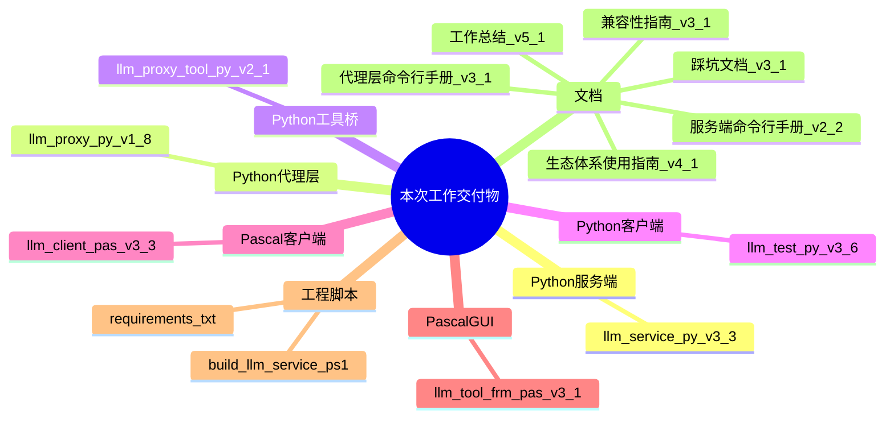

---

## 二、时间线与版本演进

### 2.1 四阶段时间轴

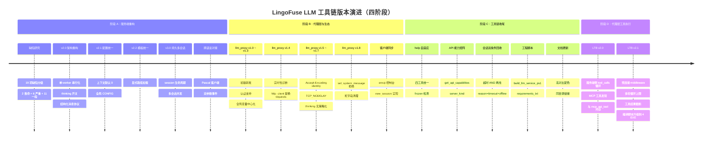

> **关于阶段 D 的日期**：LTB 在阶段 C 收尾同日开始开发（9/14），v2.0 与 v2.1 在同一日内连续完成。上图中并列显示是为了叙事完整性，不代表跨日跨度。

### 2.2 版本编号对照

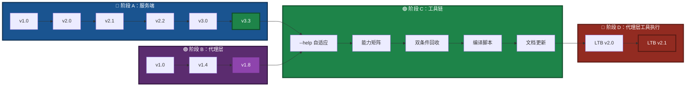

---

## 三、服务端架构演进（阶段 A）

### 3.1 架构对比：v1.0 与 v3.0

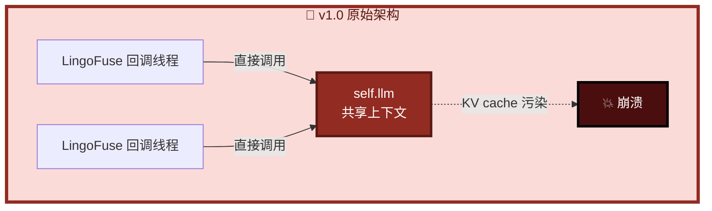

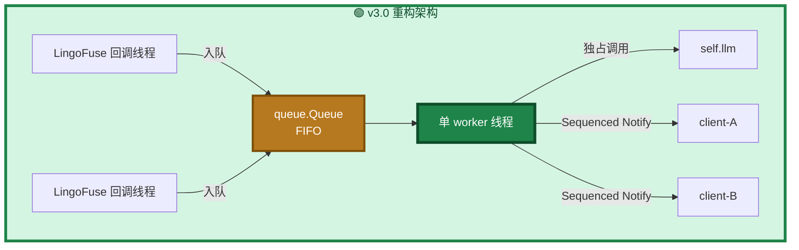

**核心洞察**：llama.cpp 的 `llama_context` 是**单线程状态机**，v1.0 的多线程直调会导致进程级 abort。v3.0 用**单 worker 串行化**彻底消除这个类别的问题。

### 3.2 组件分层

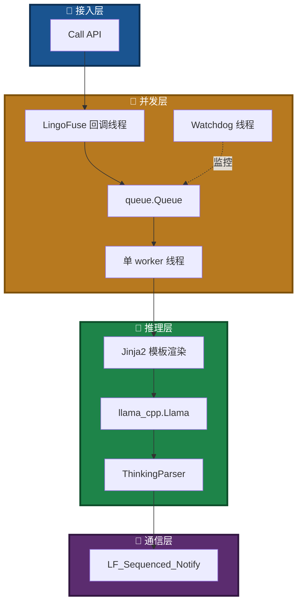

---

## 四、代理层架构（阶段 B + 阶段 D）

### 4.1 llm_proxy 的角色定位（阶段 B）

`llm_proxy.py` 是一个 **LingoFuse 服务端**，但它的内部逻辑与 `llm_service.py` 完全不同：它不加载模型，只做协议翻译。

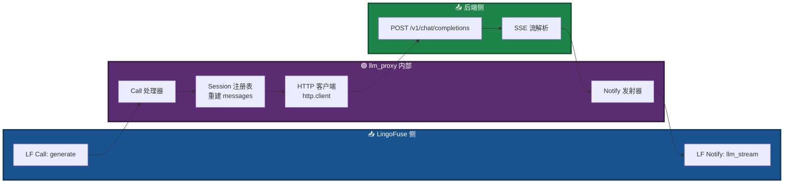

### 4.2 无状态语义下的会话处理

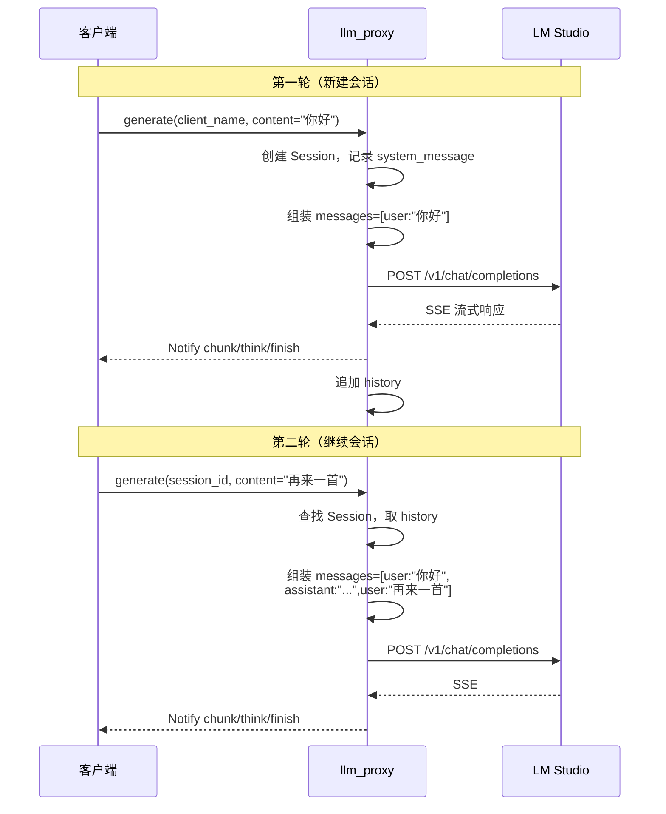

**要点**：代理**不持有**模型 KV cache，每轮请求都**重新组装**完整 messages 数组发给后端。

### 4.3 SSE 传输层的发现之旅（阶段 B 核心攻坚）

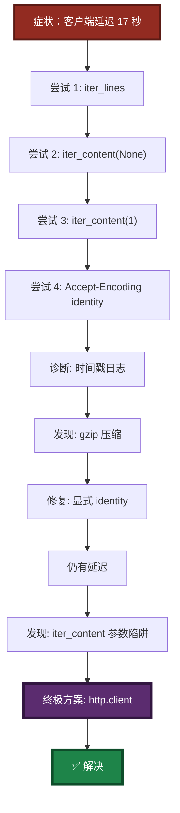

**三层缓冲，缺一不可**：

| 层 | 缓冲源 | 症状 | 修复 |
|----|--------|------|------|
| 1 | `iter_lines()` 内部 512 字节缓冲 | 短 SSE 行攒够才 yield | 换 `iter_content` |
| 2 | `iter_content(None)` = "读直到 EOF" | 整个响应才一次性返回 | 换 `chunk_size=1` |
| 3 | gzip 解码器攒够 deflate 块才吐 | 又是批量输出 | `Accept-Encoding: identity` |
| 4 | `urllib3` 内部预读 socket | 换了前面也还是延迟 | 换 `http.client` |

**最终方案**：`http.client` + `Accept-Encoding: identity` + `TCP_NODELAY`。

### 4.4 thinking 流的处理

**核心决策：代理不做任何策略**。

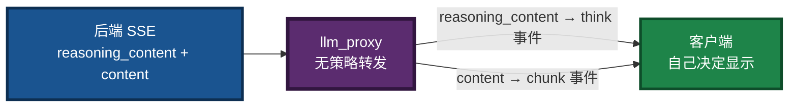

**为什么移除 `--include-thinking` 开关**：是否产生 thinking 由**模型**决定，不由代理决定。客户端想不显示 think 事件，忽略即可。

### 4.5 set_system_message 的拒绝机制

**从"假成功"到"明确拒绝"**：

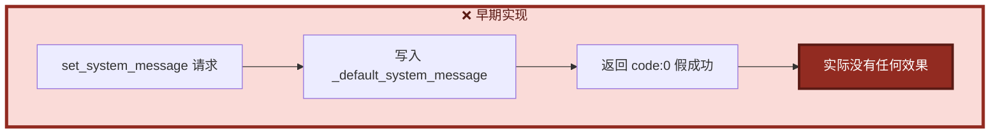

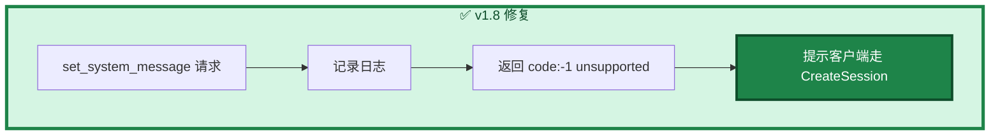

**理由**：代理是无状态转发器，"全局默认 system message"这个概念在其语义下不存在。**撒谎比拒绝更危险**。

### 4.6 LTB 的引入（阶段 D 核心）

#### 4.6.1 设计动机

阶段 B/C 完成后，代理层可以对接外部后端了，但存在一个死角：

- **路径 A（客户端侧工具执行）**：需要 AI 客户端支持 MCP 协议。LM Studio / Claude Desktop / Continue.dev 支持，但**很多客户端不支持**（如部分 Pascal GUI 客户端、自研前端）。
- **用户痛点**：不想为了用工具而专门换客户端。

**LTB 的目标**：让**任何** LingoFuse 客户端（哪怕只知道 `generate`）都能享受工具能力。客户端零改动。

#### 4.6.2 与 llm_proxy.py 的差异对照

| 维度 | `llm_proxy.py` | `llm_proxy_tool.py`（LTB） |
|------|:--------------:|:--------------------------:|
| 定位 | 纯文本透传 | 转发 + **服务端工具执行** |
| MCP 依赖 | 无 | `language_middleware` |
| 工具发现 | 无 | `agent_main` 拉取 MCP 工具列表 |
| tool_calls 循环 | 无 | **内置多轮循环** |
| 客户端对工具感知 | 不需要 | **完全无感** |
| `reg_agent` 名 | — | `llm_proxy_agent`（与 `mcp_api_tool` 的 `reg_agent` 不同） |
| 可用后端 | 129+ OpenAI 兼容 | **同左**（SSE 客户端完全一致） |
| 默认端点 / App 名 | `ipc:llm_service` / `LLM_Service` | **同左**（同时只能跑一个） |

#### 4.6.3 LTB 内部架构

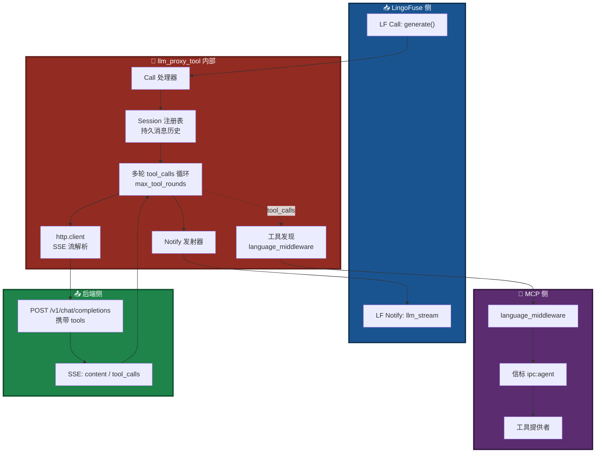

#### 4.6.4 多轮 tool_calls 循环（LTB 独有）

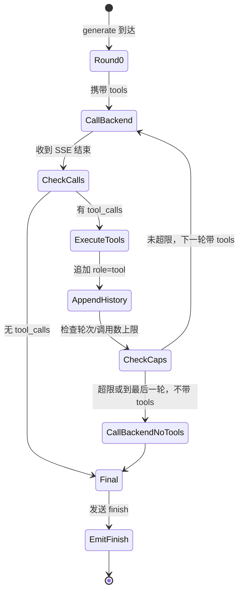

**关键设计**：
- **最后一轮不带 tools**：强制模型产出最终文本，保证循环终止。
- **两重上限**：`max_tool_rounds`（轮次）+ `max_total_tool_calls`（总调用数）。
- **两重截断**：`max_tool_result_chars`（单条结果）+ `max_total_tool_result_chars`（总结果）。

#### 4.6.5 LTB 关键参数

| 参数 | 默认值 | 说明 |
|------|:------:|------|
| `--enable-tools` / `--no-tools` | enabled | 是否启用工具（禁用时行为等价 `llm_proxy`） |
| `--mcp-endpoint` | `ipc:agent` | 信标端点 |
| `--mcp-reg-agent-app` | `llm_proxy_agent` | **必须**与 `mcp_api_tool` 的 `reg_agent` 不同 |
| `--mcp-tool-provider-app` | `agent_main_app` | 工具提供者 App 名 |
| `--max-tool-rounds` | 100 | 单次 `generate` 内最大往返轮次 |
| `--max-total-tool-calls` | 50 | 单次 `generate` 内最多执行工具次数 |
| `--max-tools-per-round` | 10 | 单轮最多处理多少个 tool_calls（OpenAI 允许批量） |
| `--max-tool-result-chars` | 8000 | 单条工具结果最大字符数 |
| `--max-total-tool-result-chars` | 200000 | 单次 `generate` 内所有工具结果总和上限 |
| `--max-history-chars` | 200000 | 单会话消息历史字符数上限 |

#### 4.6.6 与 mcp_api_tool 的共存关系

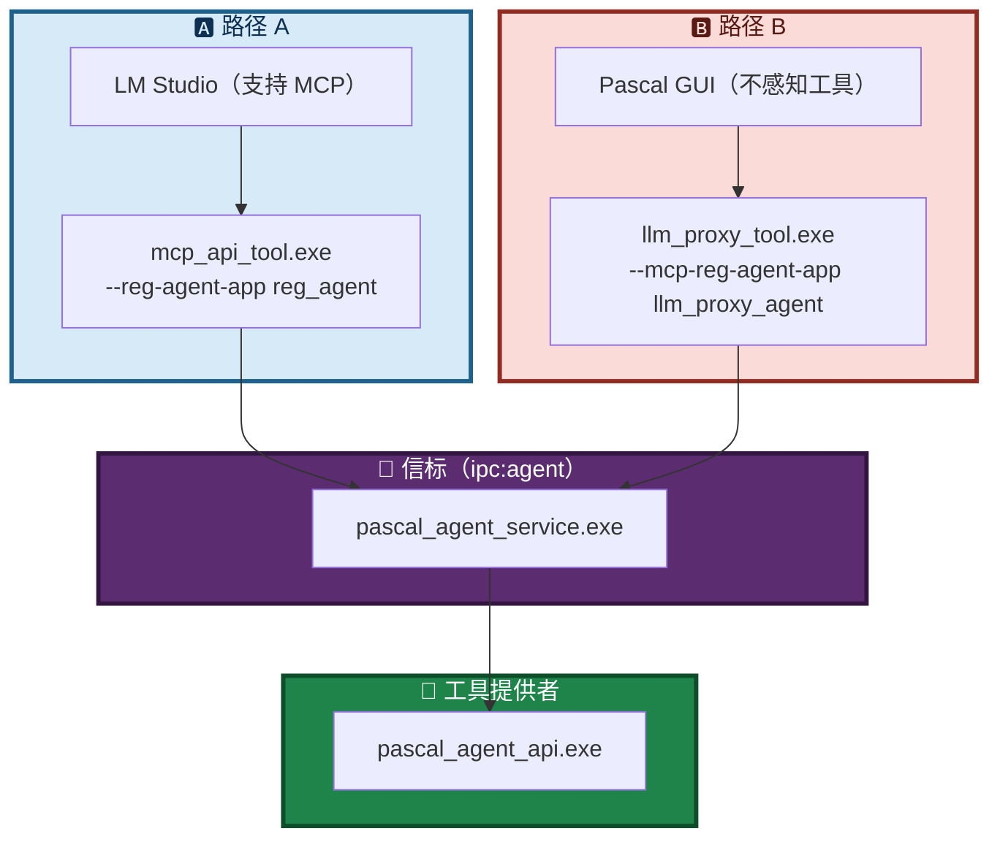

**共存关键**：**两个不同的 `reg_agent` 名字**。二者可同时运行，共享同一信标。

#### 4.6.7 预连接 middleware（顺序敏感）

**关键发现**：`Server.start()` 内部会调用 `LF_PrepareDone()`，一旦主线程启动，`language_middleware._connect()` 再调用 `LF_PrepareDone()` 会返回 0 而非 1，从而**永久禁用工具缓存**。

**修复**：LTB 在 `Server.start()` **之前**先调 `_ensure_tools_ready()`：

```python
# start() 顺序（关键）
self.resolve_model()

# ---- CRITICAL: pre-connect MCP middleware BEFORE Server.start() ----
if CONFIG.enable_tools and _HAS_MIDDLEWARE:
    ok = self._ensure_tools_ready()   # 先赢这场竞争

threading.Thread(target=self._watchdog_loop, ...).start()
self.server.start(CONFIG.endpoint)    # Server.start() 检测到主线程已活动，走 Warning 分支
```

---

## 五、API 能力矩阵机制（阶段 C 引入，阶段 D 扩展）

### 5.1 设计背景

`llm_service.py` / `llm_proxy.py` / `llm_proxy_tool.py` 是**兄弟服务端**，共用同一端点，但功能集不同——`set_system_message` 只在 `llm_service` 中可用；LTB 特有的 `tools` / `tool_calls` / `tool_results` 只在 LTB 中暴露。客户端需要一种机制发现"当前运行的是哪一个"。

### 5.2 能力矩阵结构

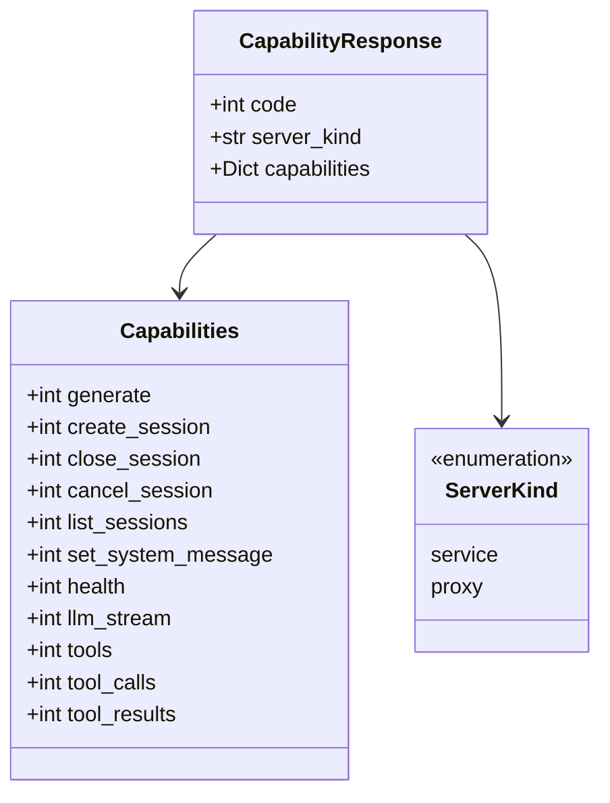

**三种服务端的差异**：

| API | `llm_service` | `llm_proxy` | `llm_proxy_tool`（LTB） |
|-----|:-------------:|:-----------:|:----------------------:|
| `generate` | 1 | 1 | 1 |
| `create_session` | 1 | 1 | 1 |
| `close_session` | 1 | 1 | 1 |
| `cancel_session` | 1 | 1 | 1 |
| `list_sessions` | 1 | 1 | 1 |
| **`set_system_message`** | **1** | **0** | **0** |
| `health` | 1 | 1 | 1 |
| `llm_stream` | 1 | 1 | 1 |
| **`tools`** | — | — | **1** |
| **`tool_calls`** | — | — | **1** |
| **`tool_results`** | — | — | **1** |
| `server_kind` | `"service"` | `"proxy"` | `"proxy"` |

**注意**：`llm_proxy` 与 `llm_proxy_tool` 的 `server_kind` 都是 `"proxy"`；要区分二者，读 `tools` / `tool_calls` 等 LTB 特有字段。

### 5.3 三方能力发现流程

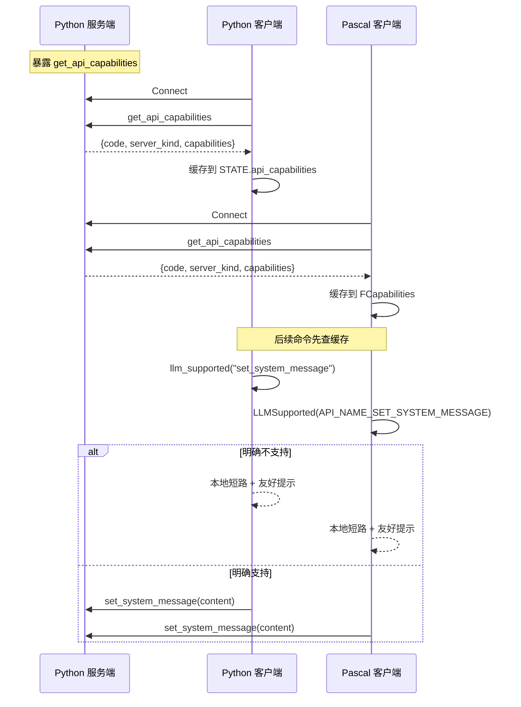

### 5.4 客户端降级行为

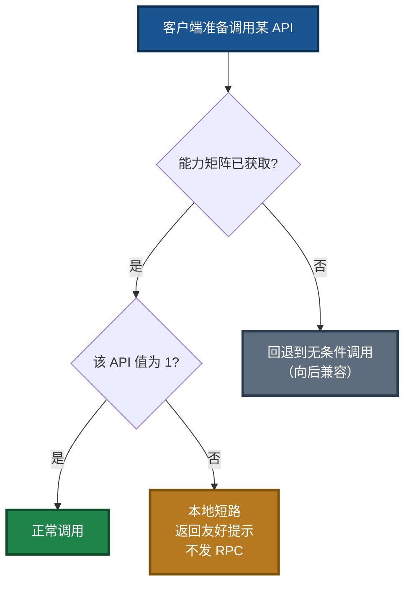

**关键设计**：`HasCapabilityInfo` 与 `LLMSupported` 分离——前者回答"信息可靠吗"，后者回答"支持吗"。这个分离让"未知"与"不支持"得以区分。

---

## 六、会话双条件回收策略（阶段 C 升级）

### 6.1 从单条件到双条件

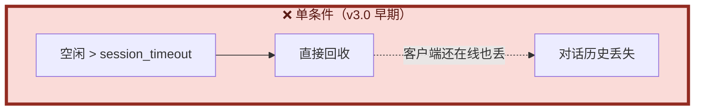

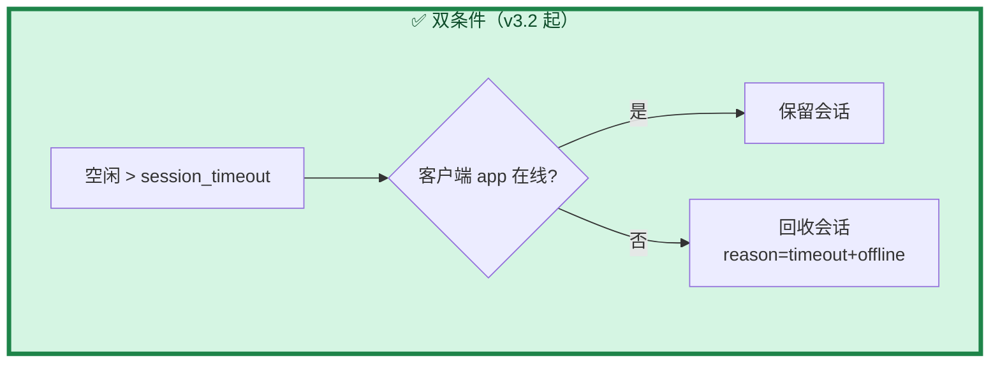

**适用范围**：

- **双条件（超时 + 离线）**：仅 **`llm_service.py`**。它持有模型 KV cache，会话重建成本高，需要更保守的回收策略。
- **单条件（仅超时）**：`llm_proxy.py` / `llm_proxy_tool.py`。二者不持有模型 KV cache，会话仅持有消息历史，回收成本低。

### 6.2 四种组合行为（llm_service 视角）

```mermaid
flowchart TD
    START["Watchdog 每 5 秒扫描"] --> C0{"会话状态 = idle?"}
    C0 -->|否| SKIP["跳过（正在生成）"]
    C0 -->|是| C1{"空闲 > session_timeout?"}
    C1 -->|否| KEEP["保留（未超时）"]
    C1 -->|是| C2{"check_app(client_name)?"}
    C2 -->|"True"| KEEP2["保留（客户端在线）"]
    C2 -->|"False"| CLOSE["回收<br/>reason=timeout+offline"]

    style START fill:#1A5490,stroke:#0D2F52,stroke-width:3px,color:#FFFFFF
    style SKIP fill:#5D6D7E,stroke:#2C3E50,stroke-width:3px,color:#FFFFFF
    style KEEP fill:#1E8449,stroke:#0E4D2A,stroke-width:3px,color:#FFFFFF
    style KEEP2 fill:#1E8449,stroke:#0E4D2A,stroke-width:3px,color:#FFFFFF
    style CLOSE fill:#922B21,stroke:#5A1A14,stroke-width:3px,color:#FFFFFF
```

### 6.3 新增 reason 值

```mermaid
mindmap
  root(("closed reason 取值"))
    client
      客户端主动 close_session
    timeout_offline
      Watchdog 双条件回收（llm_service）
    timeout
      单条件超时回收（llm_proxy / LTB）
    shutdown
      服务端关机
    ephemeral
      一次性会话自动关闭
    error
      创建或推理失败回滚
```

---

## 七、`--help` 自适应机制（阶段 C 新增）

### 7.1 问题与方案

**问题**：源码模式运行时 `--help` 显示 `python xxx.py ...`，打包为 EXE 后仍显示 `python xxx.py`，与实际调用方式不符。

**方案**：**四个** Python 工具（`llm_service.py`、`llm_proxy.py`、`llm_proxy_tool.py`、`llm_test.py`）统一引入三个辅助函数。

```mermaid
flowchart LR
    subgraph DETECT["🔍 检测阶段"]
        D1["is_frozen_exe()"]
        D2["检查 sys.frozen"]
        D3["检查 sys._MEIPASS"]
    end

    subgraph DISPLAY["🖥️ 显示阶段"]
        S1["get_invocation_name()"]
        S2["get_example_invocation()"]
    end

    D1 --> D2
    D1 --> D3
    DETECT --> DISPLAY

    style DETECT fill:#1A5490,stroke:#0D2F52,stroke-width:3px,color:#FFFFFF
    style DISPLAY fill:#1E8449,stroke:#0E4D2A,stroke-width:3px,color:#FFFFFF
```

### 7.2 效果对照

| 运行模式 | usage 显示 | 示例显示 |
|----------|-----------|----------|
| 源码 | `usage: llm_service.py ...` | `python llm_service.py --model-path ...` |
| EXE | `usage: llm_service.exe ...` | `llm_service.exe --model-path ...` |

---

## 八、缺陷修复历程

### 8.1 阶段 A：19 项服务端缺陷

```mermaid
pie showData
    title 阶段 A：19 项缺陷分布
    "致命 P0" : 2
    "严重 P1" : 6
    "一般 P2" : 11
```

### 8.2 严重缺陷修复对照

| ID | 缺陷 | 修复策略 | 版本 |
|----|------|----------|------|
| **F1** | LLM 并发不安全 | 单 worker 线程串行化 | v2.0 |
| **F2** | 会话无管理 | Session 对象 + Watchdog | v3.0 |
| **S1** | system_message 竞态 | 请求时 snapshot | v2.0 |
| **S2** | 上下文预算算错 | tokenize 精确计数 | v2.0 |
| **S3** | 字符串魔法协议 | `type` 字段结构化 | v2.0 |
| **S4** | 双轨错误协议 | 统一 `{code, error}` | v2.0 |
| **S5** | 每 token 新句柄 | 保留（API 约束） | v2.0 |
| **S6** | 双重 cleanup | `_cleaned_up` 幂等标志 | v2.0 |

### 8.3 阶段 B：代理层 8 次迭代的缺陷

| ID | 缺陷 | 症状 | 修复 | 版本 |
|----|------|------|------|------|
| **P1** | 进程秒退 | 启动后立即退出 | 加主循环 + 信号处理 | v1.3 |
| **P2** | SSE 延迟 | 客户端 17 秒才收到 | `http.client` 替换 `requests` | v1.4 |
| **P3** | gzip 干扰 | 批量输出 | `Accept-Encoding: identity` | v1.5 |
| **P4** | Nagle 抖动 | 40ms 级别抖动 | `TCP_NODELAY` | v1.6 |
| **P5** | thinking 开关 | 代理替客户端做策略 | 移除开关，无策略转发 | v1.7 |
| **P6** | set_system_message 假成功 | 返回 code:0 但无效果 | 明确返回 unsupported | v1.8 |
| **P7** | 死字段残留 | `_default_system_message` 无用 | 删除字段 | v1.8 |
| **P8** | 未支持选项静默丢弃 | `thinking`/`ephemeral` 被忽略无记录 | DEBUG 日志记录 | v1.8 |

### 8.4 阶段 C：工具链收尾改动

| ID | 改动 | 组件 | 影响 |
|----|------|------|------|
| **T1** | `--help` 自适应 | **四个** Python 工具 | 用户体验 |
| **T2** | API 能力矩阵机制 | 服务端 + 双客户端 | 协议一致性 |
| **T3** | 会话双条件回收 | `llm_service.py` | 会话稳定性 |
| **T4** | 编译脚本一次性编译 EXE | `build_llm_service.ps1` | 构建效率 |
| **T5** | 依赖清单分场景 | `requirements.txt` | 安装便利性 |
| **T6** | 文档高对比配色 + 同目录链接 | 全部 LingoFuse_LLM*.md | 可读性、可维护性 |

### 8.5 阶段 D：LTB 引入的关键设计点

| ID | 设计点 | 动机 | 实现 |
|----|--------|------|------|
| **D1** | 服务端侧工具执行 | 客户端不支持 MCP 时也能用工具 | `_run_generation` 多轮循环 |
| **D2** | 客户端零改动 | 客户端只发 `generate` | 所有 tool_calls 内部消化 |
| **D3** | 与 mcp_api_tool 共存 | 两条路径并行 | 用不同的 `reg_agent` 名 |
| **D4** | 预连接 middleware | 避免 `Server.start()` 竞争 | 在 `Server.start()` 前调 `_ensure_tools_ready()` |
| **D5** | 多轮循环上限 | 防止模型无限循环 | `max_tool_rounds` + `max_total_tool_calls` |
| **D6** | 结果长度截断 | 防止消息历史爆炸 | `max_tool_result_chars` + `max_total_tool_result_chars` + `max_history_chars` |
| **D7** | 最后一轮不带 tools | 保证循环终止 | `is_final_round` 判定 |
| **D8** | 自动降级 | 工具不可用时行为等价 `llm_proxy` | `--enable-tools` / `_HAS_MIDDLEWARE` / 连接失败判定 |
| **D9** | INFO 级别静默 | 生产部署不刷屏 | 每轮/每工具细节走 DEBUG |
| **D10** | `reg_agent` 名隔离 | 与 `mcp_api_tool` 共存 | 默认 `llm_proxy_agent`（vs `mcp_api_tool` 的 `reg_agent`） |

### 8.6 缺陷修复可视化（象限图）

```mermaid
flowchart TB
    subgraph Q1["🔴 立即修复 —— 影响大 + 复杂度高"]
        direction LR
        F1["F1 并发不安全"]
        F2["F2 会话无管理"]
        P2["P2 SSE 延迟"]
        D1["D1 服务端工具执行"]
    end

    subgraph Q2["🟠 高优先级 —— 影响大 + 复杂度低"]
        direction LR
        P1["P1 进程秒退"]
        P3["P3 gzip 干扰"]
        P6["P6 假成功"]
        S3["S3 字符串魔法"]
        D3["D3 共存命名"]
    end

    subgraph Q3["🟡 一般关注 —— 影响中 + 复杂度中"]
        direction LR
        S1["S1 竞态"]
        S2["S2 预算错"]
        P5["P5 thinking 策略"]
        D4["D4 预连接顺序"]
        D5["D5 多轮上限"]
    end

    subgraph Q4["🟢 排期修复 —— 影响小 + 复杂度低"]
        direction LR
        P4["P4 Nagle 抖动"]
        P7["P7 死字段"]
        D8["D8 自动降级"]
    end

    style Q1 fill:#FADBD8,stroke:#922B21,stroke-width:3px,color:#5A1A14
    style Q2 fill:#FDEBD0,stroke:#B7791F,stroke-width:3px,color:#7E5109
    style Q3 fill:#FEF9E7,stroke:#B7950B,stroke-width:3px,color:#7E5109
    style Q4 fill:#EAECEE,stroke:#5D6D7E,stroke-width:3px,color:#2C3E50
```

---

## 九、协议演进

### 9.1 流式消息协议对比

```mermaid
sequenceDiagram
    participant Server as 服务端
    participant Client as 客户端

    Note over Server,Client: ❌ v1.0 协议（字符串魔法）
    Server->>Client: {"chunk": "Hello"}
    Server->>Client: {"chunk": " world"}
    Server->>Client: {"chunk": "__FINISH__"}
    Note over Client: 用 startswith 判断

    Note over Server,Client: ✅ v3.0+ 协议（结构化）
    Server->>Client: {"type":"chunk","session_id":"...","text":"Hello"}
    Server->>Client: {"type":"think","session_id":"...","text":"..."}
    Server->>Client: {"type":"finish","session_id":"...","reason":"stop"}
    Server->>Client: {"type":"closed","session_id":"...","reason":"timeout+offline"}
```

**注意**：LTB 对客户端**只发送** `chunk` / `think` / `finish` / `error` / `closed`。**工具调用过程完全不暴露给客户端**——没有 `tool_calls` / `tool_result` 消息类型。

### 9.2 消息类型矩阵

```mermaid
flowchart LR
    subgraph MSG["📨 消息类型（所有服务端一致）"]
        C["chunk<br/>正文流"]
        T["think<br/>思考流"]
        F["finish<br/>生成结束"]
        E["error<br/>服务端错误"]
        CL["closed<br/>会话关闭"]
    end

    style MSG fill:#1A5490,stroke:#0D2F52,stroke-width:3px,color:#FFFFFF
```

### 9.3 三种服务端行为对照

| 维度 | `llm_service.py` | `llm_proxy.py` | `llm_proxy_tool.py` |
|------|:----------------:|:--------------:|:-------------------:|
| **模型加载** | 本地 llama.cpp | 无 | 无 |
| **推理线程** | 单 worker 串行 | 无推理 | 无推理 |
| **上下文管理** | 服务端持有 KV cache | 每轮重建 messages | 每轮重建 messages |
| **set_system_message** | ✅ 支持 | ❌ 明确拒绝 | ❌ 明确拒绝 |
| **工具执行** | 无 | 无 | ✅ 服务端代管 |
| **tool_calls 循环** | 无 | 无 | ✅ 内置多轮 |
| **会话回收** | 双条件（超时 + 离线） | 单条件（超时） | 单条件（超时） |
| **端点 / App 名** | `ipc:llm_service` / `LLM_Service` | 同左 | 同左 |
| **同时运行** | ❌ | ❌ | ❌ |

---

## 十、多会话状态机

### 10.1 会话生命周期（三端一致）

```mermaid
stateDiagram-v2
    [*] --> queued: create_session<br/>或 generate(无 session_id)
    queued --> running: worker 取出任务
    running --> idle: 生成完成
    running --> cancelled: cancel_session
    running --> error: 推理异常
    idle --> running: generate(带 session_id)
    idle --> closing: close_session
    idle --> closing: 空闲超时（可选 + 离线）
    cancelled --> idle: 保留会话
    error --> idle: 保留会话
    closing --> [*]: 移除会话
```

### 10.2 会话对象结构对照

```mermaid
classDiagram
    class SessionState_Service {
        +str session_id
        +str client_name
        +str system_message
        +List messages
        +Event current_cancel_event
        +str status
    }

    class SessionState_Proxy {
        +str session_id
        +str client_name
        +str system_message
        +List messages
        +Event cancel_event
        +bool running
    }

    class SessionState_LTB {
        +str session_id
        +str client_name
        +str system_message
        +List messages
        +Event cancel_event
        +bool running
        +add_assistant_tool_calls()
        +add_tool_result()
        +_trim_locked() 保 tool_calls 组完整
    }
```

**要点**：LTB 的 `SessionState` 比 `llm_proxy` 多两个方法（追加 `assistant.tool_calls` 和 `role=tool` 消息），且 `_trim_locked` 保证 **不切断 `assistant.tool_calls` 与其对应 `role=tool` 消息**。

---

## 十一、Thinking 分流机制

### 11.1 状态机原理

```mermaid
stateDiagram-v2
    [*] --> Outside: 初始化
    Outside --> Inside: 检测到 think 开始标记
    Inside --> Outside: 检测到 think 结束标记
    Outside --> Outside: 普通文本 → chunk
    Inside --> Inside: 思考文本 → think
```

### 11.2 三条路径

```mermaid
flowchart TB
    subgraph PATH_A["🅰️ llm_service 路径"]
        A1["llama.cpp<br/>token 流"] --> A2["ThinkingParser<br/>状态机"]
        A2 --> A3["chunk / think 事件"]
    end

    subgraph PATH_B["🅱️ llm_proxy 路径"]
        B1["后端 SSE<br/>reasoning_content + content"] --> B2["无策略转发"]
        B2 --> B3["think / chunk 事件"]
    end

    subgraph PATH_C["🔴 llm_proxy_tool 路径"]
        C1["后端 SSE<br/>content / reasoning_content / tool_calls"] --> C2["content/reasoning 直转<br/>tool_calls 内部消化"]
        C2 --> C3["think / chunk 事件<br/>（客户端看不到 tool_calls）"]
    end

    style PATH_A fill:#D5F5E3,stroke:#1E8449,stroke-width:3px,color:#0E4D2A
    style PATH_B fill:#F4ECF7,stroke:#5B2C6F,stroke-width:3px,color:#321640
    style PATH_C fill:#FADBD8,stroke:#922B21,stroke-width:3px,color:#5A1A14
```

### 11.3 关键差异

| 维度 | `llm_service` | `llm_proxy` | `llm_proxy_tool` |
|------|:-------------:|:-----------:|:----------------:|
| **thinking 判断** | 模板预置 + 状态机 | 后端已分离字段 | 后端已分离字段 |
| **是否可关** | 模板变量控制 | 无开关 | 无开关 |
| **tool_calls 处理** | 无 | 无 | **内部消化** |

---

## 十二、Chat Template 加载机制

### 12.1 加载路径（v3.3 起简化）

**v3.3 起简化**：不再搜索目录，只有显式指定时才加载模板文件。

```mermaid
flowchart TD
    START["程序启动"] --> Q1{"指定了 --chat-template?"}
    Q1 -->|是| E1["加载指定文件<br/>不存在则报错退出"]
    Q1 -->|否| FALLBACK["使用模型内置模板<br/>（不做任何文件搜索）"]

    style START fill:#1A5490,stroke:#0D2F52,stroke-width:3px,color:#FFFFFF
    style Q1 fill:#B7791F,stroke:#7E5109,stroke-width:3px,color:#FFFFFF
    style E1 fill:#1E8449,stroke:#0E4D2A,stroke-width:3px,color:#FFFFFF
    style FALLBACK fill:#5D6D7E,stroke:#2C3E50,stroke-width:3px,color:#FFFFFF
```

**注意**：代理层（`llm_proxy` / `llm_proxy_tool`）**不加载模板**。后端（LM Studio 等）自己处理。

### 12.2 v3.2 → v3.3 的变化

| 版本 | 行为 |
|------|------|
| v3.2 及之前 | 默认搜索脚本目录、父目录、CWD，找到 `chat_template.jinja` 就加载 |
| **v3.3 起** | **默认空，不搜索**。只认显式 `--chat-template` 路径 |

---

## 十三、客户端对接

### 13.1 Pascal 客户端修复历程

> **注意**：Pascal 客户端源码（`llm_client.pas`、`llm_tool_frm.pas`）位于 **LingoFuse 核心仓库**（[github.com/PassByYou888/LingoFuse](https://github.com/PassByYou888/LingoFuse)），**不在本仓库**（`LingoFuse-pasAgent`）中。

```mermaid
flowchart TB
    A["llm_client.pas v3.0"] --> B{"编译结果"}
    B -->|失败| E1["var/out 签名冲突"]
    E1 --> F1["合并为单个 Generate"]
    F1 --> G["v3.0.1 可编译"]

    G --> H["llm_tool_frm.pas"]
    H --> I{"事件签名匹配?"}
    I -->|否| E2["旧版单参数 vs 新版双参数"]
    E2 --> F2["升级所有 Do_LLM_* 处理器"]
    F2 --> J["v3.0 可编译"]

    J --> K["代码审计"]
    K --> L["发现 S1-S4 严重问题"]
    L --> M["llm_client.pas v3.2 完整注释版"]
    M --> N["新增能力发现 v3.3"]
    N --> O["llm_tool_frm.pas v3.1"]

    style A fill:#1A5490,stroke:#0D2F52,stroke-width:3px,color:#FFFFFF
    style M fill:#1E8449,stroke:#0E4D2A,stroke-width:4px,color:#FFFFFF
    style N fill:#1A5490,stroke:#0D2F52,stroke-width:3px,color:#FFFFFF
    style O fill:#922B21,stroke:#5A1A14,stroke-width:4px,color:#FFFFFF
```

### 13.2 Pascal 客户端严重问题

| ID | 问题 | 后果 | 修复 |
|----|------|------|------|
| **S1** | `Connect` 失败路径泄漏 `FApp` | 内存泄漏 + 无法重连 | `CleanupPartialConnect` |
| **S2** | `Disconnect` 早退导致主线程泄漏 | LingoFuse 主线程常驻 | `FPrepared` 追踪状态 |
| **S3** | JSON 经 `string` 中转 | 中文乱码 | 全程 `TBytes` |
| **S4** | `OnLLMStream` 未检 buffer | 空消息崩溃 | 判空 `buf` / `sz` |

### 13.3 GUI 层新增功能

**`new_session` 按钮**：让新的 system message 生效的唯一路径。

```mermaid
flowchart TB
    CLICK["用户点击新建会话"] --> READ["从 sys_prompt_Memo 读取 system message"]
    READ --> CALL["LLM.CreateSession(sys_msg, sid, err)"]
    CALL --> CHECK{"成功?"}
    CHECK -->|是| UPDATE["更新 FActiveSessionId<br/>切换到输出页"]
    CHECK -->|否| LOG["DoStatus(err)"]

    style CLICK fill:#1A5490,stroke:#0D2F52,stroke-width:3px,color:#FFFFFF
    style UPDATE fill:#1E8449,stroke:#0E4D2A,stroke-width:3px,color:#FFFFFF
    style LOG fill:#922B21,stroke:#5A1A14,stroke-width:3px,color:#FFFFFF
```

**Pascal GUI 推荐**：直接连 `llm_proxy_tool.exe`（路径 B），客户端不需要任何 MCP 相关代码。

---

## 十四、配置模型统一

### 14.1 三级优先级的统一模式

**四种**工具（`llm_service` / `llm_proxy` / `llm_proxy_tool` / `llm_test`）都遵循**完全一致**的配置模型：

```mermaid
flowchart LR
    CMD["命令行参数"] -->|优先级最高| WIN["最终生效值"]
    ENV["环境变量"] -->|优先级中| WIN
    DEF["DEFAULT_* 常量"] -->|优先级最低| WIN
    WIN --> CONFIG["全局 CONFIG 对象"]

    style CMD fill:#922B21,stroke:#5A1A14,stroke-width:3px,color:#FFFFFF
    style ENV fill:#B7791F,stroke:#7E5109,stroke-width:3px,color:#FFFFFF
    style DEF fill:#5D6D7E,stroke:#2C3E50,stroke-width:3px,color:#FFFFFF
    style CONFIG fill:#1E8449,stroke:#0E4D2A,stroke-width:4px,color:#FFFFFF
```

**统一点**：

1. 所有配置项有 `DEFAULT_*` 模块级常量
2. 初始化时创建全局 `CONFIG` 对象
3. `parse_args()` 从 env + argv 读取
4. `_init_global_config(args)` 写回 CONFIG
5. 运行时**只读 CONFIG**，不再重读 env / argv

**四个文件的实现对照**：

| 文件 | CONFIG 类 | 初始化函数 | 配置项数 |
|------|-----------|-----------|:--------:|
| `llm_service.py` | `ServiceConfig` | `_init_global_config` | 16 |
| `llm_proxy.py` | `ProxyConfig` | `_init_global_config` | 12 |
| `llm_proxy_tool.py` | `ProxyConfig` | `_init_global_config` | **24** |
| `llm_test.py` | 使用 argparse 局部变量 | — | 8 |

---

## 十五、编译与工程交付

### 15.1 一次性编译四个 EXE

**`build_llm_service.ps1`** 一次性编译：

| 源文件 | 输出 | 特殊依赖 |
|--------|------|----------|
| `llm_service.py` | `llm_service.exe` | `llama_cpp`、`jinja2` |
| `llm_proxy.py` | `llm_proxy.exe` | `requests`、`http.client`、`ssl` |
| **`llm_proxy_tool.py`** | **`llm_proxy_tool.exe`** | `requests`、`http.client`、`ssl`、**`language_middleware`** |
| `llm_test.py` | `llm_test.exe` | 仅 `lingofuse` |

**脚本流程**：

```mermaid
flowchart TB
    START["运行 build_llm_service.ps1"] --> PRE["前置检查"]
    PRE --> CLEAN["清理旧构建产物"]
    CLEAN --> B1["编译 llm_service.py"]
    B1 --> B2["编译 llm_proxy.py"]
    B2 --> B3["编译 llm_proxy_tool.py"]
    B3 --> B4["编译 llm_test.py"]
    B4 --> SUM["汇总编译结果"]
    SUM --> REMIND["提醒运行时依赖"]
    REMIND --> DONE["✅ 完成"]

    style START fill:#1A5490,stroke:#0D2F52,stroke-width:3px,color:#FFFFFF
    style B1 fill:#1E8449,stroke:#0E4D2A,stroke-width:2px,color:#FFFFFF
    style B2 fill:#5B2C6F,stroke:#321640,stroke-width:2px,color:#FFFFFF
    style B3 fill:#922B21,stroke:#5A1A14,stroke-width:2px,color:#FFFFFF
    style B4 fill:#1A5490,stroke:#0D2F52,stroke-width:2px,color:#FFFFFF
    style DONE fill:#1E8449,stroke:#0E4D2A,stroke-width:4px,color:#FFFFFF
```

**关键区别**：`llm_proxy_tool.exe` 必须带 `--hidden-import language_middleware`（源码里是 `try/except` 导入，静态分析不可见）。

### 15.2 依赖清单分场景

`requirements.txt` 按组件分场景组织：

| 段落 | 依赖 | 用途 |
|------|------|------|
| 必需 | `requests` | `llm_proxy` / `llm_proxy_tool` 探测 `/v1/models` |
| HTTP 桥接 | `flask` | `bridge.py` |
| 本地推理 | `llama-cpp-python` | `llm_service.py` |
| 聊天模板 | `jinja2` | 自定义模板 |
| 打包 | `pyinstaller` | 生成 EXE |
| 开发 | `pytest`、`black`、`flake8` | 可选 |

---

## 十六、代码审查结论

### 16.1 通过项

```mermaid
mindmap
  root(("代码审查通过项"))
    API名称一致性
      全部对齐
    能力矩阵键集
      全部对齐
    请求响应字段
      全部对齐
    流式消息字段
      全部对齐
    help自适应
      四个Python工具统一
    会话双条件回收
      llm_service专用
    Pascal能力发现
      完整
    LTB与mcp共存
      reg_agent不同
    文档同目录链接
      全部指向同目录
```

### 16.2 待优化项（不阻塞）

| 编号 | 严重度 | 文件 | 简述 |
|:----:|:------:|------|------|
| 1 | 🟠 P3 | Pascal 客户端 | `Connect` 中 `FetchCapabilities` 会覆盖 out 参数 |
| 2 | 🟠 P3 | `llm_test.py` | `llm_supported` 缓存未命中缺键时会重复 fetch |
| 3 | 🟠 P3 | GUI 窗体 | 后台线程调用 `DoStatus` 存在 UI 线程安全疑点 |
| 4 | 🟡 P4 | GUI 窗体 | `FormClose` 跳过 `Disconnect`（已知问题） |
| 5 | 🟡 P4 | `llm_service.py` | 未使用的导入 |

---

## 十七、数据统计

### 17.1 各阶段问题数

```mermaid
xychart-beta
    title "各阶段问题数"
    x-axis ["服务端研究", "v2.0", "v2.2", "v3.0", "代理层", "Pascal", "工具链", "LTB"]
    y-axis "Issue Count" 0 --> 25
    bar [19, 8, 3, 5, 8, 6, 6, 9]
```

### 17.2 代理层迭代修复项数

```mermaid
xychart-beta
    title "llm_proxy.py + llm_proxy_tool.py 迭代修复项数"
    x-axis ["proxy v1.0", "v1.3", "v1.4", "v1.5", "v1.6", "v1.7", "v1.8", "LTB v2.0", "LTB v2.1"]
    y-axis "Fixes" 0 --> 6
    bar [1, 1, 2, 1, 1, 1, 3, 5, 4]
```

### 17.3 支持的后端统计

| 类别 | 数量 |
|------|:----:|
| 云 API 提供商（国际） | 30+ |
| 云 API 提供商（中国区） | 15+ |
| 本地推理服务器 | 20+ |
| 网关 / 代理 / 路由 | 20+ |
| API 聚合 / 中转站 | 15+ |
| 桌面客户端（自带 Server） | 17+ |
| 嵌入 / TTS / STT（部分支持） | 12+ |
| **合计** | **129+** |

> **该清单对 `llm_proxy.py` 和 `llm_proxy_tool.py` 均适用**（两者底层 SSE 客户端完全一致）。

---

## 十八、交付物清单

### 18.1 服务端（Python，本仓库 `src/`）

| 文件 | 版本 | 说明 |
|------|------|------|
| `llm_service.py` | **v3.3** | 持久化多会话流式服务端（本地推理） |
| `llm_proxy.py` | **v1.8** | 无状态转发器（OpenAI 兼容后端） |
| **`llm_proxy_tool.py`** | **v2.1** | **转发器 + 服务端侧工具执行（LTB）** |

### 18.2 客户端（Python，本仓库 `src/`）

| 文件 | 版本 | 说明 |
|------|------|------|
| `llm_test.py` | **v3.6** | 交互式多会话 REPL，emoji 支持，能力发现 |

### 18.3 客户端（Pascal，**LingoFuse 核心仓库**）

| 文件 | 版本 | 说明 |
|------|------|------|
| `llm_client.pas` | **v3.3** | 完整英文注释，S1-S4 修复，能力发现 |
| `llm_tool_frm.pas` | **v3.1** | new_session 实现，能力检查，全中文注释 |

### 18.4 MCP 网关与工具桥（Python，本仓库 `src/`）

| 文件 | 版本 | 说明 |
|------|------|------|
| `mcp_api_tool.py` | **v2.42** | MCP 网关，stdio 主进程 + 参数类型注解 + ConsoleOutput 抑制 |
| `language_middleware.py` | **v7.3** | `_read_string` 容错 + `ensure_ascii=False` + `reg_tool` 字段名对齐 |
| `mcp_api_proxy.py` | **v2.5** | stdio 通信代理 |
| `generate_agent_json.py` | **v2.5** | 配置生成器 |
| `_lf_native.py` | v1.x | 加载信息走 stderr |

### 18.5 工程脚本（本仓库 `src/`）

| 文件 | 说明 |
|------|------|
| `build_mcp_api_tool.ps1` | 编译 `mcp_api_tool.exe` + `mcp_api_proxy.exe` |
| `build_llm_service.ps1` | 一次性编译**四个** LLM EXE |
| `build_bridge.ps1` | 编译 `bridge.exe` |
| `build_pascal_agent.bat` | Lazarus 一键编译 Pascal 项目 |
| `requirements.txt` | 按组件分场景的依赖清单 |

### 18.6 文档（本仓库）

| 文件 | 版本 | 说明 |
|------|------|------|
| `LingoFuse_LLM_Ecosystem_User_Guide.md` | **v4.1** | 闭环架构与生态总览（三种服务端 + 两条路径） |
| `LingoFuse_LLM_Service_CLI_guide.md` | **V2.2** | 服务端命令行手册 |
| `LingoFuse_LLM_Proxy_CLI_Guide.md` | **V3.1** | 代理层命令行手册 |
| `LingoFuse_LLM_Proxy_Compatibility_Guide.md` | **V3.1** | 129+ 后端兼容性清单 |
| `LingoFuse_LLM_Pitfalls_For_AI.md` | **v3.1** | 踩坑大全 |
| `llama_cpp_python_guide.md` | V2.0 | `llama-cpp-python` 安装与使用 |
| `pascal_agent_api_ref_json.md` | — | `agent_main` / `register_agent` JSON 结构详解 |
| `lingofuse/Bridge_User_Guide.md` | v2.0 | HTTP 桥接网关使用指南 |
| `LingoFuse_LLM_Service_Work_Summary.md` | **v5.1** | 本文档 |

---

## 十九、经验总结

### 19.1 五条核心经验

```mermaid
mindmap
  root(("经验总结"))
    架构层面
      单线程不总是性能差
      串行化是稳定性根基
      队列是最好的解耦
    协议层面
      结构化优于字符串魔法
      UTF-8 全程贯通
      能力矩阵替代硬编码假设
    跨语言层面
      字节流是通用语言
      事件签名必须严格对齐
      var/out 在 FPC 下同签名
    传输层面
      SSE 三层缓冲缺一不可
      http_client 是唯一可靠方案
      identity 禁用 gzip
    语义层面
      无状态转发不加状态
      假成功比拒绝更危险
      客户端零改动是终极目标
      未知不等于不支持
```

### 19.2 新增经验（阶段 D）

**经验 4：客户端零改动是最高级别的兼容**

`llm_proxy_tool` 的设计目标是"客户端只发 `generate`"。这意味着：
- 所有 MCP 相关的复杂性（工具发现、多轮循环、结果回填）都在服务端消化。
- 客户端无论是 Python / Pascal / 自研前端，只要能调 `generate` 就能用工具。
- **代价**：服务端复杂度大幅提升，必须处理多轮循环、上限控制、错误恢复。

**经验 5：预连接 middleware 是架构必然**

`Server.start()` 内部 `LF_PrepareDone()` 会启动主线程，一旦启动，`language_middleware._connect()` 再调 `LF_PrepareDone()` 会返回 0 而非 1，**永久禁用工具缓存**。这不是 bug，是 LingoFuse 主线程单次启动的固有约束。必须**在 `Server.start()` 之前预连接 middleware**。

**经验 6：多轮循环必须有多重上限**

Reasoning 模型可能连续调用工具几十次（尤其是模型能力不足时）。必须有多重上限：
- **轮次上限**（`max_tool_rounds`）：防无限循环
- **调用数上限**（`max_total_tool_calls`）：防单轮批量 tool_calls 爆炸
- **单结果长度上限**（`max_tool_result_chars`）：防单个结果太大
- **总结果长度上限**（`max_total_tool_result_chars`）：防累积爆炸
- **最后一轮不带 tools**：强制模型收尾

### 19.3 六条铁律

```mermaid
mindmap
  root(("六条铁律"))
    铁律一
      client_name 是身份
      不是标签
      必须真实注册
    铁律二
      回调要快
      耗时操作入队
      阻塞调用禁止
    铁律三
      字节流是通用语言
      UTF-8 全程
      不经 string 中转
    铁律四
      SSE 流必须实时
      http_client 而非 requests
      identity 而非 gzip
    铁律五
      无状态语义下
      不撒谎
      不加状态
      拒绝优于假成功
      未知不等于不支持
    铁律六
      服务端工具执行
      客户端零改动
      多重上限必须齐备
      预连接 middleware 优先于 Server.start
      mcp_api_tool 与 LTB 用不同 reg_agent 名共存
```

**关于铁律六的补充**：

- `mcp_api_tool`（路径 A）与 `llm_proxy_tool`（路径 B）**可以**同时运行——二者 `reg_agent` 名字不同（`reg_agent` vs `llm_proxy_agent`）。
- 但 LTB 与 `llm_service` / `llm_proxy` **不能**同时运行——三者默认共享 `ipc:llm_service` / `LLM_Service`，必须改端点才能共存。

---

## 二十、遗留问题与后续建议

### 20.1 尚未处理的问题

```mermaid
flowchart TB
    subgraph SERVER["⏳ 服务端"]
        S1["M1: ExitMainThread 全局副作用"]
        S2["M2: 主线程调用可能死锁"]
        S3["M3: 过期 session_id 未自动清"]
    end

    subgraph PROXY["⏳ 代理层"]
        P1["P1: Responses API 未实现"]
        P2["P2: 多模态输入未支持"]
    end

    subgraph LTB["⏳ LTB"]
        L1["L1: 工具并发执行未实现（串行执行）"]
        L2["L2: 工具列表不支持动态刷新（重启才生效）"]
        L3["L3: 无工具调用统计上报"]
    end

    subgraph GUI["⏳ GUI 层"]
        G1["P0-1: FormClose 直接 Shutdown"]
        G2["P1-5: 无取消按钮"]
        G3["P3: 后台线程 DoStatus 疑点"]
    end

    style SERVER fill:#FADBD8,stroke:#922B21,stroke-width:3px,color:#5A1A14
    style PROXY fill:#FDEBD0,stroke:#B7791F,stroke-width:3px,color:#7E5109
    style LTB fill:#F4ECF7,stroke:#5B2C6F,stroke-width:3px,color:#321640
    style GUI fill:#D6EAF8,stroke:#1F618D,stroke-width:3px,color:#0D2F52
```

### 20.2 建议优先级

| 优先级 | 项目 | 理由 |
|:------:|------|------|
| 🔴 P0 | GUI `FormClose` 顺序 | 关闭时可能崩溃 |
| 🟠 P1 | 加取消按钮 | 长回答无法中止 |
| 🟠 P1 | 中文端到端验证 | 未实测 |
| 🟠 P1 | Pascal 侧离线检查补丁 | `check_api` 误报 |
| 🟠 P2 | LTB 工具并发执行 | 单轮多工具串行效率低 |
| 🟠 P2 | LTB 工具列表动态刷新 | 目前需重启 LTB |
| 🟠 P3 | `FetchCapabilities` 覆盖 `ErrorMsg` | 5 分钟修复 |
| 🟠 P3 | 后台线程 `DoStatus` | 移入主线程或入队 |
| 🟡 P4 | 清理未使用导入 | 顺手清理 |

---

## 二十一、结语

本次工作从**一个单会话 LLM 网关的缺陷修补**出发，历经**四个阶段**，最终演进为一套**三后端、多客户端、双路径、全栈文档、全生态对齐**的完整解决方案：

- **服务端**：19 项缺陷清零，单 worker 串行化，持久多会话，双条件回收
- **代理层**：从 0 到 1 打通外部后端，8 次迭代解决实时性问题，支持 129+ 后端
- **工具桥（LTB）**：客户端零改动即可享受工具能力，与 `mcp_api_tool` 共存
- **协议**：字符串魔法 → 结构化 JSON → 无策略转发 → 能力矩阵 → 双路径
- **跨语言**：Python 与 Pascal 双端对齐，字节流全程贯通，协议三方一致
- **GUI**：new_session 实现，能力检查，温和失败处理
- **工具链**：`--help` 自适应，四 EXE 一键编译，依赖清单
- **文档**：全部改为高对比配色 + 同目录链接

**核心成果**：把一个"能跑"的 demo，变成了一个**能承受三开、能承受多会话、能承受跨语言、能对接 LM Studio 等主流后端、能自我描述能力、能让客户端零改动享受工具、能优雅降级**的工业级组件。

---

## 二十二、相关文档（同目录）

| 文档 | 说明 |
|------|------|
| `LingoFuse_LLM_Ecosystem_User_Guide.md` | 闭环架构与生态总览 |
| `LingoFuse_LLM_Service_CLI_guide.md` | `llm_service.exe` 命令行手册 |
| `LingoFuse_LLM_Proxy_CLI_Guide.md` | `llm_proxy.exe` 命令行手册 |
| `LingoFuse_LLM_Proxy_Compatibility_Guide.md` | 支持的 129+ OpenAI 兼容后端清单 |
| `LingoFuse_LLM_Pitfalls_For_AI.md` | 踩坑大全，症状-根因-正确做法 |
| `llama_cpp_python_guide.md` | `llama-cpp-python` 安装与使用 |

> **归属提醒**：`llm_client.pas`、`llm_tool_frm.pas` 等 **Pascal GUI 客户端源码**属于 **LingoFuse 核心仓库**（[github.com/PassByYou888/LingoFuse](https://github.com/PassByYou888/LingoFuse)），不在本仓库中。

---

**文档完成**

*v5.1 在 v5.0 基础上补充阶段 D 日期说明、单/双条件回收适用范围的明确区分、`--help` 自适应工具数修正（4 个）、D10 设计点（reg_agent 隔离）、交付物清单去重与补充、铁律六关于 mcp_api_tool 与 LTB 共存的补充说明。所有图表使用 Mermaid 绘制，采用高对比配色方案。*