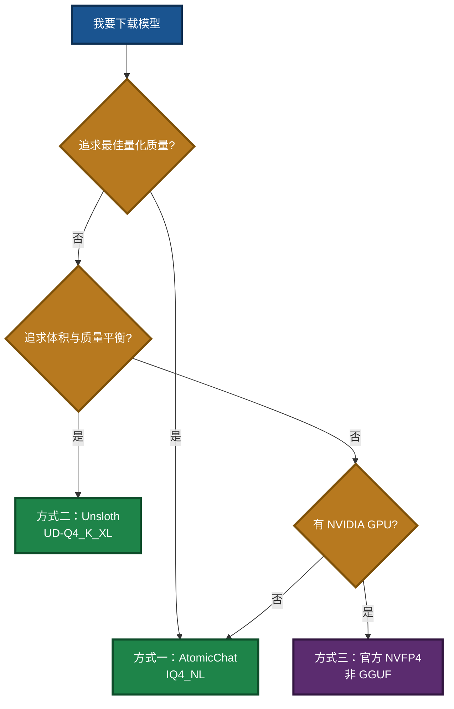
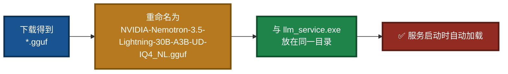
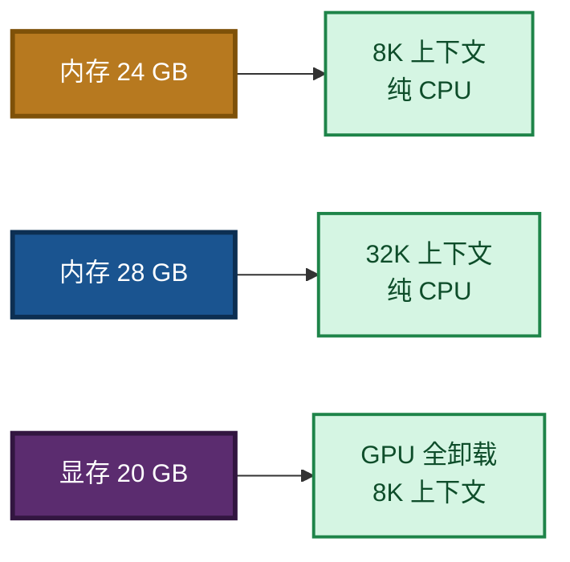
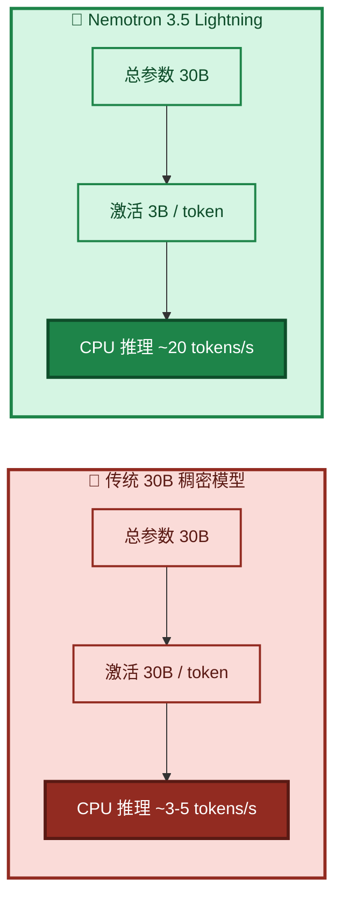

# NVIDIA-Nemotron-3.5-Lightning-30B-A3B-UD-IQ4_NL.gguf 模型下载与部署指南

> **文档版本**：V2.1  
> **最后更新**：2026-09-14  
> **适用组件**：`llm_service.exe`  
> **相关文档**（同目录）：
> - 项目总览与闭环架构：`readme.md`
> - MCP 新手指南：`mcp_api_tool_DOUBAO_GUIDE.md`
> - 编译指南：`Build_Guide.md`
> - 依赖安装：`Dependency_Installation_Guide.md`
> - LLM 服务命令行：`src/LingoFuse_LLM_Service_CLI_guide.md`
> - LLM 代理命令行：`src/LingoFuse_LLM_Proxy_CLI_Guide.md`
> - 生态体系总览：`src/LingoFuse_LLM_Ecosystem_User_Guide.md`

---

## 阅读引导

本文档介绍推荐模型 **NVIDIA-Nemotron-3.5-Lightning-30B-A3B** 的下载与部署。建议按以下顺序阅读：

1. **想快速了解这个模型** → 读第一章「模型简介」。
2. **想下载模型** → 读第二章「核心参数速查」和第三章「下载指南」。
3. **想部署到 LingoFuse LLM 服务** → 读第四章「部署说明」。
4. **想了解适用场景** → 读第五章「模型适用场景」。

如果你只想跑通 MCP 闭环，可先按 `mcp_api_tool_DOUBAO_GUIDE.md` 操作，模型下载部分参考本文档第三章。

**本次更新（V2.1）** 修正内容：
- 4.2 节启动命令示例中的 `llm_service_cpu.exe` / `llm_service_cu124.exe` 修正为 `llm_service.exe`（本项目仅有一个 `llm_service.exe`；CPU/CUDA 支持由所安装的 `llama-cpp-python` wheel 决定，而不是 exe 文件名）。
- 补全 CPU / CUDA 场景下对 `llama-cpp-python` 后端版本的前置说明。
- 相关文档链接路径修正为「根目录 / `src/` 子目录」两种，去掉已不存在的 `llm-service/` 假设。

---

## 一、模型简介

`NVIDIA-Nemotron-3.5-Lightning-30B-A3B-UD-IQ4_NL.gguf` 是 NVIDIA 于 2026 年 8 月发布的 **Nemotron 3.5 Lightning** 系列模型的 **4-bit 量化（IQ4_NL）GGUF 格式**版本，专为**长时间运行的智能体（Agent）** 中的高频任务执行而设计。

与 Qwen2.5-7B 等传统稠密模型不同，Nemotron 3.5 Lightning 采用了**混合专家（MoE）架构**：

- **总参数量**：**300 亿（30B）**，但每次推理仅激活约 **30 亿（3B）** 参数
- **架构**：Mamba-2 + MoE + Attention 混合架构，共 52 层（23 层 Mamba-2、23 层 MoE、6 层 Attention）
- **上下文长度**：最高支持 **100 万（1M）tokens**，单卡 H100 部署时默认 256K

这种“大容量、低激活”的设计意味着：模型**知识储备接近 30B 稠密模型**，但**推理开销仅相当于 3B 小模型**，因此可以在 CPU 上实现**约 20 tokens/s** 的生成速度——这是传统 30B 模型在纯 CPU 环境下难以企及的。

**IQ4_NL 量化**在 4-bit 精度下实现了约 **19.7 GB** 的文件大小，在质量与体积间取得了极佳平衡。根据 AtomicChat 的实测数据，IQ4_NL 量化在 **top-1 准确率（93.49%）** 上与 Q5_K_M（93.22%）持平甚至略优，但体积小了 **6.9 GB**。

### 图 1：模型在 pasAgent 闭环中的位置


---

## 二、核心参数速查

| 参数项 | 规格 |
|---|---|
| **模型名称** | NVIDIA-Nemotron-3.5-Lightning-30B-A3B |
| **架构** | MoE — Mamba-2 + MoE + Attention 混合 |
| **总参数量** | 30B |
| **激活参数量** | ~3B / token |
| **上下文长度** | 最高 1M tokens（256K 原生默认） |
| **量化方式** | IQ4_NL（block-32, ~4.5 bpw） |
| **文件大小** | ~19.7 GB |
| **推理模式** | 可配置思考模式（`enable_thinking=True/False`） |
| **投机解码** | 支持 DSpark、DFlash、MTP（Multi-Token Prediction） |
| **支持语言** | 英语（含代码）、西班牙语、法语、德语、意大利语、日语 |
| **推荐采样** | 思考模式：Temperature 1.0, Top_P 0.95 |
| **许可证** | OpenMDW License Agreement v1.1（可商用） |
| **发布日期** | 2026 年 8 月 11 日 |
| **预训练数据截止** | 2025 年 9 月 |
| **后训练数据截止** | 2026 年 5 月 |

> **关键理解**：30B 总参数意味着模型拥有丰富知识；3B 激活参数意味着每次推理只调用其中一小部分专家网络，因此**CPU 推理速度远超传统 30B 模型**。

---

## 三、下载指南

### 图 2：下载方式决策



### 方式一：Hugging Face 社区量化源（推荐，IQ4_NL 直接可用）

**AtomicChat** 仓库提供了本模型最完整的 IQ4_NL 量化版本，文件名为 `AD-IQ4_NL.gguf`：

- **模型主页**：[AtomicChat/NVIDIA-Nemotron-3.5-Lightning-30B-A3B-GGUF](https://huggingface.co/AtomicChat/NVIDIA-Nemotron-3.5-Lightning-30B-A3B-GGUF)
- **直接下载链接**：
  ```
  https://huggingface.co/AtomicChat/NVIDIA-Nemotron-3.5-Lightning-30B-A3B-GGUF/resolve/main/NVIDIA-Nemotron-3.5-Lightning-30B-A3B-AD-IQ4_NL.gguf
  ```

**使用 `huggingface-cli` 下载**：

```bash
pip install -U huggingface_hub

huggingface-cli download AtomicChat/NVIDIA-Nemotron-3.5-Lightning-30B-A3B-GGUF \
    --include "*-AD-IQ4_NL.gguf" \
    --local-dir . \
    --local-dir-use-symlinks False
```

下载后，您会得到 `NVIDIA-Nemotron-3.5-Lightning-30B-A3B-AD-IQ4_NL.gguf`（约 19.7 GB）。为了与 LingoFuse LLM 服务的默认扫描规则兼容，建议将其重命名为：

```
NVIDIA-Nemotron-3.5-Lightning-30B-A3B-UD-IQ4_NL.gguf
```

### 方式二：Unsloth 动态量化源

Unsloth 提供了 `UD-Q4_K_XL` 动态量化版本，在体积和准确度间取得平衡：

- **模型主页**：[unsloth/NVIDIA-Nemotron-3.5-Lightning-30B-A3B-GGUF](https://huggingface.co/unsloth/NVIDIA-Nemotron-3.5-Lightning-30B-A3B-GGUF)
- **4-bit 版本所需内存**：约 **20 GB**

**使用 `huggingface-cli` 下载**：

```bash
huggingface-cli download unsloth/NVIDIA-Nemotron-3.5-Lightning-30B-A3B-GGUF \
    --include "*UD-Q4_K_XL*.gguf" \
    --local-dir .
```

### 方式三：官方 NVFP4 格式（需 NVIDIA 硬件支持）

NVIDIA 官方发布了 **NVFP4** 格式的模型权重，专为 Blackwell 和 Hopper 架构 GPU 优化：

- **模型主页**：[nvidia/NVIDIA-Nemotron-3.5-Lightning-30B-A3B-NVFP4](https://huggingface.co/nvidia/NVIDIA-Nemotron-3.5-Lightning-30B-A3B-NVFP4)
- **支持硬件**：DGX Spark (GB10)、GB200、RTX 5090、H100、H200、A100（通过 W4A16）

> **注意**：NVFP4 是 NVIDIA 专有的 4-bit 浮点格式，**不能直接在 llama.cpp 中加载**。如果您的目标是 CPU 推理或使用 llama.cpp 生态，请选择方式一或方式二的 GGUF 格式。

### 方式四：ModelScope 魔搭社区（国内加速）

国内开发者可通过 ModelScope 获取模型：

- **模型主页**：[modelscope.cn/collections/nv-community/Nemotron-35-Lightning](https://modelscope.cn/collections/nv-community/Nemotron-35-Lightning)

### 图 3：下载后的文件放置



---

## 四、部署说明（针对 LingoFuse LLM 服务）

### 4.1 文件放置要求

将下载的 `.gguf` 文件重命名为 **`NVIDIA-Nemotron-3.5-Lightning-30B-A3B-UD-IQ4_NL.gguf`**，放置于 `llm_service.exe` 同目录下。

### 4.2 前置准备：确认 `llama-cpp-python` 后端

`llm_service.exe` 的 CPU / CUDA 支持**不是通过切换 exe 文件名实现的**，而是由所安装的 `llama-cpp-python` wheel 决定：

- **CPU 版**：
  ```bash
  pip install llama-cpp-python --extra-index-url https://abetlen.github.io/llama-cpp-python/whl/cpu
  ```
- **CUDA 版**（示例 CUDA 12.4）：
  ```bash
  pip install llama-cpp-python --extra-index-url https://abetlen.github.io/llama-cpp-python/whl/cu124
  ```

详见 `src/llama_cpp_python_guide.md`。安装完成后重新打包 `llm_service.exe`（或直接用 `python llm_service.py` 运行）即可。

### 4.3 启动命令示例

**纯 CPU 模式（推荐用于无独显环境，需安装 CPU 版 `llama-cpp-python`）**：

```powershell
.\llm_service.exe --gpu-layers 0 --threads 8 --context-size 8192
```

- `--gpu-layers 0`：强制纯 CPU 推理
- `--threads 8`：使用 8 个 CPU 线程（建议设为物理核心数的一半）
- `--context-size 8192`：将上下文限制为 8192 tokens，大幅降低内存占用

**CUDA 加速模式（需安装 CUDA 版 `llama-cpp-python`）**：

```powershell
.\llm_service.exe --gpu-layers -1 --threads 4 --context-size 32768
```

### 4.4 内存需求估算

| 配置 | 内存需求（估算） |
|---|---|
| IQ4_NL + 8K 上下文，纯 CPU | ~22–24 GB |
| IQ4_NL + 32K 上下文，纯 CPU | ~26–28 GB |
| IQ4_NL + 8K 上下文，GPU 全卸载 | ~20 GB 显存 + 少量内存 |

> **提示**：模型本身约 19.7 GB，加上 KV cache 和运行时开销，建议系统内存至少 **32 GB**。

### 图 4：内存与上下文长度权衡



### 4.5 显存不足时的渐进式调整

若出现 `CUDA out of memory`，逐步下调 `--gpu-layers`：

```powershell
# 先试 20 层
.\llm_service.exe --gpu-layers 20

# 若仍 OOM，降到 10 层
.\llm_service.exe --gpu-layers 10

# 最后回退纯 CPU
.\llm_service.exe --gpu-layers 0
```

详细参数说明见 `src/LingoFuse_LLM_Service_CLI_guide.md`。

### 4.6 替代方案：用 llm_proxy.exe 转发

如果你不想在本地加载 20 GB 模型，可改用 `llm_proxy.exe` 转发到 LM Studio 或其他 OpenAI 兼容后端：

```powershell
.\llm_proxy.exe --backend-url http://127.0.0.1:1234/v1
```

详细用法见 `src/LingoFuse_LLM_Proxy_CLI_Guide.md`。

---

## 五、模型适用场景

### ✅ 智能体任务（核心定位）

Nemotron 3.5 Lightning **专为智能体设计**。NVIDIA 官方描述其为“长时间运行的智能体中的高频任务执行”而构建，面向频繁的智能体调用，包括：**工具使用、输出验证、结果格式化、子智能体委派**。

在 **PinchBench** 基准测试中，该模型达到 **86% 准确率**，完成 10,000 个任务的速度比 Qwen3.6 35B **快 30%**。

### ✅ 日常对话与主线任务

30B 的知识储备使模型能够处理复杂的**多步推理**和**长上下文任务**。1M tokens 的上下文窗口使其特别适合需要**大量文档阅读**或**长对话历史**的场景。

### ✅ CPU 推理（约 20 tokens/s）

由于每个 token 仅激活 3B 参数，CPU 推理速度显著优于传统 30B 稠密模型。在支持 AVX2 的现代 CPU（i5-12 代以上 / Ryzen 5000 以上）上，配合合理的线程数设置，可实现**约 15–25 tokens/s** 的生成速度，满足日常对话和智能体调用的实时性需求。

### 图 5：与传统 30B 模型的对比



---

## 六、与 Qwen2.5-7B 的对比

| 对比项 | Qwen2.5-7B | NVIDIA-Nemotron-3.5-Lightning-30B-A3B |
|---|---|---|
| 总参数量 | 7B | 30B（激活 3B） |
| 上下文长度 | 32,768 tokens | 最高 1,000,000 tokens |
| 单次最大生成 | 8,192 tokens | 可配置，满足长输出需求 |
| CPU 推理速度 | ~5–10 tokens/s | ~20 tokens/s |
| 智能体稳定性 | 一般，易过拟合 | 优秀，专为智能体高频调用设计 |
| 文件大小 | ~4.7 GB | ~19.7 GB |
| 推荐用途 | 学习、演示 | 生产、智能体、主线任务 |

> **迁移建议**：Qwen2.5-7B 已作为 pasAgent 1.0 的入门学习模型，新项目请使用 NVIDIA Nemotron 模型。若需了解历史背景，可查阅 `Qwen2.5-7B-Instruct-Q4_K_M.md`。

---

## 七、故障排查

### Q1：模型文件未找到

**排查**：

- 确认文件名严格为 `NVIDIA-Nemotron-3.5-Lightning-30B-A3B-UD-IQ4_NL.gguf`（大小写敏感）。
- 确认文件与 `llm_service.exe` 在同一目录。
- 或使用 `--model-path` 指定绝对路径。

### Q2：内存不足（纯 CPU 场景）

**解决**：

- 降低 `--context-size`（如 4096）。
- 减少 `--threads`。
- 改用 `llm_proxy.exe` 转发到 LM Studio（LM Studio 可在有独显的机器上运行）。

### Q3：显存不足（CUDA 场景）

**解决**：

- 逐步降低 `--gpu-layers`（如 20 → 10 → 0）。
- 降低 `--context-size`。

### Q4：CPU 太慢 / 风扇狂转

**解决**：

- 减少 `--threads`（如从 8 降到 4）。
- 检查 CPU 是否支持 AVX2/AVX512。

### Q5：启动后立刻退出

**排查**：

- 是否缺少模型文件（见 Q1）。
- 是否有另一个 `llm_service` 或 `llm_proxy` 已占用 `ipc:llm_service`。
- 查看窗口中的错误信息。

---

## 八、相关文档

### 根目录文档

| 文档 | 说明 |
|------|------|
| `readme.md` | 项目总览与闭环架构 |
| `mcp_api_tool_DOUBAO_GUIDE.md` | 新手零基础教程 |
| `Build_Guide.md` | 编译指南 |
| `Dependency_Installation_Guide.md` | 依赖安装 |
| `Qwen2.5-7B-Instruct-Q4_K_M.md` | 旧版入门模型（仅历史参考） |

### 子目录文档（`src/`）

| 文档 | 位置 | 说明 |
|------|------|------|
| `LingoFuse_LLM_Ecosystem_User_Guide.md` | `src/` | 闭环架构与生态总览 |
| `LingoFuse_LLM_Service_CLI_guide.md` | `src/` | LLM 服务命令行手册 |
| `LingoFuse_LLM_Proxy_CLI_Guide.md` | `src/` | LLM 代理命令行手册 |
| `LingoFuse_LLM_Proxy_Compatibility_Guide.md` | `src/` | 支持的 129+ 后端清单 |
| `LingoFuse_LLM_Pitfalls_For_AI.md` | `src/` | 踩坑大全 |
| `LingoFuse_LLM_Service_Work_Summary.md` | `src/` | 版本演进与架构决策 |
| `llama_cpp_python_guide.md` | `src/` | `llama-cpp-python` 安装与使用 |

---

**文档版本**：V2.1（修正 exe 名假设，补全 llama-cpp-python 后端说明，路径修正）  
**维护者**：LingoFuse-pasAgent 团队  
**反馈**：问题提 Issue，急事加 Q（600585）