# LingoFuse LLM 生态体系使用指南

> **文档名**：`LingoFuse_LLM_Ecosystem_User_Guide.md`  
> **版本**：v3.0  
> **最后更新**：2026-09-14  
> **适用组件**：`llm_service.exe`、`llm_proxy.exe`、`llm_test.exe`、Pascal 客户端  
> **相关文档**（同目录）：
> - LLM 服务命令行手册：`LingoFuse_LLM_Service_CLI_guide.md`
> - LLM 代理命令行手册：`LingoFuse_LLM_Proxy_CLI_Guide.md`
> - 代理兼容性指南：`LingoFuse_LLM_Proxy_Compatibility_Guide.md`
> - 踩坑大全：`LingoFuse_LLM_Pitfalls_For_AI.md`
> - 版本演进总结：`LingoFuse_LLM_Service_Work_Summary.md`
> - llama-cpp-python 安装：`llama_cpp_python_guide.md`

---

## 阅读引导

本文档是 LingoFuse LLM 生态的**全局参考**。建议按以下顺序阅读：

1. **想快速了解全貌** → 读第一章「体系全景」。
2. **想选一个服务端** → 读第二章「两种服务端」。
3. **想搭起来跑** → 读第三章「快速开始」。
4. **想了解细节** → 读第四、五章「服务端详解」「客户端详解」。
5. **想知道协议和能力发现** → 读第六、七章。
6. **想解决具体问题** → 直接读第九章「故障排查」，或翻同目录 `LingoFuse_LLM_Pitfalls_For_AI.md`。
7. **想了解版本演进** → 读同目录 `LingoFuse_LLM_Service_Work_Summary.md`。

如果只想尽快跑通，跳到第三章即可。

---

## 一、体系全景

LingoFuse LLM 生态是一套跨语言、流式、多会话的大模型调用方案。它把大模型能力封装成 **LingoFuse 服务端**，任何支持 LingoFuse 的客户端都能像调用本地函数一样调用大模型，并实时接收流式输出。

为避免一张图信息过载，按**层次**拆分为两张小图。

### 图 1：生态全景（客户端 / 核心 / 服务端 / 后端）

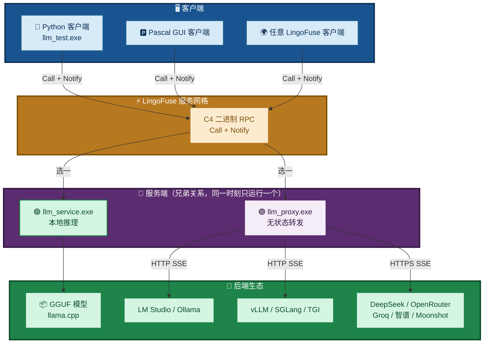
```mermaid
flowchart TB
    subgraph CLIENTS["🖥️ 客户端"]
        A1["🐍 Python 客户端<br/>llm_test.exe"]
        A2["🅿️ Pascal GUI 客户端"]
        A3["🌍 任意 LingoFuse 客户端"]
    end

    subgraph CORE["⚡ LingoFuse 服务网格"]
        B1["C4 二进制 RPC<br/>Call + Notify"]
    end

    subgraph SERVERS["🎯 服务端（兄弟关系，同一时刻只运行一个）"]
        C1["🟢 llm_service.exe<br/>本地推理"]
        C2["🟣 llm_proxy.exe<br/>无状态转发"]
    end

    subgraph BACKENDS["🔌 后端生态"]
        D1["📦 GGUF 模型<br/>llama.cpp"]
        D2["LM Studio / Ollama"]
        D3["vLLM / SGLang / TGI"]
        D4["DeepSeek / OpenRouter<br/>Groq / 智谱 / Moonshot"]
    end

    A1 -->|"Call + Notify"| B1
    A2 -->|"Call + Notify"| B1
    A3 -->|"Call + Notify"| B1
    B1 -->|"选一"| C1
    B1 -->|"选一"| C2
    C1 --> D1
    C2 -->|"HTTP SSE"| D2
    C2 -->|"HTTP SSE"| D3
    C2 -->|"HTTPS SSE"| D4

    style CLIENTS fill:#1A5490,stroke:#0D2F52,stroke-width:3px,color:#FFFFFF
    style CORE fill:#B7791F,stroke:#7E5109,stroke-width:3px,color:#FFFFFF
    style SERVERS fill:#5B2C6F,stroke:#321640,stroke-width:3px,color:#FFFFFF
    style BACKENDS fill:#1E8449,stroke:#0E4D2A,stroke-width:3px,color:#FFFFFF
    style A1 fill:#D6EAF8,stroke:#1F618D,stroke-width:2px,color:#0D2F52
    style A2 fill:#D6EAF8,stroke:#1F618D,stroke-width:2px,color:#0D2F52
    style A3 fill:#D6EAF8,stroke:#1F618D,stroke-width:2px,color:#0D2F52
    style B1 fill:#FDEBD0,stroke:#B7791F,stroke-width:2px,color:#7E5109
    style C1 fill:#D5F5E3,stroke:#1E8449,stroke-width:2px,color:#0E4D2A
    style C2 fill:#F4ECF7,stroke:#5B2C6F,stroke-width:2px,color:#321640
    style D1 fill:#D5F5E3,stroke:#1E8449,stroke-width:2px,color:#0E4D2A
    style D2 fill:#D5F5E3,stroke:#1E8449,stroke-width:2px,color:#0E4D2A
    style D3 fill:#D5F5E3,stroke:#1E8449,stroke-width:2px,color:#0E4D2A
    style D4 fill:#D5F5E3,stroke:#1E8449,stroke-width:2px,color:#0E4D2A
```

### 图 2：一次调用的完整链路

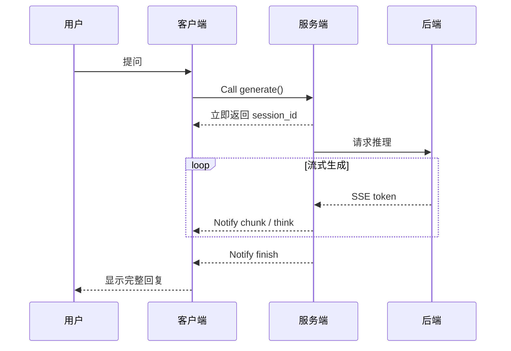
```mermaid
sequenceDiagram
    participant U as 用户
    participant C as 客户端
    participant S as 服务端
    participant B as 后端

    U->>C: 提问
    C->>S: Call generate()
    S-->>C: 立即返回 session_id
    S->>B: 请求推理
    loop 流式生成
        B-->>S: SSE token
        S-->>C: Notify chunk / think
    end
    S-->>C: Notify finish
    C-->>U: 显示完整回复
```

**一句话总结**：客户端只管调 `generate`，服务端负责把请求变成真正的模型推理——本地跑也好，转发到 LM Studio / 云 API 也好，对客户端完全透明。

---

## 二、两种服务端：兄弟关系

### 图 3：定位对比

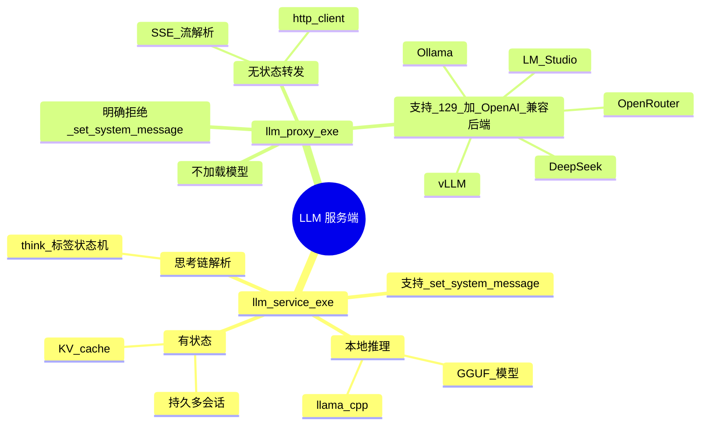
```mermaid
mindmap
  root(("LLM 服务端"))
    llm_service_exe
      本地推理
        llama_cpp
        GGUF_模型
      有状态
        持久多会话
        KV_cache
      支持_set_system_message
      思考链解析
        think_标签状态机
    llm_proxy_exe
      无状态转发
        http_client
        SSE_流解析
      不加载模型
      明确拒绝_set_system_message
      支持_129_加_OpenAI_兼容后端
        LM_Studio
        Ollama
        vLLM
        DeepSeek
        OpenRouter
```

### 图 4：能力矩阵

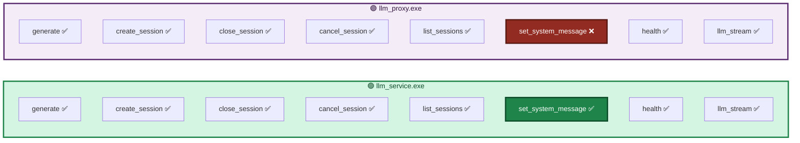
```mermaid
flowchart LR
    subgraph LS["🟢 llm_service.exe"]
        L1["generate ✅"]
        L2["create_session ✅"]
        L3["close_session ✅"]
        L4["cancel_session ✅"]
        L5["list_sessions ✅"]
        L6["set_system_message ✅"]
        L7["health ✅"]
        L8["llm_stream ✅"]
    end

    subgraph LP["🟣 llm_proxy.exe"]
        P1["generate ✅"]
        P2["create_session ✅"]
        P3["close_session ✅"]
        P4["cancel_session ✅"]
        P5["list_sessions ✅"]
        P6["set_system_message ❌"]
        P7["health ✅"]
        P8["llm_stream ✅"]
    end

    style LS fill:#D5F5E3,stroke:#1E8449,stroke-width:3px,color:#0E4D2A
    style LP fill:#F4ECF7,stroke:#5B2C6F,stroke-width:3px,color:#321640
    style L6 fill:#1E8449,stroke:#0E4D2A,stroke-width:3px,color:#FFFFFF
    style P6 fill:#922B21,stroke:#5A1A14,stroke-width:3px,color:#FFFFFF
```

### 图 5：共存规则

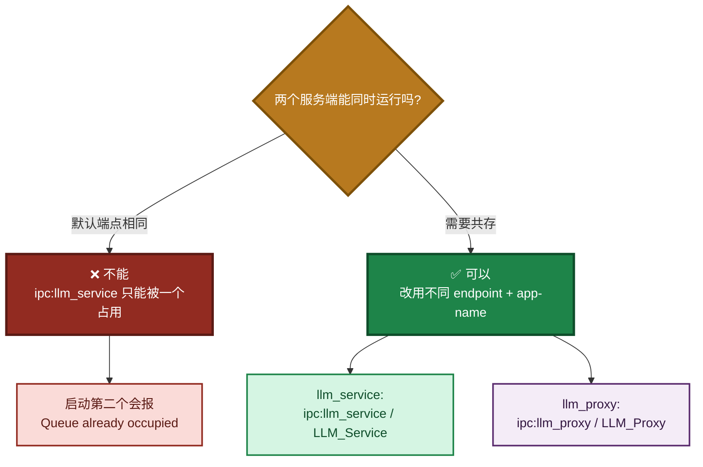
```mermaid
flowchart TB
    Q{"两个服务端能同时运行吗?"}
    Q -->|"默认端点相同"| NO["❌ 不能<br/>ipc:llm_service 只能被一个占用"]
    Q -->|"需要共存"| YES["✅ 可以<br/>改用不同 endpoint + app-name"]

    NO --> N1["启动第二个会报<br/>Queue already occupied"]
    YES --> Y1["llm_service:<br/>ipc:llm_service / LLM_Service"]
    YES --> Y2["llm_proxy:<br/>ipc:llm_proxy / LLM_Proxy"]

    style Q fill:#B7791F,stroke:#7E5109,stroke-width:3px,color:#FFFFFF
    style NO fill:#922B21,stroke:#5A1A14,stroke-width:3px,color:#FFFFFF
    style YES fill:#1E8449,stroke:#0E4D2A,stroke-width:3px,color:#FFFFFF
    style N1 fill:#FADBD8,stroke:#922B21,stroke-width:2px,color:#5A1A14
    style Y1 fill:#D5F5E3,stroke:#1E8449,stroke-width:2px,color:#0E4D2A
    style Y2 fill:#F4ECF7,stroke:#5B2C6F,stroke-width:2px,color:#321640
```

---

## 三、快速开始

### 3.1 选择服务端

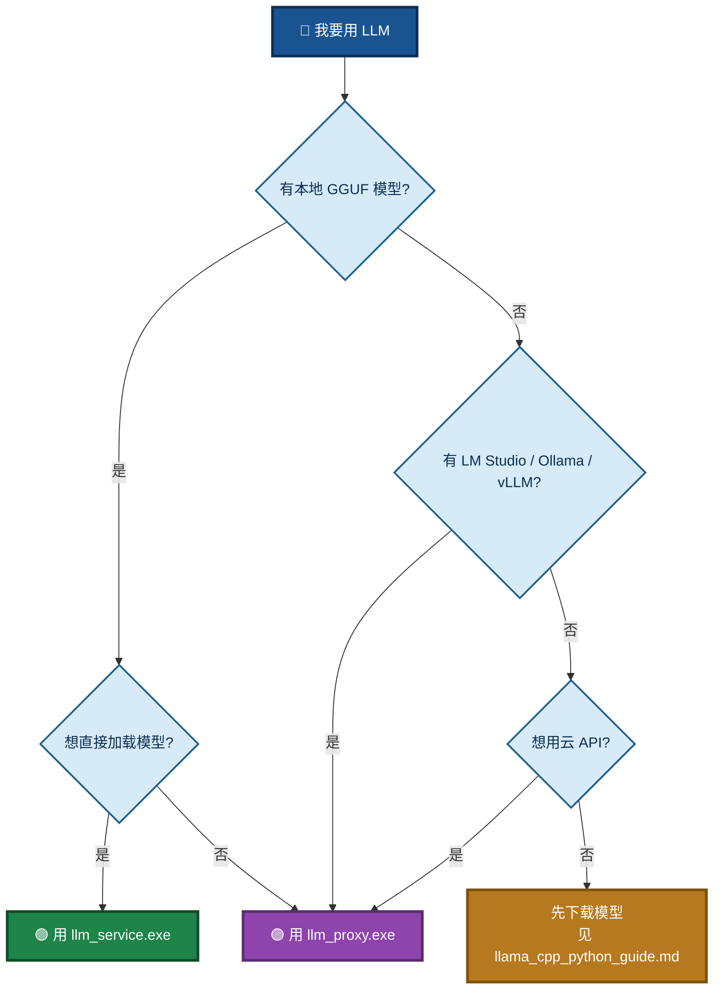
```mermaid
flowchart TD
    START["🚀 我要用 LLM"] --> Q1{"有本地 GGUF 模型?"}
    Q1 -->|是| Q2{"想直接加载模型?"}
    Q1 -->|否| Q3{"有 LM Studio / Ollama / vLLM?"}
    Q2 -->|是| LS["🟢 用 llm_service.exe"]
    Q2 -->|否| LP["🟣 用 llm_proxy.exe"]
    Q3 -->|是| LP
    Q3 -->|否| Q4{"想用云 API?"}
    Q4 -->|是| LP
    Q4 -->|否| DL["先下载模型<br/>见 llama_cpp_python_guide.md"]

    style START fill:#1A5490,stroke:#0D2F52,stroke-width:3px,color:#FFFFFF
    style LS fill:#1E8449,stroke:#0E4D2A,stroke-width:3px,color:#FFFFFF
    style LP fill:#8E44AD,stroke:#5B2C6F,stroke-width:3px,color:#FFFFFF
    style DL fill:#B7791F,stroke:#7E5109,stroke-width:3px,color:#FFFFFF
    style Q1 fill:#D6EAF8,stroke:#1F618D,stroke-width:2px,color:#0D2F52
    style Q2 fill:#D6EAF8,stroke:#1F618D,stroke-width:2px,color:#0D2F52
    style Q3 fill:#D6EAF8,stroke:#1F618D,stroke-width:2px,color:#0D2F52
    style Q4 fill:#D6EAF8,stroke:#1F618D,stroke-width:2px,color:#0D2F52
```

### 3.2 启动流程

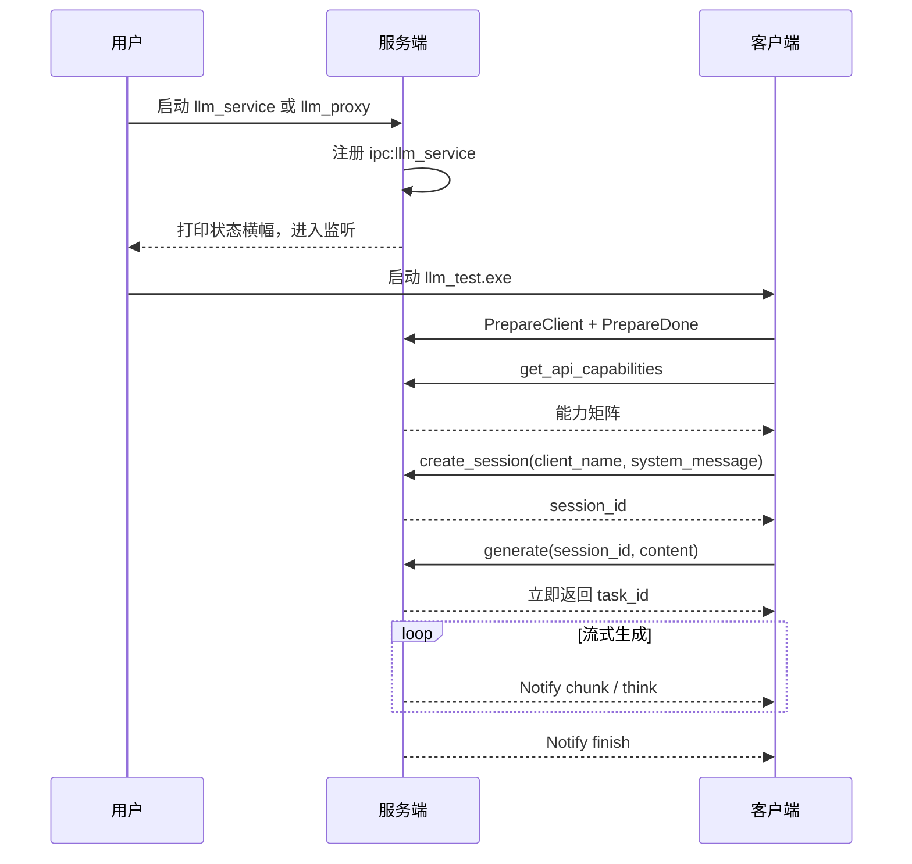
```mermaid
sequenceDiagram
    participant U as 用户
    participant S as 服务端
    participant C as 客户端

    U->>S: 启动 llm_service 或 llm_proxy
    S->>S: 注册 ipc:llm_service
    S-->>U: 打印状态横幅，进入监听
    U->>C: 启动 llm_test.exe
    C->>S: PrepareClient + PrepareDone
    C->>S: get_api_capabilities
    S-->>C: 能力矩阵
    C->>S: create_session(client_name, system_message)
    S-->>C: session_id
    C->>S: generate(session_id, content)
    S-->>C: 立即返回 task_id
    loop 流式生成
        S-->>C: Notify chunk / think
    end
    S-->>C: Notify finish
```

---

## 四、服务端详解

### 4.1 llm_service.exe —— 本地推理服务

#### 图 6：架构

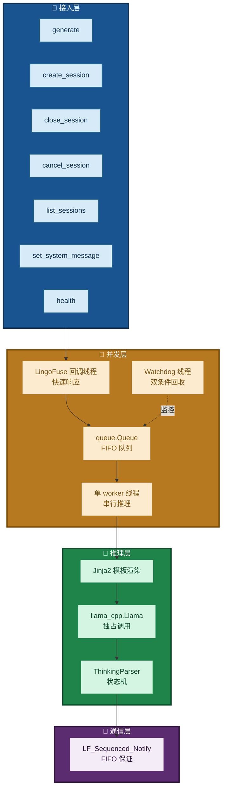
```mermaid
flowchart TB
    subgraph API["🎯 接入层"]
        A1["generate"]
        A2["create_session"]
        A3["close_session"]
        A4["cancel_session"]
        A5["list_sessions"]
        A6["set_system_message"]
        A7["health"]
    end

    subgraph CONC["🧵 并发层"]
        CB["LingoFuse 回调线程<br/>快速响应"]
        Q["queue.Queue<br/>FIFO 队列"]
        W["单 worker 线程<br/>串行推理"]
        WD["Watchdog 线程<br/>双条件回收"]
    end

    subgraph INFER["🧠 推理层"]
        TPL["Jinja2 模板渲染"]
        TH["ThinkingParser<br/>状态机"]
        LLM["llama_cpp.Llama<br/>独占调用"]
    end

    subgraph COMM["📡 通信层"]
        SEQ["LF_Sequenced_Notify<br/>FIFO 保证"]
    end

    API --> CB
    CB --> Q
    Q --> W
    W --> TPL
    TPL --> LLM
    LLM --> TH
    TH --> SEQ
    WD -.->|监控| Q

    style API fill:#1A5490,stroke:#0D2F52,stroke-width:3px,color:#FFFFFF
    style CONC fill:#B7791F,stroke:#7E5109,stroke-width:3px,color:#FFFFFF
    style INFER fill:#1E8449,stroke:#0E4D2A,stroke-width:3px,color:#FFFFFF
    style COMM fill:#5B2C6F,stroke:#321640,stroke-width:3px,color:#FFFFFF
    style A1 fill:#D6EAF8,stroke:#1F618D,stroke-width:2px,color:#0D2F52
    style A2 fill:#D6EAF8,stroke:#1F618D,stroke-width:2px,color:#0D2F52
    style A3 fill:#D6EAF8,stroke:#1F618D,stroke-width:2px,color:#0D2F52
    style A4 fill:#D6EAF8,stroke:#1F618D,stroke-width:2px,color:#0D2F52
    style A5 fill:#D6EAF8,stroke:#1F618D,stroke-width:2px,color:#0D2F52
    style A6 fill:#D6EAF8,stroke:#1F618D,stroke-width:2px,color:#0D2F52
    style A7 fill:#D6EAF8,stroke:#1F618D,stroke-width:2px,color:#0D2F52
    style CB fill:#FDEBD0,stroke:#B7791F,stroke-width:2px,color:#7E5109
    style Q fill:#FDEBD0,stroke:#B7791F,stroke-width:2px,color:#7E5109
    style W fill:#FDEBD0,stroke:#B7791F,stroke-width:2px,color:#7E5109
    style WD fill:#FDEBD0,stroke:#B7791F,stroke-width:2px,color:#7E5109
    style TPL fill:#D5F5E3,stroke:#1E8449,stroke-width:2px,color:#0E4D2A
    style TH fill:#D5F5E3,stroke:#1E8449,stroke-width:2px,color:#0E4D2A
    style LLM fill:#D5F5E3,stroke:#1E8449,stroke-width:2px,color:#0E4D2A
    style SEQ fill:#F4ECF7,stroke:#5B2C6F,stroke-width:2px,color:#321640
```

**核心设计**：llama.cpp 的 `llama_context` 是**单线程状态机**（KV cache、采样器 RNG、BPE 状态共享），多线程直调会导致进程级 abort。所以所有推理请求都通过一个 FIFO 队列串行化到单个 worker 线程。

#### 图 7：会话生命周期

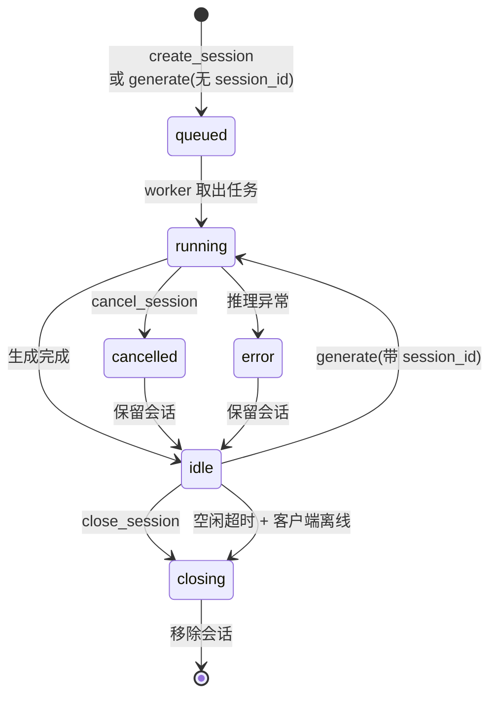
```mermaid
stateDiagram-v2
    [*] --> queued: create_session<br/>或 generate(无 session_id)
    queued --> running: worker 取出任务
    running --> idle: 生成完成
    running --> cancelled: cancel_session
    running --> error: 推理异常
    idle --> running: generate(带 session_id)
    idle --> closing: close_session
    idle --> closing: 空闲超时 + 客户端离线
    cancelled --> idle: 保留会话
    error --> idle: 保留会话
    closing --> [*]: 移除会话
```

#### 图 8：双条件回收策略

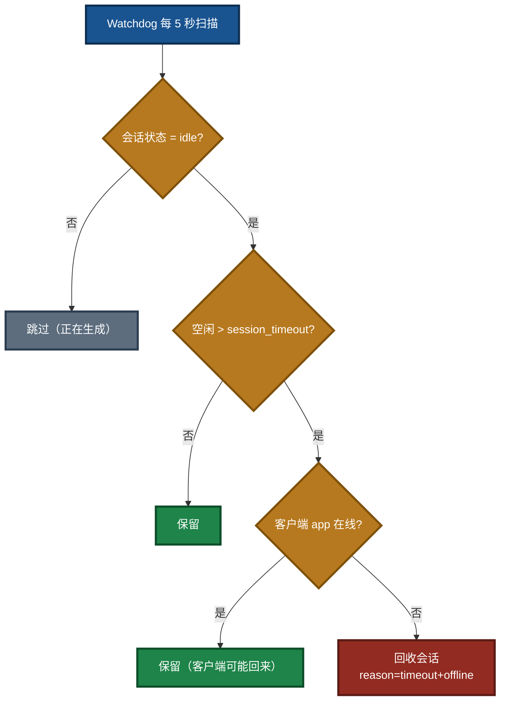
```mermaid
flowchart TD
    START["Watchdog 每 5 秒扫描"] --> C1{"会话状态 = idle?"}
    C1 -->|否| SKIP["跳过（正在生成）"]
    C1 -->|是| C2{"空闲 > session_timeout?"}
    C2 -->|否| KEEP["保留"]
    C2 -->|是| C3{"客户端 app 在线?"}
    C3 -->|是| KEEP2["保留（客户端可能回来）"]
    C3 -->|否| CLOSE["回收会话<br/>reason=timeout+offline"]

    style START fill:#1A5490,stroke:#0D2F52,stroke-width:3px,color:#FFFFFF
    style C1 fill:#B7791F,stroke:#7E5109,stroke-width:3px,color:#FFFFFF
    style C2 fill:#B7791F,stroke:#7E5109,stroke-width:3px,color:#FFFFFF
    style C3 fill:#B7791F,stroke:#7E5109,stroke-width:3px,color:#FFFFFF
    style SKIP fill:#5D6D7E,stroke:#2C3E50,stroke-width:3px,color:#FFFFFF
    style KEEP fill:#1E8449,stroke:#0E4D2A,stroke-width:3px,color:#FFFFFF
    style KEEP2 fill:#1E8449,stroke:#0E4D2A,stroke-width:3px,color:#FFFFFF
    style CLOSE fill:#922B21,stroke:#5A1A14,stroke-width:3px,color:#FFFFFF
```

**为什么双条件**：客户端偶尔断开重连（笔记本休眠、网络抖动、客户端重启）。如果只按空闲时长回收，客户端暂停超过阈值就会丢失整个对话历史。加上“客户端离线”条件后，只要客户端还在线，会话就一直保留。

**关键命令**：`--session-timeout`（默认 600 秒）、`--max-sessions`（默认 1024）、`--queue-max-size`（默认 256）。详见同目录 `LingoFuse_LLM_Service_CLI_guide.md`。

### 4.2 llm_proxy.exe —— 无状态转发代理

#### 图 9：架构

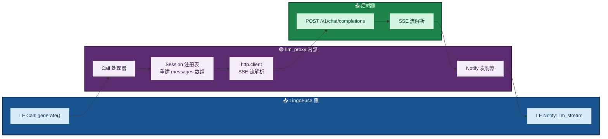
```mermaid
flowchart LR
    subgraph IN["📥 LingoFuse 侧"]
        CALL["LF Call: generate()"]
        NOTIFY["LF Notify: llm_stream"]
    end

    subgraph PROXY["🟣 llm_proxy 内部"]
        HANDLER["Call 处理器"]
        SESSION["Session 注册表<br/>重建 messages 数组"]
        BACKEND["http.client<br/>SSE 流解析"]
        EMIT["Notify 发射器"]
    end

    subgraph OUT["📤 后端侧"]
        HTTP["POST /v1/chat/completions"]
        SSE["SSE 流解析"]
    end

    CALL --> HANDLER
    HANDLER --> SESSION
    SESSION --> BACKEND
    BACKEND --> HTTP
    HTTP --> SSE
    SSE --> EMIT
    EMIT --> NOTIFY

    style IN fill:#1A5490,stroke:#0D2F52,stroke-width:3px,color:#FFFFFF
    style PROXY fill:#5B2C6F,stroke:#321640,stroke-width:3px,color:#FFFFFF
    style OUT fill:#1E8449,stroke:#0E4D2A,stroke-width:3px,color:#FFFFFF
    style CALL fill:#D6EAF8,stroke:#1F618D,stroke-width:2px,color:#0D2F52
    style NOTIFY fill:#D6EAF8,stroke:#1F618D,stroke-width:2px,color:#0D2F52
    style HANDLER fill:#F4ECF7,stroke:#5B2C6F,stroke-width:2px,color:#321640
    style SESSION fill:#F4ECF7,stroke:#5B2C6F,stroke-width:2px,color:#321640
    style BACKEND fill:#F4ECF7,stroke:#5B2C6F,stroke-width:2px,color:#321640
    style EMIT fill:#F4ECF7,stroke:#5B2C6F,stroke-width:2px,color:#321640
    style HTTP fill:#D5F5E3,stroke:#1E8449,stroke-width:2px,color:#0E4D2A
    style SSE fill:#D5F5E3,stroke:#1E8449,stroke-width:2px,color:#0E4D2A
```

#### 图 10：无状态语义

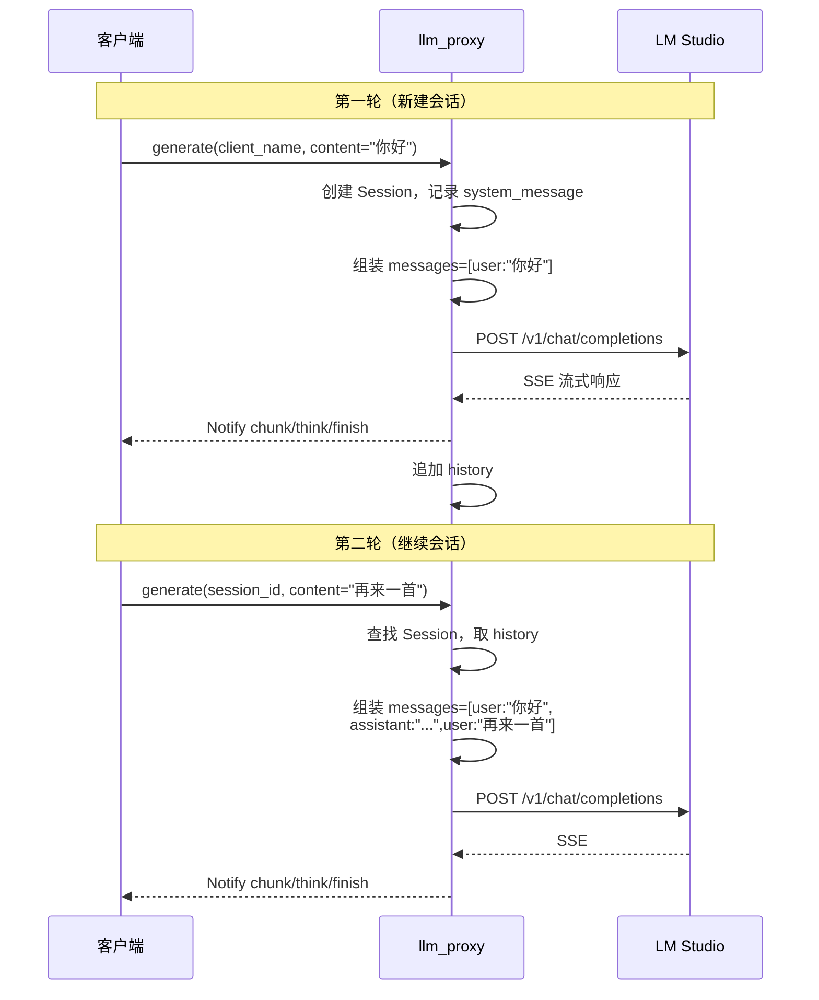
```mermaid
sequenceDiagram
    participant C as 客户端
    participant P as llm_proxy
    participant B as LM Studio

    Note over C,B: 第一轮（新建会话）
    C->>P: generate(client_name, content="你好")
    P->>P: 创建 Session，记录 system_message
    P->>P: 组装 messages=[user:"你好"]
    P->>B: POST /v1/chat/completions
    B-->>P: SSE 流式响应
    P-->>C: Notify chunk/think/finish
    P->>P: 追加 history

    Note over C,B: 第二轮（继续会话）
    C->>P: generate(session_id, content="再来一首")
    P->>P: 查找 Session，取 history
    P->>P: 组装 messages=[user:"你好",<br/>assistant:"...",user:"再来一首"]
    P->>B: POST /v1/chat/completions
    B-->>P: SSE
    P-->>C: Notify chunk/think/finish
```

**要点**：代理不持有模型 KV cache；每轮请求都重新组装完整 messages 数组发给后端。后端视角是“无状态 HTTP”，客户端视角是“持久会话”。

#### 图 11：SSE 传输层的坑

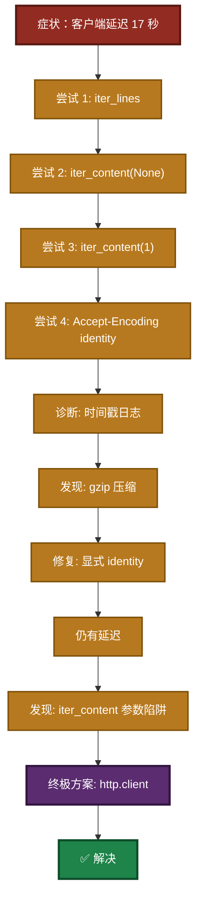
```mermaid
flowchart TB
    START["症状：客户端延迟 17 秒"] --> A1["尝试 1: iter_lines"]
    A1 --> A2["尝试 2: iter_content(None)"]
    A2 --> A3["尝试 3: iter_content(1)"]
    A3 --> A4["尝试 4: Accept-Encoding identity"]
    A4 --> A5["诊断: 时间戳日志"]
    A5 --> A6["发现: gzip 压缩"]
    A6 --> A7["修复: 显式 identity"]
    A7 --> A8["仍有延迟"]
    A8 --> A9["发现: iter_content 参数陷阱"]
    A9 --> A10["终极方案: http.client"]
    A10 --> DONE["✅ 解决"]

    style START fill:#922B21,stroke:#5A1A14,stroke-width:3px,color:#FFFFFF
    style DONE fill:#1E8449,stroke:#0E4D2A,stroke-width:3px,color:#FFFFFF
    style A10 fill:#5B2C6F,stroke:#321640,stroke-width:3px,color:#FFFFFF
    style A1 fill:#B7791F,stroke:#7E5109,stroke-width:2px,color:#FFFFFF
    style A2 fill:#B7791F,stroke:#7E5109,stroke-width:2px,color:#FFFFFF
    style A3 fill:#B7791F,stroke:#7E5109,stroke-width:2px,color:#FFFFFF
    style A4 fill:#B7791F,stroke:#7E5109,stroke-width:2px,color:#FFFFFF
    style A5 fill:#B7791F,stroke:#7E5109,stroke-width:2px,color:#FFFFFF
    style A6 fill:#B7791F,stroke:#7E5109,stroke-width:2px,color:#FFFFFF
    style A7 fill:#B7791F,stroke:#7E5109,stroke-width:2px,color:#FFFFFF
    style A8 fill:#B7791F,stroke:#7E5109,stroke-width:2px,color:#FFFFFF
    style A9 fill:#B7791F,stroke:#7E5109,stroke-width:2px,color:#FFFFFF
```

**三层缓冲，缺一不可**：

| 层 | 缓冲源 | 修复 |
|----|--------|------|
| 1 | `iter_lines()` 内部 512 字节缓冲 | 换 `iter_content` |
| 2 | `iter_content(None)` = 读直到 EOF | 换 `chunk_size=1` |
| 3 | gzip 解码器攒够 deflate 块才吐 | `Accept-Encoding: identity` |
| 4 | `urllib3` 内部预读 socket | 换 `http.client` |

**最终方案**：`http.client` + `Accept-Encoding: identity` + `TCP_NODELAY`。详细排查过程见同目录 `LingoFuse_LLM_Pitfalls_For_AI.md` 中的 P0-4、P6-1、P6-2。

#### 图 12：支持的后端分布

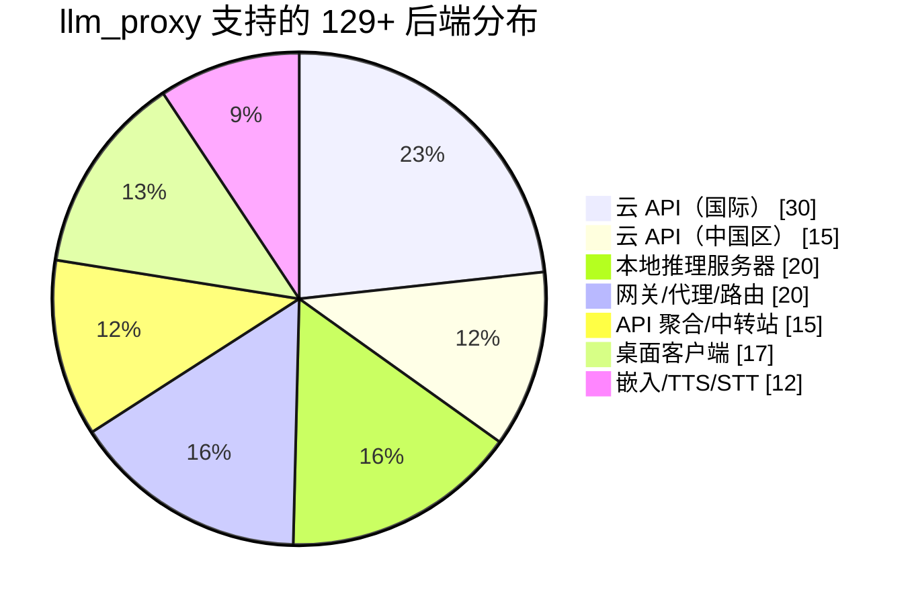
```mermaid
pie showData
    title llm_proxy 支持的 129+ 后端分布
    "云 API（国际）" : 30
    "云 API（中国区）" : 15
    "本地推理服务器" : 20
    "网关/代理/路由" : 20
    "API 聚合/中转站" : 15
    "桌面客户端" : 17
    "嵌入/TTS/STT" : 12
```

完整清单见同目录 `LingoFuse_LLM_Proxy_Compatibility_Guide.md`。

### 4.3 关键参数速查

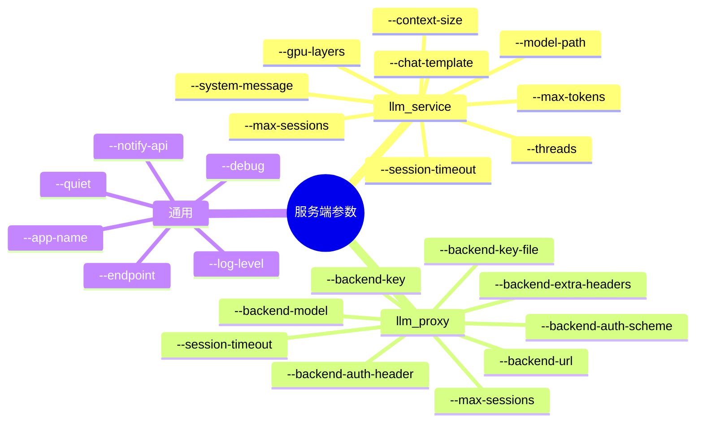
```mermaid
mindmap
  root(("服务端参数"))
    llm_service
      --model-path
      --context-size
      --max-tokens
      --threads
      --gpu-layers
      --session-timeout
      --max-sessions
      --chat-template
      --system-message
    llm_proxy
      --backend-url
      --backend-model
      --backend-key
      --backend-key-file
      --backend-auth-header
      --backend-auth-scheme
      --backend-extra-headers
      --session-timeout
      --max-sessions
    通用
      --endpoint
      --app-name
      --notify-api
      --log-level
      --debug
      --quiet
```

---

## 五、客户端详解

### 5.1 Python 客户端：llm_test.exe

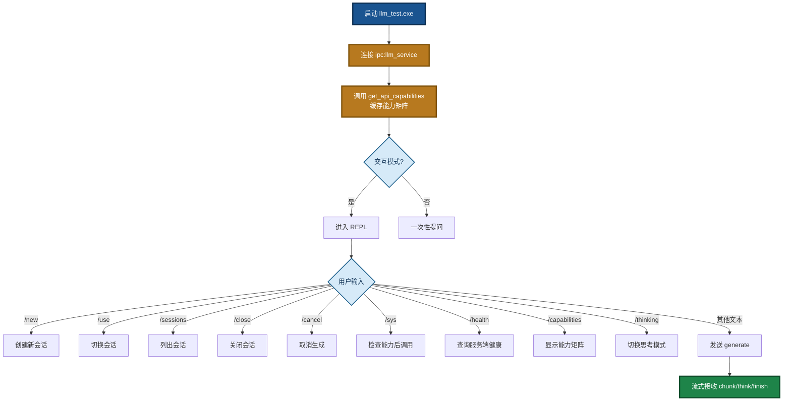
```mermaid
flowchart TB
    START["启动 llm_test.exe"] --> CONN["连接 ipc:llm_service"]
    CONN --> CAP["调用 get_api_capabilities<br/>缓存能力矩阵"]
    CAP --> MODE{"交互模式?"}
    MODE -->|是| REPL["进入 REPL"]
    MODE -->|否| ONESHOT["一次性提问"]
    REPL --> CMD{"用户输入"}
    CMD -->|"/new"| NEW["创建新会话"]
    CMD -->|"/use"| USE["切换会话"]
    CMD -->|"/sessions"| LIST["列出会话"]
    CMD -->|"/close"| CLOSE["关闭会话"]
    CMD -->|"/cancel"| CANCEL["取消生成"]
    CMD -->|"/sys"| SYS["检查能力后调用"]
    CMD -->|"/health"| HEALTH["查询服务端健康"]
    CMD -->|"/capabilities"| CAPS["显示能力矩阵"]
    CMD -->|"/thinking"| THINK["切换思考模式"]
    CMD -->|"其他文本"| SEND["发送 generate"]
    SEND --> STREAM["流式接收 chunk/think/finish"]

    style START fill:#1A5490,stroke:#0D2F52,stroke-width:3px,color:#FFFFFF
    style CONN fill:#B7791F,stroke:#7E5109,stroke-width:3px,color:#FFFFFF
    style CAP fill:#B7791F,stroke:#7E5109,stroke-width:3px,color:#FFFFFF
    style STREAM fill:#1E8449,stroke:#0E4D2A,stroke-width:3px,color:#FFFFFF
    style MODE fill:#D6EAF8,stroke:#1F618D,stroke-width:2px,color:#0D2F52
    style CMD fill:#D6EAF8,stroke:#1F618D,stroke-width:2px,color:#0D2F52
```

**命令列表**：

| 命令 | 作用 |
|------|------|
| `/new` | 创建新会话 |
| `/use <id>` | 切换当前会话 |
| `/sessions` | 列出本客户端的所有会话 |
| `/close [id]` | 关闭会话 |
| `/cancel` | 取消当前生成 |
| `/sys <msg>` | 更新全局默认 system message（能力检查后） |
| `/health` | 查询服务端健康/状态 |
| `/capabilities [refresh]` | 显示/刷新能力矩阵 |
| `/thinking on\|off` | 切换思考模式 |
| `/help` | 显示帮助 |
| `/quit`、`/exit` | 退出 |

**控制台 emoji 支持**：`_setup_console_encoding()` 在启动时自动切换 Windows 控制台代码页到 UTF-8、启用 VT 处理，并重配置 Python stream 为 UTF-8。

### 5.2 Pascal 客户端：llm_client.pas + llm_tool_frm.pas

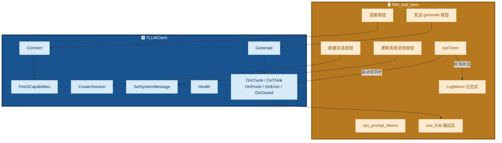
```mermaid
flowchart TB
    subgraph CLIENT["🅿️ TLLMClient"]
        CONN["Connect"]
        CAP["FetchCapabilities"]
        GEN["Generate"]
        CS["CreateSession"]
        SSM["SetSystemMessage"]
        HEALTH["Health"]
        EVENTS["OnChunk / OnThink<br/>OnFinish / OnError / OnClosed"]
    end

    subgraph GUI["🖥️ Tllm_tool_form"]
        BTN_CONN["连接按钮"]
        BTN_NEW["新建会话按钮"]
        BTN_GEN["发送 generate 按钮"]
        BTN_SYS["更新系统消息按钮"]
        MEMO["sys_prompt_Memo"]
        SSE["sse_Edit 输出区"]
        LOG["LogMemo 日志区"]
        TIMER["sysTimer"]
    end

    BTN_CONN --> CONN
    CONN --> CAP
    BTN_NEW --> CS
    BTN_GEN --> GEN
    BTN_SYS --> SSM
    GEN --> EVENTS
    EVENTS --> SSE
    TIMER -->|驱动软同步| EVENTS
    TIMER -->|轮询状态| LOG

    style CLIENT fill:#1A5490,stroke:#0D2F52,stroke-width:3px,color:#FFFFFF
    style GUI fill:#B7791F,stroke:#7E5109,stroke-width:3px,color:#FFFFFF
    style CONN fill:#D6EAF8,stroke:#1F618D,stroke-width:2px,color:#0D2F52
    style CAP fill:#D6EAF8,stroke:#1F618D,stroke-width:2px,color:#0D2F52
    style GEN fill:#D6EAF8,stroke:#1F618D,stroke-width:2px,color:#0D2F52
    style CS fill:#D6EAF8,stroke:#1F618D,stroke-width:2px,color:#0D2F52
    style SSM fill:#D6EAF8,stroke:#1F618D,stroke-width:2px,color:#0D2F52
    style HEALTH fill:#D6EAF8,stroke:#1F618D,stroke-width:2px,color:#0D2F52
    style EVENTS fill:#D6EAF8,stroke:#1F618D,stroke-width:2px,color:#0D2F52
    style BTN_CONN fill:#FDEBD0,stroke:#B7791F,stroke-width:2px,color:#7E5109
    style BTN_NEW fill:#FDEBD0,stroke:#B7791F,stroke-width:2px,color:#7E5109
    style BTN_GEN fill:#FDEBD0,stroke:#B7791F,stroke-width:2px,color:#7E5109
    style BTN_SYS fill:#FDEBD0,stroke:#B7791F,stroke-width:2px,color:#7E5109
    style MEMO fill:#FDEBD0,stroke:#B7791F,stroke-width:2px,color:#7E5109
    style SSE fill:#FDEBD0,stroke:#B7791F,stroke-width:2px,color:#7E5109
    style LOG fill:#FDEBD0,stroke:#B7791F,stroke-width:2px,color:#7E5109
    style TIMER fill:#FDEBD0,stroke:#B7791F,stroke-width:2px,color:#7E5109
```

**关键设计**：

- **`FActiveSessionId`**：会话过滤，只处理当前活动会话的消息，避免多会话输出串台。
- **“新建会话”按钮**：自定义 system message 的**唯一有效入口**。因为 `llm_proxy.exe` 不支持 `set_system_message`，必须通过 `CreateSession(system_message=...)` 传递。
- **`RegisterNotifySync`**：回调在主线程执行，可安全操作 VCL/LCL 控件。
- **能力检查**：`LLM.HasCapabilityInfo` 和 `LLM.LLMSupported(API_NAME_SET_SYSTEM_MESSAGE)` 提前短路，避免无谓 RPC。
- **Unicode**：全程 `TBytes` / UTF-8，绕过 AnsiString 转换，中文和 emoji 完整保留。

**注意事项**：Pascal 客户端的已知问题（`FormClose` 顺序、`var/out` 签名冲突、事件签名对齐、中文编码路径等）详见同目录 `LingoFuse_LLM_Pitfalls_For_AI.md`。

---

## 六、API 能力发现机制

### 图 13：能力矩阵

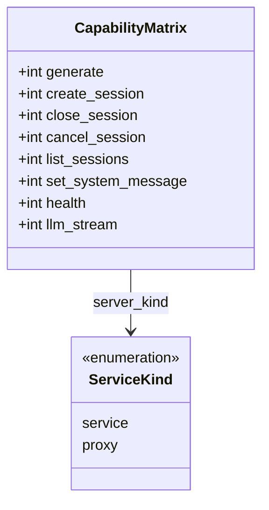
```mermaid
classDiagram
    class CapabilityMatrix {
        +int generate
        +int create_session
        +int close_session
        +int cancel_session
        +int list_sessions
        +int set_system_message
        +int health
        +int llm_stream
    }

    class ServiceKind {
        <<enumeration>>
        service
        proxy
    }

    CapabilityMatrix --> ServiceKind : server_kind
```

**1 = 支持，0 = 不支持**。缺失条目按 0 处理。

### 图 14：发现流程

```mermaid
sequenceDiagram
    participant C as 客户端
    participant S as 服务端

    C->>S: Connect
    C->>S: get_api_capabilities
    S-->>C: {code:0, server_kind, capabilities}
    C->>C: 缓存到本地
    Note over C: 后续命令先查缓存
    C->>C: LLMSupported("set_system_message")
    alt 不支持
        C-->>C: 短路，友好提示
    else 支持
        C->>S: set_system_message(content)
        S-->>C: {code:0, status:"ok"}
    end
```

**Python 客户端**：`fetch_capabilities()` + `llm_supported()`。  
**Pascal 客户端**：`FetchCapabilities()` + `HasCapabilityInfo` + `LLMSupported()`。

**向后兼容**：旧服务端不暴露 `get_api_capabilities` 时，客户端缓存保持为空，`HasCapabilityInfo` 返回 False，相关命令按“未知”处理，回退到无条件调用（旧行为）。

---

## 七、流式协议

### 7.1 消息类型

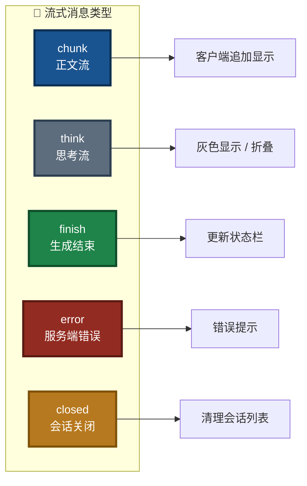
```mermaid
flowchart LR
    subgraph MSG["📨 流式消息类型"]
        C["chunk<br/>正文流"]
        T["think<br/>思考流"]
        F["finish<br/>生成结束"]
        E["error<br/>服务端错误"]
        CL["closed<br/>会话关闭"]
    end

    C --> CU["客户端追加显示"]
    T --> TU["灰色显示 / 折叠"]
    F --> FU["更新状态栏"]
    E --> EU["错误提示"]
    CL --> CLU["清理会话列表"]

    style C fill:#1A5490,stroke:#0D2F52,stroke-width:3px,color:#FFFFFF
    style T fill:#5D6D7E,stroke:#2C3E50,stroke-width:3px,color:#FFFFFF
    style F fill:#1E8449,stroke:#0E4D2A,stroke-width:3px,color:#FFFFFF
    style E fill:#922B21,stroke:#5A1A14,stroke-width:3px,color:#FFFFFF
    style CL fill:#B7791F,stroke:#7E5109,stroke-width:3px,color:#FFFFFF
```

### 图 15：协议演进

```mermaid
sequenceDiagram
    participant Server as 服务端
    participant Client as 客户端

    Note over Server,Client: ❌ v1.0 协议（字符串魔法）
    Server->>Client: {"chunk": "Hello"}
    Server->>Client: {"chunk": " world"}
    Server->>Client: {"chunk": "__FINISH__"}
    Note over Client: 用 startswith 判断

    Note over Server,Client: ✅ v3.0 协议（结构化）
    Server->>Client: {"type":"chunk","session_id":"...","text":"Hello"}
    Server->>Client: {"type":"chunk","session_id":"...","text":" world"}
    Server->>Client: {"type":"think","session_id":"...","text":"..."}
    Server->>Client: {"type":"finish","session_id":"...","reason":"stop"}
    Server->>Client: {"type":"closed","session_id":"...","reason":"timeout"}
```

### 7.3 思考流处理

```mermaid
stateDiagram-v2
    [*] --> Outside: 初始化
    Outside --> Inside: 检测到 think 开始标记
    Inside --> Outside: 检测到 think 结束标记
    Outside --> Outside: 普通文本 → chunk
    Inside --> Inside: 思考文本 → think
```

**两条路径**：

- `llm_service.exe`：模板预置 thinking 标记或模型自发，`ThinkingParser` 状态机分流。
- `llm_proxy.exe`：后端 SSE 已分离 `reasoning_content` 和 `content`，代理无策略转发。

---

## 八、典型使用场景

### 场景 1：本地推理 + Python REPL

```mermaid
flowchart LR
    A["安装 llama-cpp-python"] --> B["下载 GGUF 模型"]
    B --> C["启动 llm_service.exe"]
    C --> D["启动 llm_test.exe"]
    D --> E["/new 创建会话"]
    E --> F["输入问题"]
    F --> G["实时流式输出"]

    style A fill:#1A5490,stroke:#0D2F52,stroke-width:3px,color:#FFFFFF
    style B fill:#1A5490,stroke:#0D2F52,stroke-width:3px,color:#FFFFFF
    style C fill:#1E8449,stroke:#0E4D2A,stroke-width:3px,color:#FFFFFF
    style D fill:#1E8449,stroke:#0E4D2A,stroke-width:3px,color:#FFFFFF
    style E fill:#B7791F,stroke:#7E5109,stroke-width:3px,color:#FFFFFF
    style F fill:#B7791F,stroke:#7E5109,stroke-width:3px,color:#FFFFFF
    style G fill:#922B21,stroke:#5A1A14,stroke-width:3px,color:#FFFFFF
```

### 场景 2：转发到 LM Studio + Pascal GUI

```mermaid
flowchart LR
    A["启动 LM Studio<br/>加载模型"] --> B["启动 llm_proxy.exe<br/>--backend-url http://127.0.0.1:1234/v1"]
    B --> C["运行 llm_tool.exe"]
    C --> D["点击连接"]
    D --> E["点击新建会话"]
    E --> F["输入 system prompt + 正文"]
    F --> G["发送 generate"]

    style A fill:#1A5490,stroke:#0D2F52,stroke-width:3px,color:#FFFFFF
    style B fill:#5B2C6F,stroke:#321640,stroke-width:3px,color:#FFFFFF
    style C fill:#1E8449,stroke:#0E4D2A,stroke-width:3px,color:#FFFFFF
    style D fill:#B7791F,stroke:#7E5109,stroke-width:3px,color:#FFFFFF
    style E fill:#B7791F,stroke:#7E5109,stroke-width:3px,color:#FFFFFF
    style F fill:#B7791F,stroke:#7E5109,stroke-width:3px,color:#FFFFFF
    style G fill:#922B21,stroke:#5A1A14,stroke-width:3px,color:#FFFFFF
```

### 场景 3：跨机部署

```mermaid
flowchart TB
    subgraph GPU["🖥️ GPU 工作站（服务端）"]
        LP["llm_proxy.exe<br/>--endpoint 0.0.0.0:9898"]
    end

    subgraph WEAK["💻 弱机笔记本（客户端）"]
        PY["llm_test.exe<br/>--endpoint 192.168.1.100:9898"]
        PAS["llm_tool.exe<br/>端点填 192.168.1.100:9898"]
    end

    LP -->|TCP 9898| PY
    LP -->|TCP 9898| PAS

    style GPU fill:#5B2C6F,stroke:#321640,stroke-width:3px,color:#FFFFFF
    style WEAK fill:#1A5490,stroke:#0D2F52,stroke-width:3px,color:#FFFFFF
    style LP fill:#F4ECF7,stroke:#5B2C6F,stroke-width:2px,color:#321640
    style PY fill:#D6EAF8,stroke:#1F618D,stroke-width:2px,color:#0D2F52
    style PAS fill:#D6EAF8,stroke:#1F618D,stroke-width:2px,color:#0D2F52
```

### 场景 4：同机多后端共存

```mermaid
flowchart TB
    subgraph TERM["终端"]
        T1["终端 1<br/>llm_service.exe<br/>ipc:llm_service"]
        T2["终端 2<br/>llm_proxy.exe<br/>ipc:llm_proxy<br/>--app-name LLM_Proxy"]
    end

    subgraph CLIENT["客户端"]
        C1["llm_test.exe<br/>--endpoint ipc:llm_service"]
        C2["llm_test.exe<br/>--endpoint ipc:llm_proxy<br/>--server-app LLM_Proxy"]
    end

    T1 --> C1
    T2 --> C2

    style TERM fill:#1A5490,stroke:#0D2F52,stroke-width:3px,color:#FFFFFF
    style CLIENT fill:#B7791F,stroke:#7E5109,stroke-width:3px,color:#FFFFFF
    style T1 fill:#D5F5E3,stroke:#1E8449,stroke-width:2px,color:#0E4D2A
    style T2 fill:#F4ECF7,stroke:#5B2C6F,stroke-width:2px,color:#321640
    style C1 fill:#D6EAF8,stroke:#1F618D,stroke-width:2px,color:#0D2F52
    style C2 fill:#D6EAF8,stroke:#1F618D,stroke-width:2px,color:#0D2F52
```

---

## 九、故障排查

### 9.1 症状速查表

| 症状 | 可能原因 | 参考 |
|------|----------|------|
| 服务端刷屏 `no found app` | `client_name` 不是真实注册的 App 名 | P0-1 |
| 客户端延迟数秒才收到第一批 token | `requests` 的 SSE 缓冲 | P0-4 |
| `llm_proxy` 启动后立即退出 | `main()` 缺少阻塞主循环 | P0-5 |
| 思考阶段无输出，之后突然全部出现 | `reasoning_content` 被丢弃 | P0-6 |
| `set_system_message` 返回 `unsupported` | 当前服务端是 `llm_proxy.exe` | P6-3 |
| 多会话输出串台 | 客户端未按 `session_id` 过滤 | P6-4 |
| 中文乱码 | 未使用 `TBytes` 全程 UTF-8 | P2-1 |
| emoji 显示为 `?` | Windows 控制台代码页问题 | P2-3 |
| 关闭窗口时崩溃 | `FormClose` 直接 Shutdown | P4-2 |
| 流式输出延迟极大 | `RegisterNotifySync` 未驱动同步 | P4-3 |
| 连接失败后按钮永久禁用 | 失败路径未恢复 UI | P4-4 |
| 新的 system prompt 不生效 | 未走 `CreateSession` 路径 | P4-5 |

完整排查指南和所有坑的索引，请直接查阅同目录 `LingoFuse_LLM_Pitfalls_For_AI.md`。

### 图 16：启动失败排查优先级

```mermaid
flowchart TB
    subgraph Q1["🔴 立即防御 —— 易踩高 + 后果严重"]
        direction LR
        A1["client_name 错误"]
        A2["llama.cpp 线程不安全"]
        A3["回调中阻塞"]
        A4["SSE 缓冲"]
        A5["proxy 进程秒退"]
        A6["thinking 混淆"]
        A7["gzip 压缩"]
        A8["set_system_message 假成功"]
    end

    subgraph Q2["🟠 高优先级 —— 易踩高 + 后果中等"]
        direction LR
        B1["模板路径搜索"]
        B2["var/out 冲突"]
        B3["事件签名"]
        B4["会话过滤"]
        B5["FormClose 顺序"]
        B6["后台读 UI"]
        B7["中文编码"]
    end

    subgraph Q3["🟡 一般关注 —— 易踩低 + 后果中等"]
        direction LR
        C1["emoji 控制台"]
        C2["Connect 泄漏"]
        C3["LF_Sync 驱动"]
        C4["TCP_NODELAY"]
    end

    subgraph Q4["🟢 排期修复 —— 易踩低 + 后果轻微"]
        direction LR
        D1["递归栈溢出"]
        D2["buffer 判空"]
    end

    style Q1 fill:#FADBD8,stroke:#922B21,stroke-width:3px,color:#5A1A14
    style Q2 fill:#FDEBD0,stroke:#B7791F,stroke-width:3px,color:#7E5109
    style Q3 fill:#FEF9E7,stroke:#B7950B,stroke-width:3px,color:#7E5109
    style Q4 fill:#EAECEE,stroke:#5D6D7E,stroke-width:3px,color:#2C3E50
    style A1 fill:#922B21,stroke:#5A1A14,stroke-width:2px,color:#FFFFFF
    style A2 fill:#922B21,stroke:#5A1A14,stroke-width:2px,color:#FFFFFF
    style A3 fill:#922B21,stroke:#5A1A14,stroke-width:2px,color:#FFFFFF
    style A4 fill:#922B21,stroke:#5A1A14,stroke-width:2px,color:#FFFFFF
    style A5 fill:#922B21,stroke:#5A1A14,stroke-width:2px,color:#FFFFFF
    style A6 fill:#922B21,stroke:#5A1A14,stroke-width:2px,color:#FFFFFF
    style A7 fill:#922B21,stroke:#5A1A14,stroke-width:2px,color:#FFFFFF
    style A8 fill:#922B21,stroke:#5A1A14,stroke-width:2px,color:#FFFFFF
    style B1 fill:#B7791F,stroke:#7E5109,stroke-width:2px,color:#FFFFFF
    style B2 fill:#B7791F,stroke:#7E5109,stroke-width:2px,color:#FFFFFF
    style B3 fill:#B7791F,stroke:#7E5109,stroke-width:2px,color:#FFFFFF
    style B4 fill:#B7791F,stroke:#7E5109,stroke-width:2px,color:#FFFFFF
    style B5 fill:#B7791F,stroke:#7E5109,stroke-width:2px,color:#FFFFFF
    style B6 fill:#B7791F,stroke:#7E5109,stroke-width:2px,color:#FFFFFF
    style B7 fill:#B7791F,stroke:#7E5109,stroke-width:2px,color:#FFFFFF
    style C1 fill:#B7950B,stroke:#7E5109,stroke-width:2px,color:#FFFFFF
    style C2 fill:#B7950B,stroke:#7E5109,stroke-width:2px,color:#FFFFFF
    style C3 fill:#B7950B,stroke:#7E5109,stroke-width:2px,color:#FFFFFF
    style C4 fill:#B7950B,stroke:#7E5109,stroke-width:2px,color:#FFFFFF
    style D1 fill:#5D6D7E,stroke:#2C3E50,stroke-width:2px,color:#FFFFFF
    style D2 fill:#5D6D7E,stroke:#2C3E50,stroke-width:2px,color:#FFFFFF
```

---

## 十、三条铁律

```mermaid
mindmap
  root(("三条铁律"))
    铁律一
      client_name 是身份
      不是标签
      必须真实注册
    铁律二
      回调要快
      耗时操作入队
      阻塞调用禁止
    铁律三
      字节流是通用语言
      UTF-8 全程
      不经 string 中转
```

1. **`client_name` = LingoFuse 网络路由身份**，必须是 `generate_app_name()` 的返回值，不能是自定义字符串。
2. **回调只做“读输入 + 入队 + 立即返回”**，任何耗时操作都放 worker 线程。
3. **跨语言 JSON 走 `TBytes` / `bytes`**，UTF-8 全程一致，只在显示层转 `string`。

---

## 十一、文档索引（同目录）

| 文档 | 说明 |
|------|------|
| `LingoFuse_LLM_Service_CLI_guide.md` | `llm_service.exe` 命令行完整手册 |
| `LingoFuse_LLM_Proxy_CLI_Guide.md` | `llm_proxy.exe` 命令行完整手册 |
| `LingoFuse_LLM_Proxy_Compatibility_Guide.md` | 支持的 129+ OpenAI 兼容后端清单 |
| `LingoFuse_LLM_Pitfalls_For_AI.md` | 踩坑大全，症状-根因-正确做法 |
| `LingoFuse_LLM_Service_Work_Summary.md` | 版本演进与架构决策（历史参考） |
| `llama_cpp_python_guide.md` | `llama-cpp-python` 安装与使用 |

---

**文档版本**：v3.0（仅保留同目录链接，高对比配色，多图拆分）  
**维护者**：LingoFuse-pasAgent 团队  
**反馈**：问题提 Issue，急事加 Q（600585）