# LingoFuse LLM 生态体系使用指南

> **文档名**：`LingoFuse_LLM_Ecosystem_User_Guide.md`  
> **版本**：v2.0  
> **最后更新**：2026-09-13  
> **适用组件**：`llm_service.py`、`llm_proxy.py`、`llm_test.py`、Pascal 客户端（`llm_client.pas` / `llm_tool_frm.pas`）  
> **相关文档**：  
> - [`LingoFuse_LLM_Service_CLI_guide.md`](LingoFuse_LLM_Service_CLI_guide.md)  
> - [`LingoFuse_LLM_Proxy_CLI_Guide.md`](LingoFuse_LLM_Proxy_CLI_Guide.md)  
> - [`LingoFuse_LLM_Proxy_Compatibility_Guide.md`](LingoFuse_LLM_Proxy_Compatibility_Guide.md)  
> - [`LingoFuse_Python_Streaming_LLM_Guide.md`](LingoFuse_Python_Streaming_LLM_Guide.md)  
> - [`LingoFuse_LLM_Pitfalls_For_AI.md`](LingoFuse_LLM_Pitfalls_For_AI.md)  
> - [`LingoFuse_LLM_Service_Work_Summary.md`](LingoFuse_LLM_Service_Work_Summary.md)  
> - [`llama_cpp_python_guide.md`](llama_cpp_python_guide.md)

---

## 一、体系全景

LingoFuse LLM 生态是一套跨语言、流式、多会话的大模型调用方案。它把大模型能力封装成 **LingoFuse 服务端**，任何支持 LingoFuse 的客户端都能像调用本地函数一样调用大模型，并实时接收流式输出。

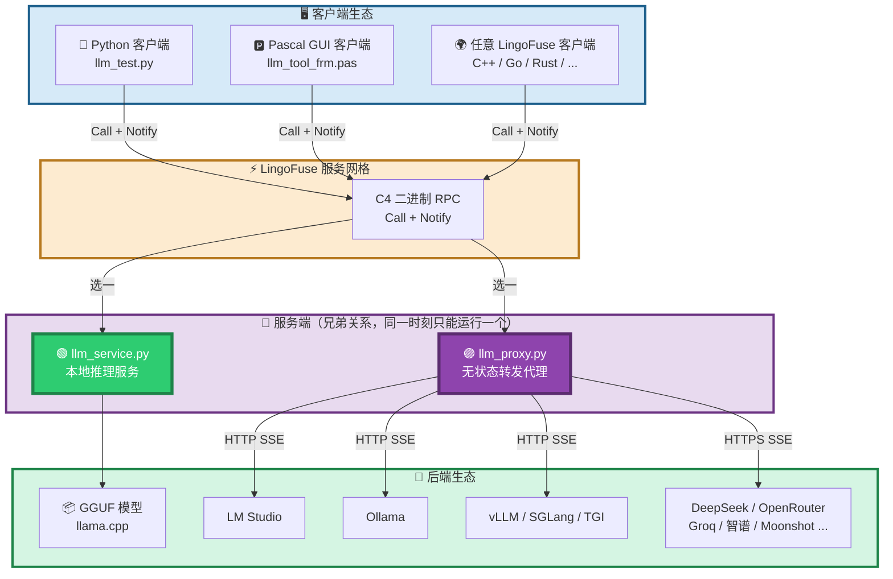
```mermaid
flowchart TB
    subgraph CLIENTS["🖥️ 客户端生态"]
        PY["🐍 Python 客户端<br/>llm_test.py"]
        PAS["🅿️ Pascal GUI 客户端<br/>llm_tool_frm.pas"]
        ANY["🌍 任意 LingoFuse 客户端<br/>C++ / Go / Rust / ..."]
    end

    subgraph CORE["⚡ LingoFuse 服务网格"]
        GRID["C4 二进制 RPC<br/>Call + Notify"]
    end

    subgraph SERVERS["🎯 服务端（兄弟关系，同一时刻只能运行一个）"]
        LS["🟢 llm_service.py<br/>本地推理服务"]
        LP["🟣 llm_proxy.py<br/>无状态转发代理"]
    end

    subgraph BACKENDS["🔌 后端生态"]
        GGUF["📦 GGUF 模型<br/>llama.cpp"]
        LMS["LM Studio"]
        OL["Ollama"]
        VLLM["vLLM / SGLang / TGI"]
        CLOUD["DeepSeek / OpenRouter<br/>Groq / 智谱 / Moonshot ..."]
    end

    PY -->|Call + Notify| GRID
    PAS -->|Call + Notify| GRID
    ANY -->|Call + Notify| GRID
    GRID -->|选一| LS
    GRID -->|选一| LP
    LS --> GGUF
    LP -->|HTTP SSE| LMS
    LP -->|HTTP SSE| OL
    LP -->|HTTP SSE| VLLM
    LP -->|HTTPS SSE| CLOUD

    style CLIENTS fill:#D6EAF8,stroke:#1F618D,stroke-width:3px
    style CORE fill:#FDEBD0,stroke:#B7791F,stroke-width:3px
    style SERVERS fill:#E8DAEF,stroke:#6C3483,stroke-width:3px
    style BACKENDS fill:#D5F5E3,stroke:#1E8449,stroke-width:3px
    style LS fill:#2ECC71,stroke:#1E8449,stroke-width:4px,color:#FFFFFF
    style LP fill:#8E44AD,stroke:#5B2C6F,stroke-width:4px,color:#FFFFFF
```

**一句话总结**：客户端只管调 `generate`，服务端负责把请求变成真正的模型推理——本地跑也好，转发到 LM Studio / 云 API 也好，对客户端完全透明。

---

## 二、两种服务端：兄弟关系

### 2.1 定位对比

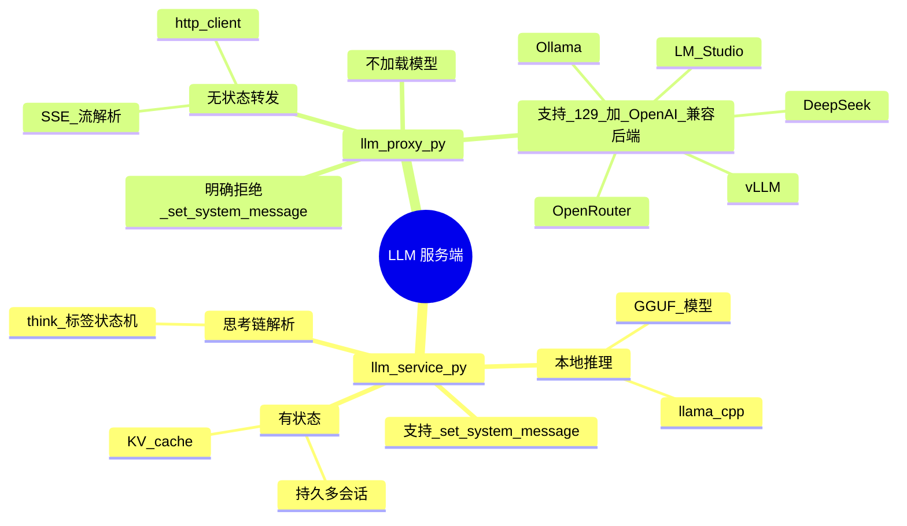
```mermaid
mindmap
  root(("LLM 服务端"))
    llm_service_py
      本地推理
        llama_cpp
        GGUF_模型
      有状态
        持久多会话
        KV_cache
      支持_set_system_message
      思考链解析
        think_标签状态机
    llm_proxy_py
      无状态转发
        http_client
        SSE_流解析
      不加载模型
      明确拒绝_set_system_message
      支持_129_加_OpenAI_兼容后端
        LM_Studio
        Ollama
        vLLM
        DeepSeek
        OpenRouter
```

### 2.2 能力矩阵

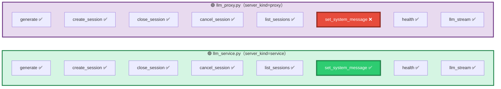
```mermaid
flowchart LR
    subgraph LS["🟢 llm_service.py（server_kind=service）"]
        L1["generate ✅"]
        L2["create_session ✅"]
        L3["close_session ✅"]
        L4["cancel_session ✅"]
        L5["list_sessions ✅"]
        L6["set_system_message ✅"]
        L7["health ✅"]
        L8["llm_stream ✅"]
    end

    subgraph LP["🟣 llm_proxy.py（server_kind=proxy）"]
        P1["generate ✅"]
        P2["create_session ✅"]
        P3["close_session ✅"]
        P4["cancel_session ✅"]
        P5["list_sessions ✅"]
        P6["set_system_message ❌"]
        P7["health ✅"]
        P8["llm_stream ✅"]
    end

    style LS fill:#D5F5E3,stroke:#1E8449,stroke-width:3px
    style LP fill:#E8DAEF,stroke:#6C3483,stroke-width:3px
    style L6 fill:#2ECC71,stroke:#1E8449,stroke-width:4px,color:#FFFFFF
    style P6 fill:#E74C3C,stroke:#922B21,stroke-width:4px,color:#FFFFFF
```

### 2.3 共存规则

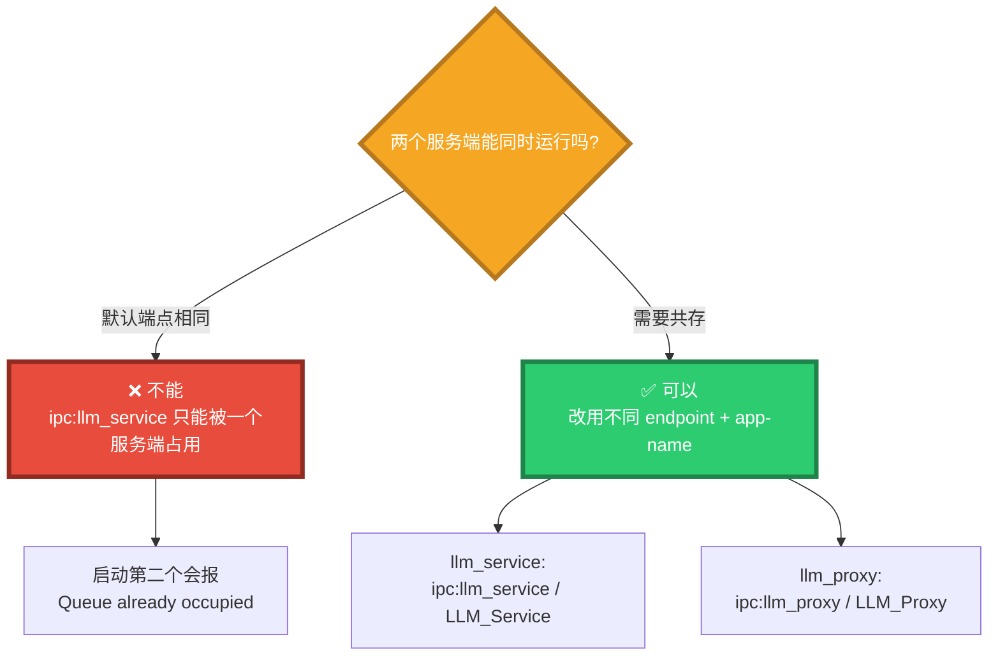
```mermaid
flowchart TB
    Q{"两个服务端能同时运行吗?"}
    Q -->|默认端点相同| NO["❌ 不能<br/>ipc:llm_service 只能被一个服务端占用"]
    Q -->|需要共存| YES["✅ 可以<br/>改用不同 endpoint + app-name"]

    NO --> N1["启动第二个会报<br/>Queue already occupied"]
    YES --> Y1["llm_service:<br/>ipc:llm_service / LLM_Service"]
    YES --> Y2["llm_proxy:<br/>ipc:llm_proxy / LLM_Proxy"]

    style Q fill:#F5A623,stroke:#B7791F,stroke-width:4px,color:#FFFFFF
    style NO fill:#E74C3C,stroke:#922B21,stroke-width:4px,color:#FFFFFF
    style YES fill:#2ECC71,stroke:#1E8449,stroke-width:4px,color:#FFFFFF
```

---

## 三、快速开始

### 3.1 选择服务端

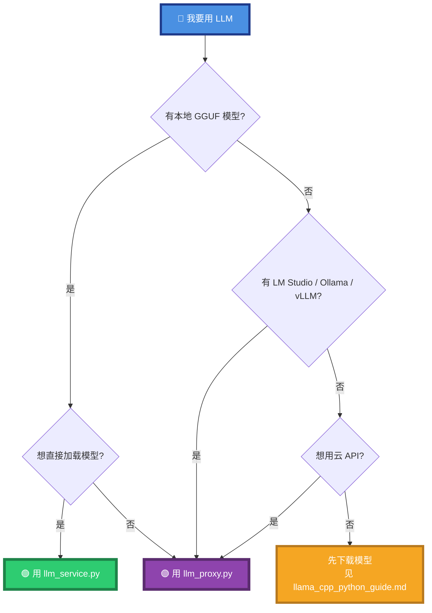
```mermaid
flowchart TD
    START["🚀 我要用 LLM"] --> Q1{"有本地 GGUF 模型?"}
    Q1 -->|是| Q2{"想直接加载模型?"}
    Q1 -->|否| Q3{"有 LM Studio / Ollama / vLLM?"}
    Q2 -->|是| LS["🟢 用 llm_service.py"]
    Q2 -->|否| LP["🟣 用 llm_proxy.py"]
    Q3 -->|是| LP
    Q3 -->|否| Q4{"想用云 API?"}
    Q4 -->|是| LP
    Q4 -->|否| DOWNLOAD["先下载模型<br/>见 llama_cpp_python_guide.md"]

    style START fill:#4A90E2,stroke:#1E3A8A,stroke-width:4px,color:#FFFFFF
    style LS fill:#2ECC71,stroke:#1E8449,stroke-width:5px,color:#FFFFFF
    style LP fill:#8E44AD,stroke:#5B2C6F,stroke-width:5px,color:#FFFFFF
    style DOWNLOAD fill:#F5A623,stroke:#B7791F,stroke-width:4px,color:#FFFFFF
```

### 3.2 启动流程

```mermaid
sequenceDiagram
    participant U as 用户
    participant S as 服务端
    participant C as 客户端

    U->>S: 启动 llm_service 或 llm_proxy
    S->>S: 注册 ipc:llm_service
    S-->>U: 打印状态横幅，进入监听
    U->>C: 启动 llm_test 或 llm_tool
    C->>S: PrepareClient + PrepareDone
    C->>S: get_api_capabilities
    S-->>C: 能力矩阵
    C->>S: create_session(client_name, system_message)
    S-->>C: session_id
    C->>S: generate(session_id, content)
    S-->>C: 立即返回 task_id
    loop 流式生成
        S-->>C: Notify chunk / think
    end
    S-->>C: Notify finish
```

---

## 四、服务端详解

### 4.1 llm_service.py —— 本地推理服务

#### 4.1.1 架构图

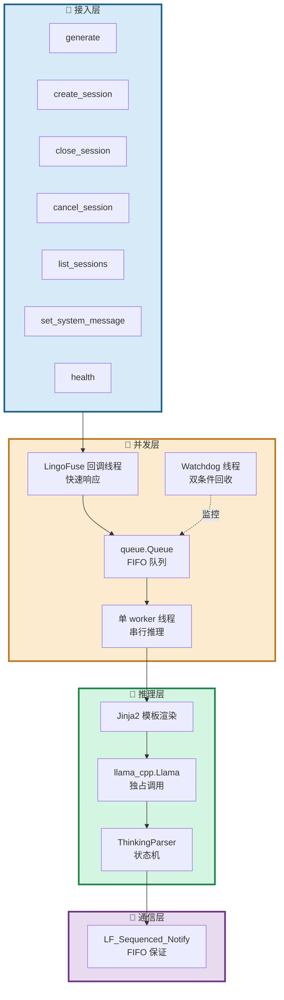
```mermaid
flowchart TB
    subgraph API["🎯 接入层"]
        A1["generate"]
        A2["create_session"]
        A3["close_session"]
        A4["cancel_session"]
        A5["list_sessions"]
        A6["set_system_message"]
        A7["health"]
    end

    subgraph CONC["🧵 并发层"]
        CB["LingoFuse 回调线程<br/>快速响应"]
        Q["queue.Queue<br/>FIFO 队列"]
        W["单 worker 线程<br/>串行推理"]
        WD["Watchdog 线程<br/>双条件回收"]
    end

    subgraph INFER["🧠 推理层"]
        TPL["Jinja2 模板渲染"]
        TH["ThinkingParser<br/>状态机"]
        LLM["llama_cpp.Llama<br/>独占调用"]
    end

    subgraph COMM["📡 通信层"]
        SEQ["LF_Sequenced_Notify<br/>FIFO 保证"]
    end

    API --> CB
    CB --> Q
    Q --> W
    W --> TPL
    TPL --> LLM
    LLM --> TH
    TH --> SEQ
    WD -.->|监控| Q

    style API fill:#D6EAF8,stroke:#1F618D,stroke-width:3px
    style CONC fill:#FDEBD0,stroke:#B7791F,stroke-width:3px
    style INFER fill:#D5F5E3,stroke:#1E8449,stroke-width:3px
    style COMM fill:#E8DAEF,stroke:#6C3483,stroke-width:3px
```

**核心设计**：llama.cpp 的 `llama_context` 是**单线程状态机**（KV cache、采样器 RNG、BPE 状态共享），多线程直调会导致进程级 abort。所以所有推理请求都通过一个 FIFO 队列串行化到单个 worker 线程。

#### 4.1.2 会话生命周期

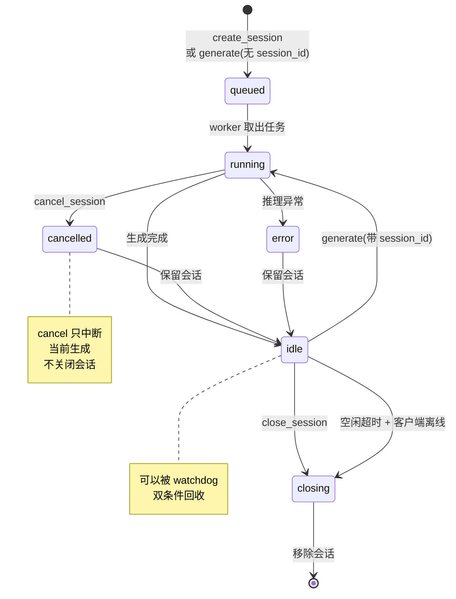
```mermaid
stateDiagram-v2
    [*] --> queued: create_session<br/>或 generate(无 session_id)
    queued --> running: worker 取出任务
    running --> idle: 生成完成
    running --> cancelled: cancel_session
    running --> error: 推理异常
    idle --> running: generate(带 session_id)
    idle --> closing: close_session
    idle --> closing: 空闲超时 + 客户端离线
    cancelled --> idle: 保留会话
    error --> idle: 保留会话
    closing --> [*]: 移除会话
    note right of idle
        可以被 watchdog
        双条件回收
    end note
    note right of cancelled
        cancel 只中断
        当前生成
        不关闭会话
    end note
```

#### 4.1.3 双条件回收策略

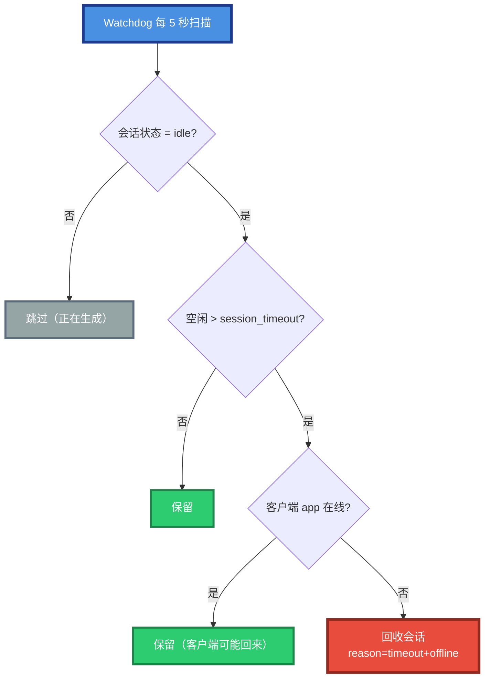
```mermaid
flowchart TD
    START["Watchdog 每 5 秒扫描"] --> C1{"会话状态 = idle?"}
    C1 -->|否| SKIP["跳过（正在生成）"]
    C1 -->|是| C2{"空闲 > session_timeout?"}
    C2 -->|否| KEEP["保留"]
    C2 -->|是| C3{"客户端 app 在线?"}
    C3 -->|是| KEEP2["保留（客户端可能回来）"]
    C3 -->|否| CLOSE["回收会话<br/>reason=timeout+offline"]

    style START fill:#4A90E2,stroke:#1E3A8A,stroke-width:4px,color:#FFFFFF
    style SKIP fill:#95A5A6,stroke:#5D6D7E,stroke-width:3px,color:#FFFFFF
    style KEEP fill:#2ECC71,stroke:#1E8449,stroke-width:3px,color:#FFFFFF
    style KEEP2 fill:#2ECC71,stroke:#1E8449,stroke-width:3px,color:#FFFFFF
    style CLOSE fill:#E74C3C,stroke:#922B21,stroke-width:4px,color:#FFFFFF
```

**为什么双条件**：客户端偶尔断开重连（笔记本休眠、网络抖动、客户端重启）。如果只按空闲时长回收，客户端暂停超过阈值就会丢失整个对话历史。加上“客户端离线”条件后，只要客户端还在线，会话就一直保留。

**关键命令**：`--session-timeout`（默认 600 秒）、`--max-sessions`（默认 1024）、`--queue-max-size`（默认 256）。详见 [`LingoFuse_LLM_Service_CLI_guide.md`](LingoFuse_LLM_Service_CLI_guide.md)。

### 4.2 llm_proxy.py —— 无状态转发代理

#### 4.2.1 架构图

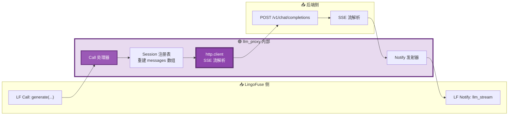
```mermaid
flowchart LR
    subgraph IN["📥 LingoFuse 侧"]
        CALL["LF Call: generate(...)"]
        NOTIFY["LF Notify: llm_stream"]
    end

    subgraph PROXY["🟣 llm_proxy 内部"]
        HANDLER["Call 处理器"]
        SESSION["Session 注册表<br/>重建 messages 数组"]
        BACKEND["http.client<br/>SSE 流解析"]
        EMIT["Notify 发射器"]
    end

    subgraph OUT["📤 后端侧"]
        HTTP["POST /v1/chat/completions"]
        SSE["SSE 流解析"]
    end

    CALL --> HANDLER
    HANDLER --> SESSION
    SESSION --> BACKEND
    BACKEND --> HTTP
    HTTP --> SSE
    SSE --> EMIT
    EMIT --> NOTIFY

    style PROXY fill:#E8DAEF,stroke:#6C3483,stroke-width:4px
    style BACKEND fill:#8E44AD,stroke:#5B2C6F,stroke-width:4px,color:#FFFFFF
    style HANDLER fill:#9B59B6,stroke:#6C3483,stroke-width:3px,color:#FFFFFF
```

#### 4.2.2 无状态语义

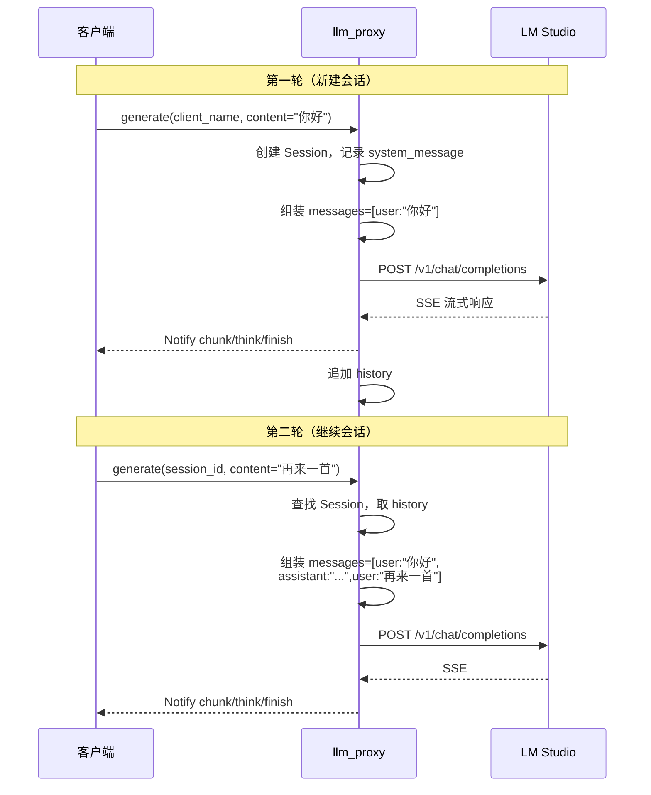
```mermaid
sequenceDiagram
    participant C as 客户端
    participant P as llm_proxy
    participant B as LM Studio

    Note over C,B: 第一轮（新建会话）
    C->>P: generate(client_name, content="你好")
    P->>P: 创建 Session，记录 system_message
    P->>P: 组装 messages=[user:"你好"]
    P->>B: POST /v1/chat/completions
    B-->>P: SSE 流式响应
    P-->>C: Notify chunk/think/finish
    P->>P: 追加 history

    Note over C,B: 第二轮（继续会话）
    C->>P: generate(session_id, content="再来一首")
    P->>P: 查找 Session，取 history
    P->>P: 组装 messages=[user:"你好",<br/>assistant:"...",user:"再来一首"]
    P->>B: POST /v1/chat/completions
    B-->>P: SSE
    P-->>C: Notify chunk/think/finish
```

**要点**：代理不持有模型 KV cache；每轮请求都重新组装完整 messages 数组发给后端。后端视角是“无状态 HTTP”，客户端视角是“持久会话”。

#### 4.2.3 SSE 传输层的坑

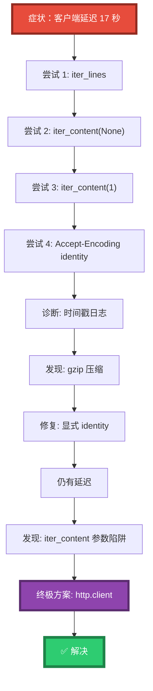
```mermaid
flowchart TB
    START["症状：客户端延迟 17 秒"] --> A1["尝试 1: iter_lines"]
    A1 --> A2["尝试 2: iter_content(None)"]
    A2 --> A3["尝试 3: iter_content(1)"]
    A3 --> A4["尝试 4: Accept-Encoding identity"]
    A4 --> A5["诊断: 时间戳日志"]
    A5 --> A6["发现: gzip 压缩"]
    A6 --> A7["修复: 显式 identity"]
    A7 --> A8["仍有延迟"]
    A8 --> A9["发现: iter_content 参数陷阱"]
    A9 --> A10["终极方案: http.client"]
    A10 --> DONE["✅ 解决"]

    style START fill:#E74C3C,stroke:#922B21,stroke-width:4px,color:#FFFFFF
    style DONE fill:#2ECC71,stroke:#1E8449,stroke-width:5px,color:#FFFFFF
    style A10 fill:#8E44AD,stroke:#5B2C6F,stroke-width:4px,color:#FFFFFF
```

**三层缓冲，缺一不可**：

| 层 | 缓冲源 | 修复 |
|----|--------|------|
| 1 | `iter_lines()` 内部 512 字节缓冲 | 换 `iter_content` |
| 2 | `iter_content(None)` = 读直到 EOF | 换 `chunk_size=1` |
| 3 | gzip 解码器攒够 deflate 块才吐 | `Accept-Encoding: identity` |
| 4 | `urllib3` 内部预读 socket | 换 `http.client` |

**最终方案**：`http.client` + `Accept-Encoding: identity` + `TCP_NODELAY`。详细排查过程见 [`LingoFuse_LLM_Pitfalls_For_AI.md`](LingoFuse_LLM_Pitfalls_For_AI.md) 中的 P0-4、P6-1、P6-2。

#### 4.2.4 支持的后端

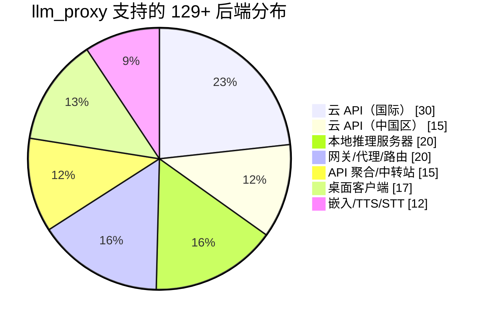
```mermaid
pie showData
    title llm_proxy 支持的 129+ 后端分布
    "云 API（国际）" : 30
    "云 API（中国区）" : 15
    "本地推理服务器" : 20
    "网关/代理/路由" : 20
    "API 聚合/中转站" : 15
    "桌面客户端" : 17
    "嵌入/TTS/STT" : 12
```

完整清单见 [`LingoFuse_LLM_Proxy_Compatibility_Guide.md`](LingoFuse_LLM_Proxy_Compatibility_Guide.md)。

### 4.3 关键参数速查

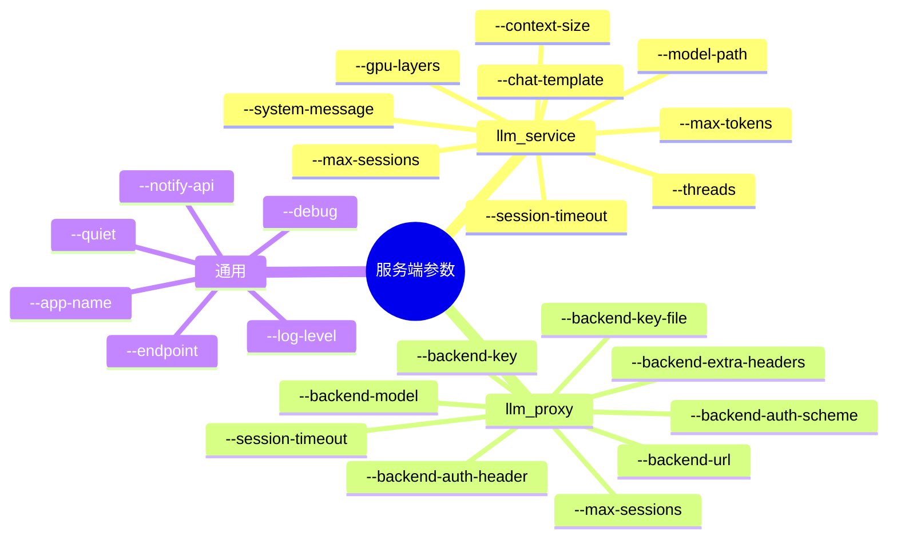
```mermaid
mindmap
  root(("服务端参数"))
    llm_service
      --model-path
      --context-size
      --max-tokens
      --threads
      --gpu-layers
      --session-timeout
      --max-sessions
      --chat-template
      --system-message
    llm_proxy
      --backend-url
      --backend-model
      --backend-key
      --backend-key-file
      --backend-auth-header
      --backend-auth-scheme
      --backend-extra-headers
      --session-timeout
      --max-sessions
    通用
      --endpoint
      --app-name
      --notify-api
      --log-level
      --debug
      --quiet
```

---

## 五、客户端详解

### 5.1 Python 客户端：llm_test.py

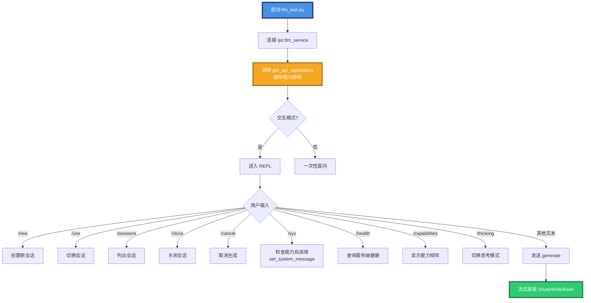
```mermaid
flowchart TB
    START["启动 llm_test.py"] --> CONN["连接 ipc:llm_service"]
    CONN --> CAP["调用 get_api_capabilities<br/>缓存能力矩阵"]
    CAP --> MODE{"交互模式?"}
    MODE -->|是| REPL["进入 REPL"]
    MODE -->|否| ONESHOT["一次性提问"]
    REPL --> CMD{"用户输入"}
    CMD -->|/new| NEW["创建新会话"]
    CMD -->|/use| USE["切换会话"]
    CMD -->|/sessions| LIST["列出会话"]
    CMD -->|/close| CLOSE["关闭会话"]
    CMD -->|/cancel| CANCEL["取消生成"]
    CMD -->|/sys| SYS["检查能力后调用<br/>set_system_message"]
    CMD -->|/health| HEALTH["查询服务端健康"]
    CMD -->|/capabilities| CAPS["显示能力矩阵"]
    CMD -->|/thinking| THINK["切换思考模式"]
    CMD -->|其他文本| SEND["发送 generate"]
    SEND --> STREAM["流式接收 chunk/think/finish"]

    style START fill:#4A90E2,stroke:#1E3A8A,stroke-width:4px,color:#FFFFFF
    style CAP fill:#F5A623,stroke:#B7791F,stroke-width:4px,color:#FFFFFF
    style STREAM fill:#2ECC71,stroke:#1E8449,stroke-width:4px,color:#FFFFFF
```

**命令列表**：

| 命令 | 作用 |
|------|------|
| `/new` | 创建新会话 |
| `/use <id>` | 切换当前会话 |
| `/sessions` | 列出本客户端的所有会话 |
| `/close [id]` | 关闭会话 |
| `/cancel` | 取消当前生成 |
| `/sys <msg>` | 更新全局默认 system message（能力检查后） |
| `/health` | 查询服务端健康/状态 |
| `/capabilities [refresh]` | 显示/刷新能力矩阵 |
| `/thinking on\|off` | 切换思考模式 |
| `/help` | 显示帮助 |
| `/quit`、`/exit` | 退出 |

**控制台 emoji 支持**：`_setup_console_encoding()` 在启动时自动切换 Windows 控制台代码页到 UTF-8、启用 VT 处理，并重配置 Python stream 为 UTF-8。

### 5.2 Pascal 客户端：llm_client.pas + llm_tool_frm.pas

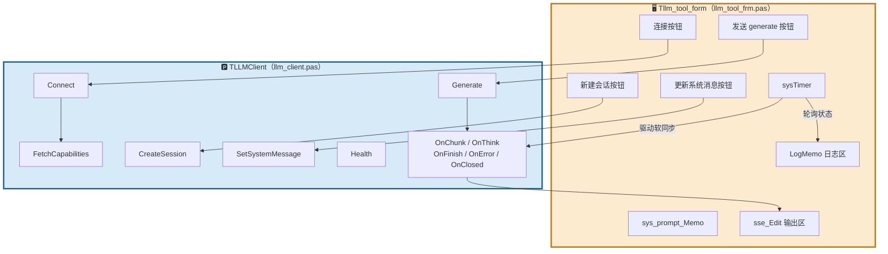
```mermaid
flowchart TB
    subgraph CLIENT["🅿️ TLLMClient（llm_client.pas）"]
        CONN["Connect"]
        CAP["FetchCapabilities"]
        GEN["Generate"]
        CS["CreateSession"]
        SSM["SetSystemMessage"]
        HEALTH["Health"]
        EVENTS["OnChunk / OnThink<br/>OnFinish / OnError / OnClosed"]
    end

    subgraph GUI["🖥️ Tllm_tool_form（llm_tool_frm.pas）"]
        BTN_CONN["连接按钮"]
        BTN_NEW["新建会话按钮"]
        BTN_GEN["发送 generate 按钮"]
        BTN_SYS["更新系统消息按钮"]
        MEMO["sys_prompt_Memo"]
        SSE["sse_Edit 输出区"]
        LOG["LogMemo 日志区"]
        TIMER["sysTimer"]
    end

    BTN_CONN --> CONN
    CONN --> CAP
    BTN_NEW --> CS
    BTN_GEN --> GEN
    BTN_SYS --> SSM
    GEN --> EVENTS
    EVENTS --> SSE
    TIMER -->|驱动软同步| EVENTS
    TIMER -->|轮询状态| LOG

    style CLIENT fill:#D6EAF8,stroke:#1F618D,stroke-width:3px
    style GUI fill:#FDEBD0,stroke:#B7791F,stroke-width:3px
```

**关键设计**：

- **`FActiveSessionId`**：会话过滤，只处理当前活动会话的消息，避免多会话输出串台。
- **“新建会话”按钮**：自定义 system message 的**唯一有效入口**。因为 `llm_proxy.py` 不支持 `set_system_message`，必须通过 `CreateSession(system_message=...)` 传递。
- **`RegisterNotifySync`**：回调在主线程执行，可安全操作 VCL/LCL 控件。
- **能力检查**：`LLM.HasCapabilityInfo` 和 `LLM.LLMSupported(API_NAME_SET_SYSTEM_MESSAGE)` 提前短路，避免无谓 RPC。
- **Unicode**：全程 `TBytes` / UTF-8，绕过 AnsiString 转换，中文和 emoji 完整保留。

**事件流**：

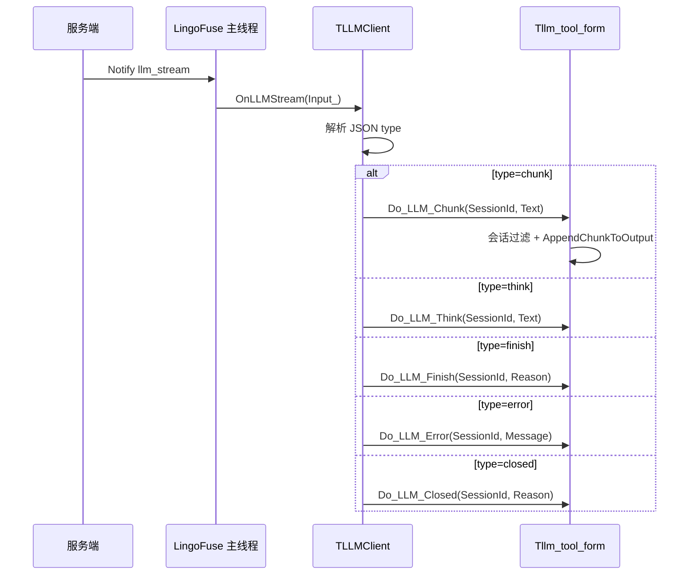
```mermaid
sequenceDiagram
    participant S as 服务端
    participant L as LingoFuse 主线程
    participant C as TLLMClient
    participant F as Tllm_tool_form

    S->>L: Notify llm_stream
    L->>C: OnLLMStream(Input_)
    C->>C: 解析 JSON type
    alt type=chunk
        C->>F: Do_LLM_Chunk(SessionId, Text)
        F->>F: 会话过滤 + AppendChunkToOutput
    else type=think
        C->>F: Do_LLM_Think(SessionId, Text)
    else type=finish
        C->>F: Do_LLM_Finish(SessionId, Reason)
    else type=error
        C->>F: Do_LLM_Error(SessionId, Message)
    else type=closed
        C->>F: Do_LLM_Closed(SessionId, Reason)
    end
```

**注意事项**：Pascal 客户端的已知问题（`FormClose` 顺序、`var/out` 签名冲突、事件签名对齐、中文编码路径等）详见 [`LingoFuse_LLM_Pitfalls_For_AI.md`](LingoFuse_LLM_Pitfalls_For_AI.md) 中的 P1-5、P1-6、P1-7、P2-1、P3-3、P4-1 至 P4-6。

---

## 六、API 能力发现机制

### 6.1 能力矩阵

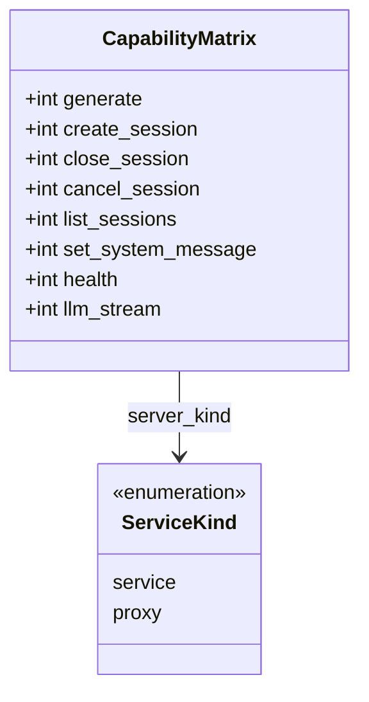
```mermaid
classDiagram
    class CapabilityMatrix {
        +int generate
        +int create_session
        +int close_session
        +int cancel_session
        +int list_sessions
        +int set_system_message
        +int health
        +int llm_stream
    }

    class ServiceKind {
        <<enumeration>>
        service
        proxy
    }

    CapabilityMatrix --> ServiceKind : server_kind
```

**1 = 支持，0 = 不支持**。缺失条目按 0 处理。

### 6.2 发现流程

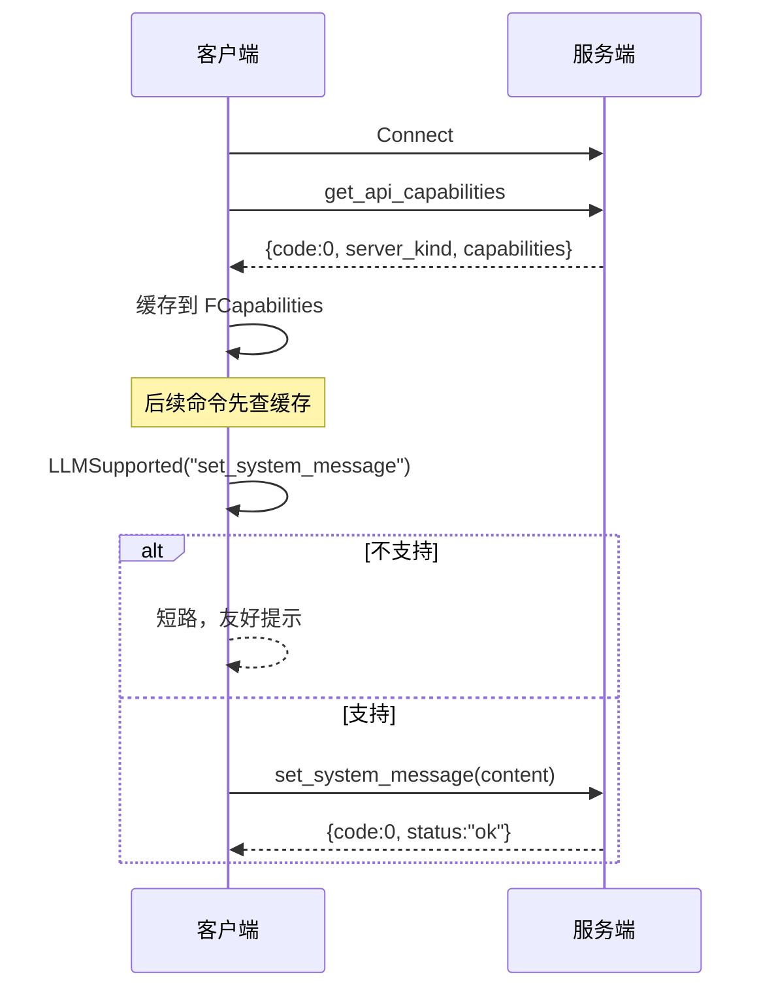
```mermaid
sequenceDiagram
    participant C as 客户端
    participant S as 服务端

    C->>S: Connect
    C->>S: get_api_capabilities
    S-->>C: {code:0, server_kind, capabilities}
    C->>C: 缓存到 FCapabilities
    Note over C: 后续命令先查缓存
    C->>C: LLMSupported("set_system_message")
    alt 不支持
        C-->>C: 短路，友好提示
    else 支持
        C->>S: set_system_message(content)
        S-->>C: {code:0, status:"ok"}
    end
```

**Python 客户端**：`fetch_capabilities()` + `llm_supported()`。  
**Pascal 客户端**：`FetchCapabilities()` + `HasCapabilityInfo` + `LLMSupported()`。

**向后兼容**：旧服务端不暴露 `get_api_capabilities` 时，客户端缓存保持为空，`HasCapabilityInfo` 返回 False，相关命令按“未知”处理，回退到无条件调用（旧行为）。

---

## 七、流式协议

### 7.1 消息类型

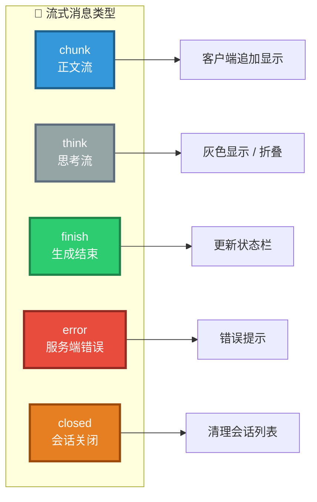
```mermaid
flowchart LR
    subgraph MSG["📨 流式消息类型"]
        C["chunk<br/>正文流"]
        T["think<br/>思考流"]
        F["finish<br/>生成结束"]
        E["error<br/>服务端错误"]
        CL["closed<br/>会话关闭"]
    end

    C --> CU["客户端追加显示"]
    T --> TU["灰色显示 / 折叠"]
    F --> FU["更新状态栏"]
    E --> EU["错误提示"]
    CL --> CLU["清理会话列表"]

    style C fill:#3498DB,stroke:#1F618D,stroke-width:3px,color:#FFFFFF
    style T fill:#95A5A6,stroke:#5D6D7E,stroke-width:3px,color:#FFFFFF
    style F fill:#2ECC71,stroke:#1E8449,stroke-width:3px,color:#FFFFFF
    style E fill:#E74C3C,stroke:#922B21,stroke-width:3px,color:#FFFFFF
    style CL fill:#E67E22,stroke:#9C4A0C,stroke-width:3px,color:#FFFFFF
```

### 7.2 协议演进

```mermaid
sequenceDiagram
    participant Server as 服务端
    participant Client as 客户端

    Note over Server,Client: ❌ v1.0 协议（字符串魔法）
    Server->>Client: {"chunk": "Hello"}
    Server->>Client: {"chunk": " world"}
    Server->>Client: {"chunk": "__FINISH__"}
    Note over Client: 用 startswith 判断

    Note over Server,Client: ✅ v3.0 协议（结构化）
    Server->>Client: {"type":"chunk","session_id":"...","text":"Hello"}
    Server->>Client: {"type":"chunk","session_id":"...","text":" world"}
    Server->>Client: {"type":"think","session_id":"...","text":"..."}
    Server->>Client: {"type":"finish","session_id":"...","reason":"stop"}
    Server->>Client: {"type":"closed","session_id":"...","reason":"timeout"}
```

### 7.3 思考流处理

```mermaid
stateDiagram-v2
    [*] --> Outside: 初始化
    Outside --> Inside: 检测到 &lt;think&gt;
    Inside --> Outside: 检测到 &lt;/think&gt;
    Outside --> Outside: 普通文本 → chunk
    Inside --> Inside: 思考文本 → think
    note right of Outside
        缓冲尾部 6 字符
        处理跨 chunk 的 &lt;think&gt;
    end note
    note right of Inside
        缓冲尾部 8 字符
        处理跨 chunk 的 &lt;/think&gt;
    end note
```

**两条路径**：

- `llm_service.py`：模板预置 `<think>` 或模型自发，`ThinkingParser` 状态机分流。
- `llm_proxy.py`：后端 SSE 已分离 `reasoning_content` 和 `content`，代理无策略转发。

---

## 八、典型使用场景

### 8.1 本地推理 + Python REPL

```mermaid
flowchart LR
    A["安装 llama-cpp-python"] --> B["下载 GGUF 模型"]
    B --> C["python llm_service.py"]
    C --> D["python llm_test.py"]
    D --> E["/new 创建会话"]
    E --> F["输入问题"]
    F --> G["实时流式输出"]

    style A fill:#4A90E2,stroke:#1E3A8A,stroke-width:3px,color:#FFFFFF
    style C fill:#2ECC71,stroke:#1E8449,stroke-width:4px,color:#FFFFFF
    style G fill:#E74C3C,stroke:#922B21,stroke-width:4px,color:#FFFFFF
```

### 8.2 转发到 LM Studio + Pascal GUI

```mermaid
flowchart LR
    A["启动 LM Studio<br/>加载模型"] --> B["python llm_proxy.py<br/>--backend-url http://127.0.0.1:1234/v1"]
    B --> C["编译并运行<br/>llm_tool.exe"]
    C --> D["点击连接"]
    D --> E["点击新建会话"]
    E --> F["输入 system prompt + 正文"]
    F --> G["发送 generate"]

    style A fill:#4A90E2,stroke:#1E3A8A,stroke-width:3px,color:#FFFFFF
    style B fill:#8E44AD,stroke:#5B2C6F,stroke-width:4px,color:#FFFFFF
    style C fill:#2ECC71,stroke:#1E8449,stroke-width:4px,color:#FFFFFF
```

### 8.3 跨机部署

```mermaid
flowchart TB
    subgraph GPU["🖥️ GPU 工作站（服务端）"]
        LP["python llm_proxy.py<br/>--endpoint 0.0.0.0:9898"]
    end

    subgraph WEAK["💻 弱机笔记本（客户端）"]
        PY["python llm_test.py<br/>--endpoint 192.168.1.100:9898"]
        PAS["llm_tool.exe<br/>端点填 192.168.1.100:9898"]
    end

    LP -->|TCP 9898| PY
    LP -->|TCP 9898| PAS

    style GPU fill:#E8DAEF,stroke:#6C3483,stroke-width:3px
    style WEAK fill:#D6EAF8,stroke:#1F618D,stroke-width:3px
```

### 8.4 同机多后端共存

```mermaid
flowchart TB
    subgraph TERM["终端"]
        T1["终端 1<br/>llm_service.py<br/>ipc:llm_service"]
        T2["终端 2<br/>llm_proxy.py<br/>ipc:llm_proxy<br/>--app-name LLM_Proxy"]
    end

    subgraph CLIENT["客户端"]
        C1["llm_test.py<br/>--endpoint ipc:llm_service"]
        C2["llm_test.py<br/>--endpoint ipc:llm_proxy<br/>--server-app LLM_Proxy"]
    end

    T1 --> C1
    T2 --> C2

    style T1 fill:#2ECC71,stroke:#1E8449,stroke-width:3px,color:#FFFFFF
    style T2 fill:#8E44AD,stroke:#5B2C6F,stroke-width:3px,color:#FFFFFF
    style C1 fill:#3498DB,stroke:#1F618D,stroke-width:3px,color:#FFFFFF
    style C2 fill:#3498DB,stroke:#1F618D,stroke-width:3px,color:#FFFFFF
```

---

## 九、故障排查

### 9.1 常见问题优先级矩阵

```mermaid
quadrantChart
    title 踩坑优先级矩阵
    x-axis 易踩程度低 --> 易踩程度高
    y-axis 后果轻微 --> 后果严重
    quadrant-1 立即防御
    quadrant-2 高优先级
    quadrant-3 低优先级
    quadrant-4 排期修复
    client_name错误: [0.90, 0.98]
    llama.cpp线程: [0.70, 0.95]
    回调中阻塞: [0.60, 0.90]
    SSE缓冲: [0.85, 0.95]
    proxy进程退出: [0.75, 0.90]
    thinking混淆: [0.80, 0.75]
    gzip压缩: [0.65, 0.90]
    set_system_message: [0.70, 0.80]
    模板路径搜索: [0.85, 0.55]
    var/out冲突: [0.75, 0.65]
    中文编码: [0.55, 0.80]
    emoji控制台: [0.60, 0.55]
    事件签名: [0.65, 0.60]
    Connect泄漏: [0.50, 0.70]
    会话过滤: [0.60, 0.75]
    FormClose顺序: [0.60, 0.85]
    后台读UI: [0.55, 0.75]
    LF_Sync驱动: [0.45, 0.60]
```

### 9.2 症状速查表

| 症状 | 可能原因 | 参考 |
|------|----------|------|
| 服务端刷屏 `no found app` | `client_name` 不是真实注册的 App 名 | P0-1 |
| 客户端延迟数秒才收到第一批 token | `requests` 的 SSE 缓冲 | P0-4 |
| `llm_proxy` 启动后立即退出 | `main()` 缺少阻塞主循环 | P0-5 |
| 思考阶段无输出，之后突然全部出现 | `reasoning_content` 被丢弃 | P0-6 |
| `set_system_message` 返回 `unsupported` | 当前服务端是 `llm_proxy.py` | P6-3 |
| 多会话输出串台 | 客户端未按 `session_id` 过滤 | P6-4 |
| 中文乱码 | 未使用 `TBytes` 全程 UTF-8 | P2-1 |
| emoji 显示为 `?` | Windows 控制台代码页问题 | P2-3 |
| 关闭窗口时崩溃 | `FormClose` 直接 `LF_Shutdown` | P4-2 |
| 流式输出延迟极大 | `RegisterNotifySync` 未驱动 `LF_Sync` | P4-3 |
| 连接失败后按钮永久禁用 | 失败路径未恢复 UI | P4-4 |
| 新的 system prompt 不生效 | 未走 `CreateSession` 路径 | P4-5 |

完整排查指南和所有坑的索引，请直接查阅 [`LingoFuse_LLM_Pitfalls_For_AI.md`](LingoFuse_LLM_Pitfalls_For_AI.md)。

### 9.3 启动失败排查流程

```mermaid
flowchart TB
    subgraph Q1["🔴 立即防御 —— 易踩程度高 + 后果严重"]
        direction LR
        A1["client_name 错误<br/>P0-1"]
        A2["llama.cpp 线程不安全<br/>P0-2"]
        A3["回调中阻塞<br/>P0-3"]
        A4["SSE 缓冲<br/>P0-4"]
        A5["proxy 进程秒退<br/>P0-5"]
        A6["thinking 混淆<br/>P0-6"]
        A7["gzip 压缩<br/>P6-1"]
        A8["set_system_message<br/>P6-3"]
    end

    subgraph Q2["🟠 高优先级 —— 易踩程度高 + 后果中等"]
        direction LR
        B1["模板路径搜索<br/>P1-1"]
        B2["var/out 冲突<br/>P1-5"]
        B3["事件签名<br/>P1-6"]
        B4["会话过滤<br/>P6-4"]
        B5["FormClose 顺序<br/>P4-2"]
        B6["后台读 UI<br/>P4-1"]
        B7["中文编码<br/>P2-1"]
    end

    subgraph Q3["🟡 一般关注 —— 易踩程度低 + 后果中等"]
        direction LR
        C1["emoji 控制台<br/>P2-3"]
        C2["Connect 泄漏<br/>P1-7"]
        C3["LF_Sync 驱动<br/>P4-3"]
        C4["TCP_NODELAY<br/>P6-2"]
    end

    subgraph Q4["🟢 排期修复 —— 易踩程度低 + 后果轻微"]
        direction LR
        D1["递归栈溢出<br/>P5-1"]
        D2["buffer 判空<br/>P5-2"]
    end

    style Q1 fill:#FADBD8,stroke:#922B21,stroke-width:4px
    style Q2 fill:#FDEBD0,stroke:#B7791F,stroke-width:4px
    style Q3 fill:#FEF9E7,stroke:#B7950B,stroke-width:3px
    style Q4 fill:#EAECEE,stroke:#5D6D7E,stroke-width:3px
    style A1 fill:#E74C3C,stroke:#922B21,stroke-width:2px,color:#FFFFFF
    style A2 fill:#E74C3C,stroke:#922B21,stroke-width:2px,color:#FFFFFF
    style A3 fill:#E74C3C,stroke:#922B21,stroke-width:2px,color:#FFFFFF
    style A4 fill:#E74C3C,stroke:#922B21,stroke-width:2px,color:#FFFFFF
    style A5 fill:#E74C3C,stroke:#922B21,stroke-width:2px,color:#FFFFFF
    style A6 fill:#E74C3C,stroke:#922B21,stroke-width:2px,color:#FFFFFF
    style A7 fill:#E74C3C,stroke:#922B21,stroke-width:2px,color:#FFFFFF
    style A8 fill:#E74C3C,stroke:#922B21,stroke-width:2px,color:#FFFFFF
    style B1 fill:#F5A623,stroke:#B7791F,stroke-width:2px,color:#FFFFFF
    style B2 fill:#F5A623,stroke:#B7791F,stroke-width:2px,color:#FFFFFF
    style B3 fill:#F5A623,stroke:#B7791F,stroke-width:2px,color:#FFFFFF
    style B4 fill:#F5A623,stroke:#B7791F,stroke-width:2px,color:#FFFFFF
    style B5 fill:#F5A623,stroke:#B7791F,stroke-width:2px,color:#FFFFFF
    style B6 fill:#F5A623,stroke:#B7791F,stroke-width:2px,color:#FFFFFF
    style B7 fill:#F5A623,stroke:#B7791F,stroke-width:2px,color:#FFFFFF
    style C1 fill:#F7DC6F,stroke:#B7950B,stroke-width:2px,color:#7E5109
    style C2 fill:#F7DC6F,stroke:#B7950B,stroke-width:2px,color:#7E5109
    style C3 fill:#F7DC6F,stroke:#B7950B,stroke-width:2px,color:#7E5109
    style C4 fill:#F7DC6F,stroke:#B7950B,stroke-width:2px,color:#7E5109
    style D1 fill:#D5D8DC,stroke:#5D6D7E,stroke-width:2px,color:#2C3E50
    style D2 fill:#D5D8DC,stroke:#5D6D7E,stroke-width:2px,color:#2C3E50
```

---

## 十、三条铁律

```mermaid
mindmap
  root(("三条铁律"))
    铁律一
      client_name 是身份
      不是标签
      必须真实注册
    铁律二
      回调要快
      耗时操作入队
      阻塞调用禁止
    铁律三
      字节流是通用语言
      UTF-8 全程
      不经 string 中转
```

1. **`client_name` = LingoFuse 网络路由身份**，必须是 `generate_app_name()` 的返回值，不能是自定义字符串。
2. **回调只做“读输入 + 入队 + 立即返回”**，任何耗时操作都放 worker 线程。
3. **跨语言 JSON 走 `TBytes` / `bytes`**，UTF-8 全程一致，只在显示层转 `string`。

---

## 十一、文档索引

| 文档 | 说明 |
|------|------|
| [`LingoFuse_LLM_Service_CLI_guide.md`](LingoFuse_LLM_Service_CLI_guide.md) | `llm_service.py` 命令行完整手册 |
| [`LingoFuse_LLM_Proxy_CLI_Guide.md`](LingoFuse_LLM_Proxy_CLI_Guide.md) | `llm_proxy.py` 命令行完整手册 |
| [`LingoFuse_LLM_Proxy_Compatibility_Guide.md`](LingoFuse_LLM_Proxy_Compatibility_Guide.md) | 支持的 129+ OpenAI 兼容后端清单 |
| [`LingoFuse_Python_Streaming_LLM_Guide.md`](LingoFuse_Python_Streaming_LLM_Guide.md) | Python 流式 LLM 服务开发要点 |
| [`LingoFuse_LLM_Pitfalls_For_AI.md`](LingoFuse_LLM_Pitfalls_For_AI.md) | 踩坑大全，症状-根因-正确做法 |
| [`LingoFuse_LLM_Service_Work_Summary.md`](LingoFuse_LLM_Service_Work_Summary.md) | 工作总结，版本演进与架构决策 |
| [`llama_cpp_python_guide.md`](llama_cpp_python_guide.md) | `llama-cpp-python` 安装与使用 |
| `llm_client.pas` | Pascal 客户端单元，含完整注释 |
| `llm_tool_frm.pas` | Pascal GUI 窗体，含完整注释 |

---

**文档结束**  
*本指南为 LingoFuse LLM 生态提供全局视野，具体参数和实现细节请查阅对应组件的专项文档。所有图表使用 Mermaid 绘制，可在支持 Mermaid 的渲染器中查看。*