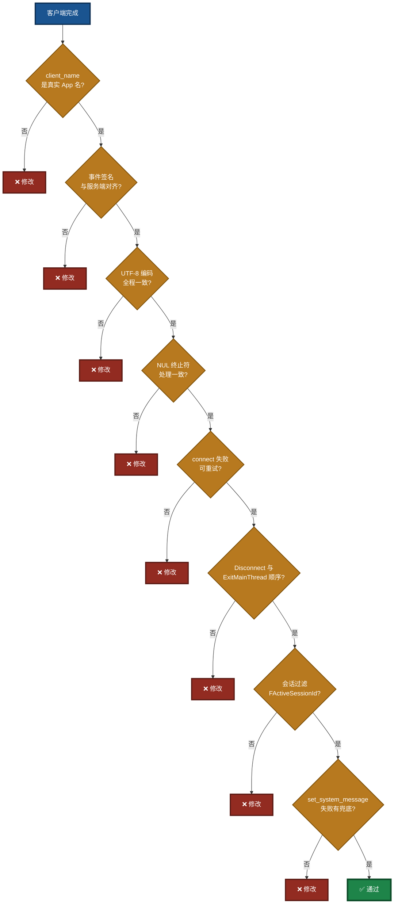
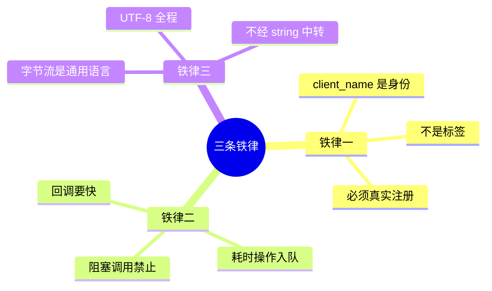
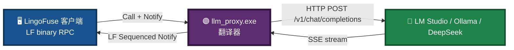

# LingoFuse LLM Pitfalls For AI（v3.0）

> **文件路径**：`LingoFuse_LLM_Pitfalls_For_AI.md`  
> **目标读者**：**AI 助手**  
> **用途**：接手本项目时，快速避坑  
> **覆盖范围**：服务端 / 代理层 / 客户端 / 协议 / 跨语言 / GUI  
> **版本**：v3.0（2026-09-14）—— 更新为高对比配色，仅保留同目录链接  
> **相关文档**（同目录）：
> - 生态体系使用指南：`LingoFuse_LLM_Ecosystem_User_Guide.md`
> - 服务端命令行手册：`LingoFuse_LLM_Service_CLI_guide.md`
> - 代理命令行手册：`LingoFuse_LLM_Proxy_CLI_Guide.md`
> - 代理兼容性指南：`LingoFuse_LLM_Proxy_Compatibility_Guide.md`
> - 版本演进总结：`LingoFuse_LLM_Service_Work_Summary.md`
> - llama-cpp-python 安装：`llama_cpp_python_guide.md`

---

## 零、阅读指南

本文档**不解释原理**，只列**踩过的坑 + 正确做法**。  
每条坑格式：**症状 → 根因 → 正确做法**。  
AI 检索时可直接搜关键词（如 `client_name`、`var/out`、`Streaming stall`）。

**优先级标识**：

- 🔴 **致命**：不修必崩
- 🟠 **严重**：逻辑错误 / 静默失败
- 🟡 **一般**：体验 / 可维护性

**版本变化（v3.0 新增）**：

- 全文档图表改为高对比配色
- 相关文档链接改为同目录相对路径
- 与新版生态体系使用指南对齐

---

## 一、通用踩坑地图

```mermaid
flowchart TB
    ROOT["🎯 LingoFuse + LLM 项目"]

    ROOT --> A["🟦 LingoFuse 框架坑"]
    ROOT --> B["🟩 Python 服务端坑"]
    ROOT --> P["🟪 llm_proxy 传输坑"]
    ROOT --> C["🟫 Pascal 客户端坑"]
    ROOT --> D["🟧 跨语言协议坑"]
    ROOT --> E["🟥 GUI 集成坑"]

    A --> A1["client_name 必须是 App 名"]
    A --> A2["回调中不能调 LF_Call"]
    A --> A3["Sequenced Notify 目标"]
    A --> A4["Overlap_Connection 陷阱"]
    A --> A5["LF_ExitMainThread 全局副作用"]

    B --> B1["llama.cpp 单线程"]
    B --> B2["tokenize 计数"]
    B --> B3["system_message 竞态"]
    B --> B4["模板路径搜索"]
    B --> B5["set_system_message 无状态化"]

    P --> P1["requests 的 SSE 缓冲"]
    P --> P2["gzip 压缩破坏流式"]
    P --> P3["iter_content 参数陷阱"]
    P --> P4["http.client 是唯一可靠方案"]
    P --> P5["Accept-Encoding: identity"]
    P --> P6["reasoning vs content 混淆"]

    C --> C1["var/out 同签名"]
    C --> C2["事件签名对齐"]
    C --> C3["Connect 部分失败"]
    C --> C4["AnsiString 陷阱"]

    D --> D1["字符串魔法协议"]
    D --> D2["NUL 终止符"]
    D --> D3["UTF-8 字节流"]

    E --> E1["后台线程读 UI"]
    E --> E2["关闭顺序"]
    E --> E3["LF_Sync 驱动"]
    E --> E4["new_session 与 system_message"]

    style ROOT fill:#0D2F52,stroke:#000000,stroke-width:4px,color:#FFFFFF
    style A fill:#1A5490,stroke:#0D2F52,stroke-width:3px,color:#FFFFFF
    style B fill:#1E8449,stroke:#0E4D2A,stroke-width:3px,color:#FFFFFF
    style P fill:#5B2C6F,stroke:#321640,stroke-width:3px,color:#FFFFFF
    style C fill:#7B241C,stroke:#4A1108,stroke-width:3px,color:#FFFFFF
    style D fill:#B7791F,stroke:#7E5109,stroke-width:3px,color:#FFFFFF
    style E fill:#922B21,stroke:#5A1A14,stroke-width:3px,color:#FFFFFF
```



---

## 二、🔴 致命坑（必须避免）

### P0-1. **`client_name` 必须是真实注册的 App 名**

**症状**：

```
no found app("interactive") api("llm_stream")
no found app("interactive") api("llm_stream")
no found app("interactive") api("llm_stream")
...
```

服务端刷屏 `no found app`，客户端永远收不到任何消息，`finish_event` 永不置位，看起来"卡死"。

**根因**：  
LLM 客户端的 `client_name` **不是**一个人可读的标签，而是 **LingoFuse 网络上真实存在的 App 名**。服务端通过 `LF_Sequenced_Notify(client_name, ...)` 推消息时，LingoFuse 会按这个名字去查找路由。名字不存在，消息被丢弃。

**反面示例**：

```python
# ❌ 错误：硬编码字符串作为 client_name
client_name = "interactive"
session = create_session(client_name=client_name)  # 服务端拿这个名字推送，找不到
```

**正确做法**：

```python
# ✅ 正确：先用 generate_app_name() 拿到真实 App 名
LF_PrepareClient(endpoint, nil)
LF_PrepareDone()
client_name = generate_app_name()   # 形如 @__generate__@ipc:llm_service:0&...
app = App(client_name)
app.register_notify("llm_stream", on_stream)
LF_BindApp(app.raw)
# 之后所有 client_name 都用这个真实值
```

**AI 检索关键词**：`client_name`、`generate_app_name`、`no found app`、`Sequenced_Notify`。

---

### P0-2. **llama.cpp 上下文不是线程安全的**

**症状**：

- 双开客户端时，会话串台（A 收到 B 的内容）
- 推理中途进程突然 abort，Python 层 try/except 抓不住
- `GGML_ASSERT` 崩溃

**根因**：  
`llama_cpp.Llama` 内部的 `llama_context`（KV cache、采样器 RNG、tokenizer BPE）是**单线程状态机**。多线程并发调用 `create_chat_completion` 会互相污染。

**反面示例**：

```python
# ❌ 错误：多线程直接调用共享的 llm
def handle_request(data):
    threading.Thread(target=self.llm.create_chat_completion, args=(...)).start()
```

**正确做法**：

```python
# ✅ 正确：所有推理串行化到单 worker 线程
self._request_queue = queue.Queue()
self._worker_thread = threading.Thread(target=self._worker_loop)
self._worker_thread.start()

# 回调线程只入队，不做推理
def handle_request(data):
    self._request_queue.put_nowait(task)   # 立即返回
```

**AI 检索关键词**：`llama.cpp`、`线程安全`、`KV cache`、`worker thread`、`串行化`。

---

### P0-3. **回调中不能调用阻塞 LingoFuse 函数**

**症状**：

- 回调里调 `LF_Call` / `LF_LocalCall` / `LF_PrepareDone` → 死锁
- 回调线程持锁等待，网络线程无法推进

**根因**：  
LingoFuse 的回调在库内部的线程池执行。回调期间持有内部锁。若在回调里再调阻塞函数（如 `LF_Call` 等同步调用），会尝试获取另一把锁/等待另一线程，与当前回调持锁形成死锁。

**反面示例**：

```python
# ❌ 错误：在回调里做远程调用
def on_stream(trigger, inp):
    data = inp.read_json()
    result = LF_Call("OtherApp", data, 5000)  # 死锁！
```

**正确做法**：

```python
# ✅ 正确：入队到工作线程，回调立即返回
def on_stream(trigger, inp):
    data = inp.read_json()
    self._work_queue.put_nowait(data)   # 立即返回
```

**AI 检索关键词**：`callback`、`deadlock`、`LF_Call`、回调阻塞。

---

### P0-4. **`requests` 的 SSE 响应缓冲（流式延迟的元凶）**

**症状**：

- `llm_proxy` 转发流式输出，客户端延迟几秒甚至十几秒才收到第一批 token
- LM Studio 日志显示 token 生成速率稳定（如 30 t/s），但客户端看不到
- 尝试过 `iter_lines()`、`iter_content(chunk_size=None)`、`iter_content(chunk_size=1)`、`Accept-Encoding: identity` **全部无效**
- 尝试过 `TCP_NODELAY` **无效**

**根因**（三层叠加，缺一都无效）：

1. **`iter_lines()` 内部缓冲 512 字节**：`requests` 的 `iter_lines()` 底层用 `iter_content(chunk_size=512)`，短 SSE 行（如 50 字节）必须攒够 512 字节才 yield 一次。
2. **`iter_content(chunk_size=None)` 语义是"读到 EOF"**：整个响应必须结束才返回数据，一次性吐出全部。
3. **`urllib3` 层在 socket 之上还有内部预读**：即使换成 `chunk_size=1`，`urllib3` 也会预读 socket 缓冲。
4. **gzip 压缩**：`requests` 默认发 `Accept-Encoding: gzip, deflate`，gzip 解码器必须攒够完整 deflate 块才吐数据。

**正确做法**：

```python
# ✅ 换用 http.client 标准库
import http.client, socket, ssl
from urllib.parse import urlparse

parsed = urlparse(url)
if parsed.scheme == "https":
    conn = http.client.HTTPSConnection(parsed.hostname, parsed.port,
                                       timeout=300, context=ssl.create_default_context())
else:
    conn = http.client.HTTPConnection(parsed.hostname, parsed.port, timeout=300)

conn.putrequest("POST", parsed.path, skip_accept_encoding=True)
conn.putheader("Content-Type", "application/json")
conn.putheader("Accept", "text/event-stream")
conn.putheader("Accept-Encoding", "identity")   # SSE 不压缩
conn.putheader("Content-Length", str(len(body)))
conn.endheaders()
conn.send(body)

resp = conn.getresponse()
for raw_line in resp:                            # 每行一到就 yield
    ...
```

**AI 检索关键词**：`SSE buffering`、`iter_lines`、`iter_content`、`requests delay`、`streaming stall`、`http.client`。

---

### P0-5. **`llm_proxy` 服务进程立即退出**

**症状**：

- 启动日志显示所有 API 注册成功，`Server 'LLM_Service' started on ipc:llm_service`
- 然后立刻 `Clean Framework` / `Server stopped`，进程退出
- 客户端连接时 `no found app`

**根因**：  
`main()` 里 `service.start()` 只负责启动，**不阻塞**。启动完直接进入 `finally` 块调用 `service.stop()`，一切被立即清理。

**正确做法**：

```python
# ✅ 信号处理 + 主循环阻塞
_SHUTDOWN = threading.Event()

def _install_signal_handlers():
    def _handler(signum, frame):
        logger.info("Received signal %s; shutting down", signum)
        _SHUTDOWN.set()
    for sig in ("SIGINT", "SIGTERM"):
        s = getattr(signal, sig, None)
        if s is None: continue
        try:
            signal.signal(s, _handler)
        except (ValueError, OSError):
            pass

def main():
    service = LLMProxyService()
    atexit.register(service.stop)
    _install_signal_handlers()
    try:
        service.start()
        logger.info("Press Ctrl+C to stop...")
        while not _SHUTDOWN.is_set():
            if _SHUTDOWN.wait(timeout=1.0):
                break
    except KeyboardInterrupt:
        logger.info("Interrupted by user")
    finally:
        service.stop()
```

**AI 检索关键词**：`llm_proxy exit`、`SIGINT`、`main loop`、`atexit`、`_SHUTDOWN`。

---

### P0-6. **thinking 阶段被误认为"网络延迟"**

**症状**：

- 客户端发送"你好"后，17 秒内完全没有任何输出
- 用户以为是网络卡死或代理缓冲
- 但 LM Studio 日志显示模型从 0 秒开始就在稳定输出 30 t/s
- 17 秒后，客户端**突然**一次性显示出完整的正文回复

**根因**：  
Reasoning 模型（Nemotron、DeepSeek-R1、Qwen3-thinking、...）在 SSE 流里输出**两种字段**：

- `reasoning_content`：思考链（内部推理，占 10~20 秒）
- `content`：最终答案（思考结束后才开始）

如果代理只转发 `content` 丢弃 `reasoning_content`，客户端会在 17 秒内看不到任何输出，然后突然收到全部正文。

**正确做法**（v1.7 后）：

```python
# ✅ 无策略转发：reasoning_content 和 content 都发
for delta in self._backend.stream_chat(model, messages, options):
    if "reasoning_content" in delta:
        self._emit(sess, {"type": "think", "text": delta["reasoning_content"]})
    if "content" in delta:
        self._emit(sess, {"type": "chunk", "text": delta["content"]})
```

**是否产生 thinking 由模型决定，不由代理决定**：

- Nemotron / DeepSeek-R1：思考 10~20 秒
- Qwen3 / Llama3：通常无 thinking
- 客户端可选择显示 think 事件（暗色）或忽略

**AI 检索关键词**：`reasoning_content`、`thinking`、`delay`、`Nemotron`、`DeepSeek-R1`。

---

## 三、🌉 llm_proxy 专项坑

### P6-1. **`Accept-Encoding: identity` 必须显式设置**

**症状**：

- 即使换用 `http.client`，某些后端（如 nginx 反代的 vLLM）仍返回 gzip 压缩的 SSE
- 客户端仍看到批量输出

**根因**：  
HTTP 客户端默认（或通过 `urllib3` / `requests`）发送 `Accept-Encoding: gzip, deflate`。任何支持 gzip 的后端会压缩 SSE 流。gzip 解码器必须攒够完整的 deflate 块才吐数据。

**正确做法**：

```python
# ✅ 显式要求不压缩
headers = {
    "Accept": "text/event-stream",
    "Accept-Encoding": "identity",   # SSE 标准实践
}
```

并且 `http.client.putrequest()` 要传 `skip_accept_encoding=True`，否则库会自动加上 `Accept-Encoding: identity` 之外的默认值。

**AI 检索关键词**：`Accept-Encoding`、`gzip`、`identity`、`SSE compression`。

---

### P6-2. **`TCP_NODELAY` 优化**

**症状**：

- 大部分情况下已经实时，但偶尔有 40ms 级别的抖动

**根因**：  
Nagle 算法会合并小包。SSE 的每行很短（几十字节），如果 Nagle 开启会攒够 MSS 才发送。

**正确做法**：

```python
# ✅ 连接建立后立即禁用 Nagle
conn.connect()
conn.sock.setsockopt(socket.IPPROTO_TCP, socket.TCP_NODELAY, 1)
```

**AI 检索关键词**：`TCP_NODELAY`、`Nagle`、`SSE latency`。

---

### P6-3. **`set_system_message` 在代理中必须显式返回 unsupported**

**症状**：

- 客户端调用 `set_system_message`，收到 `{"code": 0}`，以为成功
- 但已存在会话的 system prompt 没有任何变化
- 只有新创建的会话才会用到新的默认值（实际上新会话也没用到）

**根因**：  
`llm_proxy.py` 是无状态转发器，没有全局 state。它的 `set_system_message` 早期实现为兼容 `llm_service.py` 返回 `{"code": 0}`，但**实际上什么都没有做**。客户端的 `/sys` 命令以为设置成功了，用户看到"更新成功"，实际没有任何效果。

**反面示例**：

```python
# ❌ 错误：假成功
def _handle_set_system_message(self, data):
    self._default_system_message = data["content"]   # 写入一个没人读的字段
    return {"code": 0, "status": "ok"}                # 撒谎
```

**正确做法**：

```python
# ✅ 明确拒绝，给出替代方案
def _handle_set_system_message(self, data):
    logger.info("set_system_message rejected: not supported by "
                "llm_proxy (stateless forwarder)")
    return {
        "code": -1,
        "status": "unsupported",
        "error": (
            "set_system_message is not supported by llm_proxy. "
            "The system message is fixed at session creation. "
            "To change it, close the current session and create "
            "a new one with the desired system_message."
        ),
    }
```

**客户端必须准备接受失败**：

```pascal
// ✅ 温和处理失败
if not LLM.SetSystemMessage(new_sys, err) then
begin
  DoStatus('更新系统消息失败: ' + err);
  DoStatus('提示：点击"新建会话"可以让新的系统提示词生效。');
  Exit;
end;
```

**AI 检索关键词**：`set_system_message`、`unsupported`、`stateless`、`llm_proxy`。

---

### P6-4. **会话过滤：`FActiveSessionId` 必须生效**

**症状**：

- 客户端开了多个会话，某个会话的输出跑到了另一个会话的显示区
- 或者点击"新建会话"后，旧的会话还在往当前窗口输出

**根因**：  
`llm_proxy` 服务端支持多会话，每个会话有独立的 `session_id`。所有会话的流式消息**都通过同一个 `llm_stream` API 推送到客户端**。如果客户端不按 `session_id` 过滤，就会串台。

**正确做法**：

```pascal
// ✅ 所有 Do_LLM_* 事件处理器里，先做会话过滤
procedure Tllm_tool_form.Do_LLM_Chunk(const SessionId, Chunk: string);
begin
  // 只处理当前显示的会话；空字符串表示尚未选定（兜底）
  if (FActiveSessionId <> '') and (SessionId <> FActiveSessionId) then
    Exit;
  ...
end;
```

`FActiveSessionId` 的更新时机：

- `new_session_ButtonClick` 创建新会话成功后立即更新
- `test_generate_ButtonClick` 得到生效的 session_id 后立即更新
- `Do_LLM_Closed` 收到当前会话的关闭事件时清空

**AI 检索关键词**：`FActiveSessionId`、`session_id filter`、`cross-session`、`session mixing`。

---

## 四、🟠 Python 服务端坑

### P1-1. **Chat template 搜索路径与脚本位置不一致**

**症状**：

- 启动日志显示 `No default chat template file; using model built-in template`
- 明明 `chat_template.jinja` 就在磁盘上

**根因**：  
最初代码只在**脚本同目录**找模板。但实际布局是：

```
Py/
├── chat_template.jinja     ← 模板在这里
└── llm-service/
    └── llm_service.py      ← 脚本在这里
```

`os.path.dirname(__file__)` = `.../llm-service`，模板不在那儿。

**正确做法**：

```python
# ✅ 多路径搜索
SEARCH_DIRS = (
    _SCRIPT_DIR,                            # 脚本目录
    os.path.abspath(os.path.join(_SCRIPT_DIR, "..")),  # 父目录
    os.getcwd(),                            # 当前工作目录
)
```

**AI 检索关键词**：`chat_template.jinja`、`template not found`、`LoadTemplate`、`__file__`。

---

### P1-2. **`system_message` 竞态**

**症状**：

- 生成过程中 `set_system_message` 被调用 → 当前生成的 system prompt 被"半路换人"
- 输出语义混乱

**根因**：  
`self.system_message` 被 `_stream_generate` 读取，同时被 `set_system_message` 写入。没有锁，读取时机不确定。

**正确做法**：

```python
# ✅ 在请求入口 snapshot
with self._system_message_lock:
    system_message_snapshot = self._system_message

session = Session(
    ...,
    system_message_snapshot=system_message_snapshot,  # 会话固化
)
```

**AI 检索关键词**：`system_message`、`race`、`snapshot`、`竞态`。

---

### P1-3. **上下文 token 预算算错**

**症状**：

- 请求通过了检查，但推理中途 `context length exceeded`
- 错误信息含糊

**根因**：

- 只算了 input，没算 `max_tokens` 输出预留
- 只算了 system + input，没算 chat template 的开销（BOS/EOS/role 标记）
- 用 `len//4` 估算，中文场景严重低估

**正确做法**：

```python
# ✅ 精确 token 计数
input_tokens = len(llm.tokenize(full_input.encode("utf-8"), add_bos=False, special=True))
sys_tokens   = len(llm.tokenize(system.encode("utf-8"), add_bos=False, special=True))
template_overhead = 32   # 经验值

total_needed = input_tokens + sys_tokens + max_tokens + template_overhead
if total_needed > n_ctx:
    return {"code": -1, "error": f"Request too large: ..."}
```

**AI 检索关键词**：`token budget`、`context length`、`tokenize`、`上下文`。

---

### P1-4. **字符串魔法协议**

**症状**：

- 客户端把服务端的 `__FINISH__` 前缀当结束标志
- 模型如果真输出 `__FINISH__` 字符串 → 客户端提前终止
- 加新消息类型（如 `think`）时前缀爆炸

**根因**：  
v1.0 用 `{"chunk": "..."}` 协议，靠 `chunk == "__FINISH__"`、`chunk.startswith("__ERROR__")` 判断。字符串魔法，不可扩展。

**正确做法**：

```json
// ✅ 结构化协议
{"type": "chunk",  "session_id": "...", "text": "..."}
{"type": "think",  "session_id": "...", "text": "..."}
{"type": "finish", "session_id": "...", "reason": "stop"}
{"type": "error",  "session_id": "...", "message": "..."}
{"type": "closed", "session_id": "...", "reason": "timeout"}
```

**AI 检索关键词**：`__FINISH__`、`__ERROR__`、`type 字段`、`结构化协议`。

---

### P1-5. **FPC 下 `var` 和 `out` 签名冲突**

**症状**：

```
Error: (3029) function header doesn't match the previous declaration
```

两条看起来"不同"的签名，编译器认为相同。

**根因**：  
Free Pascal 在重载决议时，`var` 和 `out` 编码为**相同的引用传递类别**。

```pascal
// ❌ 错误：这两个是同一个签名
function Generate(..., var ASessionId: string; out AError: string): boolean;
function Generate(..., out ASessionId, AError: string): boolean;
```

**正确做法**：

```pascal
// ✅ 合并为一个（用 var 保留"读-改-写"语义）
function Generate(const AContent, APrompt: string;
                  var ASessionId: string;
                  out AError: string): boolean;

// 若需要便捷版，另取名字
function GenerateCurrent(const AContent, APrompt: string;
                         out AError: string): boolean;
```

**AI 检索关键词**：`var/out`、`overload`、`3029`、`function header doesn't match`。

---

### P1-6. **事件签名必须严格对齐**

**症状**：

```
Incompatible types: got "procedure(const AnsiString) of object"
expected "procedure(const AnsiString; const AnsiString) of object"
```

**根因**：  
`llm_client.pas` 把事件类型从单参数升级为双参数（加了 `SessionId`），但 `llm_tool_frm.pas` 里的处理器还是旧的单参数签名。

**正确做法**：

```pascal
// ✅ 客户端事件类型
TLLMChunkEvent = procedure(const SessionId, Text: string) of object;

// ✅ 界面处理器必须严格对齐
procedure Do_LLM_Chunk(const SessionId, Chunk: string);
```

**AI 检索关键词**：`Incompatible types`、`procedure variable type`、事件签名。

---

### P1-7. **`Connect` 部分失败导致资源泄漏**

**症状**：

- `RegisterNotifySync` 或 `Bind` 失败后，`FApp` 已创建但未释放
- 用户重新点"连接"时创建新 `FApp`，旧的继续泄漏
- 更严重：主线程已启动，`Disconnect` 因 `FConnected = False` 直接跳过，主线程永不停

**正确做法**：

```pascal
// ✅ 统一清理函数 + 状态标志
FPrepared: boolean;   // PrepareDone 是否成功过

procedure CleanupPartialConnect(AExitMainThread: boolean);
begin
  if FApp <> nil then
  begin
    FApp.Free;
    FApp := nil;
  end;
  if AExitMainThread and FPrepared then
    LF.ExitMainThread;
  FPrepared := False;
  FConnected := False;
end;

// 每个失败分支统一调
if not FApp.RegisterNotifySync(...) then
begin
  ErrorMsg := '...';
  CleanupPartialConnect(True);   // ✅
  Exit;
end;
```

**AI 检索关键词**：`Connect`、`FApp leak`、`CleanupPartialConnect`、`FPrepared`。

---

## 五、🟡 编码相关坑

### P2-1. **JSON 经 `string` 中转导致中文乱码**

**症状**：

- 中文 `content` / `prompt` 到服务端变成 `????` 或乱码
- 英文完全正常

**根因**：  
Pascal FPC 里 `string` 默认可能是 `AnsiString`（取决于编译指令）。当 JSON 从 `TUPascalString`（内部 Unicode）赋给 `string` 时，会经过一次字符集转换。中文在这样的转换中可能被替换为 `?`。

**正确做法**：

```pascal
// ✅ 全程走 TBytes，不经 string
var
  reqBytes, respBytes: TBytes;
begin
  reqBytes := joReq.ToBytes;                     // 直接拿 UTF-8 bytes
  LF_WriteStringBytes(hnd, reqBytes);            // 写入 bytes

  LF_ReadStringBytes(res, respBytes);            // 读取 bytes
  joResp.Parae(respBytes);                       // 直接解析 bytes
end;

// 只在给 UI 显示时才转 string
display := TEncoding.UTF8.GetString(respBytes);
```

**AI 检索关键词**：`中文乱码`、`AnsiString`、`TBytes`、`ToBytes`、`Parae`。

---

### P2-2. **NUL 终止符在不同语言间不一致**

**症状**：

- Pascal 收到 Python 发的 JSON，多一个 `\0` 导致解析失败
- HTTP 桥接返回的响应含 `\0`，浏览器 JSON 解析炸

**根因**：

- `LF_WriteString` **总是**追加 `\0`
- `LF_ReadString` 扫描到 `\0` 停止
- HTTP 桥接（如 `bridge.py`）必须**自动追加 `\0`** 请求，**自动剥离 `\0`** 响应

**正确做法**：

- **跨语言**：双方约定 `\0` 是终止符，读写时显式处理
- **HTTP 桥接**：进出时各处理一次
- **Python 侧**：`read_json` 前先检查尾部 `\0`，剥离后解析

**AI 检索关键词**：`NUL`、`\0`、`null terminator`、`bridge.py`。

---

### P2-3. **Windows 控制台 emoji 显示为 `?` 或乱码**

**症状**：

- 中文正常显示，但 emoji（🌍🚀🎉）显示为 `?` 或方块
- 或抛出 `UnicodeEncodeError: 'gbk' codec can't encode character ...`
- 客户端收到含 emoji 的 chunk 时崩溃或静默丢失

**根因**：

1. **代码页**：Windows 控制台默认 CP936（GBK），无法表示 emoji
2. **Python 输出编码**：`sys.stdout` 默认用 `locale.getpreferredencoding()`（在中文 Windows 上是 cp936）
3. **字体**：Consolas/宋体等传统字体无 emoji 字形

**正确做法**：

```python
# ✅ 在任何输出之前配置控制台
def _setup_console_encoding():
    if sys.platform == "win32":
        try:
            import ctypes
            kernel32 = ctypes.windll.kernel32
            for handle_id in (-11, -12):   # stdout, stderr
                h = kernel32.GetStdHandle(handle_id)
                if not h or h == -1:
                    continue
                mode = ctypes.c_uint32()
                if kernel32.GetConsoleMode(h, ctypes.byref(mode)):
                    kernel32.SetConsoleMode(h, mode.value | 0x0001 | 0x0004)
            kernel32.SetConsoleOutputCP(65001)
            kernel32.SetConsoleCP(65001)
        except Exception:
            pass

    for name in ("stdout", "stderr", "stdin"):
        stream = getattr(sys, name, None)
        if stream is None:
            continue
        try:
            stream.reconfigure(encoding="utf-8", errors="replace")
        except Exception:
            pass

_setup_console_encoding()
```

**推荐终端**：

- Windows Terminal（Win10 1809+ / Win11 内置）：彩色 emoji
- VSCode 集成终端：彩色 emoji
- PowerShell 7+ 独立窗口：需手动切字体为 `Cascadia Mono`
- 旧版 conhost (cmd.exe)：黑白 emoji，需切字体

**AI 检索关键词**：`emoji`、`UnicodeEncodeError`、`chcp 65001`、`SetConsoleOutputCP`、`reconfigure`。

---

## 六、🟠 多会话 / 生命周期坑

### P3-1. **Watchdog 误杀正在生成的会话**

**症状**：

- 长回答跑到一半突然中止
- 会话被意外关闭

**根因**：  
早期实现从 `created_at` 计时，一个长生成超过 `session_timeout` 就被判定为"超时"。

**正确做法**：

```python
# ✅ 从 last_active_at 计时
if now - sess.last_active_at > CONFIG.session_timeout:
    cancel(sess)

# ✅ 只回收 idle 状态的会话
if sess.status != "idle":
    continue
```

**AI 检索关键词**：`watchdog`、`timeout`、`session_timeout`、`idle`。

---

### P3-2. **一次性会话 vs 持久会话的混淆**

**症状**：

- 老客户端调用 `generate` 每次都是新会话，历史丢失
- 新客户端调用 `generate` 不带 `session_id` 时以为会复用

**根因**：  
v1.0 是"一次性"模式：一次生成 = 一次调用 = 生成完即销。  
v3.0 是"持久化"模式：会话跨多次 `generate` 存在。

**正确做法**：

```python
# ✅ v3.0 语义
generate(content, prompt, client_name, session_id?, options?)
# - 有 session_id → 继续该会话（历史累积）
# - 无 session_id + FCurrentSessionId 非空 → 用当前会话
# - 无 session_id + FCurrentSessionId 空 → 新建会话

# ✅ 一次性兼容：options.ephemeral=true
```

**AI 检索关键词**：`session_id`、`持久会话`、`ephemeral`、`mode`。

---

### P3-3. **过期 `session_id` 未自动清理**

**症状**：

- 服务端 watchdog 关闭一个会话后，客户端仍持旧 `session_id`
- 用户继续 `generate` 收到 `Session not found`
- 客户端不清理 `session_id`，用户下次还是收到同样错误

**正确做法**：

```pascal
// ✅ 服务端返回 "Session not found" 时自动清空
if (code <> 0) and (Pos('Session not found', AError) > 0) then
begin
  ASessionId := '';
  FCurrentSessionId := '';
end;
```

**AI 检索关键词**：`Session not found`、`过期 session_id`、`自动清空`。

---

## 七、🟡 GUI 集成坑

### P4-1. **后台线程直接读 UI 控件**

**症状**：

- 程序偶发崩溃
- 多核机器上概率更高

**根因**：  
`TCompute.RunM_NP(Do_Thread_Connect)` 把任务丢到后台线程，但 `Do_Thread_Connect` 内部读 `llm_APP_Edit.Text`（UI 控件）。UI 控件不是线程安全的。

**正确做法**：

```pascal
// ✅ 主线程先抓值
procedure TForm.conn_ButtonClick(Sender: TObject);
var
  AppName, Endpoint: string;
begin
  AppName  := llm_APP_Edit.Text;      // 主线程读
  Endpoint := LLM_Service_Edit.Text;  // 主线程读
  TCompute.RunM_NP(
    procedure begin Do_Thread_Connect(AppName, Endpoint); end
  );
end;
```

**AI 检索关键词**：`RunM_NP`、`后台线程读 UI`、`TLabeledEdit.Text`。

---

### P4-2. **窗口关闭顺序错误**

**症状**：

- 生成过程中关闭窗口 → 崩溃
- `OnChunk` 回调访问已释放的 Form

**根因**：

```pascal
procedure TForm.FormClose(...);
begin
  CloseAction := caFree;
  LF_Shutdown;    // ❌ 直接 Shutdown，跳过 LLM.Disconnect
end;
```

**正确做法**：

```pascal
// ✅ 先优雅关闭客户端，再 Shutdown
procedure TForm.FormClose(...);
begin
  CloseAction := caFree;
  if LLM <> nil then
  begin
    LLM.Disconnect;              // 内部 ExitMainThread + FreeApp
    disposeObjectAndNil(LLM);
  end;
  LF_Shutdown;
end;
```

**AI 检索关键词**：`FormClose`、`LF_Shutdown`、`Disconnect`、关闭顺序。

---

### P4-3. **`RegisterNotifySync` 依赖外部 `LF_Sync` 驱动**

**症状**：

- 流式输出延迟极大（每次等 1 秒才更新）
- 或者根本收不到

**根因**：  
`RegisterNotifySync` 走 `TSoft_Synchronize_Tool`，需要主线程**定期调用** `LF_Sync` 或 `Check_Soft_Thread_Synchronize` 来驱动同步队列。周期由 Timer 决定。

**正确做法**：

```pascal
// ✅ Timer 周期设小（10~50ms）
sysTimer.Interval := 30;
sysTimer.Enabled := True;

procedure TForm.sysTimerTimer(Sender: TObject);
begin
  while LF_GetStatusCount > 0 do
    DoStatus(LF_GetStatusEx);
  Check_Soft_Thread_Synchronize(0);
  LF_Sync;
end;

// ✅ Form 关闭时先停 Timer
procedure TForm.FormClose(...);
begin
  sysTimer.Enabled := False;
  ...
end;
```

**AI 检索关键词**：`RegisterNotifySync`、`LF_Sync`、`sysTimer`、`Check_Soft_Thread_Synchronize`。

---

### P4-4. **连接失败后按钮永久禁用**

**症状**：

- 连接失败后，"连接"按钮变灰，无法重试
- 只能重启程序

**正确做法**：

```pascal
// ✅ 失败时也 Sync 回主线程恢复 UI
procedure TForm.Do_Thread_Connect;
begin
  if not LLM.Connect(err) then
  begin
    DoStatus(err);
    disposeObjectAndNil(LLM);
    TCompute.SyncM(Do_Thread_Connect_Failed);   // ✅
    exit;
  end;
  TCompute.SyncM(Do_Thread_Connect_Done);
end;

procedure TForm.Do_Thread_Connect_Failed;
begin
  conn_llm_Button.Enabled := True;
  LLM_Service_Edit.Enabled := True;
  llm_APP_Edit.Enabled := True;
end;
```

**AI 检索关键词**：`Disable_All`、`Enabled_All`、连接失败、按钮禁用。

---

### P4-5. **`new_session` 按钮必须携带 system_message**

**症状**：

- 需要自定义 system prompt，但不知道入口在哪
- 客户端调 `/sys` 命令设置全局默认，但已存在的会话没有任何变化
- 只能重启客户端才能让新的 system prompt 生效

**根因**：  
在 `llm_proxy` 模式（无状态转发）下：

- 不存在"全局默认 system message"
- `set_system_message` API 返回 `unsupported`
- 修改 system prompt 的**唯一有效路径**是 `create_session(system_message=...)`

**正确做法**：

```pascal
(* new_session_ButtonClick — 从 sys_prompt_Memo 读取 system prompt，
   通过 CreateSession 创建带自定义 system prompt 的新会话 *)
procedure Tllm_tool_form.new_session_ButtonClick(Sender: TObject);
var
  sid, err: string;
  sys_msg: TP_String;
begin
  // 1) 前置检查
  if LLM = nil then
  begin
    DoStatus('尚未连接 LLM 服务，请先点击"连接"按钮。');
    Exit;
  end;

  // 2) 读取系统提示词
  sys_msg := sys_prompt_Memo.Lines.Text;
  sys_msg := sys_msg.TrimChar(#13#10#32#9);

  // 3) 创建新会话（system_message 在此时固化到服务端）
  if not LLM.CreateSession(sys_msg, sid, err) then
  begin
    DoStatus('创建新会话失败: ' + err);
    Exit;
  end;

  // 4) 更新 UI 状态
  FActiveSessionId := sid;    // 会话过滤的关键
  FInThinking := False;
  MainPageControl.ActivePage := Output_TabSheet;
  ResetOutputHeader(sid);
  sse_Edit.ReadOnly := True;

  DoStatus('已创建新会话: ' + sid);
end;
```

**设计要点**：

- system message 通过 `CreateSession` 的第二个参数传递，**不是**通过 `SetSystemMessage`
- `FActiveSessionId` 立即更新，让后续流式回调只处理这个新会话
- 后端不论是 `llm_service.py` 还是 `llm_proxy.py`，此流程都有效

**AI 检索关键词**：`new_session`、`CreateSession`、`system_message`、`FActiveSessionId`。

---

### P4-6. **`set_system_message` 失败的温和处理**

**症状**：

- 连接时同步默认 system message，在 `llm_proxy` 下报错 `unsupported`
- 如果按"连接失败"处理会导致连接无法建立
- 用户看到连接失败但不知道原因

**根因**：  
连接流程里有一个可选步骤："尝试同步默认系统消息"。在 `llm_service.py` 下会成功，在 `llm_proxy.py` 下必然失败。这个失败**不应该中断连接**。

**正确做法**：

```pascal
(* Do_Thread_Connect 里的可选步骤 *)
n := sys_prompt_Memo.Lines.Text;
n := n.TrimChar(#13#10#32#9);
if not LLM.SetSystemMessage(n, err) then
  DoStatus('（可选）同步默认系统消息失败：' + err +
           '。请点击"新建会话"让系统提示词生效。')
else
  DoStatus('已同步默认系统消息');
```

**“更新系统消息”按钮同理**：

```pascal
procedure Tllm_tool_form.Button1Click(Sender: TObject);
begin
  if LLM = nil then Exit;

  n := sys_prompt_Memo.Lines.Text;
  n := n.TrimChar(#13#10#32#9);

  if not LLM.SetSystemMessage(n, err) then
  begin
    // 温和失败：告诉用户走 new_session 路径
    DoStatus('更新系统消息失败: ' + err);
    DoStatus('提示：点击"新建会话"按钮可以让新的系统提示词生效。');
    Exit;
  end;

  DoStatus('已更新系统消息（仅对之后新建的会话生效）');
end;
```

**设计原则**：

- 可选步骤失败 → 只写日志，继续主流程
- 用户可见的操作失败 → 明确提示 + 替代方案
- 绝不让"支持后端 A 的机制"在"后端 B"下静默失效

**AI 检索关键词**：`set_system_message`、`graceful failure`、`optional step`、`unsupported`。

---

## 八、🟡 递归 / 边界坑

### P5-1. **递归追加输出可能栈溢出**

**症状**：

- 大 chunk（含多个换行）时崩溃
- 栈深度超限

**根因**：

```pascal
// ❌ 错误：chunk 里有 N 个换行就递归 N 层
procedure AppendChunk(const Text: string);
begin
  if Pos(#10, s) > 0 then
    AppendChunk(rest);   // 递归
end;
```

**正确做法**：

```pascal
// ✅ 改循环
procedure AppendChunk(const Text: string);
var
  p: integer;
  s, first, rest: string;
begin
  s := Text;
  while True do
  begin
    p := Pos(#10, s);
    if p = 0 then
    begin
      CurrentLine := CurrentLine + s;
      Break;
    end;
    CurrentLine := CurrentLine + Copy(s, 1, p - 1);
    NewLine;
    s := Copy(s, p + 1, MaxInt);
  end;
end;
```

**AI 检索关键词**：`递归`、`栈溢出`、`stack overflow`、`AppendChunk`。

---

### P5-2. **`OnLLMStream` 未检查 buffer 有效性**

**症状**：

- 空消息时崩溃
- 消息刚好在边界时崩溃

**根因**：

```pascal
// ❌ 错误：没判空
jstr.ReadUTF8AnsiChar(LF_GetBuffer(Input_), LF_GetSize(Input_));
// LF_GetBuffer 可能返回 nil，LF_GetSize 可能返回 0
```

**正确做法**：

```pascal
// ✅ 先取变量再判空
var
  buf: Pointer;
  sz: int64;
begin
  if Input_ = nil then Exit;
  buf := LF_GetBuffer(Input_);
  sz  := LF_GetSize(Input_);
  if (buf = nil) or (sz <= 0) then Exit;

  jstr.ReadUTF8AnsiChar(buf, sz);
  ...
end;
```

**AI 检索关键词**：`LF_GetBuffer`、`nil`、`OnLLMStream`、buffer 检查。

---

## 九、坑的优先级矩阵


---

## 十、AI 检索速查表

| 症状关键词 | 对应坑 |
|-----------|--------|
| `no found app` | P0-1 client_name 错误 |
| `GGML_ASSERT` / 崩溃 | P0-2 llama.cpp 线程 |
| 死锁 / hang | P0-3 回调阻塞 |
| **流式延迟 / 静默几秒** | **P0-4 requests SSE 缓冲** |
| **proxy 启动后立即退出** | **P0-5 主循环缺失** |
| **thinking 期间无输出** | **P0-6 reasoning_content** |
| 模板未加载 | P1-1 路径搜索 |
| 语义混乱 | P1-2 system_message 竞态 |
| `context length exceeded` | P1-3 token 预算 |
| `__FINISH__` / `__ERROR__` | P1-4 字符串魔法 |
| `3029` / `function header doesn't match` | P1-5 var/out |
| `Incompatible types` / `procedure variable type` | P1-6 事件签名 |
| `FApp leak` | P1-7 Connect 部分失败 |
| 中文乱码 | P2-1 AnsiString |
| `\0` 问题 | P2-2 NUL 终止符 |
| **emoji 显示为 `?`** | **P2-3 Windows 控制台** |
| 长会话被中止 | P3-1 Watchdog |
| 历史丢失 | P3-2 持久会话 |
| `Session not found` | P3-3 过期 session_id |
| 后台线程崩 | P4-1 读 UI |
| 关闭崩溃 | P4-2 关闭顺序 |
| 输出延迟 | P4-3 LF_Sync |
| 无法重试 | P4-4 按钮禁用 |
| **新的 system prompt 不生效** | **P4-5 new_session 实现** |
| **set_system_message 报错** | **P4-6 温和失败 / P6-3** |
| 大 chunk 崩 | P5-1 递归栈溢 |
| 边界崩溃 | P5-2 buffer 空 |
| **gzip / 压缩 / Accept-Encoding** | **P6-1 identity header** |
| **40ms 抖动** | **P6-2 TCP_NODELAY** |
| **多会话串台** | **P6-4 FActiveSessionId** |

---

## 十一、跨语言一致性检查清单

写完任一语言的客户端，**上线前必查**：



---

## 十二、三条铁律



**铁律一**：`client_name` = LingoFuse 网络路由身份，必须是 `generate_app_name()` 的返回值，不能是自定义字符串。

**铁律二**：回调只做"读输入 + 入队 + 立即返回"，任何耗时操作都放 worker 线程。

**铁律三**：跨语言 JSON 走 `TBytes` / `bytes`，UTF-8 全程一致，只在显示层转 `string`。

---

## 十三、llm_proxy 是翻译器，不是替代品



**核心认知**：

- `llm_proxy` **不拥有**模型，它只是把 LF 二进制 RPC 翻译成 OpenAI 兼容 HTTP
- 它**无状态**：每个请求的 messages 数组由代理层重建，历史记录由客户端持有
- 它**不做策略**：流里有什么就转发什么，包括 `reasoning_content`（thinking）
- 它**不支持** `set_system_message`（无状态语义下无法实现）

---

## 十四、AI 接手建议

如果你是**第一次接手本项目**，按以下顺序读代码：


**重点关注**：

1. `llm_service.py` 的 `_worker_loop` 和 `_process_task`（推理串行化）
2. `llm_service.py` 的 `_emit_message` / `_send_payload`（协议出口）
3. `llm_proxy.py` 的 `OpenAIStreamClient.stream_chat`（http.client 流式读取）
4. `llm_proxy.py` 的 `_handle_set_system_message`（明确拒绝而非静默失败）
5. Pascal 客户端的 `OnLLMStream`（协议入口）
6. Pascal 客户端的 `CleanupPartialConnect`（资源安全）
7. GUI 窗体的 `new_session_ButtonClick`（system prompt 生效入口）

**不要碰**（除非明确要改）：

- `LF_Sequenced_Notify` 的使用方式
- `RegisterNotifySync` 的注册方式
- `TBytes` 编码路径
- `http.client` 流式读取循环
- `Accept-Encoding: identity` 与 `TCP_NODELAY`

**关键认知**：

- `llm_service.py` 与 `llm_proxy.py` 是**兄弟**关系，不是协作关系
- 二者共享 Call API 面，只有 `set_system_message` 行为不同
- 二者使用**同一个** `ipc:llm_service` 端点，**只能同时运行一个**
- 二者都是 LingoFuse 服务端，客户端不需要任何代码改动就能切换

---

## 十五、相关文档（同目录）

| 文档 | 说明 |
|------|------|
| `LingoFuse_LLM_Ecosystem_User_Guide.md` | 闭环架构与生态总览 |
| `LingoFuse_LLM_Service_CLI_guide.md` | `llm_service.exe` 命令行手册 |
| `LingoFuse_LLM_Proxy_CLI_Guide.md` | `llm_proxy.exe` 命令行手册 |
| `LingoFuse_LLM_Proxy_Compatibility_Guide.md` | 支持的 129+ OpenAI 兼容后端清单 |
| `LingoFuse_LLM_Service_Work_Summary.md` | LLM 工具链版本演进与架构决策（历史参考） |
| `llama_cpp_python_guide.md` | `llama-cpp-python` 安装与使用 |

---

**文档完成**

*本踩坑总结面向 AI，通过症状-根因-正确做法的结构化形式，让后续 AI 助手能快速定位和避免已知陷阱。v3.0 在 v2.0 基础上更新为高对比配色，相关文档链接改为同目录相对路径，与新版生态体系使用指南对齐。*