# LingoFuse LLM 工具链工作总结

> **文档路径**：`LingoFuse_LLM_Service_Work_Summary.md`  
> **版本**：v4.0  
> **涵盖周期**：2026-08-31 ~ 2026-09-14  
> **涉及组件**：Python 服务端、Python 代理层、Python 客户端、Pascal 客户端、Pascal GUI、工程脚本、全套文档  
> **相关文档**（同目录）：
> - 生态体系使用指南：`LingoFuse_LLM_Ecosystem_User_Guide.md`
> - 服务端命令行手册：`LingoFuse_LLM_Service_CLI_guide.md`
> - 代理命令行手册：`LingoFuse_LLM_Proxy_CLI_Guide.md`
> - 代理兼容性指南：`LingoFuse_LLM_Proxy_Compatibility_Guide.md`
> - 踩坑大全：`LingoFuse_LLM_Pitfalls_For_AI.md`
> - llama-cpp-python 安装：`llama_cpp_python_guide.md`
> **版本变化**：v4.0 在 v3.0 基础上更新为高对比配色，仅保留同目录链接，大型图表拆分。

---

## 阅读引导

本文档是**版本演进与架构决策的历史记录**。如果你是：

- **想了解工具链全貌** → 读第一章「工作概览」和第二章「时间线」。
- **想知道每个阶段做了什么** → 读第三、四、五章。
- **想了解缺陷修复历程** → 读第八章。
- **想了解协议演进** → 读第九章。
- **想了解遗留问题** → 读第二十章。
- **想直接上手** → 请转向 `LingoFuse_LLM_Ecosystem_User_Guide.md`。

---

## 一、工作概览

本次工作围绕 **LingoFuse LLM 工具链** 展开，覆盖 **Python 服务端 / 代理层 / 客户端** 与 **Pascal 客户端 / GUI** 两大语言生态，经历三个主要阶段：

1. **阶段 A（8/31 ~ 9/10）—— 服务端重构**  
   把最初一个**单会话、无状态、串行**的 LLM 网关，升级为**多会话、持久化、结构化协议**的工业级组件（`llm_service.py` v3.0）。
2. **阶段 B（9/11 ~ 9/13）—— 代理层与生态**  
   新增 **`llm_proxy.py`** —— 一个无状态转发器，把 LingoFuse 二进制 RPC 桥接到任何 OpenAI 兼容 HTTP 后端，并同步升级所有客户端与文档。
3. **阶段 C（9/13 ~ 9/14）—— 工具链收尾**  
   统一三个 Python 工具的 `--help` 自适应；引入**跨语言 API 能力矩阵机制**；升级会话回收为**双条件判断**；一次性编译三个 EXE 的脚本；补齐依赖清单与兼容性指南；对所有交付文件做交叉审查。

### 一句话总结

> **从"能跑"到"能扛"，再到"能对接全世界"，最后到"全生态对齐"：19 项服务端缺陷修复 + 8 次代理层迭代 + 跨语言协议对齐 + 一套贯穿三端的 API 能力矩阵 + 全栈文档与工程脚本。**

### 图 1：交付物一览

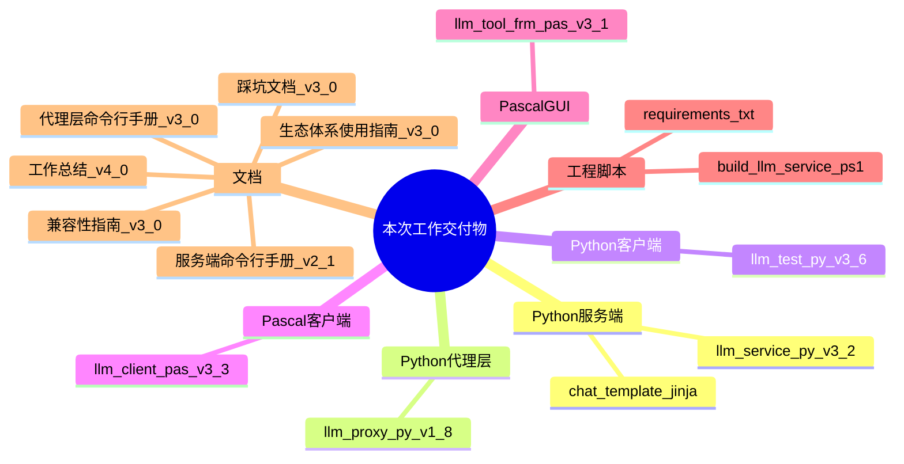

---

## 二、时间线与版本演进

### 2.1 三阶段时间轴

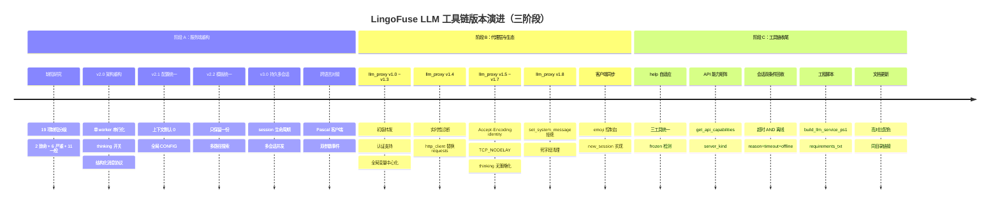

### 2.2 版本编号对照

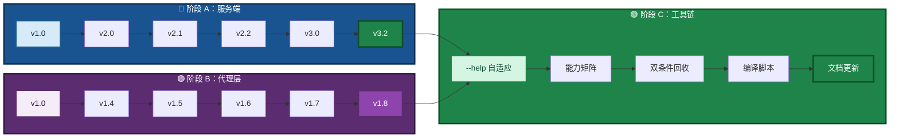

---

## 三、服务端架构演进（阶段 A）

### 3.1 架构对比：v1.0 与 v3.0

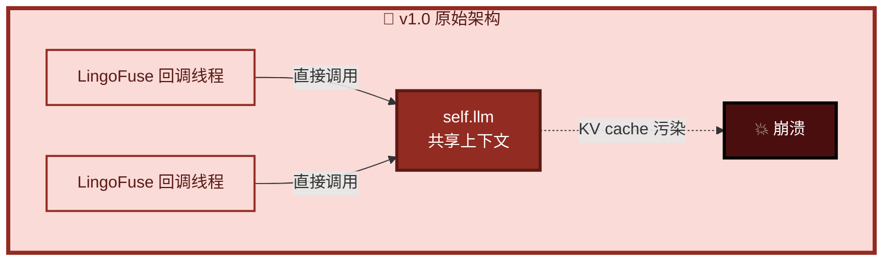

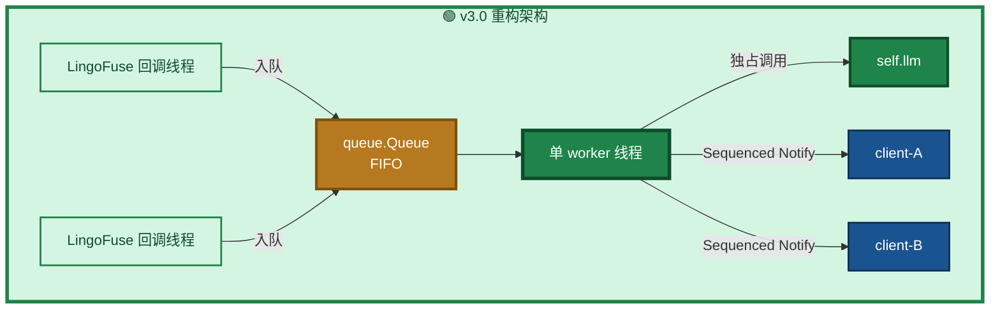

**核心洞察**：llama.cpp 的 `llama_context` 是**单线程状态机**（KV cache、采样器 RNG、BPE 状态全共享），v1.0 的多线程直调会导致进程级 abort。v3.0 用**单 worker 串行化**彻底消除这个类别的问题。

### 3.2 组件分层

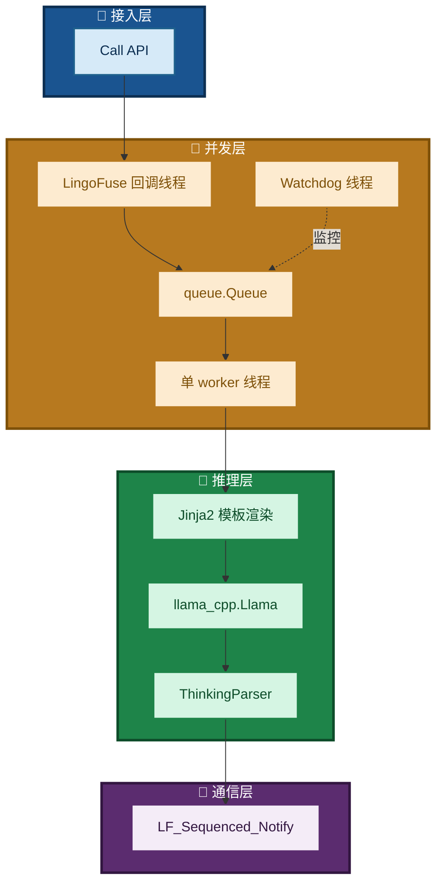

---

## 四、代理层架构（阶段 B）

### 4.1 llm_proxy 的角色定位

`llm_proxy.py` 是一个 **LingoFuse 服务端**，但它的内部逻辑与 `llm_service.py` 完全不同：它不加载模型，只做协议翻译。

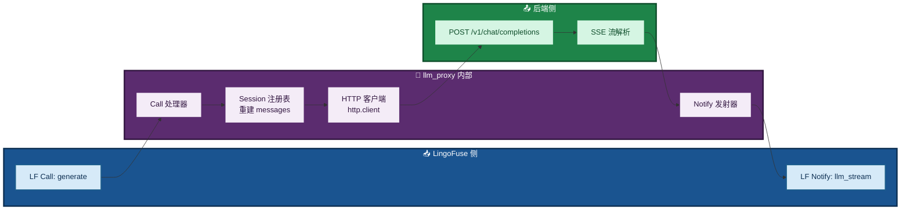

### 4.2 无状态语义下的会话处理

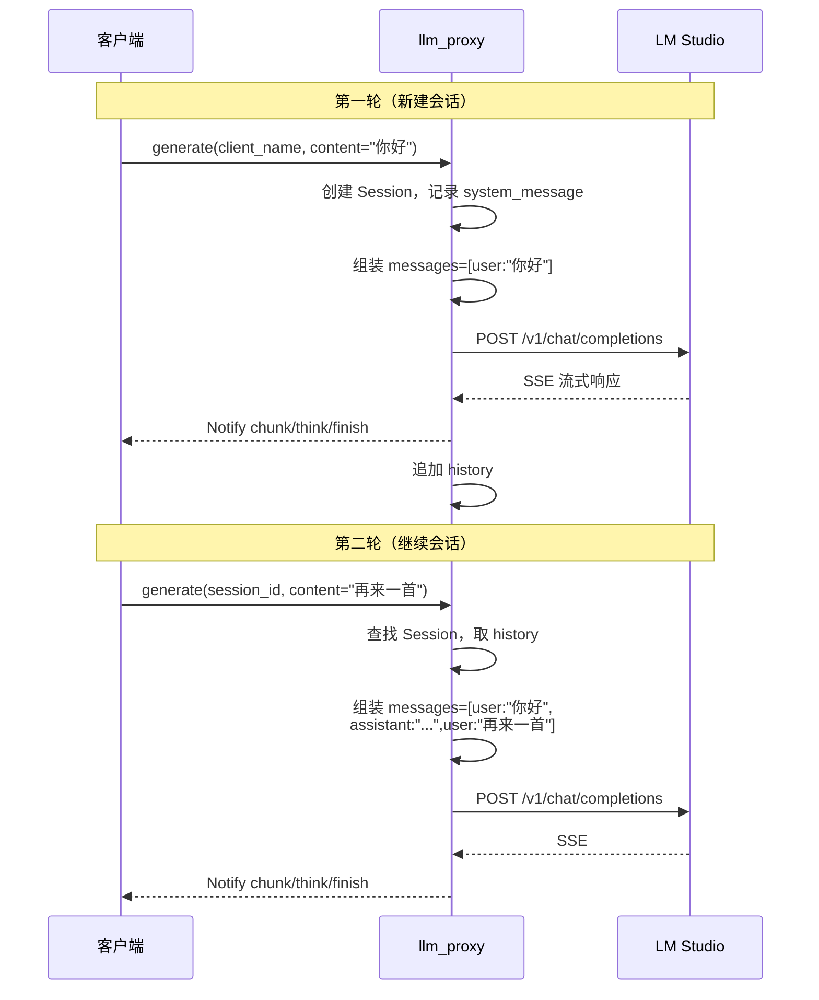

**要点**：代理**不持有**模型 KV cache，每轮请求都**重新组装**完整 messages 数组发给后端；后端视角是"无状态 HTTP"，客户端视角是"持久会话"。

### 4.3 SSE 传输层的发现之旅

这是本次工作中**最曲折**的一段。以下是排查过程的完整记录：

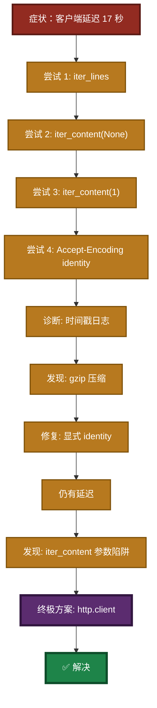

**三层缓冲，缺一不可**：

| 层 | 缓冲源 | 症状 | 修复 |
|----|--------|------|------|
| 1 | `iter_lines()` 内部 512 字节缓冲 | 短 SSE 行攒够才 yield | 换 `iter_content` |
| 2 | `iter_content(None)` = "读直到 EOF" | 整个响应才一次性返回 | 换 `chunk_size=1` |
| 3 | gzip 解码器攒够 deflate 块才吐 | 又是批量输出 | `Accept-Encoding: identity` |
| 4 | `urllib3` 内部预读 socket | 换了前面也还是延迟 | 换 `http.client` |

**最终方案**：`http.client` + `Accept-Encoding: identity` + `TCP_NODELAY`。

### 4.4 thinking 流的处理

**核心决策：代理不做任何策略**。

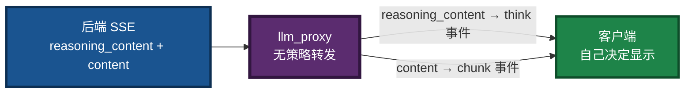

**为什么移除 `--include-thinking` 开关**：是否产生 thinking 由**模型**决定，不由代理决定；代理加开关等于"替客户端做策略"。客户端想不显示 think 事件，忽略即可；想显示，渲染即可。

### 4.5 set_system_message 的拒绝机制

**从"假成功"到"明确拒绝"**：

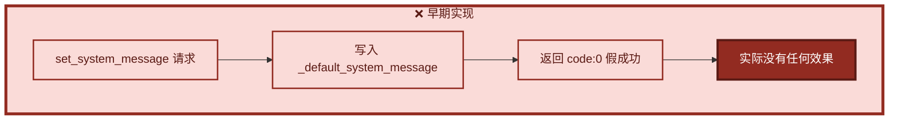

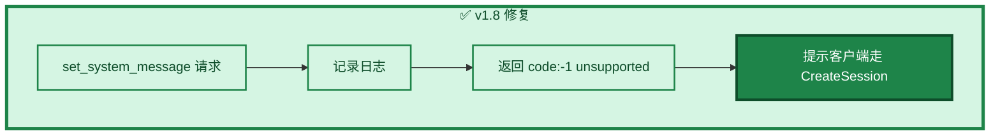

**理由**：代理是无状态转发器，"全局默认 system message"这个概念在其语义下不存在。**撒谎比拒绝更危险**。

---

## 五、API 能力矩阵机制（阶段 C 新增）

### 5.1 设计背景

`llm_service.py` 与 `llm_proxy.py` 是**兄弟服务端**，共用同一端点（`ipc:llm_service`）与同一 App 名（`LLM_Service`），但功能集不同——`set_system_message` 只在 `llm_service` 中可用。客户端需要一种机制发现"当前运行的是哪一个"。

### 5.2 能力矩阵结构

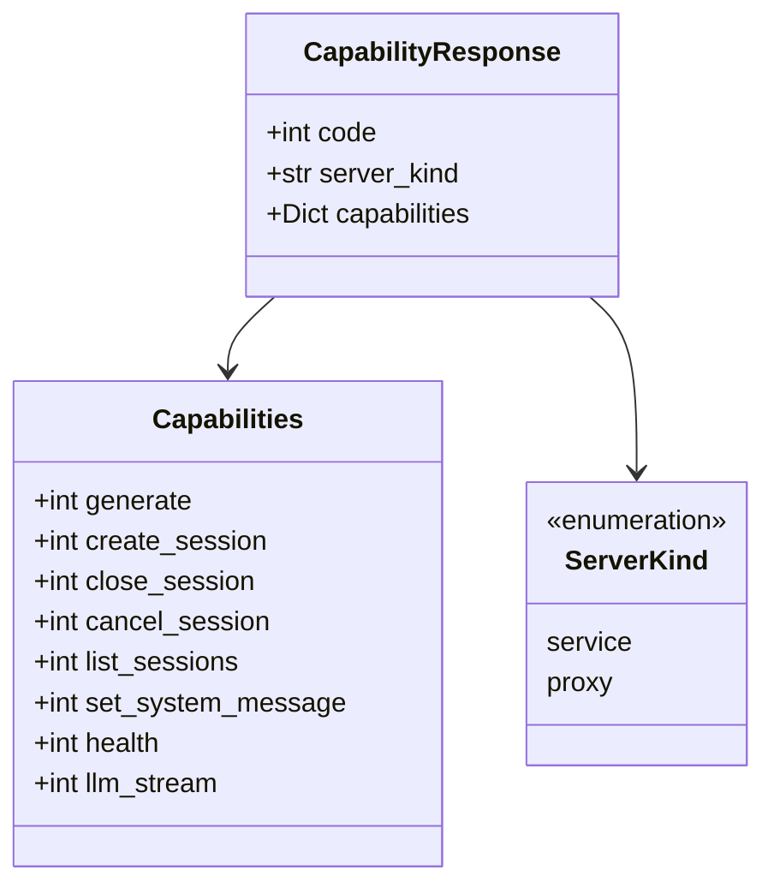

**服务端差异**：

| API | `llm_service` | `llm_proxy` |
|-----|:-------------:|:-----------:|
| `generate` | 1 | 1 |
| `create_session` | 1 | 1 |
| `close_session` | 1 | 1 |
| `cancel_session` | 1 | 1 |
| `list_sessions` | 1 | 1 |
| **`set_system_message`** | **1** | **0** |
| `health` | 1 | 1 |
| `llm_stream` | 1 | 1 |
| `server_kind` | `"service"` | `"proxy"` |

### 5.3 三方能力发现流程

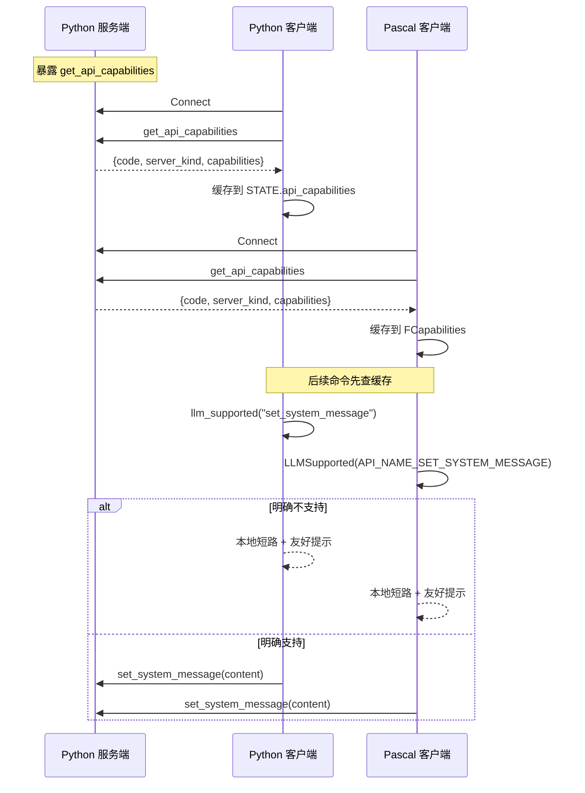

### 5.4 客户端降级行为

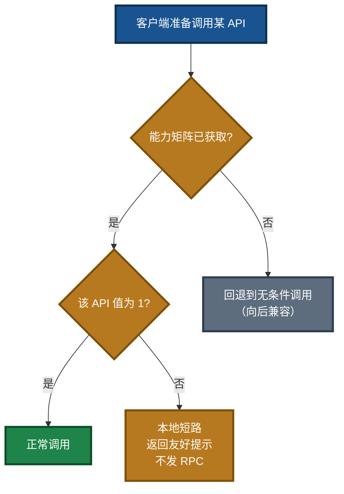

**关键设计**：`HasCapabilityInfo` 与 `LLMSupported` 分离——前者回答"信息可靠吗"，后者回答"支持吗"。这个分离让"未知"与"不支持"得以区分。

| 缓存状态 | `HasCapabilityInfo` | `LLMSupported(api)` | 调用方行为 |
|----------|:-------------------:|:-------------------:|-----------|
| 已获取 | True | 按矩阵返回 | 按支持度决策 |
| 未获取 | False | 一律 False | 保持原样尝试 |

---

## 六、会话双条件回收策略（阶段 C 升级）

### 6.1 从单条件到双条件

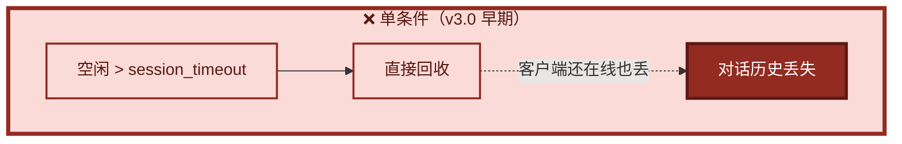

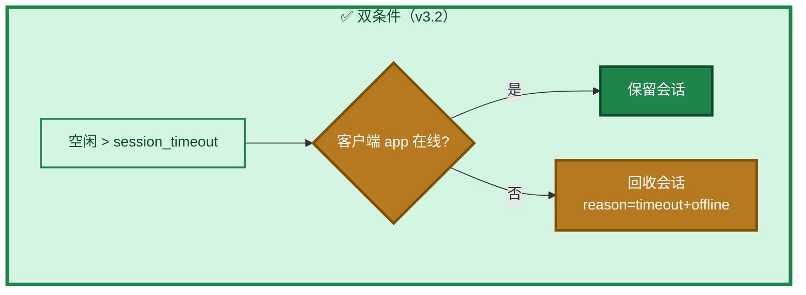

### 6.2 四种组合行为

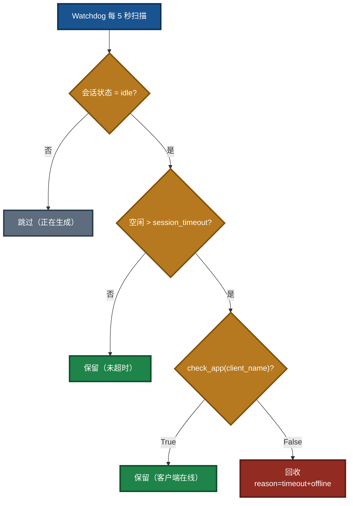

### 6.3 新增 reason 值

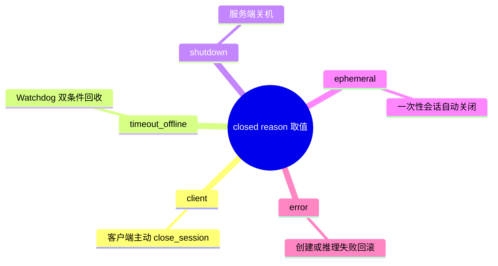

---

## 七、`--help` 自适应机制（阶段 C 新增）

### 7.1 问题与方案

**问题**：源码模式运行时 `--help` 显示 `python xxx.py ...`，打包为 EXE 后仍显示 `python xxx.py`，与实际调用方式不符。

**方案**：三个 Python 工具（`llm_service.py`、`llm_proxy.py`、`llm_test.py`）统一引入三个辅助函数。

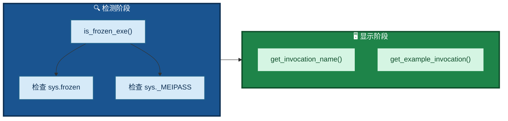

### 7.2 效果对照

| 运行模式 | usage 显示 | 示例显示 |
|----------|-----------|----------|
| 源码 | `usage: llm_service.py ...` | `python llm_service.py --model-path ...` |
| EXE | `usage: llm_service.exe ...` | `llm_service.exe --model-path ...` |

---

## 八、缺陷修复历程

### 8.1 阶段 A：19 项服务端缺陷

```mermaid
pie showData
    title 阶段 A：19 项缺陷分布
    "致命 P0" : 2
    "严重 P1" : 6
    "一般 P2" : 11
```

### 8.2 严重缺陷修复对照

| ID | 缺陷 | 修复策略 | 版本 |
|----|------|----------|------|
| **F1** | LLM 并发不安全 | 单 worker 线程串行化 | v2.0 |
| **F2** | 会话无管理 | Session 对象 + Watchdog | v3.0 |
| **S1** | system_message 竞态 | 请求时 snapshot | v2.0 |
| **S2** | 上下文预算算错 | tokenize 精确计数 | v2.0 |
| **S3** | 字符串魔法协议 | `type` 字段结构化 | v2.0 |
| **S4** | 双轨错误协议 | 统一 `{code, error}` | v2.0 |
| **S5** | 每 token 新句柄 | 保留（API 约束） | v2.0 |
| **S6** | 双重 cleanup | `_cleaned_up` 幂等标志 | v2.0 |

### 8.3 阶段 B：代理层 8 次迭代的缺陷

| ID | 缺陷 | 症状 | 修复 | 版本 |
|----|------|------|------|------|
| **P1** | 进程秒退 | 启动后立即退出 | 加主循环 + 信号处理 | v1.3 |
| **P2** | SSE 延迟 | 客户端 17 秒才收到 | `http.client` 替换 `requests` | v1.4 |
| **P3** | gzip 干扰 | 批量输出 | `Accept-Encoding: identity` | v1.5 |
| **P4** | Nagle 抖动 | 40ms 级别抖动 | `TCP_NODELAY` | v1.6 |
| **P5** | thinking 开关 | 代理替客户端做策略 | 移除开关，无策略转发 | v1.7 |
| **P6** | set_system_message 假成功 | 返回 code:0 但无效果 | 明确返回 unsupported | v1.8 |
| **P7** | 死字段残留 | `_default_system_message` 无用 | 删除字段 | v1.8 |
| **P8** | 未支持选项静默丢弃 | `thinking`/`ephemeral` 被忽略无记录 | DEBUG 日志记录 | v1.8 |

### 8.4 阶段 C：工具链收尾改动

| ID | 改动 | 组件 | 影响 |
|----|------|------|------|
| **T1** | `--help` 自适应 | 三个 Python 工具 | 用户体验 |
| **T2** | API 能力矩阵机制 | 服务端 + 双客户端 | 协议一致性 |
| **T3** | 会话双条件回收 | `llm_service.py` | 会话稳定性 |
| **T4** | 编译脚本一次性编译三个 EXE | `build_llm_service.ps1` | 构建效率 |
| **T5** | 依赖清单分场景 | `requirements.txt` | 安装便利性 |
| **T6** | 文档高对比配色 + 同目录链接 | 全部 LingoFuse_LLM*.md | 可读性、可维护性 |

### 8.5 缺陷修复可视化（象限图）

```mermaid
flowchart TB
    subgraph Q1["🔴 立即修复 —— 影响大 + 复杂度高"]
        direction LR
        F1["F1 并发不安全"]
        F2["F2 会话无管理"]
        P2["P2 SSE 延迟"]
    end

    subgraph Q2["🟠 高优先级 —— 影响大 + 复杂度低"]
        direction LR
        P1["P1 进程秒退"]
        P3["P3 gzip 干扰"]
        P6["P6 假成功"]
        S3["S3 字符串魔法"]
    end

    subgraph Q3["🟡 一般关注 —— 影响中 + 复杂度中"]
        direction LR
        S1["S1 竞态"]
        S2["S2 预算错"]
        P5["P5 thinking 策略"]
    end

    subgraph Q4["🟢 排期修复 —— 影响小 + 复杂度低"]
        direction LR
        P4["P4 Nagle 抖动"]
        P7["P7 死字段"]
    end

    style Q1 fill:#FADBD8,stroke:#922B21,stroke-width:3px,color:#5A1A14
    style Q2 fill:#FDEBD0,stroke:#B7791F,stroke-width:3px,color:#7E5109
    style Q3 fill:#FEF9E7,stroke:#B7950B,stroke-width:3px,color:#7E5109
    style Q4 fill:#EAECEE,stroke:#5D6D7E,stroke-width:3px,color:#2C3E50
    style F1 fill:#922B21,stroke:#5A1A14,stroke-width:2px,color:#FFFFFF
    style F2 fill:#922B21,stroke:#5A1A14,stroke-width:2px,color:#FFFFFF
    style P2 fill:#922B21,stroke:#5A1A14,stroke-width:2px,color:#FFFFFF
    style P1 fill:#B7791F,stroke:#7E5109,stroke-width:2px,color:#FFFFFF
    style P3 fill:#B7791F,stroke:#7E5109,stroke-width:2px,color:#FFFFFF
    style P6 fill:#B7791F,stroke:#7E5109,stroke-width:2px,color:#FFFFFF
    style S3 fill:#B7791F,stroke:#7E5109,stroke-width:2px,color:#FFFFFF
    style S1 fill:#B7950B,stroke:#7E5109,stroke-width:2px,color:#FFFFFF
    style S2 fill:#B7950B,stroke:#7E5109,stroke-width:2px,color:#FFFFFF
    style P5 fill:#B7950B,stroke:#7E5109,stroke-width:2px,color:#FFFFFF
    style P4 fill:#5D6D7E,stroke:#2C3E50,stroke-width:2px,color:#FFFFFF
    style P7 fill:#5D6D7E,stroke:#2C3E50,stroke-width:2px,color:#FFFFFF
```

---

## 九、协议演进

### 9.1 流式消息协议对比

```mermaid
sequenceDiagram
    participant Server as 服务端
    participant Client as 客户端

    Note over Server,Client: ❌ v1.0 协议（字符串魔法）
    Server->>Client: {"chunk": "Hello"}
    Server->>Client: {"chunk": " world"}
    Server->>Client: {"chunk": "__FINISH__"}
    Note over Client: 用 startswith 判断

    Note over Server,Client: ✅ v3.0 协议（结构化）
    Server->>Client: {"type":"chunk","session_id":"...","text":"Hello"}
    Server->>Client: {"type":"chunk","session_id":"...","text":" world"}
    Server->>Client: {"type":"think","session_id":"...","text":"..."}
    Server->>Client: {"type":"finish","session_id":"...","reason":"stop"}
    Server->>Client: {"type":"closed","session_id":"...","reason":"timeout+offline"}
```

### 9.2 消息类型矩阵

```mermaid
flowchart LR
    subgraph MSG["📨 消息类型"]
        C["chunk<br/>正文流"]
        T["think<br/>思考流"]
        F["finish<br/>生成结束"]
        E["error<br/>服务端错误"]
        CL["closed<br/>会话关闭"]
    end

    C --> CU["客户端追加显示"]
    T --> TU["灰色显示或折叠"]
    F --> FU["更新状态栏"]
    E --> EU["错误提示"]
    CL --> CLU["清理会话列表"]

    style MSG fill:#1A5490,stroke:#0D2F52,stroke-width:3px,color:#FFFFFF
    style C fill:#1A5490,stroke:#0D2F52,stroke-width:3px,color:#FFFFFF
    style T fill:#5D6D7E,stroke:#2C3E50,stroke-width:3px,color:#FFFFFF
    style F fill:#1E8449,stroke:#0E4D2A,stroke-width:3px,color:#FFFFFF
    style E fill:#922B21,stroke:#5A1A14,stroke-width:3px,color:#FFFFFF
    style CL fill:#B7791F,stroke:#7E5109,stroke-width:3px,color:#FFFFFF
    style CU fill:#D6EAF8,stroke:#1F618D,stroke-width:2px,color:#0D2F52
    style TU fill:#EAECEE,stroke:#5D6D7E,stroke-width:2px,color:#2C3E50
    style FU fill:#D5F5E3,stroke:#1E8449,stroke-width:2px,color:#0E4D2A
    style EU fill:#FADBD8,stroke:#922B21,stroke-width:2px,color:#5A1A14
    style CLU fill:#FDEBD0,stroke:#B7791F,stroke-width:2px,color:#7E5109
```

### 9.3 双后端行为对照

| 维度 | `llm_service.py` | `llm_proxy.py` |
|------|:----------------:|:--------------:|
| **模型加载** | 本地 llama.cpp | 无（转发到外部） |
| **推理线程** | 单 worker 串行 | 无推理，HTTP 转发 |
| **上下文管理** | 服务端持有 KV cache | 每轮重建 messages |
| **set_system_message** | ✅ 支持 | ❌ 明确拒绝 |
| **CreateSession（有 sys）** | 使用传入值 | 使用传入值 |
| **CreateSession（无 sys）** | 用全局默认 | 空 system message |
| **thinking 转发** | 由 template 决定 | 由后端模型决定 |
| **health() 字段** | 本地模型信息 | 代理 + 后端信息 |
| **端点 / App 名** | `ipc:llm_service` / `LLM_Service` | 同左 |
| **能否同时运行** | ❌ | ❌ |

---

## 十、多会话状态机

### 10.1 会话生命周期

```mermaid
stateDiagram-v2
    [*] --> queued: create_session<br/>或 generate(无 session_id)
    queued --> running: worker 取出任务
    running --> idle: 生成完成
    running --> cancelled: cancel_session
    running --> error: 推理异常
    idle --> running: generate(带 session_id)
    idle --> closing: close_session
    idle --> closing: 双条件回收（超时+离线）
    cancelled --> idle: 保留会话
    error --> idle: 保留会话
    closing --> [*]: 移除会话
```

### 10.2 会话对象结构

```mermaid
classDiagram
    class SessionState {
        +str session_id
        +str client_name
        +str system_message
        +List messages
        +float created_at
        +float last_active_at
        +str status
        +Event current_cancel_event
        +Lock lock
        +to_summary() Dict
    }

    class GenerationTask {
        +str task_id
        +Session session
        +str content
        +str prompt
        +Dict options
        +bool ephemeral
        +Event cancel_event
    }

    class LLMService {
        -Dict _sessions
        -Queue _request_queue
        -Thread _worker_thread
        -Thread _watchdog_thread
        +_handle_generate()
        +_process_task()
    }

    class LLMProxyService {
        -Dict _sessions
        -Lock _sessions_lock
        -OpenAIStreamClient _backend
        +_handle_generate()
        +_run_generation()
    }

    LLMService "1" --> "*" SessionState : manages
    LLMProxyService "1" --> "*" SessionState : manages
```

**要点**：`SessionState` 在两个服务端实现中**语义一致**，但内部处理不同——`llm_service.py` 的 Session 直接持有 llama.cpp 的历史；`llm_proxy.py` 的 Session 只是一个 message list，每轮重建 messages。

---

## 十一、Thinking 分流机制

### 11.1 状态机原理

```mermaid
stateDiagram-v2
    [*] --> Outside: 初始化
    Outside --> Inside: 检测到 think 开始标记
    Inside --> Outside: 检测到 think 结束标记
    Outside --> Outside: 普通文本 → chunk
    Inside --> Inside: 思考文本 → think
```

### 11.2 两条路径

```mermaid
flowchart TB
    subgraph PATH_A["🅰️ llm_service 路径"]
        A1["llama.cpp<br/>token 流"] --> A2["ThinkingParser<br/>状态机"]
        A2 --> A3["chunk / think 事件"]
    end

    subgraph PATH_B["🅱️ llm_proxy 路径"]
        B1["后端 SSE<br/>reasoning_content + content"] --> B2["无策略转发"]
        B2 --> B3["think / chunk 事件"]
    end

    style PATH_A fill:#D5F5E3,stroke:#1E8449,stroke-width:3px,color:#0E4D2A
    style PATH_B fill:#F4ECF7,stroke:#5B2C6F,stroke-width:3px,color:#321640
    style A1 fill:#D5F5E3,stroke:#1E8449,stroke-width:2px,color:#0E4D2A
    style A2 fill:#1E8449,stroke:#0E4D2A,stroke-width:4px,color:#FFFFFF
    style A3 fill:#1E8449,stroke:#0E4D2A,stroke-width:2px,color:#0E4D2A
    style B1 fill:#F4ECF7,stroke:#5B2C6F,stroke-width:2px,color:#321640
    style B2 fill:#5B2C6F,stroke:#321640,stroke-width:4px,color:#FFFFFF
    style B3 fill:#F4ECF7,stroke:#5B2C6F,stroke-width:2px,color:#321640
```

### 11.3 关键差异

| 维度 | `llm_service.py` | `llm_proxy.py` |
|------|:----------------:|:--------------:|
| **thinking 判断** | 模板预置 + 状态机 | 后端已分离字段 |
| **是否可关** | 模板变量控制 | 无开关，全量转发 |
| **跨 chunk 处理** | 需要尾部缓冲 | 后端已保证字段完整 |

---

## 十二、Chat Template 加载机制

### 12.1 加载路径搜索

```mermaid
flowchart TD
    START["程序启动"] --> Q1{"指定了 --chat-template?"}
    Q1 -->|是| E1["显式路径<br/>不存在则报错退出"]
    Q1 -->|否| SEARCH["多路径搜索 chat_template.jinja"]
    SEARCH --> P1["脚本目录"]
    P1 --> P2["脚本父目录"]
    P2 --> P3["当前工作目录"]
    P3 --> Q2{"找到?"}
    Q2 -->|是| LOAD["加载文件"]
    Q2 -->|否| FALLBACK["回落模型内置模板"]
    E1 --> LOAD
    LOAD --> RENDER["渲染时传入变量"]
    FALLBACK --> RENDER

    style START fill:#1A5490,stroke:#0D2F52,stroke-width:3px,color:#FFFFFF
    style Q1 fill:#B7791F,stroke:#7E5109,stroke-width:3px,color:#FFFFFF
    style Q2 fill:#B7791F,stroke:#7E5109,stroke-width:3px,color:#FFFFFF
    style E1 fill:#B7791F,stroke:#7E5109,stroke-width:2px,color:#FFFFFF
    style SEARCH fill:#B7791F,stroke:#7E5109,stroke-width:2px,color:#FFFFFF
    style P1 fill:#D6EAF8,stroke:#1F618D,stroke-width:2px,color:#0D2F52
    style P2 fill:#D6EAF8,stroke:#1F618D,stroke-width:2px,color:#0D2F52
    style P3 fill:#D6EAF8,stroke:#1F618D,stroke-width:2px,color:#0D2F52
    style LOAD fill:#1E8449,stroke:#0E4D2A,stroke-width:3px,color:#FFFFFF
    style FALLBACK fill:#B7791F,stroke:#7E5109,stroke-width:2px,color:#FFFFFF
    style RENDER fill:#5B2C6F,stroke:#321640,stroke-width:3px,color:#FFFFFF
```

### 12.2 关键发现

用户在目录 `Py/` 下放 `chat_template.jinja`，脚本在 `Py/llm-service/llm_service.py`。

- **v2.1 行为**：只在脚本目录找 → **找不到** → 走模型内置模板
- **v2.2 行为**：搜索脚本目录、父目录、CWD → **命中父目录** → 正确加载

**代理层的对应处理**：`llm_proxy.py` 不加载模板。后端（LM Studio 等）自己处理模板。

---

## 十三、客户端对接

### 13.1 Pascal 客户端修复历程

```mermaid
flowchart TB
    A["llm_client.pas v3.0"] --> B{"编译结果"}
    B -->|失败| E1["var/out 签名冲突"]
    E1 --> F1["合并为单个 Generate"]
    F1 --> G["v3.0.1 可编译"]

    G --> H["llm_tool_frm.pas"]
    H --> I{"事件签名匹配?"}
    I -->|否| E2["旧版单参数 vs 新版双参数"]
    E2 --> F2["升级所有 Do_LLM_* 处理器"]
    F2 --> J["v3.0 可编译"]

    J --> K["代码审计"]
    K --> L["发现 S1-S4 严重问题"]
    L --> M["llm_client.pas v3.2 完整注释版"]
    M --> N["新增能力发现 v3.3"]
    N --> O["llm_tool_frm.pas v3.1"]

    style A fill:#1A5490,stroke:#0D2F52,stroke-width:3px,color:#FFFFFF
    style M fill:#1E8449,stroke:#0E4D2A,stroke-width:4px,color:#FFFFFF
    style N fill:#1A5490,stroke:#0D2F52,stroke-width:3px,color:#FFFFFF
    style O fill:#922B21,stroke:#5A1A14,stroke-width:4px,color:#FFFFFF
    style E1 fill:#FADBD8,stroke:#922B21,stroke-width:2px,color:#5A1A14
    style E2 fill:#FADBD8,stroke:#922B21,stroke-width:2px,color:#5A1A14
    style B fill:#B7791F,stroke:#7E5109,stroke-width:2px,color:#FFFFFF
    style I fill:#B7791F,stroke:#7E5109,stroke-width:2px,color:#FFFFFF
    style F1 fill:#D5F5E3,stroke:#1E8449,stroke-width:2px,color:#0E4D2A
    style F2 fill:#D5F5E3,stroke:#1E8449,stroke-width:2px,color:#0E4D2A
    style G fill:#1E8449,stroke:#0E4D2A,stroke-width:2px,color:#FFFFFF
    style H fill:#D6EAF8,stroke:#1F618D,stroke-width:2px,color:#0D2F52
    style J fill:#1E8449,stroke:#0E4D2A,stroke-width:2px,color:#FFFFFF
    style K fill:#B7791F,stroke:#7E5109,stroke-width:2px,color:#FFFFFF
    style L fill:#FDEBD0,stroke:#B7791F,stroke-width:2px,color:#7E5109
```

### 13.2 Pascal 客户端严重问题

| ID | 问题 | 后果 | 修复 |
|----|------|------|------|
| **S1** | `Connect` 失败路径泄漏 `FApp` | 内存泄漏 + 无法重连 | `CleanupPartialConnect` |
| **S2** | `Disconnect` 早退导致主线程泄漏 | LingoFuse 主线程常驻 | `FPrepared` 追踪状态 |
| **S3** | JSON 经 `string` 中转 | 中文乱码 | 全程 `TBytes` |
| **S4** | `OnLLMStream` 未检 buffer | 空消息崩溃 | 判空 `buf` / `sz` |

### 13.3 GUI 层新增功能

**`new_session` 按钮**：让新的 system message 生效的唯一路径。

```mermaid
flowchart TB
    CLICK["用户点击新建会话"] --> READ["从 sys_prompt_Memo 读取 system message"]
    READ --> CALL["LLM.CreateSession(sys_msg, sid, err)"]
    CALL --> CHECK{"成功?"}
    CHECK -->|是| UPDATE["更新 FActiveSessionId<br/>切换到输出页"]
    CHECK -->|否| LOG["DoStatus(err)"]
    UPDATE --> INFO["日志: 已创建新会话"]

    style CLICK fill:#1A5490,stroke:#0D2F52,stroke-width:3px,color:#FFFFFF
    style READ fill:#B7791F,stroke:#7E5109,stroke-width:2px,color:#FFFFFF
    style CALL fill:#B7791F,stroke:#7E5109,stroke-width:2px,color:#FFFFFF
    style CHECK fill:#B7791F,stroke:#7E5109,stroke-width:3px,color:#FFFFFF
    style UPDATE fill:#1E8449,stroke:#0E4D2A,stroke-width:3px,color:#FFFFFF
    style LOG fill:#922B21,stroke:#5A1A14,stroke-width:3px,color:#FFFFFF
    style INFO fill:#1E8449,stroke:#0E4D2A,stroke-width:2px,color:#FFFFFF
```

---

## 十四、配置模型统一

### 14.1 三级优先级的统一模式

两个服务端和客户端现在都遵循**完全一致**的配置模型：

```mermaid
flowchart LR
    CMD["命令行参数"] -->|优先级最高| WIN["最终生效值"]
    ENV["环境变量"] -->|优先级中| WIN
    DEF["DEFAULT_* 常量"] -->|优先级最低| WIN
    WIN --> CONFIG["全局 CONFIG 对象"]

    style CMD fill:#922B21,stroke:#5A1A14,stroke-width:3px,color:#FFFFFF
    style ENV fill:#B7791F,stroke:#7E5109,stroke-width:3px,color:#FFFFFF
    style DEF fill:#5D6D7E,stroke:#2C3E50,stroke-width:3px,color:#FFFFFF
    style WIN fill:#1A5490,stroke:#0D2F52,stroke-width:3px,color:#FFFFFF
    style CONFIG fill:#1E8449,stroke:#0E4D2A,stroke-width:4px,color:#FFFFFF
```

**统一点**：

1. 所有配置项有 `DEFAULT_*` 模块级常量
2. 初始化时创建全局 `CONFIG` 对象
3. `parse_args()` 从 env + argv 读取
4. `_init_global_config(args)` 写回 CONFIG
5. 运行时**只读 CONFIG**，不再重读 env / argv

**三个文件的实现对照**：

| 文件 | CONFIG 类 | 初始化函数 | 配置项数 |
|------|-----------|-----------|:--------:|
| `llm_service.py` | `ServiceConfig` | `_init_global_config` | 16 |
| `llm_proxy.py` | `ProxyConfig` | `_init_global_config` | 12 |
| `llm_test.py` | 使用 argparse 局部变量 | — | 8 |

---

## 十五、编译与工程交付

### 15.1 一次性编译三个 EXE

**`build_llm_service.ps1`** 一次性编译：

| 源文件 | 输出 | 特殊依赖 |
|--------|------|----------|
| `llm_service.py` | `llm_service.exe` | `llama_cpp`、`jinja2` |
| `llm_proxy.py` | `llm_proxy.exe` | `requests`、`http.client`、`ssl` |
| `llm_test.py` | `llm_test.exe` | 仅 `lingofuse` |

**脚本流程**：

```mermaid
flowchart TB
    START["运行 build_llm_service.ps1"] --> PRE["前置检查"]
    PRE --> CLEAN["清理旧构建产物"]
    CLEAN --> B1["编译 llm_service.py"]
    B1 --> B2["编译 llm_proxy.py"]
    B2 --> B3["编译 llm_test.py"]
    B3 --> SUM["汇总编译结果"]
    SUM --> REMIND["提醒运行时依赖"]
    REMIND --> DONE["✅ 完成"]

    style START fill:#1A5490,stroke:#0D2F52,stroke-width:3px,color:#FFFFFF
    style PRE fill:#B7791F,stroke:#7E5109,stroke-width:2px,color:#FFFFFF
    style CLEAN fill:#B7791F,stroke:#7E5109,stroke-width:2px,color:#FFFFFF
    style B1 fill:#1E8449,stroke:#0E4D2A,stroke-width:2px,color:#FFFFFF
    style B2 fill:#5B2C6F,stroke:#321640,stroke-width:2px,color:#FFFFFF
    style B3 fill:#1A5490,stroke:#0D2F52,stroke-width:2px,color:#FFFFFF
    style SUM fill:#B7791F,stroke:#7E5109,stroke-width:2px,color:#FFFFFF
    style REMIND fill:#B7791F,stroke:#7E5109,stroke-width:2px,color:#FFFFFF
    style DONE fill:#1E8449,stroke:#0E4D2A,stroke-width:4px,color:#FFFFFF
```

### 15.2 依赖清单分场景

`requirements.txt` 按组件分场景组织：

| 段落 | 依赖 | 用途 |
|------|------|------|
| 必需 | `requests` | `llm_proxy` 探测 `/v1/models` |
| HTTP 桥接 | `flask` | `bridge.py` |
| 本地推理 | `llama-cpp-python` | `llm_service.py` |
| 聊天模板 | `jinja2` | 自定义模板 |
| 打包 | `pyinstaller` | 生成 EXE |
| 开发 | `pytest`、`black`、`flake8` | 可选 |

---

## 十六、代码审查结论

### 16.1 通过项

```mermaid
mindmap
  root(("代码审查通过项"))
    API名称一致性
      全部对齐
    能力矩阵键集
      全部对齐
    请求响应字段
      全部对齐
    流式消息字段
      全部对齐
    help自适应
      3个Python工具统一
    会话双条件回收
      逻辑正确
    Pascal能力发现
      完整
    文档同目录链接
      全部指向同目录
```

### 16.2 待优化项（不阻塞）

| 编号 | 严重度 | 文件 | 简述 |
|:----:|:------:|------|------|
| 1 | 🟠 P3 | Pascal 客户端 | `Connect` 中 `FetchCapabilities` 会覆盖 out 参数 |
| 2 | 🟠 P3 | `llm_test.py` | `llm_supported` 缓存未命中缺键时会重复 fetch |
| 3 | 🟠 P3 | GUI 窗体 | 后台线程调用 `DoStatus` 存在 UI 线程安全疑点 |
| 4 | 🟡 P4 | GUI 窗体 | `FormClose` 跳过 `Disconnect`（已知问题） |
| 5 | 🟡 P4 | `llm_service.py` | 未使用的导入 |

**结论**：功能正确，无致命缺陷，待优化项可排入后续迭代。

---

## 十七、数据统计

### 17.1 各阶段问题数

```mermaid
xychart-beta
    title "各阶段问题数"
    x-axis ["服务端研究", "v2.0", "v2.2", "v3.0", "代理层", "Pascal", "工具链"]
    y-axis "Issue Count" 0 --> 25
    bar [19, 8, 3, 5, 8, 6, 6]
```

### 17.2 代理层迭代修复项数

```mermaid
xychart-beta
    title "llm_proxy.py 迭代修复项数"
    x-axis ["v1.0", "v1.3", "v1.4", "v1.5", "v1.6", "v1.7", "v1.8"]
    y-axis "Fixes" 0 --> 6
    bar [1, 1, 2, 1, 1, 1, 3]
```

### 17.3 支持的后端统计

| 类别 | 数量 |
|------|:----:|
| 云 API 提供商（国际） | 30+ |
| 云 API 提供商（中国区） | 15+ |
| 本地推理服务器 | 20+ |
| 网关 / 代理 / 路由 | 20+ |
| API 聚合 / 中转站 | 15+ |
| 桌面客户端（自带 Server） | 17+ |
| 嵌入 / TTS / STT（部分支持） | 12+ |
| **合计** | **129+** |

---

## 十八、交付物清单

### 18.1 服务端（Python）

| 文件 | 版本 | 说明 |
|------|------|------|
| `llm_service.py` | **v3.2** | 持久化多会话流式服务端（本地推理） |
| `llm_proxy.py` | **v1.8** | 无状态转发器（OpenAI 兼容后端） |
| `chat_template.jinja` | — | NVIDIA Nemotron 模板 |

### 18.2 客户端（Python）

| 文件 | 版本 | 说明 |
|------|------|------|
| `llm_test.py` | **v3.6** | 交互式多会话 REPL，emoji 支持，能力发现 |

### 18.3 客户端（Pascal）

| 文件 | 版本 | 说明 |
|------|------|------|
| `llm_client.pas` | **v3.3** | 完整英文注释，S1-S4 修复，能力发现 |
| `llm_tool_frm.pas` | **v3.1** | new_session 实现，能力检查，全中文注释 |

### 18.4 工程脚本

| 文件 | 说明 |
|------|------|
| `build_llm_service.ps1` | 一次性编译三个 EXE |
| `requirements.txt` | 按组件分场景的依赖清单 |

### 18.5 文档

| 文件 | 版本 | 说明 |
|------|------|------|
| `LingoFuse_LLM_Ecosystem_User_Guide.md` | **v3.0** | 闭环架构与生态总览 |
| `LingoFuse_LLM_Service_CLI_guide.md` | **v2.1** | 服务端命令行手册 |
| `LingoFuse_LLM_Proxy_CLI_Guide.md` | **v3.0** | 代理层命令行手册 |
| `LingoFuse_LLM_Proxy_Compatibility_Guide.md` | **v3.0** | 129+ 后端兼容性清单 |
| `LingoFuse_LLM_Pitfalls_For_AI.md` | **v3.0** | 踩坑大全 |
| `llama_cpp_python_guide.md` | — | `llama-cpp-python` 安装与使用 |
| `LingoFuse_LLM_Service_Work_Summary.md` | **v4.0** | 本文档 |

---

## 十九、经验总结

### 19.1 五条核心经验

```mermaid
mindmap
  root(("经验总结"))
    架构层面
      单线程不总是性能差
      串行化是稳定性根基
      队列是最好的解耦
    协议层面
      结构化优于字符串魔法
      UTF-8 全程贯通
      type 字段胜过前缀判断
      能力矩阵替代硬编码假设
    跨语言层面
      字节流是通用语言
      事件签名必须严格对齐
      var/out 在 FPC 下同签名
    传输层面
      SSE 三层缓冲缺一不可
      http_client 是唯一可靠方案
      identity 禁用 gzip
    语义层面
      无状态转发不加状态
      假成功比拒绝更危险
      失败要有替代路径
      未知不等于不支持
```

### 19.2 三条核心经验

**经验 1：协议一致性优先于实现细节**

跨语言（Python / Pascal）合作时，最容易出错的地方不是算法，而是**协议字段名、大小写、空值处理**。本次通过统一的能力矩阵机制，把"服务端支持什么"这个动态信息固化成结构化协议，避免了硬编码假设。

**经验 2：能力发现机制的核心是"未知 ≠ 不支持"**

`HasCapabilityInfo` 与 `LLMSupported` 必须分离——前者回答"信息可靠吗"，后者回答"支持吗"。否则无法区分"旧服务端未实现能力 API"与"新服务端明确不支持该 API"，后者会错误地短路掉本可正常运行的调用。

**经验 3：watchdog 的回收条件应保守而非激进**

单条件（仅超时）会导致客户端短暂离线时丢失会话；双条件（超时 AND 离线）在延迟回收与保守保留之间取得平衡。代价是会话驻留时间可能变长，但这与 `max_sessions` 的限流机制互补，整体可控。

### 19.3 五条铁律

```mermaid
mindmap
  root(("五条铁律"))
    铁律一
      client_name 是身份
      不是标签
      必须真实注册
    铁律二
      回调要快
      耗时操作入队
      阻塞调用禁止
    铁律三
      字节流是通用语言
      UTF-8 全程
      不经 string 中转
    铁律四
      SSE 流必须实时
      http_client 而非 requests
      identity 而非 gzip
    铁律五
      无状态语义下
      不撒谎
      不加状态
      拒绝优于假成功
      未知不等于不支持
```

---

## 二十、遗留问题与后续建议

### 20.1 尚未处理的问题

```mermaid
flowchart TB
    subgraph SERVER["⏳ 服务端"]
        S1["M1: ExitMainThread 全局副作用"]
        S2["M2: 主线程调用可能死锁"]
        S3["M3: 过期 session_id 未自动清"]
        S4["M4: 未使用导入"]
    end

    subgraph PROXY["⏳ 代理层"]
        P1["P1: 工具调用（tools）不支持"]
        P2["P2: Responses API 未实现"]
        P3["P3: 多模态输入未支持"]
        P4["P4: watchdog 未加入 check_app"]
    end

    subgraph GUI["⏳ GUI 层"]
        G1["P0-1: FormClose 直接 Shutdown"]
        G2["P1-5: 无取消按钮"]
        G3["P2: 会话列表 UI 缺失"]
        G4["P3: 后台线程 DoStatus 疑点"]
        G5["P3: FetchCapabilities 覆盖 ErrorMsg"]
    end

    subgraph TEST["⏳ 客户端"]
        T1["P3: llm_supported 重复 fetch"]
    end

    style SERVER fill:#FADBD8,stroke:#922B21,stroke-width:3px,color:#5A1A14
    style PROXY fill:#FDEBD0,stroke:#B7791F,stroke-width:3px,color:#7E5109
    style GUI fill:#D6EAF8,stroke:#1F618D,stroke-width:3px,color:#0D2F52
    style TEST fill:#F4ECF7,stroke:#5B2C6F,stroke-width:3px,color:#321640
    style G1 fill:#922B21,stroke:#5A1A14,stroke-width:3px,color:#FFFFFF
    style S1 fill:#D6EAF8,stroke:#1F618D,stroke-width:2px,color:#0D2F52
    style S2 fill:#D6EAF8,stroke:#1F618D,stroke-width:2px,color:#0D2F52
    style S3 fill:#D6EAF8,stroke:#1F618D,stroke-width:2px,color:#0D2F52
    style S4 fill:#D6EAF8,stroke:#1F618D,stroke-width:2px,color:#0D2F52
    style P1 fill:#D5F5E3,stroke:#1E8449,stroke-width:2px,color:#0E4D2A
    style P2 fill:#D5F5E3,stroke:#1E8449,stroke-width:2px,color:#0E4D2A
    style P3 fill:#D5F5E3,stroke:#1E8449,stroke-width:2px,color:#0E4D2A
    style P4 fill:#D5F5E3,stroke:#1E8449,stroke-width:2px,color:#0E4D2A
    style G2 fill:#D5F5E3,stroke:#1E8449,stroke-width:2px,color:#0E4D2A
    style G3 fill:#D5F5E3,stroke:#1E8449,stroke-width:2px,color:#0E4D2A
    style G4 fill:#D5F5E3,stroke:#1E8449,stroke-width:2px,color:#0E4D2A
    style G5 fill:#D5F5E3,stroke:#1E8449,stroke-width:2px,color:#0E4D2A
    style T1 fill:#F4ECF7,stroke:#5B2C6F,stroke-width:2px,color:#321640
```

### 20.2 建议优先级

| 优先级 | 项目 | 理由 |
|:------:|------|------|
| 🔴 P0 | GUI `FormClose` 顺序 | 关闭时可能崩溃 |
| 🟠 P1 | 加取消按钮 | 长回答无法中止 |
| 🟠 P1 | 中文端到端验证 | 未实测 |
| 🟠 P1 | 代理层工具调用 | Agent 类客户端依赖 |
| 🟠 P3 | `FetchCapabilities` 覆盖 `ErrorMsg` | 5 分钟修复 |
| 🟠 P3 | 后台线程 `DoStatus` | 移入主线程或入队 |
| 🟠 P3 | `llm_supported` 重复 fetch | 加缺键哨兵 |
| 🟡 P2 | 会话列表 UI | 多会话体验 |
| 🟡 P2 | Responses API | 新客户端接入 |
| 🟡 P4 | 清理未使用导入 | 顺手清理 |

---

## 二十一、结语

本次工作从**一个单会话 LLM 网关的缺陷修补**出发，历经**三个阶段**，最终演进为一套**双后端、多客户端、全栈文档、全生态对齐**的完整解决方案：

- **服务端**：19 项缺陷清零，单 worker 串行化，持久多会话，双条件回收
- **代理层**：从 0 到 1 打通外部后端，8 次迭代解决实时性问题，支持 129+ 后端
- **协议**：字符串魔法 → 结构化 JSON → 无策略转发 → 能力矩阵
- **跨语言**：Python 与 Pascal 双端对齐，字节流全程贯通，协议三方一致
- **GUI**：new_session 实现，能力检查，温和失败处理，全中文注释
- **工具链**：`--help` 自适应，编译脚本，依赖清单
- **文档**：全部改为高对比配色 + 同目录链接，可读性与可维护性大幅提升

**核心成果**：把一个"能跑"的 demo，变成了一个**能承受双开、能承受多会话、能承受跨语言、能对接 LM Studio 等主流后端、能自我描述能力、能优雅降级**的工业级组件。

---

## 二十二、相关文档（同目录）

| 文档 | 说明 |
|------|------|
| `LingoFuse_LLM_Ecosystem_User_Guide.md` | 闭环架构与生态总览 |
| `LingoFuse_LLM_Service_CLI_guide.md` | `llm_service.exe` 命令行手册 |
| `LingoFuse_LLM_Proxy_CLI_Guide.md` | `llm_proxy.exe` 命令行手册 |
| `LingoFuse_LLM_Proxy_Compatibility_Guide.md` | 支持的 129+ OpenAI 兼容后端清单 |
| `LingoFuse_LLM_Pitfalls_For_AI.md` | 踩坑大全，症状-根因-正确做法 |
| `llama_cpp_python_guide.md` | `llama-cpp-python` 安装与使用 |

---

**文档完成**

*本次工作总结完毕，所有图表使用 Mermaid 绘制，采用高对比配色方案，可在支持 Mermaid 的渲染器中查看。v4.0 在 v3.0 基础上更新为高对比配色，仅保留同目录链接，大型图表已拆分为多个小图以提升可读性。*