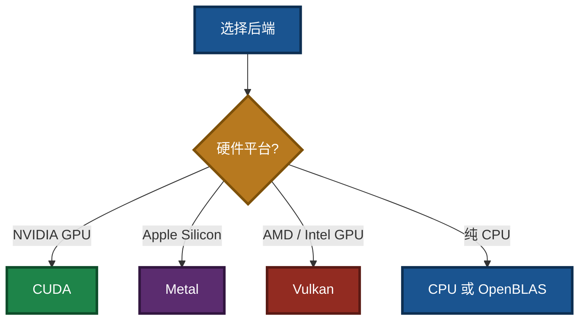
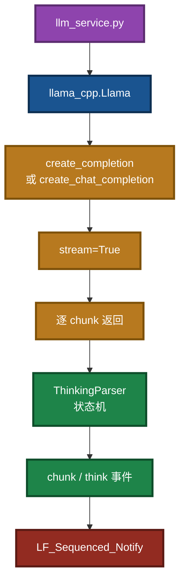
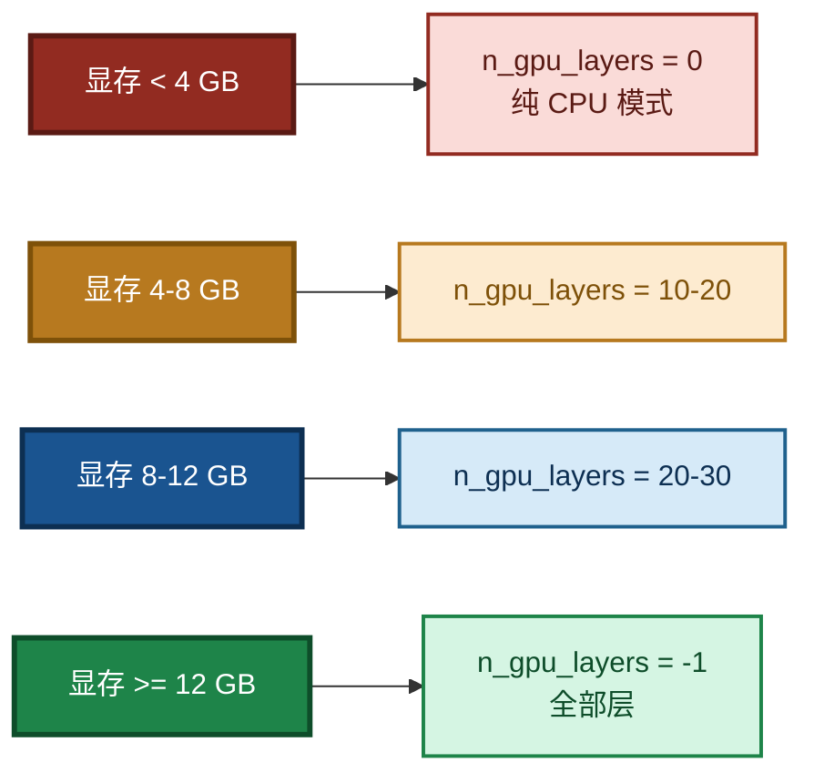

# llama-cpp-python 使用说明

> **文档名**：`llama_cpp_python_guide.md`  
> **版本**：V2.0  
> **最后更新**：2026-09-14  
> **相关文档**（同目录）：
> - 生态体系使用指南：`LingoFuse_LLM_Ecosystem_User_Guide.md`
> - 服务端命令行手册：`LingoFuse_LLM_Service_CLI_guide.md`
> - 代理命令行手册：`LingoFuse_LLM_Proxy_CLI_Guide.md`
> - 代理兼容性指南：`LingoFuse_LLM_Proxy_Compatibility_Guide.md`
> - 踩坑大全：`LingoFuse_LLM_Pitfalls_For_AI.md`
> - 版本演进总结：`LingoFuse_LLM_Service_Work_Summary.md`

---

## 一、简介

`llama-cpp-python` 是 [llama.cpp](https://github.com/ggerganov/llama.cpp) 的 Python 绑定库，让你能够在 Python 环境中高效运行各种量化的大语言模型（LLM）。它提供低层 C API 的 ctypes 访问和高层 Python API。

**系统要求**：Python 3.8+、C 编译器（Linux: gcc/clang、Windows: Visual Studio 或 MinGW、macOS: Xcode）。

### 图 1：llama-cpp-python 在闭环中的位置


---

## 二、卸载方法

卸载 `llama-cpp-python` 使用 pip 即可：

```bash
pip uninstall llama-cpp-python
```

如需强制卸载（不提示确认）：

```bash
pip uninstall llama-cpp-python -y
```

**清理缓存**（可选，彻底清除残留文件）：

```bash
# 清空全部 pip 缓存
pip cache purge

# 或仅移除 llama-cpp-python 的缓存
pip cache remove llama-cpp-python
```

---

## 三、安装方法

### 3.1 基础 CPU 版本

```bash
pip install llama-cpp-python
```

此命令会从源码编译 `llama.cpp` 并一同安装。如果编译失败，可添加 `--verbose` 查看完整 CMake 构建日志。

**使用预编译 CPU wheel（推荐，无需编译）**：

```bash
pip install llama-cpp-python --extra-index-url https://abetlen.github.io/llama-cpp-python/whl/cpu
```

### 3.2 各后端加速版本

`llama.cpp` 支持多种硬件加速后端，包括 CUDA、Metal、Vulkan、OpenBLAS、ROCm、SYCL 等。安装时通过 `CMAKE_ARGS` 环境变量指定后端。

### 图 2：后端选择决策



#### CUDA（NVIDIA GPU）

**从源码编译**：

```bash
CMAKE_ARGS="-DGGML_CUDA=on" pip install llama-cpp-python
```

**使用预编译 wheel（推荐）**：

```bash
pip install llama-cpp-python --extra-index-url https://abetlen.github.io/llama-cpp-python/whl/cu124
```

> CUDA 版本支持：11.8、12.1、12.2、12.3、12.4、12.5、13.0、13.2。将 URL 中的 `cu124` 替换为你的 CUDA 版本（如 `cu121`、`cu122` 等）。

**强制重新安装**（解决缓存问题）：

```bash
CMAKE_ARGS="-DGGML_CUDA=on" pip install llama-cpp-python --force-reinstall --no-cache-dir
```

#### Metal（Apple Silicon / macOS）

```bash
CMAKE_ARGS="-DGGML_METAL=on" pip install llama-cpp-python
```

**使用预编译 wheel**：

```bash
pip install llama-cpp-python --extra-index-url https://abetlen.github.io/llama-cpp-python/whl/metal
```

> 要求：macOS 11.0+、Python 3.10/3.11/3.12。

#### Vulkan（跨平台 GPU，含 AMD/Intel）

**从源码编译**：

```bash
CMAKE_ARGS="-DGGML_VULKAN=on" pip install llama-cpp-python --force-reinstall --no-cache-dir
```

或使用 `LLAMA_VULKAN` 变量：

```bash
CMAKE_ARGS="-DLLAMA_VULKAN=on" pip install llama-cpp-python
```

**使用预编译 wheel**（Linux/Windows）：

```bash
pip install llama-cpp-python --extra-index-url https://abetlen.github.io/llama-cpp-python/whl/vulkan
```

> **注意**：Vulkan 后端在部分环境下可能不稳定，如遇问题可回退 CPU 模式或尝试其他后端。

#### OpenBLAS（CPU 加速）

```bash
CMAKE_ARGS="-DGGML_BLAS=ON -DGGML_BLAS_VENDOR=OpenBLAS" pip install llama-cpp-python
```

### 3.3 安装服务器组件（可选）

如需启动 OpenAI 兼容的 API 服务器：

```bash
pip install 'llama-cpp-python[server]'
```

---

## 四、可用 Python 包与后端列表

### 4.1 官方预编译 Wheel 源

| 后端 | 安装命令 |
|------|----------|
| CPU（基础） | `pip install llama-cpp-python --extra-index-url https://abetlen.github.io/llama-cpp-python/whl/cpu` |
| CUDA 12.4 | `pip install llama-cpp-python --extra-index-url https://abetlen.github.io/llama-cpp-python/whl/cu124` |
| CUDA 12.1 | `pip install llama-cpp-python --extra-index-url https://abetlen.github.io/llama-cpp-python/whl/cu121` |
| Metal | `pip install llama-cpp-python --extra-index-url https://abetlen.github.io/llama-cpp-python/whl/metal` |
| Vulkan | `pip install llama-cpp-python --extra-index-url https://abetlen.github.io/llama-cpp-python/whl/vulkan` |

**验证安装与 GPU 支持**：

```bash
# 检查 vulkan 支持
python -c "import llama_cpp; print(llama_cpp.llama_supports_gpu_offload())"

# 检查版本和 gpu 支持
python -c "import llama_cpp; print(f'版本: {llama_cpp.__version__}'); print(f'GPU支持: {llama_cpp.llama_supports_gpu_offload()}')"
```

### 4.2 官方源 Wheel 文件列表（可直接浏览器访问）

官方源的规律是：`https://abetlen.github.io/llama-cpp-python/whl/<后端名称>/llama-cpp-python/`

你可以在这些页面看到所有可用的 `.whl` 文件列表，然后选择你需要的版本进行下载。

| 后端 | 文件列表页 URL |
| :--- | :--- |
| **CPU** | `https://abetlen.github.io/llama-cpp-python/whl/cpu/llama-cpp-python/` |
| **CUDA 12.4** | `https://abetlen.github.io/llama-cpp-python/whl/cu124/llama-cpp-python/` |
| **CUDA 13.0** | `https://abetlen.github.io/llama-cpp-python/whl/cu130/llama-cpp-python/` |
| **CUDA 13.2** | `https://abetlen.github.io/llama-cpp-python/whl/cu132/llama-cpp-python/` |
| **Metal** | `https://abetlen.github.io/llama-cpp-python/whl/metal/llama-cpp-python/` |
| **Vulkan** | `https://abetlen.github.io/llama-cpp-python/whl/vulkan/llama-cpp-python/` |

> **请注意**：官方源支持 CUDA 11.8, 12.1, 12.2, 12.3, 12.4, 12.5, 13.0, 13.2 等多个版本。你可以将上面 URL 中的 `cu124` 替换为你的 CUDA 版本（如 `cu121`、`cu122` 等）。

### 4.3 社区预编译 Wheel 集合

以下社区仓库提供了更丰富的预编译 wheel，涵盖更多平台、Python 版本和后端：

- **AIencoder/llama-cpp-wheels**（Hugging Face）：包含 **8,333 个 wheel**，覆盖 Linux、Windows、macOS 全平台，支持 OpenBLAS、MKL、Vulkan、CLBlast、OpenCL、RPC、CUDA、Metal 等后端。

  安装示例：
  ```bash
  pip install "https://huggingface.co/datasets/AIencoder/llama-cpp-wheels/resolve/main/llama_cpp_python-0.3.18+openblas_haswell-cp311-cp311-manylinux_2_31_x86_64.whl"
  ```

- **ParisNeo/llama-cpp-python-wheels**（GitHub）：支持 CPU、CUDA、Metal 等后端，可通过 `--extra-index-url` 安装：
  ```bash
  pip install llama-cpp-python --extra-index-url https://parisneo.github.io/llama-cpp-python-wheels/whl/cpu/
  ```

### 4.4 支持的后端完整列表

`llama.cpp` 支持以下硬件加速后端：

| 后端 | 适用硬件 |
|------|----------|
| **CPU** | 所有平台（默认） |
| **OpenBLAS** | CPU（BLAS 加速） |
| **CUDA (cuBLAS)** | NVIDIA GPU |
| **Metal (MPS)** | Apple Silicon (M1/M2/M3) |
| **Vulkan** | 跨平台 GPU（AMD/Intel/NVIDIA） |
| **ROCm (HIP)** | AMD GPU |
| **SYCL** | Intel GPU |
| **CLBlast** | OpenCL 兼容设备 |
| **RPC** | 分布式推理 |

---

## 五、查看版本与支持状态

### 5.1 查看已安装版本

```python
import llama_cpp
print(llama_cpp.__version__)
```

### 5.2 检查 GPU 卸载支持

```python
import llama_cpp

# 检查是否支持 GPU 卸载
has_gpu = llama_cpp.llama_supports_gpu_offload()
print(f"GPU offload supported: {has_gpu}")
```

### 5.3 查看可用后端

```python
from llama_cpp import Llama
print(Llama.get_available_backends())
```

### 5.4 验证安装是否成功

```bash
python -c "from llama_cpp import Llama; print('安装成功！')"
```

---

## 六、各平台下载地址汇总

### 6.1 官方源（abetlen）

官方预编译 wheel 索引地址：

- **CPU**：`https://abetlen.github.io/llama-cpp-python/whl/cpu`
- **CUDA**：`https://abetlen.github.io/llama-cpp-python/whl/cu<版本号>`（如 `cu121`、`cu124`）
- **Metal**：`https://abetlen.github.io/llama-cpp-python/whl/metal`
- **Vulkan**：`https://abetlen.github.io/llama-cpp-python/whl/vulkan`

### 6.2 社区 mega-factory 仓库（AIencoder）

Hugging Face 仓库：`https://huggingface.co/datasets/AIencoder/llama-cpp-wheels`

包含 **8,333 个 wheel**，覆盖：

- **Linux x86_64 (manylinux)**：4,940 个
- **macOS Intel (x86_64)**：1,040 个
- **Windows (amd64)**：1,010 个
- **Windows (32-bit)**：634 个
- **macOS Apple Silicon (arm64)**：289 个
- **Linux aarch64**：120 个
- **Linux RISC-V**：5 个

支持的 Python 版本：3.8 至 3.14（含实验版），以及 PyPy。

### 6.3 社区仓库（ParisNeo）

GitHub：`https://github.com/ParisNeo/llama-cpp-python-wheels`

可通过 `--extra-index-url` 安装：

```bash
pip install llama-cpp-python --extra-index-url https://parisneo.github.io/llama-cpp-python-wheels/whl/<backend>/
```

也可从 **Releases 页面**手动下载对应平台的 `.whl` 文件。

### 6.4 手动下载 Wheel 文件列表

如果你想手动下载 `.whl` 文件以便离线安装或随时切换版本，可以通过以下链接直接在浏览器中查看和下载：

**官方源文件列表页**：

| 后端 | 文件列表页 URL |
| :--- | :--- |
| **CPU** | `https://abetlen.github.io/llama-cpp-python/whl/cpu/llama-cpp-python/` |
| **CUDA 12.4** | `https://abetlen.github.io/llama-cpp-python/whl/cu124/llama-cpp-python/` |
| **CUDA 13.0** | `https://abetlen.github.io/llama-cpp-python/whl/cu130/llama-cpp-python/` |
| **CUDA 13.2** | `https://abetlen.github.io/llama-cpp-python/whl/cu132/llama-cpp-python/` |
| **Metal** | `https://abetlen.github.io/llama-cpp-python/whl/metal/llama-cpp-python/` |
| **Vulkan** | `https://abetlen.github.io/llama-cpp-python/whl/vulkan/llama-cpp-python/` |

> 你可以将 URL 中的 `cu124` 替换为其他 CUDA 版本（如 `cu121`、`cu122`、`cu125` 等）来获取对应版本的文件列表。

**社区仓库直达链接**：

- **AIencoder 仓库（Hugging Face）**：  
  `https://huggingface.co/datasets/AIencoder/llama-cpp-wheels/tree/main`  
  进入后可直接浏览所有 `.whl` 文件，并点击下载。

- **ParisNeo 仓库（GitHub Releases）**：  
  `https://github.com/ParisNeo/llama-cpp-python-wheels/releases`  
  在 Releases 页面中可下载各个版本的 `.whl` 附件。

下载后，使用以下命令安装：

```bash
pip install /path/to/downloaded.whl
```

这样可以方便地管理和切换不同后端或版本的 `llama-cpp-python`。

---

## 七、命令行使用说明

### 7.1 基础文本生成

```python
from llama_cpp import Llama

# 加载模型
llm = Llama(
    model_path="./models/your-model.gguf",  # 模型路径
    n_ctx=2048,          # 上下文长度
    n_threads=4,         # CPU 线程数
    n_gpu_layers=-1,     # GPU 层数（-1=全部，0=CPU）
    verbose=False
)

# 生成文本
response = llm(
    "解释什么是机器学习：",
    max_tokens=100,
    stop=["\n", "###"]
)
print(response["choices"][0]["text"])
```

### 7.2 聊天对话（Chat Completion）

```python
from llama_cpp import Llama

llm = Llama(model_path="./models/your-model.gguf", n_gpu_layers=-1)

messages = [
    {"role": "system", "content": "你是一个有用的助手。"},
    {"role": "user", "content": "你好，请介绍一下你自己。"}
]

response = llm.create_chat_completion(
    messages=messages,
    stream=False
)
print(response["choices"][0]["message"]["content"])
```

### 7.3 流式输出

```python
stream = llm.create_chat_completion(
    messages=messages,
    stream=True
)

for chunk in stream:
    delta = chunk["choices"][0].get("delta", {})
    if "content" in delta:
        print(delta["content"], end="", flush=True)
```

### 图 3：llm_service 与 llama-cpp-python 的调用关系



### 7.4 启动 OpenAI 兼容服务器

安装服务器组件后：

```bash
python -m llama_cpp.server --model ./models/your-model.gguf --n_gpu_layers -1
```

默认监听 `http://localhost:8000`，支持 OpenAI API 格式调用。

> **提示**：如果你只想用 `llm_proxy.exe` 转发到本地模型，也可以直接启动这个服务器，然后让 `llm_proxy.exe --backend-url http://127.0.0.1:8000/v1` 转发过去。

---

## 八、GPU 层数选择建议

### 图 4：显存与 n_gpu_layers 对照



| 显存大小 | 建议 `n_gpu_layers` |
|----------|---------------------|
| < 4GB | `0`（纯 CPU 模式） |
| 4GB – 8GB | `10` – `20` 层 |
| 8GB – 12GB | `20` – `30` 层 |
| ≥ 12GB | `-1`（全部层） |

---

## 九、常见问题

### Q1：安装时提示找不到 CMake 或编译器？

**A**：确保已安装 CMake 和 C++ 编译器。Windows 用户需要 Visual Studio 或 MinGW。

### Q2：如何确认 GPU 加速生效？

**A**：加载模型时设置 `verbose=True`，查看启动日志中是否显示 `Using CUDA` / `Using Metal` 等字样。

### Q3：显存不足（OOM）怎么办？

**A**：减小 `n_gpu_layers` 的值，或改用更小的量化模型（如 Q4_K_M 而非 Q8）。

### Q4：Vulkan 后端安装后无法使用？

**A**：确保系统已安装 Vulkan SDK 和驱动。如问题持续，可尝试设置 `n_gpu_layers=0` 回退 CPU 模式。

### Q5：CPU 安装成功但推理很慢？

**A**：检查是否使用了 OpenBLAS 加速版本：

```bash
pip install llama-cpp-python --extra-index-url https://abetlen.github.io/llama-cpp-python/whl/cpu
```

同时确认 `n_threads` 设置为物理核心数的一半。

### Q6：预编译 wheel 与源码编译版本不一致？

**A**：预编译 wheel 通常由官方源或社区仓库提供，版本号明确。若你曾从源码编译过，建议先 `pip uninstall llama-cpp-python -y` 再安装 wheel。

### Q7：安装后 import 报错 `libllama.so not found`？

**A**：说明 wheel 与当前平台不匹配，或依赖库缺失。检查：

- 是否安装了对应平台和 Python 版本的 wheel。
- Linux 下 `libllama.so` 是否需要额外的 `LD_LIBRARY_PATH`。
- 通过 `pip show -f llama-cpp-python` 查看已安装文件的路径。

### Q8：如何确认当前使用的是哪个后端？

**A**：

```python
import llama_cpp
print(f"Version: {llama_cpp.__version__}")
print(f"GPU offload: {llama_cpp.llama_supports_gpu_offload()}")

from llama_cpp import Llama
print(Llama.get_available_backends())
```

---

## 十、与 LingoFuse LLM 工具链的关系

`llama-cpp-python` 是 `llm_service.exe` 的**底层推理引擎**。当你选择本地加载 GGUF 模型时，`llm_service.exe` 内部就是通过 `llama-cpp-python` 调用 `llama.cpp` 完成推理的。

如果你不想用 `llm_service.exe`，也可以：

1. **直接使用 `llama-cpp-python` 的 OpenAI 兼容服务器**：
   ```bash
   python -m llama_cpp.server --model ./models/your-model.gguf --n_gpu_layers -1
   ```
2. **用 `llm_proxy.exe` 转发**：
   ```bash
   llm_proxy.exe --backend-url http://127.0.0.1:8000/v1
   ```

这样也能得到与 `llm_service.exe` 相近的效果，但会多一层 HTTP 开销。推荐直接用 `llm_service.exe`。

### 图 5：三种部署方式对比


**推荐**：方式 A 最直接、延迟最低；方式 B、C 适合已部署外部后端的场景。

---

## 十一、相关文档（同目录）

| 文档 | 说明 |
|------|------|
| `LingoFuse_LLM_Ecosystem_User_Guide.md` | 闭环架构与生态总览 |
| `LingoFuse_LLM_Service_CLI_guide.md` | `llm_service.exe` 命令行手册 |
| `LingoFuse_LLM_Proxy_CLI_Guide.md` | `llm_proxy.exe` 命令行手册 |
| `LingoFuse_LLM_Proxy_Compatibility_Guide.md` | 支持的 129+ OpenAI 兼容后端清单 |
| `LingoFuse_LLM_Pitfalls_For_AI.md` | 踩坑大全，症状-根因-正确做法 |
| `LingoFuse_LLM_Service_Work_Summary.md` | 版本演进与架构决策（历史参考） |

---

**文档版本**：V2.0（仅保留同目录链接，高对比配色）  
**维护者**：LingoFuse-pasAgent 团队  
**反馈**：问题提 Issue，急事加 Q（600585）